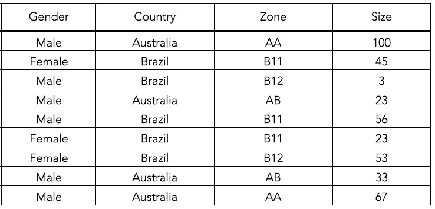
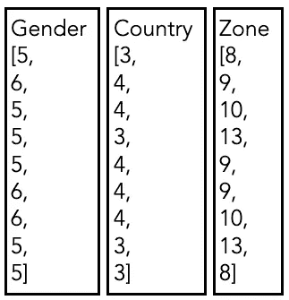
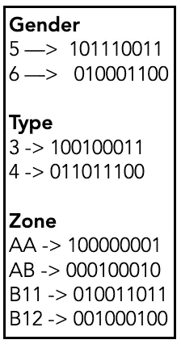
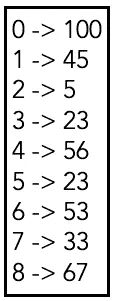

# 位图索引洞察

> 原文：<https://levelup.gitconnected.com/insights-into-indexing-using-bitmap-index-c28a3db1ad97>

## 以及 Apache Druid 如何使用它进行超快速分析


Pierre Bamin 在 [Unsplash](https://unsplash.com/s/photos/index?utm_source=unsplash&utm_medium=referral&utm_content=creditCopyText) 上拍摄的照片

## 什么是位图索引？

位图索引是一种特殊的索引，它使用位图或位数组来索引数据。由于以下优点，在许多应用中使用:

1.  快速即席查询
2.  存储空间的减少

位图索引与其他编码/索引技术一起使用，以提高查询性能。这些被用在许多分析引擎中，**阿帕奇德鲁伊**就是其中之一。我将通过展示 **Druid** 如何索引数据来解释位图索引和其他技术。我会尽量使它简单。在这篇文章结束时，我相信你会对这些有一个完整的概念。

让我们使用下面的作为源数据。这就是我们要索引的内容。



源数据

为了存储这些数据，Druid 将存储以下 4 种数据结构。

## **数据结构#1**

我们不能按原样存储数据，因为它们会占用大量空间。因此，我们要做的第一件事是为列的每个唯一值创建一个字典。这叫做**字典编码。**

```
**Gender**
{
  Male: 5
  Female: 6
}**Country**
{
  Australia: 3
  Brazil:4
}**Zone** {
  AA: 8
  B11: 9
  B12: 10
  AB: 13
}
```

> 性别。男性将被存储为 5，而性别。女性存储为 6

## 数据结构#2

这是列值的列表，由数据结构#1 中的字典编码(读取**替换**)。下面是 Datra 结构#2 的样子



列数据的数据结构#2

## 数据结构#3

对于列中的每个不同值，都会创建一个位图，指示哪些行包含该值。这些也被称为[倒排索引](https://medium.com/datadriveninvestor/inverted-index-61037d2972c5)。位数取决于行数



位图索引

在上面的示例中，性别 5(男性)出现在第 1、3、4、5、8 和 9 行。

## 数据结构#4

这是为了存储事实或指标。它们存储为数组。



度量(大小)列的数组

## 询问

现在让我们看看不同类型的查询，看看它们是如何被解析的。

```
*select 
  sum(characters added) 
from 
  table
where
  gender = ‘Male’ and 
  Type = ‘Australia’*
```

这是一个简单的过滤查询，因此该查询可以由数据结构#1 和#3 来回答。让我们看看如何

1.  转换性别。*公*和*型。澳大利亚*到其对应的字典。分别是 5 和 3
2.  性别 5 和类型 3 之间的 AND 运算

> =101110011 和 100100011
> 
> =100100011

3.对于上面的行，从数据结构#4 获取相应的大小，并返回总和。

```
*select 
  zone,
  sum(characters added) 
from 
  table
where
  gender = ‘Male’ and 
  Type = ‘Australia’
group by
  zone*
```

上面的查询有一个附加的“Group By”子句。因此，我们也需要数据结构#2。让我们看看 Druid 是如何解析这些类型的查询的。

1.  转换性别。*男*和*型。澳大利亚*到其对应的字典。分别是 5 和 3
2.  和类型 3 之间的运算

> =101110011 和 100100011
> 
> =100100011

3.对于这些行，遍历数据结构#2 以获取列区域，遍历数据结构#4 以获取相应的大小信息

4.将数据分组，生成大小总和

5.解码区域字段并返回给用户

我希望这份文件是有帮助的。如果我错过了什么，请在评论区告诉我。

特别感谢 [Arun](https://medium.com/@aruncthomas) 仔细审阅本文。

你也可以找到我之前用过的**倒排索引**的详细指南。

[](https://medium.com/datadriveninvestor/inverted-index-61037d2972c5) [## 倒排索引初学者指南

### 倒排索引是一种广泛用于在文档中快速搜索单词/文本的数据结构。许多信息…

medium.com](https://medium.com/datadriveninvestor/inverted-index-61037d2972c5)