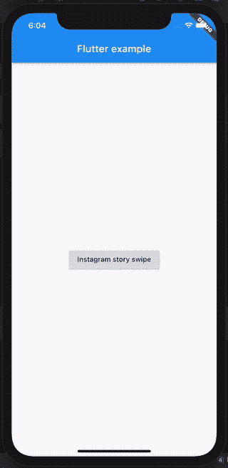
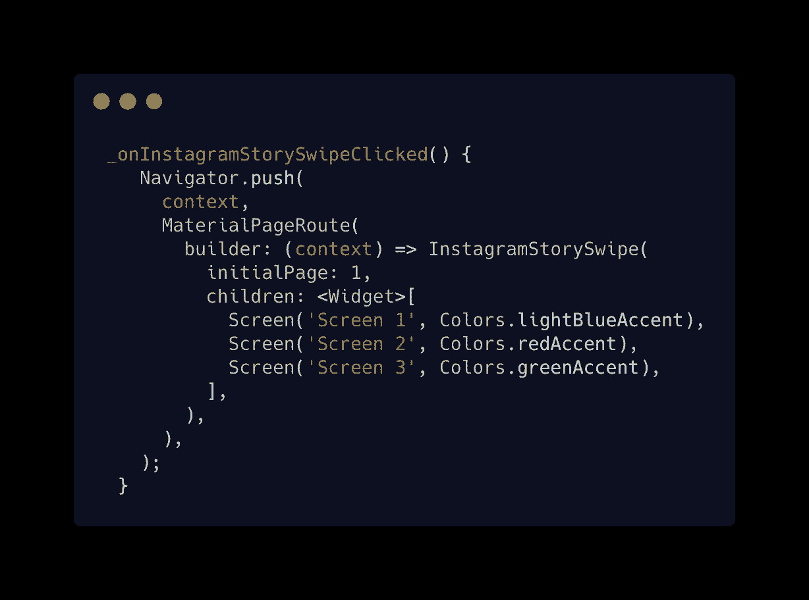
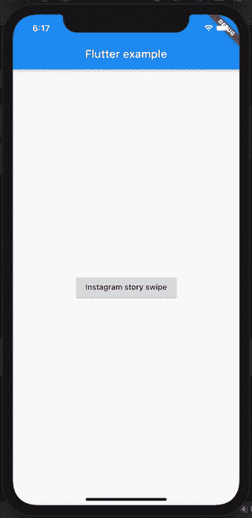

# Instagram stories swiper — Flutter

> 原文：<https://levelup.gitconnected.com/instagram-stories-swiper-flutter-bb53f9377431>

欢迎光临！

今天，我们将制作一个非常棒的滑块，就像 Instagram stories 一样，好的一面是它很简单，就像 T2 一样。

在 Instagram 上与我联系:

 [## boring 开发者

### 欢迎回到 Instagram。登录查看您的朋友、家人和兴趣爱好捕捉和分享了什么…

www.instagram.com](https://www.instagram.com/theboringdeveloper/) 

## **让我们先看看它在 Instagram 上的样子**

## 让我们开始吧

1.将***social _ media _ widgets***添加到 pubspec.yaml

 [## 社交媒体插件| Flutter 包

### 一个新的 flutter 包，用于收集常见的流行社交媒体小工具 Snapchat 屏幕解散-通过向下滑动…

公共开发](https://pub.dev/packages/social_media_widgets) 

2.创建一个基本的屏幕部件

3.现在使用***InstagramStorySwipe***小部件与屏幕小部件作为子部件

# 让我们检查输出:

# **您也可以改变初始页面的加载方式**

## **让我们检查一下输出**

超级简单对吧？:)

查看完整项目 [**此处**](https://github.com/GursheeshSingh/social_media_widgets/tree/master/example) 有更多例子**。**

> 谢谢你坚持到最后

# 更多激动人心的博客-

 [## 信用卡滑块—颤动

### 欢迎来到本教程，创建一个可怕的信用卡滑块。

levelup.gitconnected.com](/credit-card-slider-flutter-1edec451103a)  [## 更新应用程序— Flutter

### 欢迎来到本教程，为你的 flutter 应用程序添加更新应用程序

medium.com](https://medium.com/swlh/update-app-flutter-402c528235e4)  [## Twitter 旋转器——颤动

### 欢迎来到本教程，在 Flutter 中创建 Twitter Spinner

medium.com](https://medium.com/swlh/twitter-spinner-flutter-81ca13c0f00e)  [## 简单易用的通用底部导航栏——Flutter

### 欢迎来到本教程，在 Flutter 中创建一个普通的底部导航栏。

medium.com](https://medium.com/swlh/common-bottom-navigation-bar-made-easy-flutter-199c9f683b29)  [## 颤动:TabBar 的自定义标签指示器

### 欢迎学习本教程，为 Flutter 中的 TabBar 创建一个自定义的标签指示器。

medium.com](https://medium.com/swlh/flutter-custom-tab-indicator-for-tabbar-d72bbc6c9d0c) 

我将会发布更多关于 flutter 的**和**，敬请关注:)