# 为部署安装和配置 AWS CLI

> 原文：<https://levelup.gitconnected.com/install-and-configure-aws-cli-for-deployment-c9148a10902f>

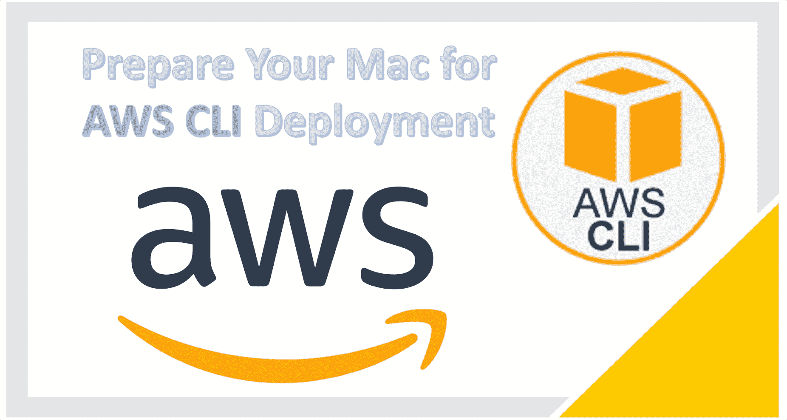

我假设您有一台普通的机器，没有安装任何与 AWS CLI 相关的东西。为了使这更容易，我将使用命令行，而不是通过网站导航

# 首先:创建一个免费的亚马逊账户

我们将需要它来部署到 AWS。它简单明了。只需按照这里的说明[https://AWS . Amazon . com/premium support/knowledge-center/create-and-activate-AWS-account/](https://aws.amazon.com/premiumsupport/knowledge-center/create-and-activate-aws-account/)

这里是 https://portal.aws.amazon.com/billing/signup#/start[的报名页面](https://portal.aws.amazon.com/billing/signup#/start)

# 1.下载 AWS CLI V2

```
curl "https://awscli.amazonaws.com/AWSCLIV2.pkg" -o "AWSCLIV2.pkg"
```

# 2.安装 awscli

```
sudo installer -pkg AWSCLIV2.pkg -target /
```

# 3.验证安装

```
aws --versionOutput will be close but not exact to the following:aws-cli/2.1.28 Python/3.8.8 Darwin/20.3.0 exe/x86_64 prompt/off
```

# 4.安装 XCode 命令行工具

```
xcode-select --install
```

# 配置 AWS CLI

# 1.获取凭据

为了能够使用 AWS CLI，您需要创建一个新用户并获得访问密钥和密码。让我们从控制台开始。请按照之前的视频。在视频中会更容易解释

# 1-搜索 IAM

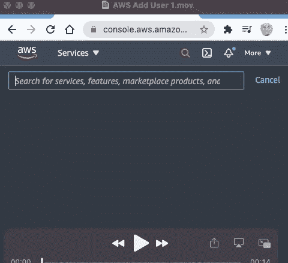

# 2 —选择 IAM 并输入用户名(这里我使用的是 aws-cli)

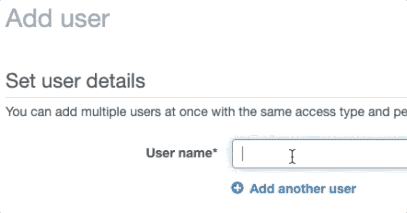

# 3-选择编程访问，然后选择下一步:权限

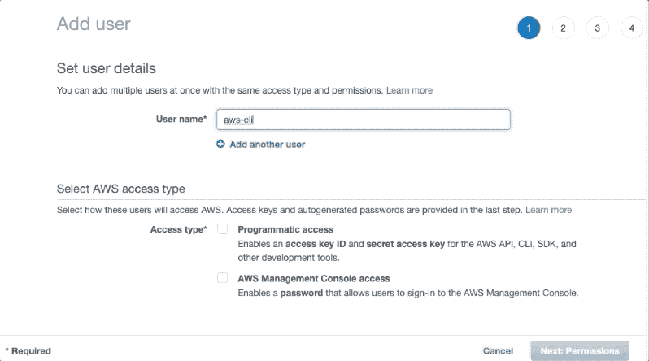

# 4-选择直接附加现有策略

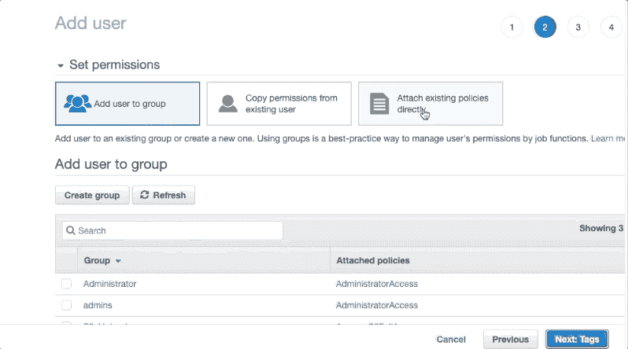

# 5-选择管理员访问权限，然后选择下一步:标记

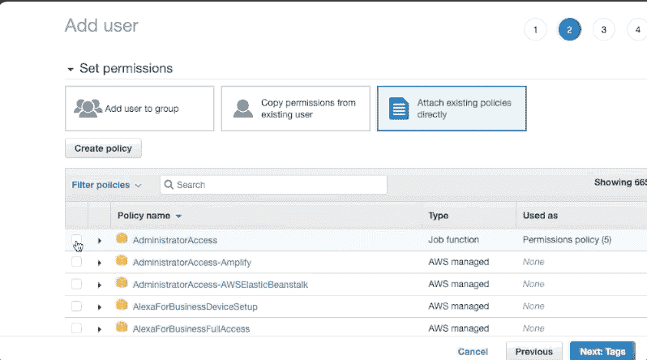

# 6-跳过标签并单击下一步:预览

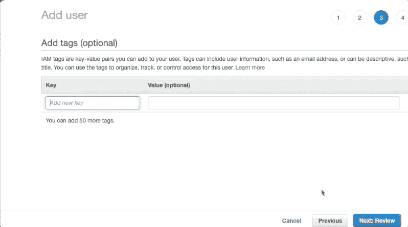

# 7-单击下一步:创建用户

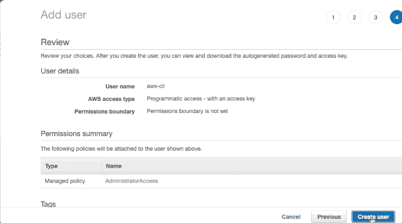

# 8-下载凭据 CSV

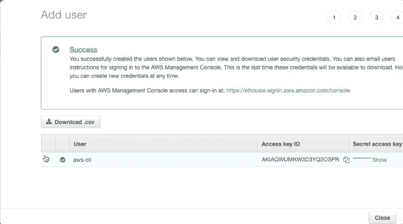

# 9-打开下载的文件，它将类似于以下内容

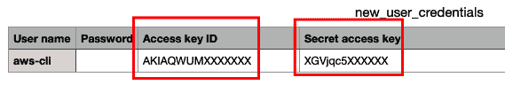

我们将在接下来的步骤中使用这些凭据

# 10-打开命令窗口/终端并写入

```
aws configure
```


# 11-它会要求您输入 AWS 访问密钥 ID

从下载的 csv 中放一个

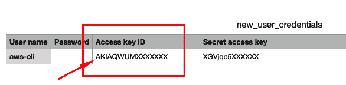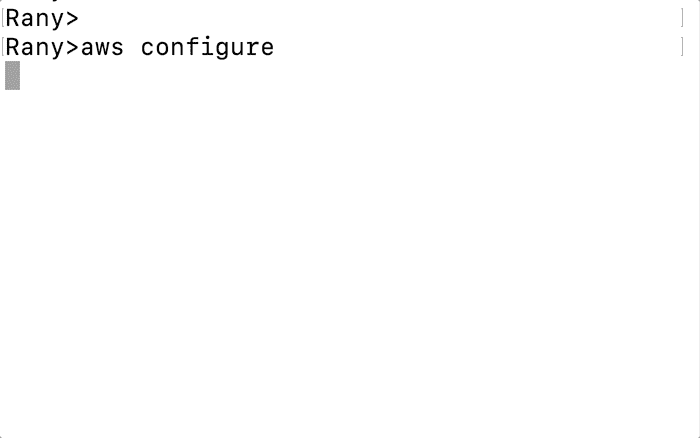

# 12-从同一文件添加 AWS 密钥

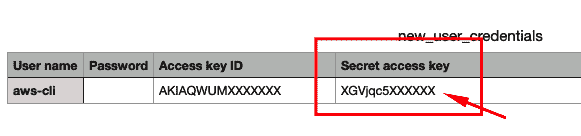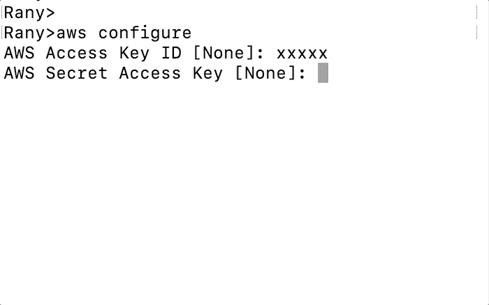

# 13 —填写您所在的地区

确保选择您用来创建资源的相同区域(在我的例子中，我使用 us-east-a)

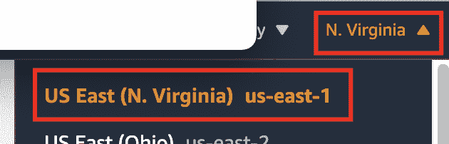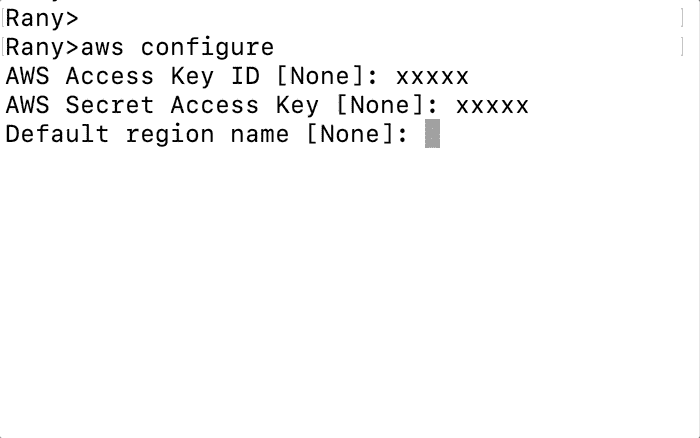

您可以通过运行来测试

```
aws s3 ls
```

最初发布于 LinkedIn:

[](https://www.linkedin.com/pulse/install-configure-aws-cli-deployment-rany-elhousieny-phd%E1%B4%AC%E1%B4%AE%E1%B4%B0/) [## 为部署安装和配置 AWS CLI

### 在我们创建的大多数项目中，我们将经常与 AWS mor 打交道。因此，我决定创造这个…

www.linkedin.com](https://www.linkedin.com/pulse/install-configure-aws-cli-deployment-rany-elhousieny-phd%E1%B4%AC%E1%B4%AE%E1%B4%B0/)