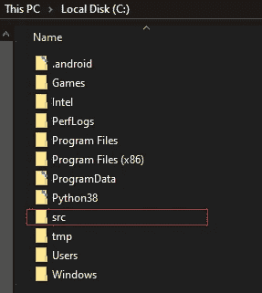

# 在 Windows 上安装 Flutter 和 Setup VS 代码进行跨平台应用开发

> 原文：<https://levelup.gitconnected.com/install-flutter-and-setup-vs-code-for-app-dev-on-windows-86c1933718ef>


**刚刚听说 Flutter 打算在您的 Windows 系统上安装它？不用再找了，你很快就可以开业了。**

**还没听说过，还想在 Windows 上开发 Android 和 iOS 的 app？跟着读。**

F **lutter** 是一个开源 UI 工具包，由 **Google** 创建，用于从单一代码库为移动、web 和桌面构建漂亮的本地编译应用程序。没错，你听到了…单一代码库。不再有特定于平台的代码库。相信我，跨平台应用程序开发从未如此简单。

好了，说够了。让我们把这个东西安装好，这样你就可以亲身体验了。

# 要求

确保您的系统能够处理颤振的几件事情

*   **磁盘空间:** 400 MB(几乎没有)
*   操作系统:64 位 Windows 7 SP1 或更高版本(除非你生活在 90 年代，否则应该没问题)
*   **Windows Powershell:**Windows 10 已经预装了。如果你运行的是旧版本的 Windows，请点击这里从[获取。](https://docs.microsoft.com/en-us/powershell/scripting/install/installing-windows-powershell)
*   **Git for Windows:** 为了让 Flutter 工作，您应该能够从命令提示符运行 Git 命令。请阅读以下内容，了解如何在您的系统上检查/安装它

在命令提示符下运行`git --version`。如果你有类似于`git is not recognized as an internal or external command, operable program or batch file`的东西，那么你可能想从[这里](https://git-scm.com/download/win)安装它。安装后运行相同的命令进行检查。

如果您在运行它时看到类似于`git version 2.23.0.windows.1`的东西，那么您就可以开始了

好了，现在我们已经确保 Flutter 可以在我们的系统上运行，让我们开始安装过程。

# 下载 Flutter SDK

现在，有两种方法可以做到这一点:克隆 Flutter GitHub 库或者从 Flutter 的网站下载 SDK。对于大多数用户来说，我会推荐第二种选择，这也是我将在这里展示的，但是如果你喜欢冒险，可以看看 **Flutter 的** GitHub [库](https://github.com/flutter/flutter)。

1.  **进入 Flutter 的网站:**在新标签页打开这个[网站](https://flutter.dev/docs/get-started/install/windows#get-the-flutter-sdk)。
2.  **点击蓝色大按钮:**是的，没错，点击“获取 Flutter SDK”部分下的蓝色大按钮，Flutter 的最新版本将开始下载。


等待下载完成，这可能需要几分钟，取决于您的互联网连接和*瞧！你有最新版本的 Flutter SDK。就这么简单。*

# 给 Flutter SDK 一个家

Flutter SDK 目前位于下载文件夹中的一个. zip 文件中。我们需要把它提取出来，转移到一个安全容易接近的地方。我们就这么做吧。

**注意**:接下来的几个步骤指导您将 Flutter SDK 移动到推荐的位置。同样，如果你喜欢冒险，你可以对硬盘上的不同文件夹执行相同的步骤。请务必记住这个文件夹。

*   **创建一个“src”文件夹:**打开文件浏览器，导航到“C:\”目录。在这里，创建一个名为“src”的新文件夹



*   **提取‘扑扑’从。zip 文件:**导航到你的下载文件夹，使用像 [WinRAR](https://www.win-rar.com/start.html?&L=0) 这样的解压工具，从。zip 文件，并将其放在我们刚刚创建的“src”文件夹中。

# 给你的道路增加颤动

**Flutter** 现在在它自己的目录中是安全的，但是为了能够从计算机上的任何地方访问/运行它，我们必须告诉系统 **Flutter** 保存在哪里。最简单的方法是更新 PATH 变量。PATH 变量是我们的系统检查软件或可执行文件的目录/位置列表。如果一个目录在我们的 PATH 变量中，我们将能够访问该目录的所有内容，而不必导航到它。所以，让我们来设置一下。

1.**从任务栏启动 Windows 搜索，输入‘env’并选择‘编辑系统环境变量’**


2.**在弹出的窗口中，点击“环境变量”按钮。**


3.**在下一个窗口的“用户变量”下，检查名称“路径”。**


4.**如果您在列表中找到“路径”:**

*   选择它并点击“编辑”
*   在弹出窗口中，单击“新建”
*   在文本字段中，如果你按照我的步骤，输入`C:\src\flutter\bin`。如果您将**颤振**放置在不同的位置，键入`<yourlocation>\flutter\bin`(根据您的位置修改)


*   点击“确定”

5.**如果在列表中找不到“路径”:**

*   点击“新建”按钮
*   在弹出窗口的“变量名”下，输入`Path`
*   在“变量值”下，如果你按照我的步骤，输入`C:\src\flutter\bin`。如果你把 Flutter 放在不同的位置，输入`<yourlocation>\flutter\bin`


*   点击“确定”

# 验证颤振安装

*   打开命令提示符
*   运行命令`flutter --version`
*   如果你得到这样的东西:

```
Flutter 1.17.1 • channel stable • [https://github.com/flutter/flutter.git](https://github.com/flutter/flutter.git)
Framework • revision f7a6a7906b (10 days ago) • 2020-05-12 18:39:00 -0700
Engine • revision 6bc433c6b6
Tools • Dart 2.8.2
```

然后，就这样了！您已经成功地在 Windows 系统上安装了 Flutter。

**注意-** 如果这一步失败，你得到的是不同的消息，你可能在某个地方出错了。如果你面临这样的问题，我很乐意帮助你。

现在我们已经安装了 **Flutter** ，我们需要一个**代码编辑器**来帮助我们使用 **Flutter** 开发应用。快速的谷歌搜索会产生各种各样的代码编辑器，但是我推荐安装 **Visual Studio 代码**。它是程序员中最受欢迎的代码编辑器，主要是因为它的简单性和轻量级。它还提供人工智能自动完成和其他令人敬畏的功能。按照他们[网站](https://code.visualstudio.com/)上的说明将它安装到您的系统上。一旦你安装好了，回到这里看看我们如何为 **Flutter** 开发设置它。

# 为颤振设置 VS 代码

*   启动与代码
*   从左侧的活动栏转到“扩展”选项卡
*   在搜索框中，输入“Flutter ”,你应该会在结果中看到一个“Flutter”扩展名


我的电脑上没有绿色的“安装”按钮，因为我已经安装了它

*   点击绿色的“安装”按钮，为 VS 代码添加颤振支持
*   对“Dart”做同样的事情，因为这增加了对 Dart 语言的 VS 代码支持，Dart 语言是用于构建 Flutter 应用程序的编程语言

那都是乡亲们！现在，您可以在 Windows 系统上使用 Flutter 和 VS 代码构建令人惊叹的跨平台应用程序了。祝你好运！