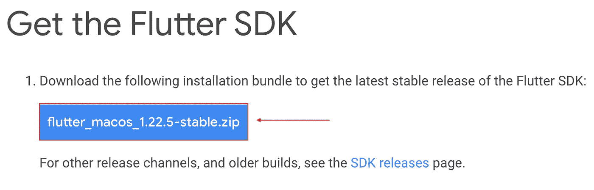
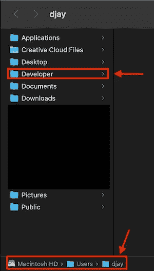
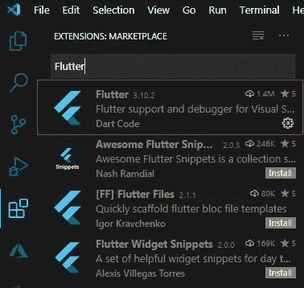

# 在 macOS 上安装用于跨平台应用程序开发的 window 和 Setup VS 代码

> 原文：<https://levelup.gitconnected.com/install-flutter-and-setup-vs-code-for-cross-platform-app-development-on-macos-3bde9e86082c>


如果你想在你的 Windows 系统上安装旋舞，我写了另一篇文章，你可以在这里[找到](/install-flutter-and-setup-vs-code-for-app-dev-on-windows-86c1933718ef)。不客气:)

F **lutter** 是由 **Google** 创建的开源 UI 工具包，用于从单个代码库构建漂亮的、本机编译的移动、网络和桌面应用程序。没错，你听到了…一个单一的代码库。不再有特定于平台的代码库。相信我，跨平台应用开发从来没有这么容易过。

好了，废话少说。让我们安装这个东西，这样你就可以亲身体验它。

# 要求

以下几点可以确保 Mac 可以处理 window

*   **磁盘空间:** 2.8 GB(几乎不算什么)
*   **操作系统** : macOS 64 位
*   **Git:** 要安装 window，您应该能够从终端运行 Git 命令。如果你已经安装了 Xcode，那么 git 应该已经安装好了。请继续阅读以下内容，了解如何在 mac 上检查/安装 git

在终端中运行`git --version`。如果你有类似于`zsh: command not found: git`或`bash: git: command not found`的东西，那么你可能想从[这里](https://git-scm.com/download/mac)或者通过从 App Store 安装 Xcode 来安装。安装后运行相同的命令进行检查。

如果一切设置正确，你应该得到类似`git version 2.24.3 (Apple Git-128)`的东西。

# 下载 Flutter SDK

现在，有两种方法可以做到这一点:克隆旋舞 GitHub 存储库或从旋舞的网站下载 SDK。对于大多数用户，我会推荐第二种选择，这也是我在这里要展示的，但是如果你想冒险，可以去**sport 的** GitHub [资源库](https://github.com/flutter/flutter)看看。

1.  **转到旋舞网站:**在新的选项卡中打开此[网站](https://flutter.dev/docs/get-started/install/macos)。
2.  **点击蓝色大按钮:**是的，没错，点击“获取旋舞 SDK”部分下的蓝色大按钮，就会开始下载最新版本的旋舞。



等待下载完成，这可能需要几分钟，取决于您的互联网连接和*瞧！*你有最新版本的 Flutter SDK。就这么简单。

# 给 Flutter SDK 一个家

Flutter SDK 目前位于下载文件夹中的一个. zip 文件中。我们需要把它提取出来，转移到一个安全容易接近的地方。我们就这么做吧。

**注意**:接下来的几个步骤指导您将 Flutter SDK 移动到推荐的位置。同样，如果你喜欢冒险，你可以对你的驱动器上的不同文件夹执行相同的步骤。请务必记住这个文件夹，我们在接下来的步骤中会用到它。

*   **创建一个‘开发者’文件夹:**打开 Finder，导航到用户主目录(一般以用户命名)。在这里，创建一个名为“开发者”的文件夹，如果你还没有的话。您甚至可以使用类似名称的文件夹，但建议使用“Developer”。



我的用户名是 djay，我的主目录名也是如此

*   **打开一个终端窗口:**打开终端，输入下面的`cd Developer/`，按回车键。如果终端显示`cd: no such file or directory: Developer`，那么“开发者”文件夹没有创建在正确的位置。如果它成功执行，我们现在就在我们创建的 Developer 文件夹中。在这里，我们将解压下载的。压缩文件，给 Flutter 一个舒适的家。
*   **解压缩 Flutter:** 在同一个终端窗口中，输入上述命令后，输入这个命令`unzip ~/Downloads/flutter_macos`并点击“TAB ”,终端将自动填充路径的剩余部分。一旦完成上述命令，就像`unzip ~/Downloads/flutter_macos_x.xx.x-stable.zip` 按回车键。

# 给你的道路增加颤动

**Flutter** 现在在它自己的目录中是安全的，但是为了能够从计算机上的任何地方访问/运行它，我们必须告诉系统 **Flutter** 保存在哪里。最简单的方法是更新 PATH 变量。PATH 变量是我们的系统检查软件或可执行文件的目录/位置列表。如果一个目录在我们的 PATH 变量中，我们将能够访问该目录的所有内容，而不必导航到它。所以，让我们来设置一下。

1.  **检查$SHELL 并更新 rc 文件:**在终端输入`echo $SHELL`，查看输出。

*   如果您看到`/bin/zsh`:您有一个 zsh shell，您需要编辑。zshrc 文件。输入`sudo nano ~/.zshrc`并输入您的用户密码。一旦 nano 编辑器打开，添加下面一行到文件`export PATH=”$PATH:/Users/<yourusername>/Developer/flutter/bin”`，如果你按照我推荐的步骤。如果你没有按照我的步骤创建开发者文件夹，你可以用 flutter 文件夹的位置替换':'之后'/bin '之前的部分。例如，对于上图中我的 mac，我必须输入`export PATH=”$PATH:/Users/djay/Developer/flutter/bin”`
*   如果您看到`/bin/bash`:您有一个 bash shell，您需要编辑。巴沙尔或者。bash_profile 文件。输入`sudo nano ~/.bashrc`或`sudo nano ~/.bash_profile`并输入您的密码。一旦 nano 编辑器打开，将下面一行添加到文件`export PATH=”$PATH:/Users/<your username>/Developer/flutter/bin”`中，如果你遵循了我推荐的步骤。如果你没有按照我的步骤创建开发者文件夹，你可以用 flutter 文件夹的位置替换':'之后'/bin '之前的部分。例如，对于上图中我的 mac，我必须输入`export PATH=”$PATH:/Users/djay/Developer/flutter/bin”`

# 验证颤振安装

*   打开命令提示符
*   运行命令`flutter --version`
*   如果你得到这样的东西:

```
Flutter 1.20.4 • channel stable • [https://github.com/flutter/flutter.git](https://github.com/flutter/flutter.git)
Framework • revision fba99f6cf9 (3 months ago) • 2020-09-14 15:32:52 -0700
Engine • revision d1bc06f032
Tools • Dart 2.9.2
```

然后，就这样了！您已经成功地在 Mac 上安装了 Flutter。

**注意** —如果这一步失败，并且您得到不同的消息，您可能在某个地方出错了。如果你面临这样的问题，我很乐意帮助你，请在 pndjay@gmail.com 给我发邮件或评论这篇文章。

# 为 Flutter 设置 IDE

现在我们已经安装了 **Flutter** ，我们需要一个**代码编辑器**来帮助我们使用 **Flutter** 开发应用。快速的谷歌搜索会产生各种各样的代码编辑器，但是我推荐安装 **Visual Studio 代码**。它是程序员中最受欢迎的代码编辑器，主要是因为它的简单性和轻量级。它还提供人工智能自动完成和其他令人敬畏的功能。按照他们网站上的说明把它安装到你的系统上。一旦你安装好了，回到这里看看我们如何为 **Flutter** 开发设置它。

*   启动与代码
*   从左侧的活动栏转到“扩展”选项卡
*   在搜索框中，输入“Flutter ”,你应该会在结果中看到一个“Flutter”扩展，有 140 万次下载



我的电脑上没有绿色的“安装”按钮，因为我已经安装了它

*   点击旁边的绿色“安装”按钮，为 VS 代码添加 Flutter 支持
*   对“Dart”做同样的事情，因为这增加了对 Dart 语言的 VS 代码支持，Dart 语言是用于构建 Flutter 应用程序的编程语言

那都是乡亲们！现在，您可以在 Mac 上使用 Flutter 和 VS 代码构建令人惊叹的跨平台应用程序了。

如果你喜欢这篇文章，请给它一个掌声，并与任何希望在 Mac 上开始使用 Flutter 的人分享它！祝你好运！