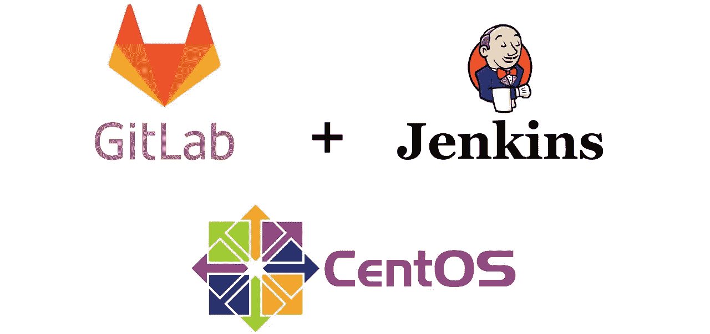
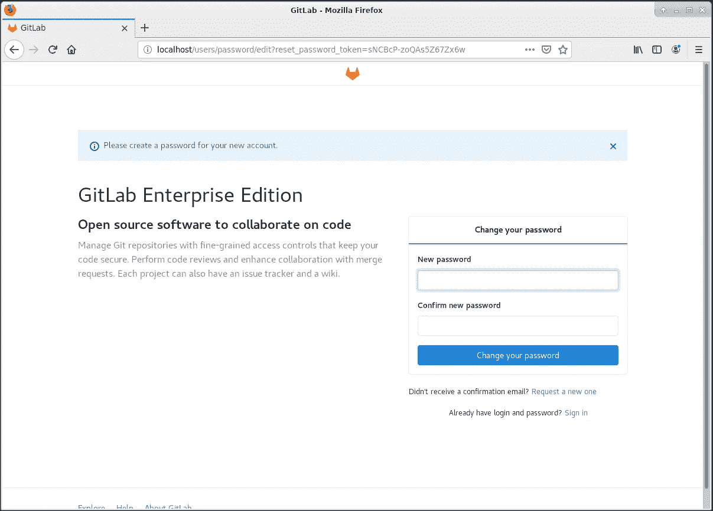
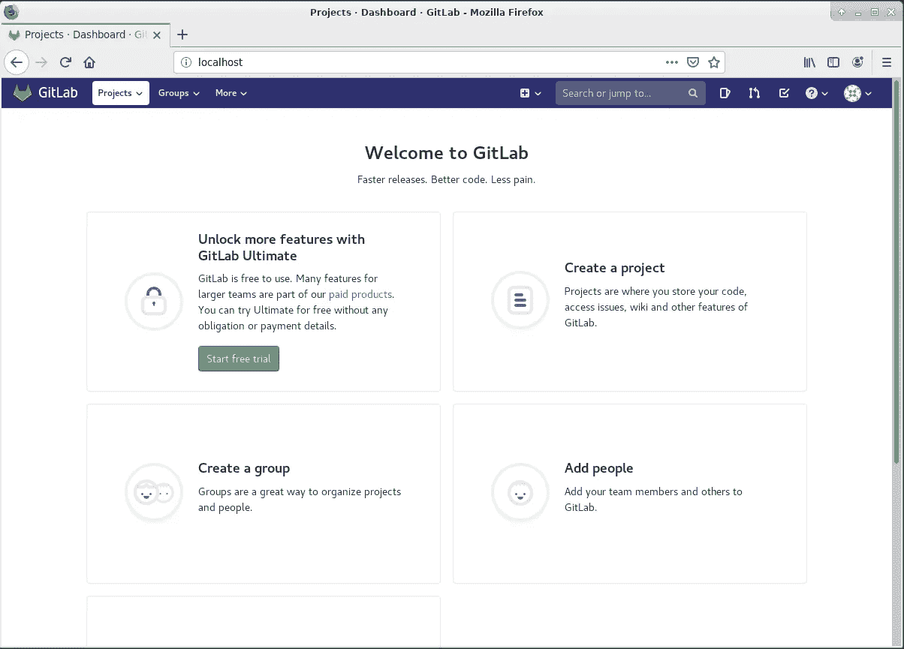
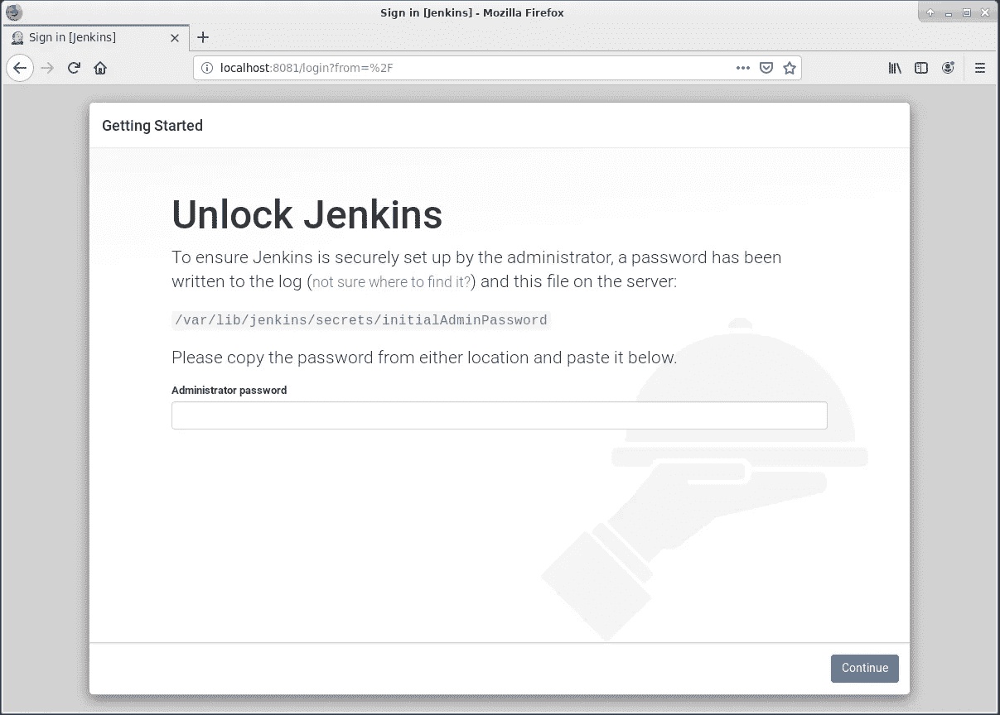
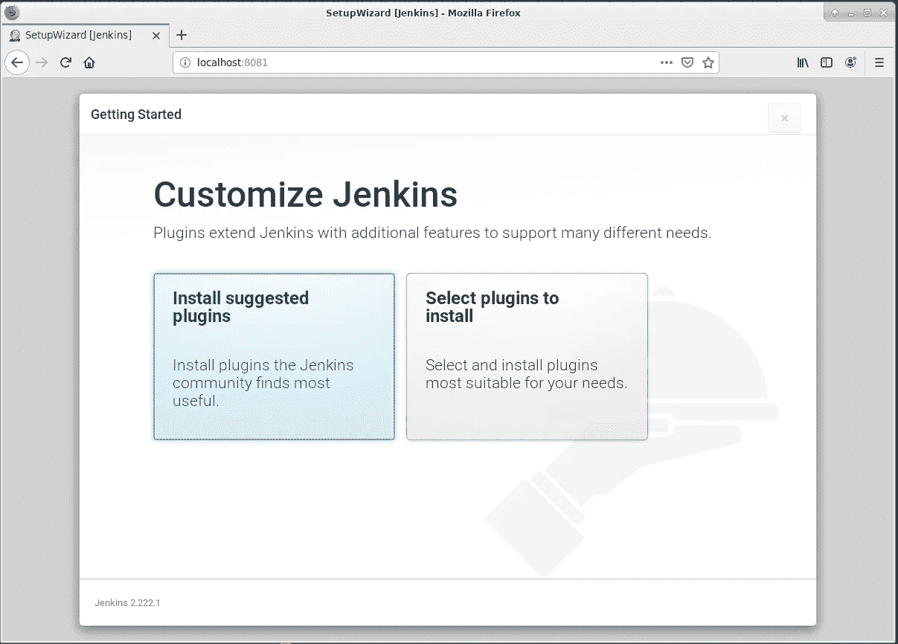
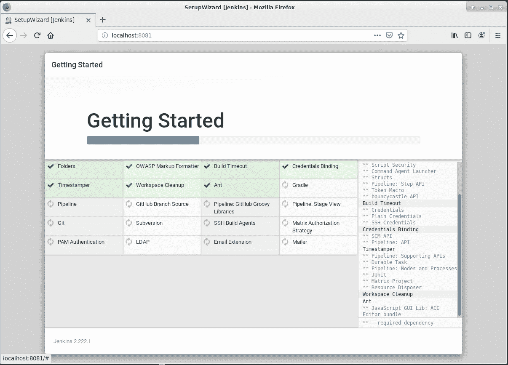
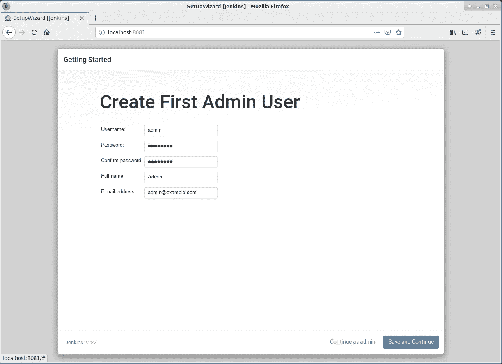
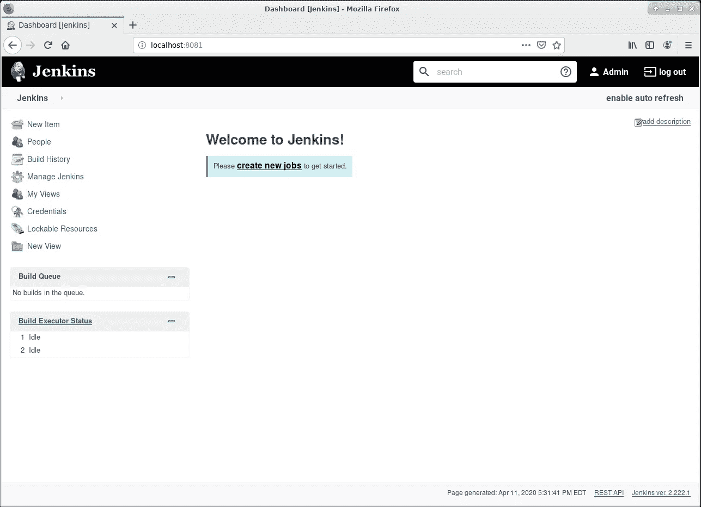

# 在 CentOS 7 上安装 GitLab & Jenkins

> 原文：<https://levelup.gitconnected.com/install-gitlab-jenkins-on-centos-7-504df77fae4>



如果您是 DevOps 或 CI/CD 的新手，并希望在不配置多个服务器或网络的情况下开始使用这些工具，那么在同一台机器上安装 GitLab 和 Jenkins 可以加快您的配置，并允许您专注于学习工具本身。

*免责声明:不建议将这种类型的配置用于生产，而是作为学习如何实施 CI/CD 的第一步。*

到本文结束时，您将在同一个 CentOS 7 服务器上安装 GitLab 和 Jenkins，GitLab 监听默认 HTTP 端口(80)，Jenkins 监听端口 8081。

之后，请看[这篇文章](https://medium.com/@gyfdev/jenkins-pipeline-with-gitlab-for-java-projects-d2e10c08e255)来学习如何通过推送至 GitLab 库来自动触发 Jenkins 构建。

# 步骤 1:安装 GitLab

安装依赖项并配置系统防火墙以允许 HTTP/S(尽管本教程只讨论 HTTP):

```
sudo yum install -y curl policycoreutils-python openssh-server
sudo systemctl enable sshd
sudo systemctl start sshd
sudo firewall-cmd --permanent --add-service=http
sudo firewall-cmd --permanent --add-service=https
sudo systemctl reload firewalld
```

添加 GitLab 包存储库:

```
curl https://packages.gitlab.com/install/repositories/gitlab/gitlab-ee/script.rpm.sh | sudo bash
```

安装 GitLab，传入您想要访问它的主机 URL。在我们的例子中，它只是 [http://localhost](http://localhost) (默认端口 80):

```
sudo EXTERNAL_URL="[http://localhost](http://localhost)" yum install -y gitlab-ee
```

通过在 web 浏览器中访问 [http://localhost](http://localhost) 来验证安装。如果遇到错误，请确保没有其他服务正在侦听端口 80。此外，端口 8080 应该是空闲的，因为这是内部 Unicorn 守护进程监听的端口。



输入新密码，然后使用您刚刚创建的密码作为 **root** 登录。然后，您应该会看到欢迎页面:



# 步骤 2:安装 Jenkins

安装 Java，添加 Jenkins 包存储库，并安装 Jenkins:

```
sudo yum install java-1.8.0-openjdk-devel -y
curl --silent --location [http://pkg.jenkins-ci.org/redhat-stable/jenkins.repo](http://pkg.jenkins-ci.org/redhat-stable/jenkins.repo) | sudo tee /etc/yum.repos.d/jenkins.repo
sudo rpm --import [https://jenkins-ci.org/redhat/jenkins-ci.org.key](https://jenkins-ci.org/redhat/jenkins-ci.org.key)
sudo yum install jenkins -y
```

编辑 Jenkins 配置文件，以便 Jenkins 监听端口 8081，而不是默认的 8080:

```
sudo sed -i 's/JENKINS_PORT="8080"/JENKINS_PORT="8081"/g' /etc/sysconfig/jenkins
```

允许端口 8081 通过系统防火墙:

```
sudo firewall-cmd --permanent --zone=public --add-port=8081/tcp
sudo firewall-cmd --reload
```

启动 Jenkins 服务:

```
sudo systemctl enable jenkins
sudo systemctl start jenkins
```

在您的网络浏览器中，转到 [http://localhost:8081](http://localhost:8081)



从指定位置复制管理员密码，并在中输入。



点击**安装建议插件**并等待插件安装。



创建管理员用户。



确保 Jenkins URL 为 [http://localhost:8081](http://localhost:8081) 并点击**保存并完成。**

使用您的新管理员凭据登录，您应该会看到以下屏幕:



恭喜你！您已经在 CentOS 7 上成功安装了 GitLab 和 Jenkins。参见[本帖](https://medium.com/@gyfdev/jenkins-pipeline-with-gitlab-for-java-projects-d2e10c08e255)了解如何配置 Jenkins 从 GitLab 自动构建 Java 项目。

## 来源:

*   [https://about.gitlab.com/install/#centos-7](https://about.gitlab.com/install/#centos-7)
*   [https://linuxize . com/post/how-to-install-Jenkins-on-centos-7/](https://linuxize.com/post/how-to-install-jenkins-on-centos-7/)