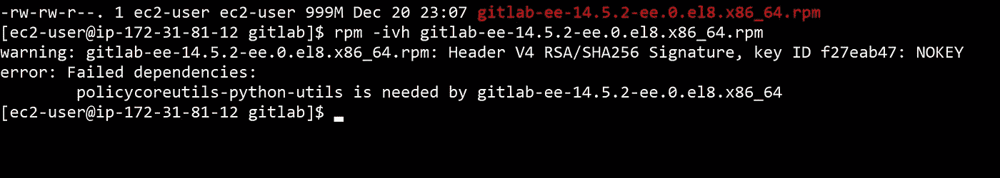
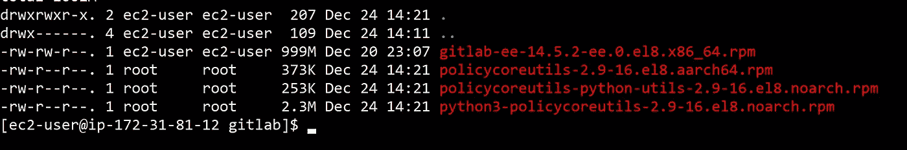

# 离线安装 Gitlab

> 原文：<https://levelup.gitconnected.com/install-gitlab-offline-3b788bbd64cd>


照片由 [Pankaj Patel](https://unsplash.com/@pankajpatel?utm_source=medium&utm_medium=referral) 在 [Unsplash](https://unsplash.com?utm_source=medium&utm_medium=referral) 上拍摄

我设法离线安装 gitlab，这意味着没有互联网连接的帮助。我不觉得他们的[指南](https://docs.gitlab.com/ee/topics/offline/quick_start_guide.html)有用，因为它是基于 Ubuntu 的，但我在 RHEL 上工作，因此我分享如何做一个，你可以得到你需要的库/包，并把它带到离线服务器。

您需要什么:

1.  离线/有空隙的数据中心中的服务器。
2.  任何云提供商(AWS/GCP/Azure)中的 EC2/计算机器，其操作系统版本和架构与空隙数据中心中的服务器相同，连接到互联网并可以进行 yum/apt 更新
3.  从这个[链接](https://packages.gitlab.com/gitlab/gitlab-ee)下载一个 gitlab 包，该包在操作系统版本和架构下工作。

以下步骤将帮助您在进入数据中心并将其安装到离线服务器上之前，获得几乎所有需要的文件。这不仅仅适用于 gitlab。它适用于任何需要大量软件包的离线安装的服务器。

1.  在你的云服务器上安装 createrepo 库。这有助于创建本地服务器存储库。
2.  把你下载的 gitlab 包复制到你自己提供的云机器上。
3.  在默认的 home 用户中创建文件夹`gitlab`,并将 gitlab 包复制到其中
4.  进入`/etc/yum.repos.d/`并将所有存储库文件移动到另一个文件夹。这模拟了一个脱机服务器。
5.  回到`gitlab`文件夹，尝试安装 gitlab 包。它将失败，并且无法获得它需要的包



失败是成功之母

6.CD 到`/etc/yum.repos.d/`再移回你已经复制出来的所有回购文件

7.因为在这个例子中我使用的是 rhel8，所以我运行`gitlab`文件夹中的`sudo dnf download --resolve <list-of-missing-libs>`来下载所有的文件和依赖项。



现在不那么孤单了

8.在 gitlab 文件夹中运行命令`createrepo .`。它将创建文件夹`repodata`作为 dnf/yum/apt 引用的存储库

9.回到`/etc/yum.repos.d/`，再次移出所有的`.repo`文件。创建一个新的本地回购文件，其中`baseurl`指向步骤 6 中的包和依赖项所在的文件夹，如下所示:

```
[local-rpm]
name=Local libraries to install gitlab
enabled=1
baseurl=file:///home/ec2-user/gitlab
```

10.回到`gitlab`文件夹，再次尝试安装包。如果失败，继续执行步骤 6 到 10，直到成功安装 gitlab-ee。

一旦你成功安装了 Gitlab，并且只有`/etc/yum.repos.d`文件夹中的`local.repo`文件，这意味着`gitlab`文件夹中的库足够被复制出来并放在离线服务器中进行安装。根据云操作系统和异地服务器操作系统的最小化程度，如果云操作系统不像异地服务器那样最小化，您可能需要再次进行一些旅行，但仍然会为您节省大量的痛苦，因为该文件夹将包含您需要的 90%的包。

您可能会问“为什么我们不把所有的库存储库下载到非现场服务器并安装呢？”有一些原因可能是不明智的:

1.  您的服务器被几个具有不同 CIDRs 的 VLANs 分隔开，因此很难分配一个服务器来托管所有异地服务器的所有软件包。
2.  需要巨大的磁盘空间，至少大约 100-200 GB，并且您可能没有足够的空间将硬盘插入服务器。
3.  有不同种类的仓库。例如，RPM 有 EPEL、Centos、Centos 更新和 Centos Extras。您可能不希望下载所有内容，因为您的软件在每种类型的存储库中都需要一些包。
4.  不是每个[存储库镜像](https://admin.fedoraproject.org/mirrormanager/mirrors/EPEL)都是 rsync 服务器。据我所知，只有 EPEL 的图书馆有 rsync 镜子，CENTOS 没有。你没有足够的时间或互联网连接来访问镜像网站，点击每一个链接来下载 RPM。但是使用 rsync server，您可以创建一个具有足够磁盘空间的服务器，并在后台运行一个 [rsync 命令](https://access.redhat.com/discussions/3988321)，在 24 小时内复制出所有的库。

希望这个指南能让你免去很多离线安装软件的痛苦。很多时候，在线指南不会列出您需要复制到离线服务器进行安装的所有软件包和版本。

顺便说一句，我有离线安装 gitlab 的 ISO 文件。如果你想要，请在评论中告诉我。