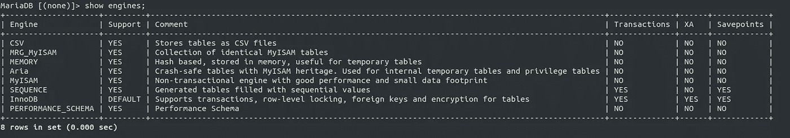
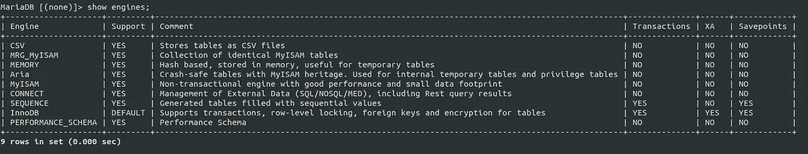
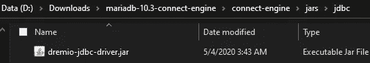
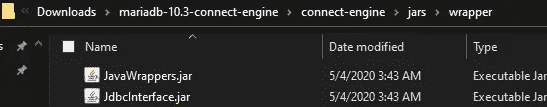

# 用德雷米奥 VDS - JDBC 连接表支架在 Docker 上安装 MariaDB 连接引擎。

> 原文：<https://levelup.gitconnected.com/install-mariadb-connect-engine-on-docker-with-dremio-vds-jdbc-connect-table-support-c969f7c97c90>


你可以使用来自 ***docker hub*** 的 [MariaDB 官方镜像](https://hub.docker.com/_/mariadb)来做到这一点。我准备用 **MariaDB 10.3** 版本的图片，这篇文章是基于 ***Ubuntu 18.04 LTS 仿生*** 的。

**我会附上一个示例文件包 google drive 的链接，本文结束后下载，为大家节省时间。😃**

**先决条件:**

*   你得先安装 ***Docker*** 和 [***Docker 作曲***](https://docs.docker.com/compose/install/) 。
*   互联网连接下载文件。
*   ***Linux/Ubuntu、MariaDB/MySQL、Docker、Docker Compose*** 中的基础知识。

基本上，

在 ***MariaDB*** 容器上安装 ***java*** ，然后就可以安装 ***连接引擎插件*** 。然后在 ***connect.conf*** 文件中设置***connect _ JVM _ path***和***connect _ class _ path***变量。

1.  首先，我会举例说明必要的步骤。
2.  然后我会提供我的 docker 文件来自动化这个过程。

# 1.手动遵循的步骤(学习目的)

运行 ***MariaDB*** 容器。(我将给 ***根*** 作为密码，给***connect-Maria db***作为容器名)

```
docker run --name **connect-mariadb** -e MYSQL_ROOT_PASSWORD=**root** -d mariadb:10.3
```

***connect-Maria db***可以替换成你喜欢的任何容器名。或者也可以使用容器 id 来代替它。但是，从现在开始，我将在我的命令中使用这个容器名。(JFYI)

首先将**内的*日志*到**容器中:

```
docker exec -it **connect-mariadb** bash
```

要安装 ***java*** 类型:

```
apt update
apt install openjdk-8-jdk -y
export JAVA_HOME=/usr/lib/jvm/java-1.8.0-openjdk-amd64
```

然后设置 ***MariaDB*** 存储库，按照[链接](https://downloads.mariadb.org/mariadb/repositories/#distro=Ubuntu&distro_release=bionic--ubuntu_bionic&mirror=hostag&version=10.3)或键入:

```
apt-get install software-properties-common -yapt-key adv — fetch-keys ‘[https://mariadb.org/mariadb_release_signing_key.asc'](https://mariadb.org/mariadb_release_signing_key.asc')add-apt-repository ‘deb [arch=amd64,arm64,ppc64el] [http://mirror.host.ag/mariadb/repo/10.3/ubuntu](http://mirror.host.ag/mariadb/repo/10.3/ubuntu) bionic main’apt update
```

然后安装插件的包:

```
apt-get install mariadb-plugin-connect -y
```

然后下载[***dre mio-JDBC-driver . jar***](http://download.dremio.com/jdbc-driver/4.2.2-202004211133290458-b550b6fa/dremio-jdbc-driver-4.2.2-202004211133290458-b550b6fa.jar)文件并复制到路径:

```
/usr/lib/jvm/java-1.8.0-openjdk-amd64/jre/lib/ext/
```

例如:你可以使用 ***docker cp*** 命令将里面的 jar 复制到容器中。

***sourcePath*** =主机上下载的 dremio jdbc jar 文件的源路径。(可以长得像 ***。/Downloads/dre mio-JDBC . jar***

```
docker cp ***sourcePath*** connect-mariadb:/usr/lib/jvm/java-1.8.0-openjdk-amd64/jre/lib/ext/
```

然后下载[***Java wrappers . jar***](https://drive.google.com/open?id=1MWPTvX_QDR9-7u_8qhwx9vF5RpeJc0za)和[***JDBC interface . jar***](https://drive.google.com/open?id=1uH2yKnvLBCpDpQnhOmm_Us988-AcKkLw)文件并复制到路径:

```
/usr/lib/mysql/plugin
```

打开**/etc/MySQL/Maria db . conf . d/***connect . CNF***文件，在****【Maria db】***下添加下面几行，***

```
*[mariadb]
plugin-load-add=ha_connect.soconnect_jvm_path=”/usr/lib/jvm/java-1.8.0-openjdk-amd64/jre/lib/amd64/server”
connect_class_path=”/usr/lib/mysql/plugin:/usr/lib/jvm/java-1.8.0-openjdk-amd64/jre/lib/ext/dremio-jdbc-driver.jar”*
```

***检查上述步骤中给出的路径是否存在于您的容器中。要检查的路径:***

```
*/usr/lib/jvm/java-1.8.0-openjdk-amd64
/usr/lib/jvm/java-1.8.0-openjdk-amd64/jre/lib/ext/
/usr/lib/mysql/plugin
/etc/mysql/mariadb.conf.d/*
```

***重新启动容器。***

```
*docker restart connect-mariadb*
```

***登录***Maria db****(*`mysql -u root -p`*)*后可以使用以下命令检查*连接引擎是否安装了。****

```
**SHOW ENGINES;
SHOW PLUGINS;**
```

********

****未安装连接时****

********

****安装连接时****

****此外，如果安装了连接引擎，您可以创建一个示例 ***JDBC 连接表*** 并从 ***Dremio 虚拟数据集*** 中获取数据。****

# ****2.下面我将放入我的 docker 示例文件来自动化这个过程。****

******Dockerfile******

```
**FROM mariadb:10.3LABEL author=”[prabuddha.kulatunga@gmail.com](mailto:prabuddha.kulatunga@mcmedisoft.com)”
LABEL version=”1.0"RUN apt update && apt install openjdk-8-jdk -y && export JAVA_HOME=/usr/lib/jvm/java-1.8.0-openjdk-amd64RUN apt update && apt-get install software-properties-common -y && apt-key adv — fetch-keys ‘[https://mariadb.org/mariadb_release_signing_key.asc'](https://mariadb.org/mariadb_release_signing_key.asc') && add-apt-repository ‘deb [arch=amd64,arm64,ppc64el] [http://mirror.host.ag/mariadb/repo/10.3/ubuntu](http://mirror.host.ag/mariadb/repo/10.3/ubuntu) bionic main’RUN apt update && apt-get install mariadb-plugin-connect -yCOPY ./jars/wrapper/* /usr/lib/mysql/plugin/
COPY ./jars/jdbc/* /usr/lib/jvm/java-1.8.0-openjdk-amd64/jre/lib/ext/
COPY ./connect.cnf /etc/mysql/mariadb.conf.d/connect.cnf
RUN chmod 0444 /etc/mysql/mariadb.conf.d/connect.cnfVOLUME /var/lib/mysqlEXPOSE 3306CMD [“mysqld”]**
```

******docker-compose.yml******

```
**version: ‘3’
services:
 connect_engine: 
 build: .
 image: mariadb-connect:1
 container_name: connect
 ports:
 — 3336:3306
 environment:
 — MYSQL_ROOT_PASSWORD=root
 volumes:
 — ./connectData:/var/lib/mysql
 — ./connect.cnf:/etc/mysql/mariadb.conf.d/connect.cnf
 restart: always**
```

******connect.cnf******

```
**[mariadb]
plugin-load-add=ha_connect.soconnect_jvm_path=”/usr/lib/jvm/java-1.8.0-openjdk-amd64/jre/lib/amd64/server”
connect_class_path=”/usr/lib/mysql/plugin:/usr/lib/jvm/java-1.8.0-openjdk-amd64/jre/lib/ext/dremio-jdbc-driver.jar”**
```

*******下面我将把文件夹的结构简化一下。*******

********

****文件夹结构(连接引擎文件夹)****

****在 ***jars*** 文件夹内，****

********

****内部 jars 文件夹结构****

****在 ***jdbc*** 文件夹内，****

********

****jars/jdbc 文件夹内容内部****

****在 ***包装器*** 文件夹内，****

********

****jars/wrapper 文件夹内容****

****在***connect-engine/connect data***文件夹里面不需要有任何东西。(JFYI)****

****将一切设置到正确的文件夹和文件后，您可以进入 ***connect-engine*** 文件夹，然后可以键入:****

```
**docker-compose up -d**
```

****[**点击此处下载完整文件包**](https://drive.google.com/open?id=1VrDOsBOh9j7ywN0Gp3N2gCR3vtUTw_3Z)****

****根据我的样本***docker-compose . yml***文件，****

*   ****root 用户的密码= ***root*******
*   ****主机端口= ***3336*******
*   ******集装箱港口=*3306*******
*   ******容器名称=*连接*容器******
*   ****image name =***Maria db-connect:1*******
*   ****数据库将存储在主机的***connect-engine/connect data***文件夹中。****

****你可以随意改变。👈****

****如果你需要进一步的澄清，请在评论区告诉我。****