# 在 Linux 上安装多个 Python 版本

> 原文：<https://levelup.gitconnected.com/install-multiple-python-versions-on-linux-8bd6d301d78c>

## 系列:人工智能

## 附有说明和截图的简明指南


图片由[程峰](https://unsplash.com/@chengfengrecord)

> [扩展指南](https://medium.com/p/916990dabe4b)使用术语和命令的定义来帮助您了解正在发生的事情。

1.  点击左上角的“活动”
2.  在搜索栏中输入“终端”
3.  点击“终端”


## 检查默认版本:

1.  从下面这些指令中复制命令
2.  将命令粘贴到终端
3.  按“回车”

```
python --version
```

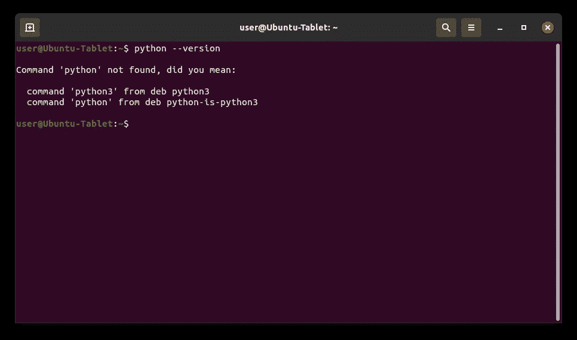

## 检查可执行文件:

1.  从下面这些指令中复制命令
2.  将命令粘贴到终端
3.  按“回车”

```
which python
```

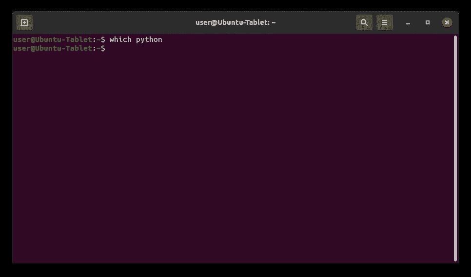

## 打开主目录:

1.  从下面这些指令中复制命令
2.  将命令粘贴到终端
3.  按“回车”

```
cd $HOME
```

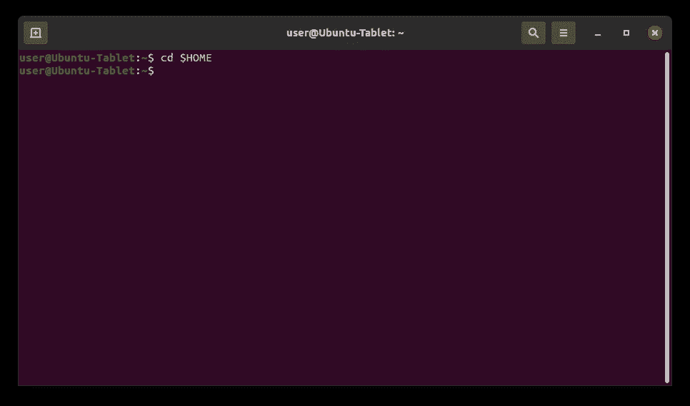

## 安装 Git:

1.  从下面这些指令中复制命令
2.  将命令粘贴到终端
3.  按“回车”

```
sudo apt-get install --yes git
```

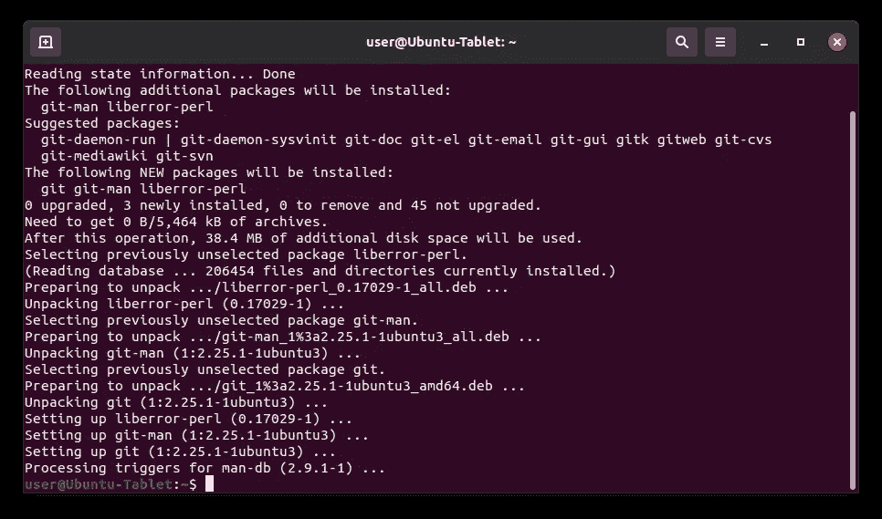

## 克隆 Pyenv 存储库:

1.  从下面这些指令中复制命令
2.  将命令粘贴到终端
3.  按“回车”

```
git [clone](#1b3c) https://github.com/pyenv/pyenv.git ~/.pyenv
```

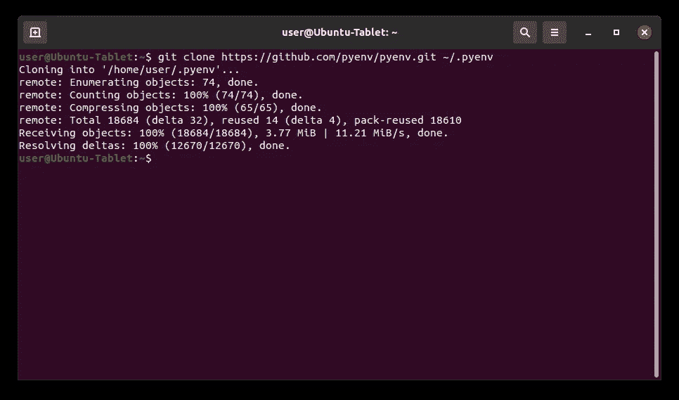

## 打开 Bash 配置文件:

1.  从下面这些指令中复制命令
2.  将命令粘贴到终端
3.  按“回车”

```
gedit .bashrc
```

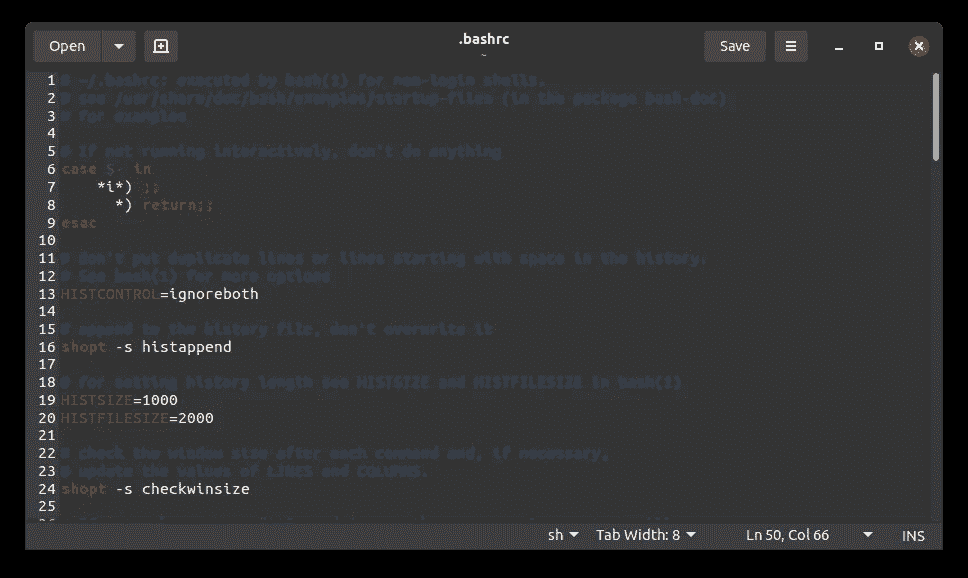

## 编辑 Bash 配置文件:

1.  从这些指令下面复制代码
2.  将代码粘贴到文本编辑器中
3.  点击“保存”

```
# Pyenv environment variables
export PYENV_ROOT="$HOME/.pyenv"
export PATH="$PYENV_ROOT/bin:$PATH"# Pyenv initialization
if command -v pyenv 1>/dev/null 2>&1; then
  eval "$(pyenv init -)"
fi
```

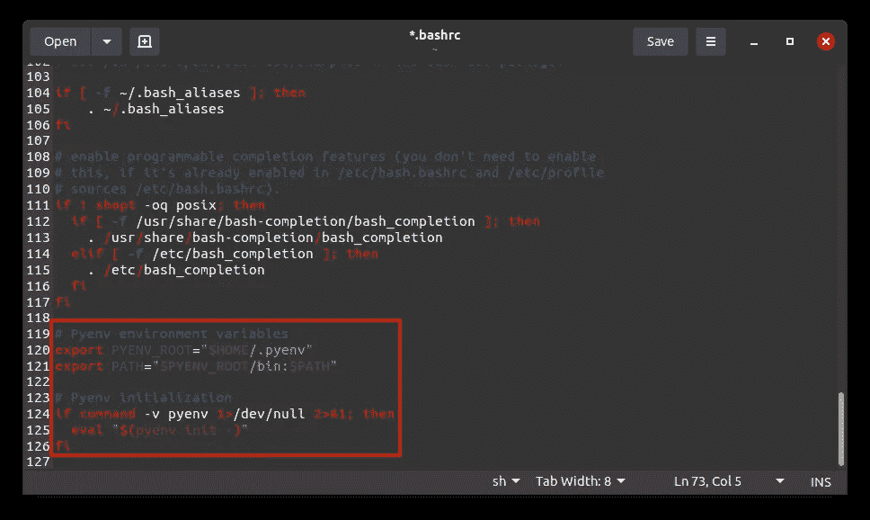

## 重新启动 Bash:

1.  从下面这些指令中复制命令
2.  将命令粘贴到终端
3.  按“回车”

```
exec $SHELL
```

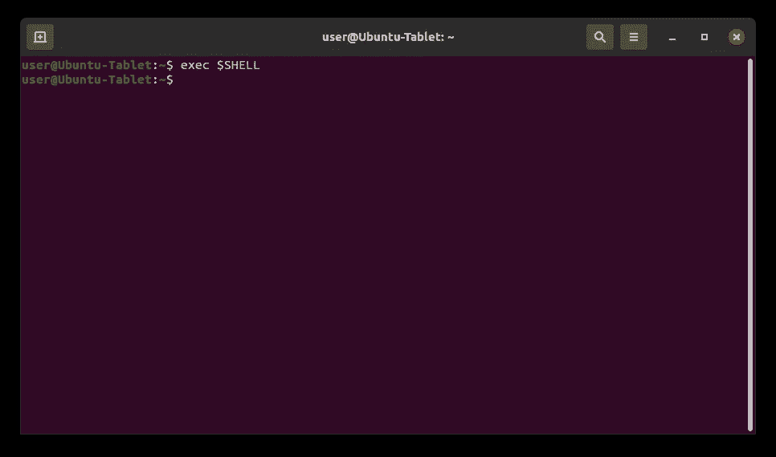

## 更新来源列表和来源列表目录:

1.  从下面这些指令中复制命令
2.  将命令粘贴到终端
3.  按“回车”

```
sudo apt-get update --yes
```

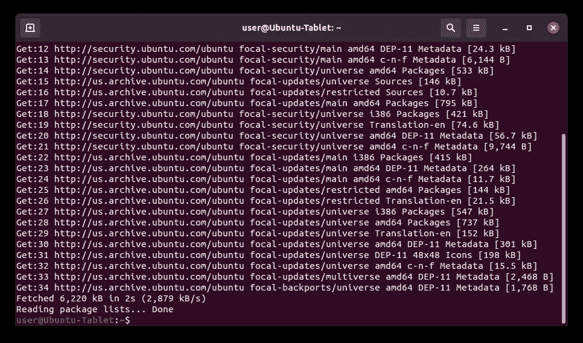

## 安装 Pyenv 依赖项:

1.  从下面这些指令中复制命令
2.  将命令粘贴到终端
3.  按“回车”

```
sudo apt-get install --yes libssl-dev zlib1g-dev libbz2-dev libreadline-dev libsqlite3-dev llvm libncurses5-dev libncursesw5-dev xz-utils tk-dev libgdbm-dev lzma lzma-dev tcl-dev libxml2-dev libxmlsec1-dev libffi-dev liblzma-dev wget curl make build-essential python-openssl
```

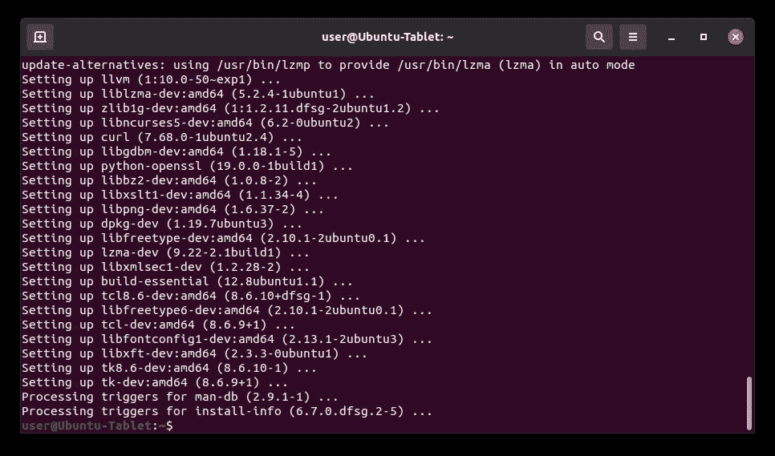

## 查看 Python 版本:

1.  从下面这些指令中复制命令
2.  将命令粘贴到终端
3.  按“回车”

```
pyenv install --list
```

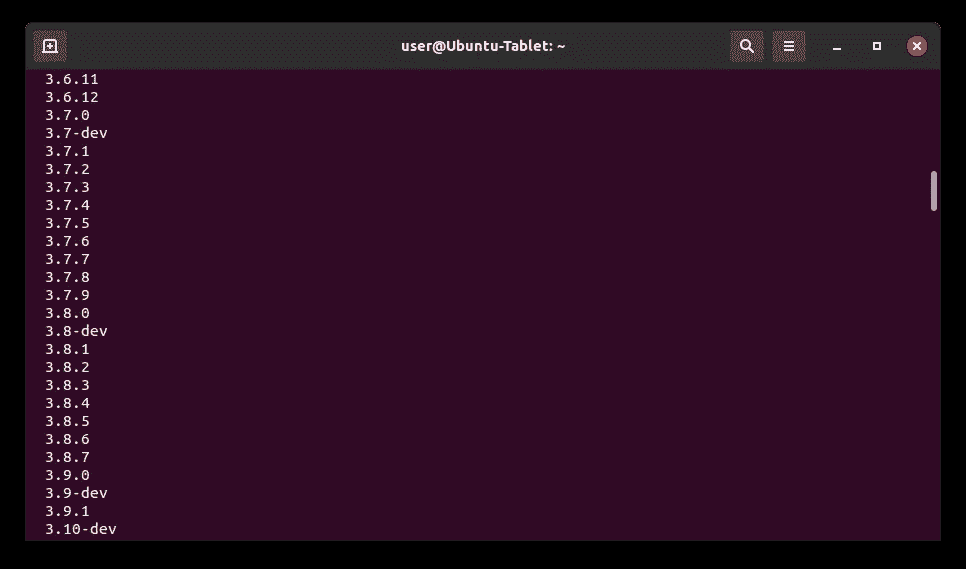

## 安装 Python:

1.  从以下这些说明中找到版本
2.  复制提供的命令
3.  将命令粘贴到终端
4.  按“回车”
5.  重复

```
**Python 3.5:**
pyenv install 3.5.4**Python 3.6:**
pyenv install 3.6.8**Python 3.7:**
pyenv install 3.7.9**Python 3.8:**
pyenv install 3.8.6**Python 3.9:**
pyenv install 3.9.0
```

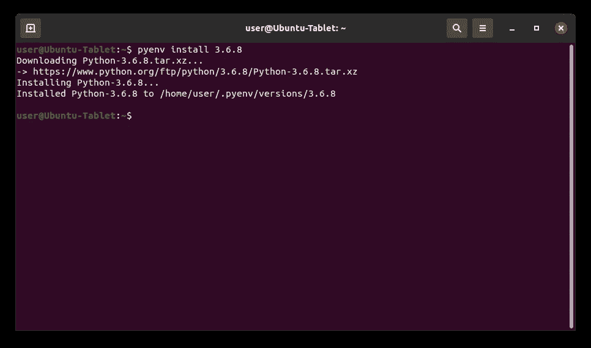

## 设定电脑的默认版本:

1.  从下面这些指令中复制命令
2.  将命令粘贴到终端
3.  按“回车”

```
pyenv global 3.8.6
```

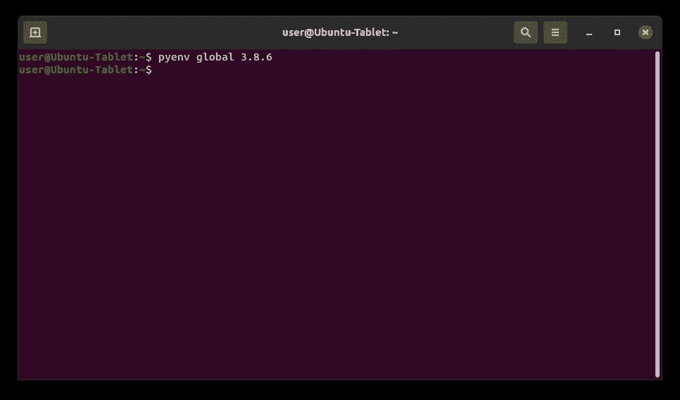

## 创建临时目录:

1.  从下面这些指令中复制命令
2.  将命令粘贴到终端
3.  按“回车”

```
mkdir temporary
```


## 打开临时目录:

1.  从下面这些指令中复制命令
2.  将命令粘贴到终端
3.  按“回车”

```
cd temporary
```

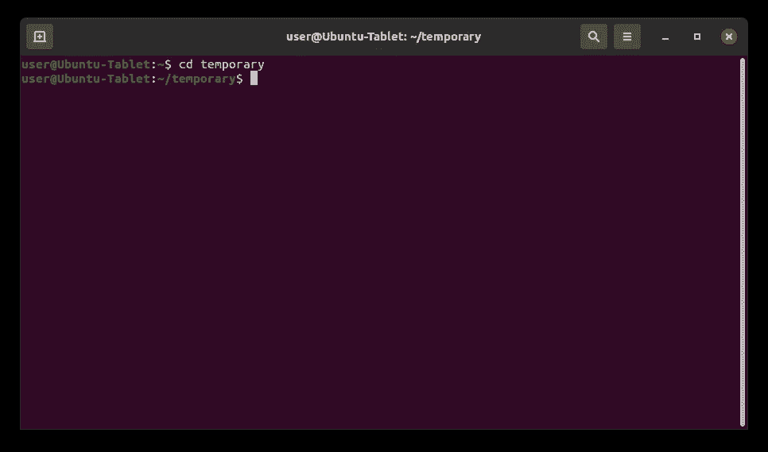

## 设置目录的默认版本:

1.  从下面这些指令中复制命令
2.  将命令粘贴到终端
3.  按“回车”

```
pyenv local 3.6.8
```

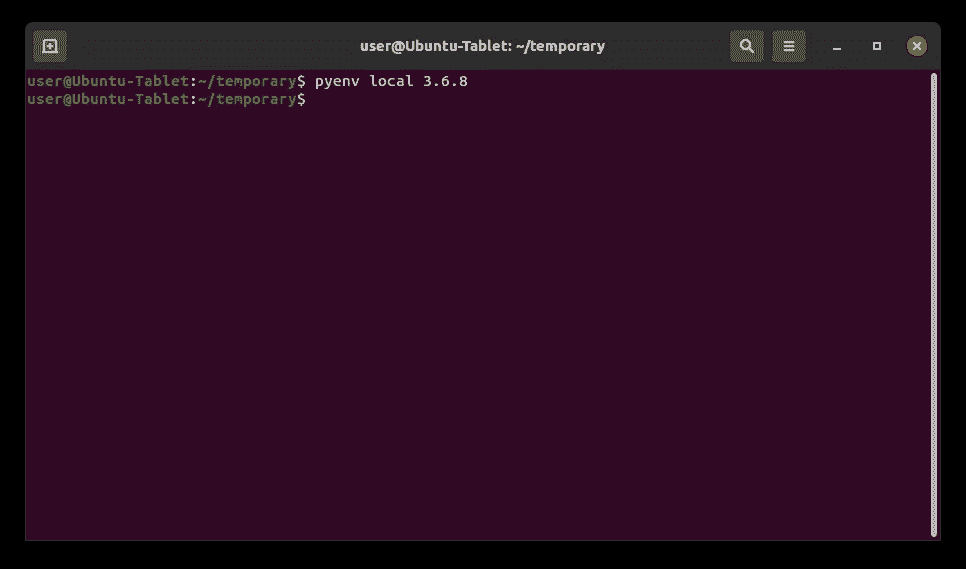

## 检查默认版本:

1.  从下面这些指令中复制命令
2.  将命令粘贴到终端
3.  按“回车”

```
python --version
```

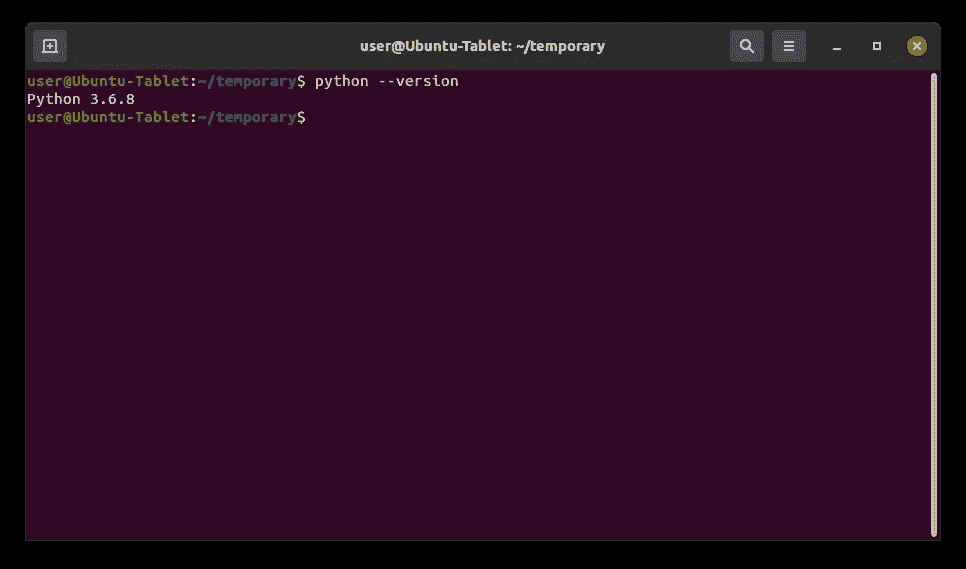

## 打开父目录:

1.  从下面这些指令中复制命令
2.  将命令粘贴到终端
3.  按“回车”

```
cd ..
```

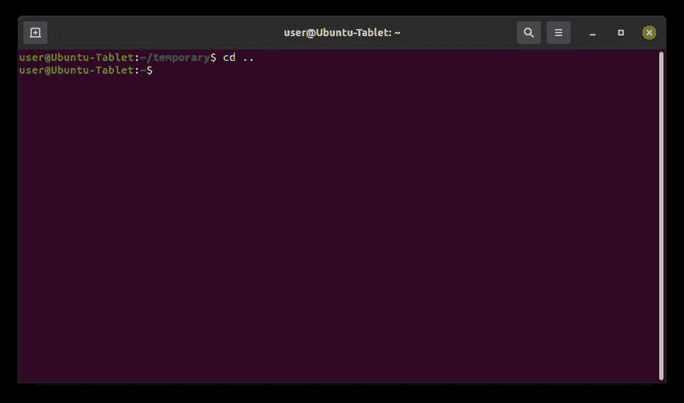

## 检查默认版本:

1.  从下面这些指令中复制命令
2.  将命令粘贴到终端
3.  按“回车”

```
python --version
```


## 打开临时目录:

1.  从下面这些指令中复制命令
2.  将命令粘贴到终端
3.  按“回车”

```
cd temporary
```

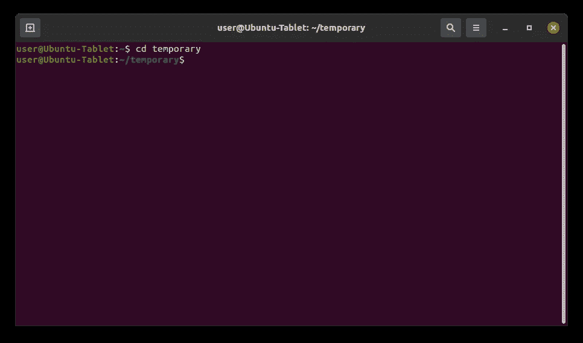

## 创建虚拟环境:

1.  从下面这些指令中复制命令
2.  将命令粘贴到终端
3.  按“回车”

```
python -m venv venv36
```

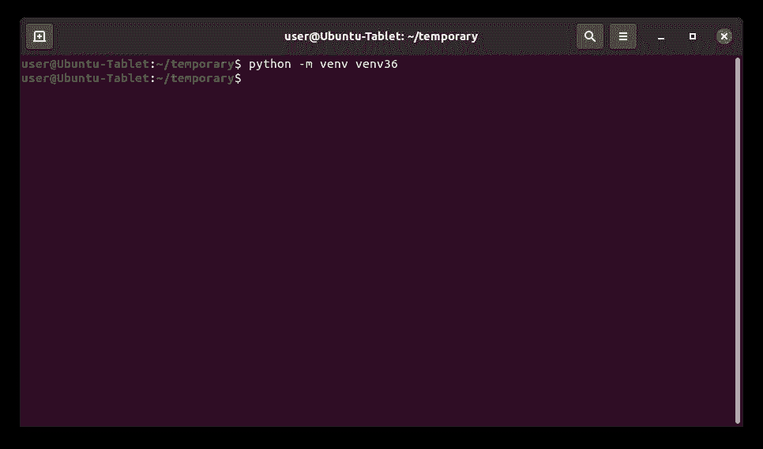

## 激活虚拟环境:

1.  从下面这些指令中复制命令
2.  将命令粘贴到终端
3.  按“回车”

```
source ./venv36/bin/activate
```

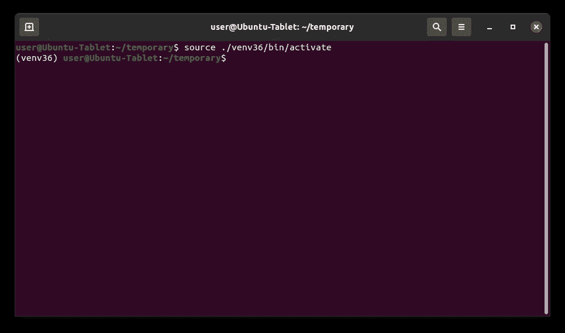

## 检查默认版本:

1.  从下面这些指令中复制命令
2.  将命令粘贴到终端
3.  按“回车”

```
python --version
```

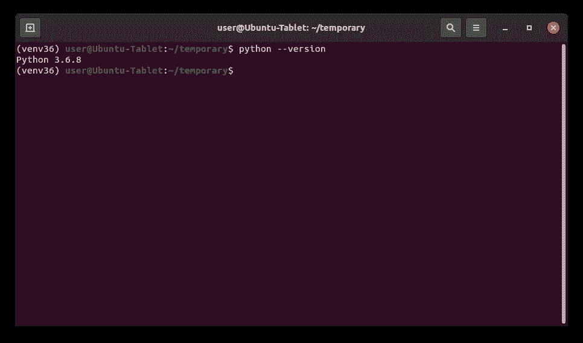

## 检查可执行文件:

1.  从下面这些指令中复制命令
2.  将命令粘贴到终端
3.  按“回车”

```
which python
```

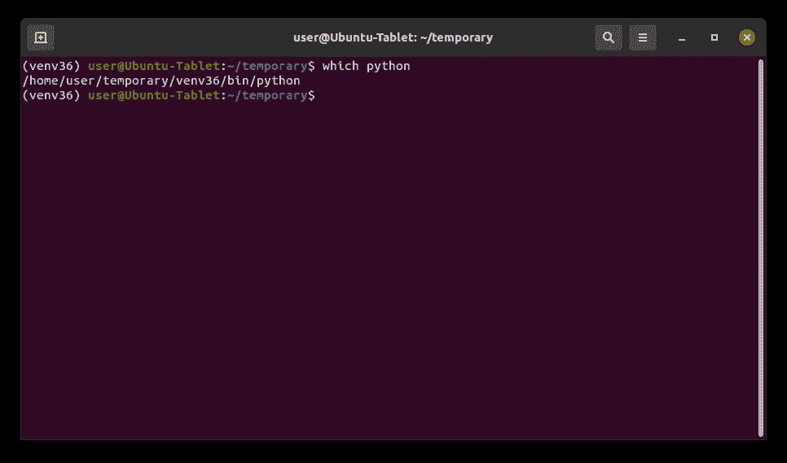

## 停用虚拟环境:

1.  从下面这些指令中复制命令
2.  将命令粘贴到终端
3.  按“回车”

```
deactivate
```

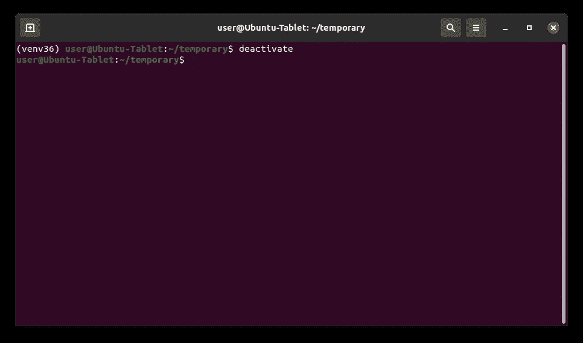

> “希望这篇文章能帮助您获得👯‍♀️🏆👯‍♀️，记得订阅获取更多内容🏅"

## 后续步骤:

这篇文章是一个迷你系列的一部分，帮助读者设置他们开始学习人工智能、机器学习、深度学习和/或数据科学所需的一切。它包括包含复制和粘贴代码的说明和截图的文章，以帮助读者尽快获得结果。它还包括一些文章，包含带有解释和截图的说明，以帮助读者了解正在发生的事情。

```
**Linux:**
01\. [Install Multiple Python Versions](https://medium.com/p/8bd6d301d78c)
02\. [Install the CUDA Driver and Toolkit](https://medium.com/p/3494a4436d6)
03\. [Install the Jupyter Notebook Server](https://medium.com/p/f5bbc07e184a)
04\. [Install Virtual Environments in Jupyter Notebook](https://medium.com/p/c93fd8d07ca0)
05\. [Install the Python Environment for AI](https://medium.com/p/d2937ce641b7)**WSL2:**
01\. [Install Windows Subsystem for Linux 2](https://medium.com/p/e01f92e98cc0)
02\. [Install Multiple Python Versions](https://medium.com/p/ba81f21109d6)
03\. [Install the CUDA Driver and Toolkit](https://medium.com/p/be38703fed5c)
04\. [Install the Jupyter Notebook Server](https://medium.com/p/3ea9bc06a0e5)
05\. [Install Virtual Environments in Jupyter Notebook](https://medium.com/p/d99de1d79fd4)
06\. [Install the Python Environment for AI](https://medium.com/p/6d73735b546)
07\. [Install Ubuntu Desktop GUI (Bonus)](https://medium.com/p/7c3730e33bb2)**Windows 10:**
01\. [Install Multiple Python Versions](https://medium.com/p/15a8685ec99d)
02\. [Install the CUDA Driver and Toolkit](https://medium.com/p/f103ea5eae4b)
03\. [Install the Jupyter Notebook Server](https://medium.com/p/c2ca45793e3b)
04\. [Install Virtual Environments in Jupyter Notebook](https://medium.com/p/a307b6524715)
05\. [Install the Python Environment for AI](https://medium.com/p/604168afbd6e)**MacOS:** 01\. [Install Multiple Python Versions](https://medium.com/p/a58b1966825f)
02\. [Install the Jupyter Notebook Server](https://medium.com/p/7b42d371ac21)
03\. [Install Virtual Environments in Jupyter Notebook](https://medium.com/p/557f23e55f99)
04\. [Install the Python Environment for AI](https://medium.com/p/ed5c93639301)
```