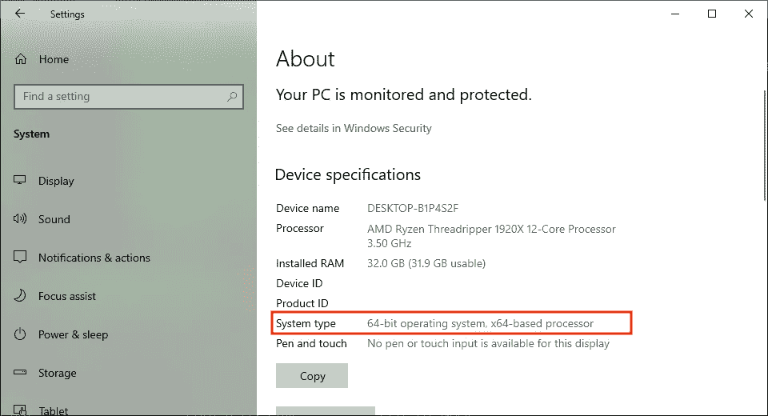
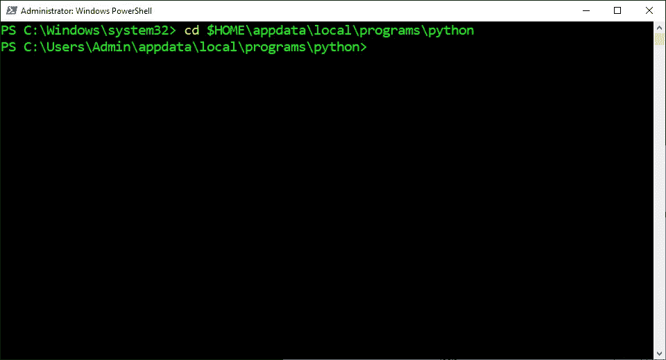
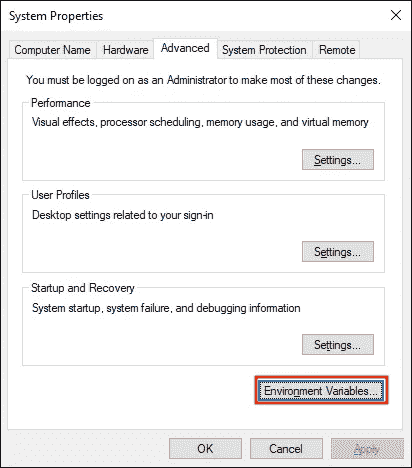
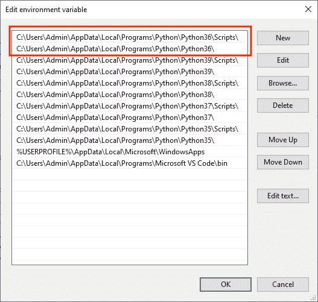
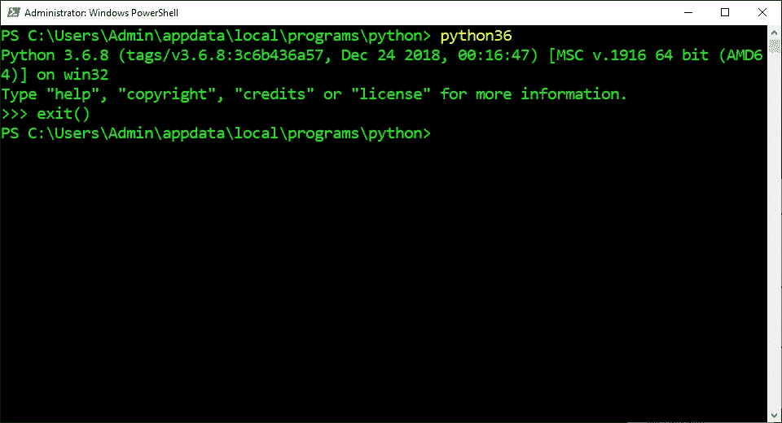
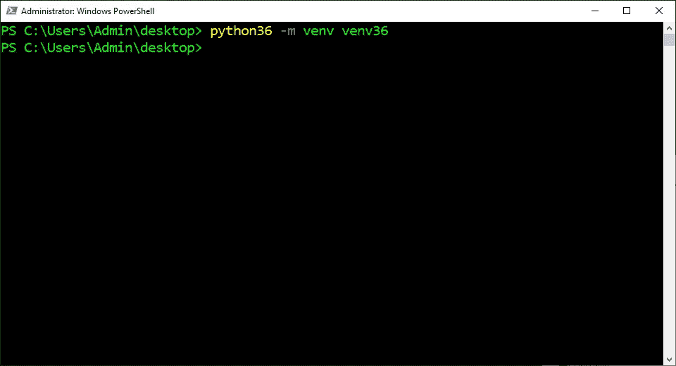

# 在 Windows 10 上安装多个 Python 版本

> 原文：<https://levelup.gitconnected.com/install-multiple-python-versions-on-windows-10-15a8685ec99d>

## 系列:人工智能

## 附有说明和截图的简明指南


图片由[程峰](https://unsplash.com/@chengfengrecord)

> [扩展指南](https://medium.com/p/c90098d7ba5a)使用术语和命令的定义来帮助您了解正在发生的事情。

## 检查系统类型:

1.  按下“⊞之窗”
2.  在搜索栏中输入“关于”
3.  点击“关于您的电脑”



## 下载 Python:

1.  访问官网:[[3.5](https://www.python.org/downloads/release/python-354/)][[3.6](https://www.python.org/downloads/release/python-368/)][[3.7](https://www.python.org/downloads/release/python-379/)][[3.8](https://www.python.org/downloads/release/python-386/)][[3.9](https://www.python.org/downloads/release/python-390/)]
2.  滚动到“寻找特定版本？”部分
3.  滚动到“文件”部分
4.  下载与系统类型匹配的“可执行安装程序”
5.  重复


## 打开可执行文件:

1.  双击 Python 文件
2.  选中“将 Python **添加到路径”框
3.  单击“立即安装”
4.  重复


## 打开 PowerShell:

1.  按下“⊞之窗”
2.  在搜索栏中输入“PowerShell”
3.  单击“以管理员身份运行”


## 打开 Python 目录:

1.  从下面这些指令中复制命令
2.  将命令粘贴到 PowerShell 中
3.  按“回车”

```
cd $HOME\appdata\local\programs\python
```



## 复制可执行文件:

1.  从以下这些说明中找到版本
2.  复制提供的命令
3.  将命令粘贴到 PowerShell 中
4.  按“回车”
5.  重复

```
**Python 3.5:**
copy python35\python.exe python35\python35.exe**Python 3.6:** copy python36\python.exe python36\python36.exe**Python 3.7:** copy python37\python.exe python37\python37.exe**Python 3.8:** copy python38\python.exe python38\python38.exe**Python 3.9:** copy python39\python.exe python39\python39.exe
```


## 打开环境变量:

1.  按下“⊞之窗”
2.  在搜索栏中输入“环境变量”
3.  单击“编辑系统环境变量”
4.  单击“环境变量…”



## 打开路径:

1.  在“用户变量”部分选择“路径”
2.  点击“编辑”


## 设置默认版本:

1.  从以下这些说明中找到版本
2.  在路径中选择提供的路径
3.  点击“上移”
4.  单击“上移”,直到提供的路径成为顶部的两个项目
5.  单击“确定”
6.  单击“确定”
7.  单击“确定”

```
**Python 3.5:**
c:\users\admin\appdata\local\programs\python\python35\scripts\
c:\users\admin\appdata\local\programs\python\python35\**Python 3.6:**
c:\users\admin\appdata\local\programs\python\python36\scripts\
c:\users\admin\appdata\local\programs\python\python36\**Python 3.7:**
c:\users\admin\appdata\local\programs\python\python37\scripts\
c:\users\admin\appdata\local\programs\python\python37\**Python 3.8:**
c:\users\admin\appdata\local\programs\python\python38\scripts\
c:\users\admin\appdata\local\programs\python\python38\**Python 3.9:**
c:\users\admin\appdata\local\programs\python\python39\scripts\
c:\users\admin\appdata\local\programs\python\python39\
```



## 检查默认版本:

1.  从下面这些指令中复制命令
2.  将命令粘贴到 PowerShell 中
3.  按“回车”

```
python --version
```


## 使用特定的 Python 解释器:

1.  从以下这些说明中找到版本
2.  复制提供的命令
3.  将命令粘贴到 PowerShell 中
4.  按“回车”

```
**Python 3.5:**
python35**Python 3.6:** python36**Python 3.7:** python37**Python 3.8:** python38**Python 3.9:** python39
```


## 退出 Python 解释器:

1.  从下面这些指令中复制命令
2.  将提供的命令粘贴到 PowerShell 中
3.  按“回车”

```
exit()
```



## 打开桌面目录:

1.  从下面这些指令中复制命令
2.  将提供的命令粘贴到 PowerShell 中
3.  按“回车”

```
cd $HOME\desktop
```


## 创建虚拟环境:

1.  从以下这些说明中找到版本
2.  复制提供的命令
3.  将命令粘贴到 PowerShell 中
4.  按“回车”

```
**Python 3.5:**
python35 -m venv venv35**Python 3.6:**
python36 -m venv venv36**Python 3.7:**
python37 -m venv venv37**Python 3.8:**
python38 -m venv venv38**Python 3.9:**
python39 -m venv venv39
```



## 激活虚拟环境:

1.  从以下这些说明中找到版本
2.  复制提供的命令
3.  将命令粘贴到 PowerShell 中
4.  按“回车”

```
**Python 3.5:** venv35\scripts\activate**Python 3.6:**
venv36\scripts\activate**Python 3.7:**
venv37\scripts\activate**Python 3.8:**
venv38\scripts\activate**Python 3.9:** venv39\scripts\activate
```


## 检查可执行文件:

1.  从下面这些指令中复制命令
2.  将命令粘贴到终端
3.  按“回车键”

```
$(get-command python).path
```


## 停用虚拟环境:

1.  从下面这些指令中复制命令
2.  将命令粘贴到 PowerShell 中
3.  按“回车”

```
deactivate
```


> “希望这篇文章能帮助您获得👯‍♀️🏆👯‍♀️，记得订阅获取更多内容🏅"

## 后续步骤:

这篇文章是一个迷你系列的一部分，帮助读者设置他们开始学习人工智能、机器学习、深度学习和/或数据科学所需的一切。它包括包含复制和粘贴代码的说明和截图的文章，以帮助读者尽快获得结果。它还包括一些文章，包含带有解释和截图的说明，以帮助读者了解正在发生的事情。

```
**Linux:**
01\. [Install Multiple Python Versions](https://medium.com/p/8bd6d301d78c)
02\. [Install the CUDA Driver and Toolkit](https://medium.com/p/3494a4436d6)
03\. [Install the Jupyter Notebook Server](https://medium.com/p/f5bbc07e184a)
04\. [Install Virtual Environments in Jupyter Notebook](https://medium.com/p/c93fd8d07ca0)
05\. [Install the Python Environment for AI](https://medium.com/p/d2937ce641b7)**WSL2:**
01\. [Install Windows Subsystem for Linux 2](https://medium.com/p/e01f92e98cc0)
02\. [Install Multiple Python Versions](https://medium.com/p/ba81f21109d6)
03\. [Install the CUDA Driver and Toolkit](https://medium.com/p/be38703fed5c)
04\. [Install the Jupyter Notebook Server](https://medium.com/p/3ea9bc06a0e5)
05\. [Install Virtual Environments in Jupyter Notebook](https://medium.com/p/d99de1d79fd4)
06\. [Install the Python Environment for AI](https://medium.com/p/6d73735b546)
07\. [Install Ubuntu Desktop GUI (Bonus)](https://medium.com/p/7c3730e33bb2)**Windows 10:**
01\. [Install Multiple Python Versions](https://medium.com/p/15a8685ec99d)
02\. [Install the CUDA Driver and Toolkit](https://medium.com/p/f103ea5eae4b)
03\. [Install the Jupyter Notebook Server](https://medium.com/p/c2ca45793e3b)
04\. [Install Virtual Environments in Jupyter Notebook](https://medium.com/p/a307b6524715)
05\. [Install the Python Environment for AI](https://medium.com/p/604168afbd6e)**MacOS:** 01\. [Install Multiple Python Versions](https://medium.com/p/a58b1966825f)
02\. [Install the Jupyter Notebook Server](https://medium.com/p/7b42d371ac21)
03\. [Install Virtual Environments in Jupyter Notebook](https://medium.com/p/557f23e55f99)
04\. [Install the Python Environment for AI](https://medium.com/p/ed5c93639301)
```