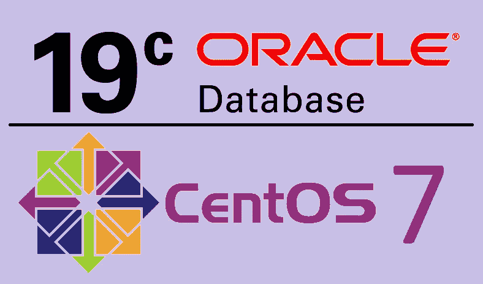
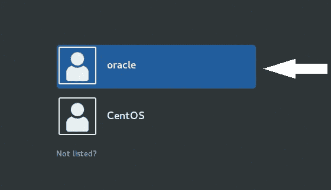
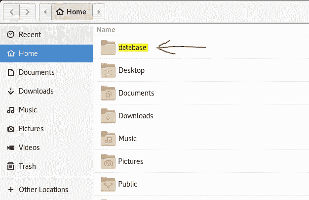
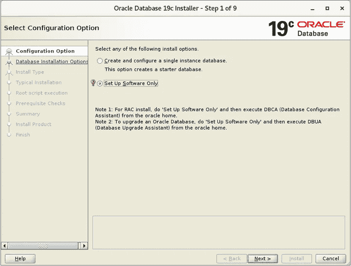
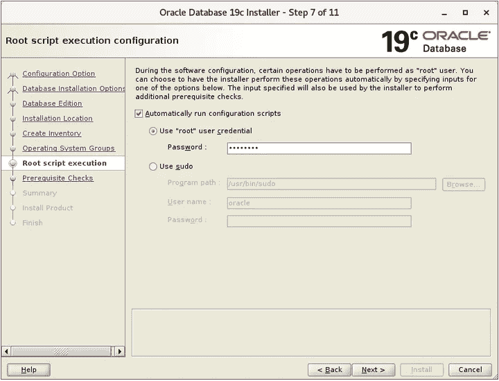
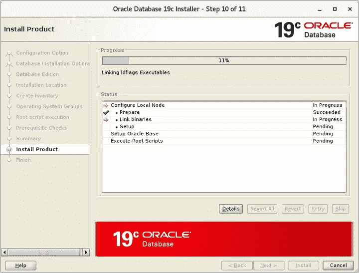
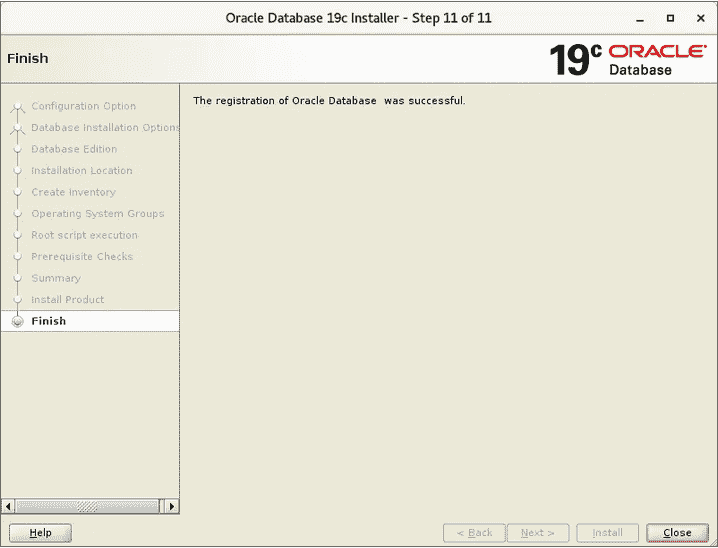

# 在 CentOS 7 上安装 Oracle 数据库 19.3c

> 原文：<https://levelup.gitconnected.com/install-oracle-database-19-3c-on-centos-7-52036876436>



# **什么是 Oracle 数据库？**

Oracle 数据库是一个多模式的数据库管理系统。这意味着数据库可以在多个模型中存储、索引和查询数据。此外，它是一个免费的产品，每个人都可以使用。

# **Oracle 数据库有哪些用途？**

最常见的是，它使用数据仓库(DW)、在线事务处理(OLTP)以及 DW 和 OLTP 的混合。

# **Oracle 数据库评测**

Oracle 以“Oracle v2”作为其第一个产品，然后将其升级到“Oracle 7.3”作为常规版本。

之后，他们从 1998 年开始使用三个类别评估他们的 oracle 版本。

*   “我”的版本-:代表“互联网”例如:Oracle 8i、Oracle 9i
*   “g”版本:代表网格计算。例如:Oracle 10g、Oracle 11g
*   “c”版本-:代表云计算。例如:甲骨文 12c、甲骨文 18c、甲骨文 19c

# **开始安装前如何准备环境？**

目前，Oracle 数据库版本的最稳定版本是 19.3c。为了安装该版本，我选择了 CentOS 7，因为它比其他版本的 Linux 平台有更好的正面评论。

就我而言，我使用 VMware 来运行 CentOS。您可以从这个 [**网站**](https://www.linuxvmimages.com/images/centos-7/) 找到 CentOS VM 镜像。

设置 CentOS7 后，它会显示 CLI 版本。要获得 GUI 版本，请遵循这些 [**方法**](https://www.server-world.info/en/note?os=CentOS_7&p=x) 。

配置完 GUI 后，我们需要创建一个能够支持 Oracle 数据库的新用户配置文件。要创建新的自定义配置文件，请遵循此 [**链接**](https://www.server-world.info/en/note?os=CentOS_7&p=oracle19c&f=1) 和**仅遵循第 2 步到第 4 步**。然后退出当前的概要文件，并登录到新创建的名为“oracle”的概要文件密码也是“甲骨文”



完成这些步骤后，现在我们必须安装 oracle 数据库。之前我告诉过你，我为此选择了 oracle 19.3c。所以你可以使用这个 [**链接**](https://www.oracle.com/database/technologies/oracle-database-software-downloads.html#19c) **找到 zip 文件。**在那里，选择“Linux x86–64”旁边的 zip 文件。

之后，再次使用终端遵循这些行。

```
**[oracle@centos7 ~]#** mkdir database**[oracle@centos7 ~]#** cd database
```

然后将 oracle 安装 zip 文件放入数据库文件夹。



```
**[oracle@centos7 database]#** unzip LINUX.X64_193000_db_home.zip**[oracle@centos7 database]#** ./runInstaller
```

此后，将出现 Oracle 数据库安装向导

然后向导将打开，我们可以安装 oracle 数据库。因此，跟随我的脚步。

**步骤 1 -:** 在向导中选择**“仅设置软件”**，因为我将单独安装 DBCA。因此，我将能够在没有任何冲突的情况下设置所有设置。



**第 2 步-:** 点击“下一步”按钮继续向导，直到第 7 步。在步骤 7 中，选择“自动复选框”并设置 root 密码来配置 root 脚本。在步骤 7 之后，单击“下一步”继续安装。



**第 3 步-:** 然后点击“下一步”直到完成。



在接下来的教程中，我将教你如何创建 CDB，PDB，听众等等。谢谢大家！

1.  *第二部分* — **Oracle 数据库 19.3c —多租户架构，创建 CDB 和 PDB-:**[https://kalanaejayasuriya . medium . com/Oracle-Database-multi tenant-Architecture-Create-CDB-and-PD b-4a 9bb 954803 b](https://kalanaejayasuriya.medium.com/oracle-database-multitenant-architecture-create-cdb-and-pdb-4a9bb954803b)
2.  *第 3 部分* — **Oracle 数据库—创建自定义监听器并将其注册到 Oracle 数据库 19.3c 中的 PDB-:**[https://kalanaejayasuriya . medium . com/Create-custom-Listener-and-register-it-to-a-PD B- f6c 709d 23054](https://kalanaejayasuriya.medium.com/create-custom-listener-and-register-it-to-a-pdb-f6c709d23054)