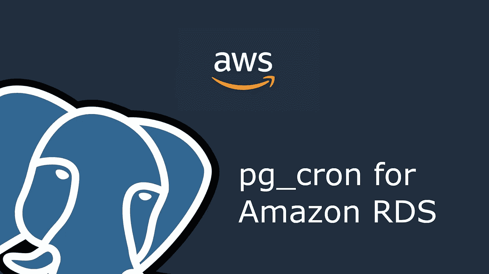
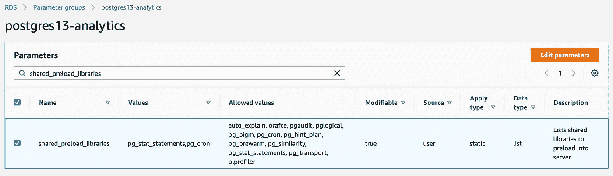
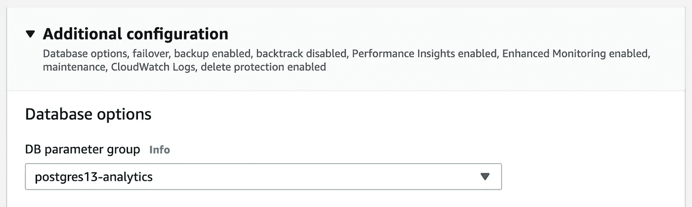

# 在 Amazon RDS 上安装 pg_cron

> 原文：<https://levelup.gitconnected.com/install-pg-cron-on-amazon-rds-758ca272f75c>

*我最近将我们位于*[*Org*](https://theorg.com/org/theorg)*的分析数据库升级到 PostgreSQL 13.1，以便支持定期刷新物化视图，使用 pg_cron 直接在数据库中运行作业。我们之前的设置涉及触发 Lambda 运行刷新命令的 CloudWatch 事件。*

在 Amazon RDS 上安装 pg_cron

# 升级到 PostgreSQL 12.5 以上版本

亚马逊 RDS 从 12.5 版本及更高版本开始支持 pg _ cron([来源](https://aws.amazon.com/about-aws/whats-new/2021/01/amazon-rds-postgresql-supports-pg-cron-extension-scheduling-database-jobs/))。如果您运行的是旧版本，则需要进行更新。

您可以在 AWS 控制面板中或通过运行:
`SELECT version();`来检查版本

如果您运行的是 12.5 版或更高版本，请直接跳到下一节。否则，您需要更新您的数据库。导航到您的数据库实例，将数据库引擎版本设置为 PostgreSQL 13.1-R1 以更新它。

下一步将要求您更新参数组，这也需要重新启动。同时执行这两个步骤有利于减少停机时间。

更新主要版本将需要 10-20 分钟，并使您的数据库暂时不可用。我不会在这里讨论避免停机的策略。

# 更新参数组

转到参数组，更改*shared _ preload _ libraries*的值，以包含 pg_cron。您不能更新默认参数组。

如果您正在使用 *default.postgres13* 参数组，则创建一个新的参数组，将*参数组族*设置为 postgres13。这将创建模板的副本，然后您可以对其进行修改。

修改 shared_preload_libraries 以包含 pg_cron

导航到 RDS 实例，然后单击修改。在附加配置下设置 DB 参数组，以使用您刚刚创建的组。如果您只是修改了现有的参数组，请跳过这一步。

为 RDS 实例设置数据库参数组。

应用更改。这需要快速重启数据库。

# 安装 pg_cron

作为 rds _ 超级用户连接到您的数据库。默认管理员账户(通常称为 *postgres* )是这个用户组的一部分。连接后，在 postgres 数据库中运行以下 SQL:

`CREATE EXTENSION pg_cron;`

如果成功，您应该能够在 postgres 数据库中看到一个名为 *cron* 的模式，其中包含一个*作业*和 *job_run_details* 表。不成功的常见错误包括:

> *错误:pg_cron 只能通过 shared_preload_libraries 加载*

参数组未正确更新。请确保您更新了正确的参数组，并将更改应用于数据库。数据库重新启动可能被挂起。

> *错误:创建扩展“pg_cron”的权限被拒绝*

您验证的用户没有安装 pg_cron 的权限。确保您使用的是具有管理员权限的帐户。postgres 和 rdsadmin 都可以。

> *错误:只能在数据库 postgres 中创建扩展*

您连接到了错误的数据库。确保您正在针对 *postgres* 数据库运行命令。

# 使用 pg_cron 添加 Cron 作业

一旦安装了 pg_cron，您就可以使用以下语法开始调度 SQL 命令: `SELECT cron.schedule(SCHEDULE, COMMAND);
SELECT cron.schedule(JOB_NAME, SCHEDULE, COMMAND);`

默认情况下，这些 cron 作业将在 *postgres* 数据库上下文中运行。我们使用 pg_cron 的用例是定期更新物化视图，因此我们需要更新执行命令的数据库。这可以通过首先调度作业，然后更新 *cron.job* 表中的*数据库*列来完成。在我们的例子中，代码如下所示:

`SELECT cron.schedule(
'Refresh weekly analytics',
'5 0 * * 1',
$$REFRESH MATERIALIZED VIEW web_client.company_weekly_analytics$$
)
UPDATE cron.job SET database = 'theorg' WHERE jobid = 1`

这将在每周一的 0:05 在我们的主数据库中运行该命令。

# pg_cron 的速成班

pg_cron 背后的概念相当简单。计划的任务存储在 *cron.job* 表中，其中包含要执行的命令和时间。时间表被表示为一个常规的 cron 表达式——您可以使用 [crontab.guru](https://crontab.guru/) 来生成正确的 cron 表达式。

查看所有预定作业:
`SELECT * FROM cron.job`

检查以前运行的日志:
`SELECT * FROM cron.job_run_details`

安排新工作:`SELECT cron.schedule(JOB_NAME, SCHEDULE, COMMAND);`

取消安排作业:

更新作业的 cron 表达式，例如 to 将在每天 3:14 运行 `UPDATE cron.job SET schedule = '14 3 * * *' WHERE jobid = 1`

每次运行都会在 *cron.job_run_details* 表中添加一个条目。查询它以确认您的 cron 作业成功执行。

# 放弃

考虑一下在您的数据库中直接运行 cron 作业是否是您的用例中的正确解决方案。它会使您的数据库变得混乱，耗尽资源，并从您的代码库中隐藏业务关键信息——可能会为您的同事带来一些非常糟糕的调试会话。

我个人不建议直接在数据库中运行清理或数据修改作业。我们的用例是确保我们的物化视图(由于性能原因必须物化)保持更新。我们的替代方法是使用 CloudWatch 事件来定期触发连接到数据库并刷新视图的 AWS lambda。

运行 Lambda 来刷新视图增加了成本和复杂性，并涉及更多可能会失败的移动部件。这种方法也不是很明显，因为你必须知道 lambda 的存在，并且是周期性触发的。在我们的例子中，使用 pg_cron 是较小的错误。

*原载于 2021 年 6 月 29 日*[*【https://adequatesource.com】*](https://adequatesource.com/pg-cron-aws-rds/)*。*