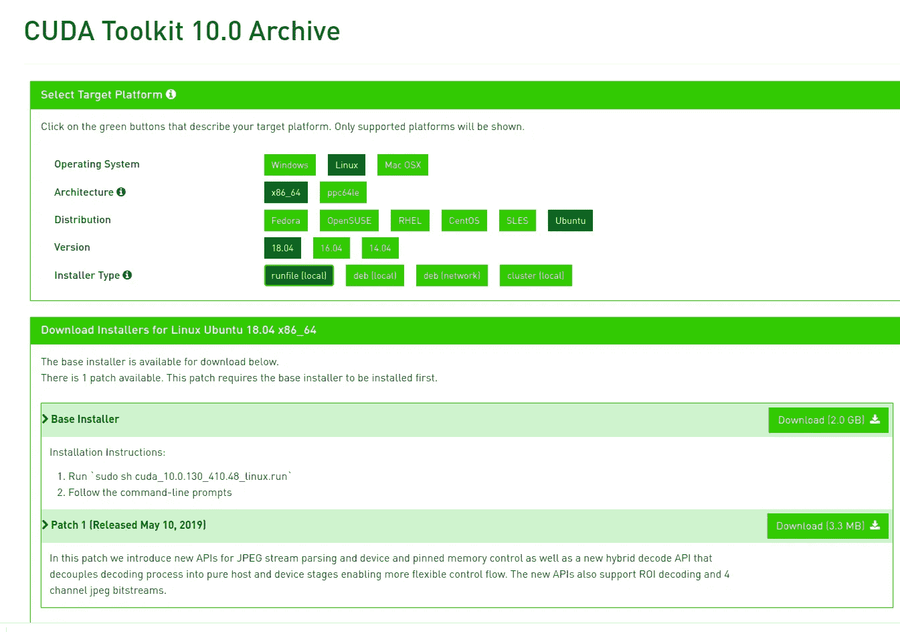
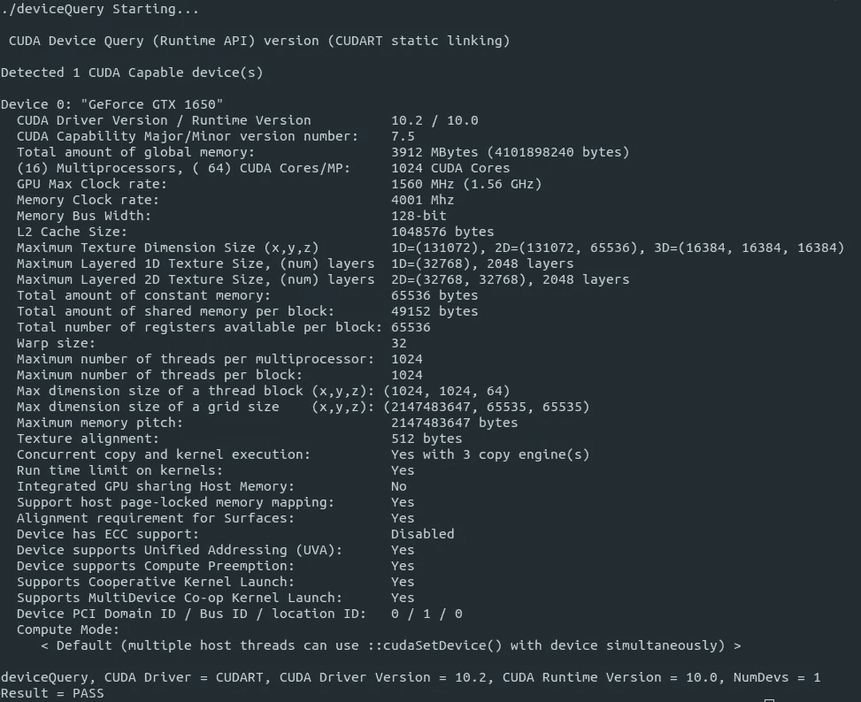

# 使用 Nvidia GTX1650/ GTX1660Ti 在 Ubuntu 18.04 上安装 Tensorflow 2.0.0

> 原文：<https://levelup.gitconnected.com/install-tensorflow-2-0-0-on-ubuntu-18-04-with-nvidia-gtx1650-gtx1660ti-9fd7a837d5fd>


在这篇文章中，我将向您展示如何使用 Nvidia GTX1650/GTX1660Ti 在 Ubuntu 18.04 上安装 Tensorflow GPU 2.0.0。我们将安装 Cuda 工具包 10.0，Cudnn 7.6.5 和 Nvidia 驱动程序。

# 步骤 1:删除已经安装的 Nvidia 驱动程序和 Cuda 版本

首先，我们将删除任何预装的 Nvidia 驱动程序或 cuda 版本。如果你有一个全新安装的 Ubuntu 18.04，那么你不需要这样做。

```
sudo apt-get purge nvidia* && sudo apt-get autoremovesudo rm -rf /usr/local/cuda*
```

执行此操作后，不要重新启动 ubuntu，因为没有安装 nvidia 驱动程序，因此您可能会在启动时遇到困难。

# 步骤 2:安装 Nvidia 驱动程序 440.100(或更高版本)

现在我们将安装 nvidia 驱动程序版本 440.100(或更高)。您可以访问 Ubuntu 软件和更新，安装驱动程序版本 440.100(首选)或使用以下命令安装可用的最新驱动程序版本。

```
sudo ubuntu-drivers autoinstall
```

安装完成后，重新启动系统。登录后，通过执行以下操作验证驱动程序是否安装正确:

```
nvidia-smi
```

如果您得到如下输出，则您的 nvidia 驱动程序安装成功:


# 步骤 3:安装 Cuda 工具包 10.0

现在我们将安装 Cuda 工具包 10.0。我们将从 nvidia 官方页面安装运行文件。链接是[https://developer.nvidia.com/cuda-10.0-download-archive](https://developer.nvidia.com/cuda-10.0-download-archive)。选择如下选项并下载**基础安装程序**:



完成基本安装程序的下载后，转到终端并执行以下操作:

```
cd ~/Downloads
chmod +x cuda_10.0.130_410.48_linux.run
sudo sh cuda_10.0.130_410.48_linux.run
```

这将开始安装 Cuda 工具包 10.0。只需滚动许可协议或按 Ctrl+c 关闭它。之后，cuda 会询问**是否要安装 nvidia 驱动。**键入**否，**因为您已经安装了 nvidia 驱动程序。之后，按 **Yes** 选择所有选项。cuda toolkit 安装一结束，您就必须在 bashrc 中添加一些环境变量:

```
nano ~/.bashrc 
```

滚动到底部，添加以下两行:

```
export PATH=/usr/local/cuda-10.0/bin${PATH:+:${PATH}}
export LD_LIBRARY_PATH=/usr/local/cuda-10.0/lib64${LD_LIBRARY_PATH:+:${LD_LIBRARY_PATH}}
```

关闭 bashrc 并将其来源化:

```
source ~/.bashrc
```

现在验证 Cuda 10.0 安装:

```
cd ~/NVIDIA_CUDA-10.0_Samples && make
cd ~/NVIDIA_CUDA-10.0_Samples/bin/x86_64/linux/release
./deviceQuery
```

输出如下所示:



如果您得到以上输出，那么 Cuda Toolkit 10.0 已经成功安装。如果没有，则再次执行上述步骤，并查看是否有任何警告。

# 步骤 4:安装 Cudnn 7.6.5

现在我们要从 Nvidia 官方页面安装 Cudnn 的**运行时**和**开发者**库。你必须为 Nvidia 创建一个帐户。进入[https://developer.nvidia.com/cudnn](https://developer.nvidia.com/cudnn)链接，按照步骤登录。然后选择“我同意”，然后你会得到 Cudnn 版本列表。单击以下内容，它将展开:

```
[Download cuDNN v7.6.5 (November 5th, 2019), for CUDA 10.1](https://developer.nvidia.com/rdp/cudnn-download#a-collapse765-101)
```

现在在“Library for Windows，Mac，Linux，Ubuntu and red hat/Centos(x86 _ 64 architecture)”下选择以下 2 个包并下载它们:

```
[cuDNN Runtime Library for Ubuntu18.04 (Deb)](https://developer.nvidia.com/compute/machine-learning/cudnn/secure/7.6.5.32/Production/10.1_20191031/Ubuntu18_04-x64/libcudnn7_7.6.5.32-1%2Bcuda10.1_amd64.deb)
[cuDNN Developer Library for Ubuntu18.04 (Deb)](https://developer.nvidia.com/compute/machine-learning/cudnn/secure/7.6.5.32/Production/10.1_20191031/Ubuntu18_04-x64/libcudnn7-dev_7.6.5.32-1%2Bcuda10.1_amd64.deb)
```

下载完成后，执行以下操作:

```
cd ~/Downloads
sudo dpkg -i libcudnn7_7.6.5.32-1+cuda10.1_amd64.deb
sudo dpkg -i libcudnn7-dev_7.6.5.32-1+cuda10.1_amd64.deb
```

# 第五步:安装 tensorflow-gpu 2.0

我建议安装一个 Anaconda 来解决这个问题。如果您没有，请从这里下载并安装它:

```
[https://repo.anaconda.com/archive/Anaconda3-2020.02-Windows-x86_64.exe](https://repo.anaconda.com/archive/Anaconda3-2020.02-Windows-x86_64.exe)
```

一旦安装了 conda，现在我们将使用 pip 安装 tensorflow-gpu 2.0:

```
pip install tensorflow-gpu==2.0.0
```

一旦安装了 tensorflow，我们就安装了所有的工具，我们将检查它是否工作。

# 第六步:核实一切

我使用下面的代码片段(来自 Tensorflow 网站)，它使用 CNN 和密集层 NN 对 **cifar10** 数据集执行多类分类。因此，我们将以此为例:

```
import tensorflow as tf
from tensorflow.keras import datasets, layers, models
(train_images, train_labels), (test_images, test_labels) = datasets.cifar10.load_data()
train_images, test_images = train_images / 255.0, test_images / 255.0
class_names = ['airplane', 'automobile', 'bird', 'cat', 'deer','dog', 'frog', 'horse', 'ship', 'truck']
model = models.Sequential()
model.add(layers.Conv2D(32, (3, 3), activation='relu', input_shape=(32, 32, 3)))
model.add(layers.MaxPooling2D((2, 2)))
model.add(layers.Conv2D(64, (3, 3), activation='relu'))
model.add(layers.MaxPooling2D((2, 2)))
model.add(layers.Conv2D(64, (3, 3), activation='relu'))
model.add(layers.Flatten())
model.add(layers.Dense(64, activation='relu'))
model.add(layers.Dense(10))
model.compile(optimizer='adam',loss=tf.keras.losses.SparseCategoricalCrossentropy(from_logits=True),metrics=['accuracy'])
history = model.fit(train_images, train_labels,batch_size= 64, epochs=10,validation_data=(test_images, test_labels))
test_loss, test_acc = model.evaluate(test_images,  test_labels, verbose=2)
```

如果您运行上述代码，您将会得到一个非常常见的错误，如下所示:

```
Failed to get convolution algorithm. This is probably because cuDNN failed to initialize, so try looking to see if a warning log message was printed above.
```

如果您查看上面的警告，您会看到这样的警告:

```
Allocation of 1228800000 exceeds 10% of system memory.
Allocation of 245760000 exceeds 10% of system memory.
```

这看起来像是分配系统内存的错误，因为代码只允许使用 10%的系统内存。我通过在我们的 python 代码中添加以下代码片段找到了解决方法:

```
from tensorflow.compat.v1 import ConfigProto
from tensorflow.compat.v1 import InteractiveSession
config = ConfigProto()
config.gpu_options.per_process_gpu_memory_fraction = 0.9
gpu_devices = tf.config.experimental.list_physical_devices("GPU")
for device in gpu_devices:
    tf.config.experimental.set_memory_growth(device, True)
```

因此，上述代码将允许 90%的系统内存访问，还将支持每个物理 GPU 设备的内存增长。所以现在我们的代码变成了:

```
import tensorflow as tf
from tensorflow.keras import datasets, layers, modelsfrom tensorflow.compat.v1 import ConfigProto
from tensorflow.compat.v1 import InteractiveSession
config = ConfigProto()
config.gpu_options.per_process_gpu_memory_fraction = 0.9
gpu_devices = tf.config.experimental.list_physical_devices("GPU")
for device in gpu_devices:
    tf.config.experimental.set_memory_growth(device, True)(train_images, train_labels), (test_images, test_labels) = datasets.cifar10.load_data()
train_images, test_images = train_images / 255.0, test_images / 255.0
class_names = ['airplane', 'automobile', 'bird', 'cat', 'deer','dog', 'frog', 'horse', 'ship', 'truck']
model = models.Sequential()
model.add(layers.Conv2D(32, (3, 3), activation='relu', input_shape=(32, 32, 3)))
model.add(layers.MaxPooling2D((2, 2)))
model.add(layers.Conv2D(64, (3, 3), activation='relu'))
model.add(layers.MaxPooling2D((2, 2)))
model.add(layers.Conv2D(64, (3, 3), activation='relu'))
model.add(layers.Flatten())
model.add(layers.Dense(64, activation='relu'))
model.add(layers.Dense(10))
model.compile(optimizer='adam',loss=tf.keras.losses.SparseCategoricalCrossentropy(from_logits=True),metrics=['accuracy'])
history = model.fit(train_images, train_labels,batch_size= 64, epochs=10,validation_data=(test_images, test_labels))
test_loss, test_acc = model.evaluate(test_images,  test_labels, verbose=2)
```

现在这段代码将成功运行。您可以使用“htop”命令来检查您的内存使用情况。希望以上方向对你有所帮助。如果你还有任何问题，请在评论中提出，或者在 [Linkedin](https://www.linkedin.com/in/pratik-karia-703a39109/) 上联系我。我很乐意帮助你，并与你联系。谢谢你。