# 在 Linux 上安装 CUDA 驱动程序和工具包

> 原文：<https://levelup.gitconnected.com/install-the-cuda-driver-and-toolkit-on-linux-3494a4436d6>

## 系列:人工智能

## 附有说明和截图的简明指南


图片由 [Denys Nevozhai](https://unsplash.com/@dnevozhai)

> [扩展指南](https://medium.com/p/cd5b3a4f824)使用术语和命令的定义来帮助您了解正在发生的事情。

## 开放终端:

1.  点击左上角的“活动”
2.  在搜索栏中输入“终端”
3.  点击“终端”


## 安装 NVIDIA CUDA 驱动程序:

1.  从下面这些指令中复制命令
2.  将命令粘贴到终端
3.  按“回车”

```
sudo ubuntu-drivers autoinstall
```

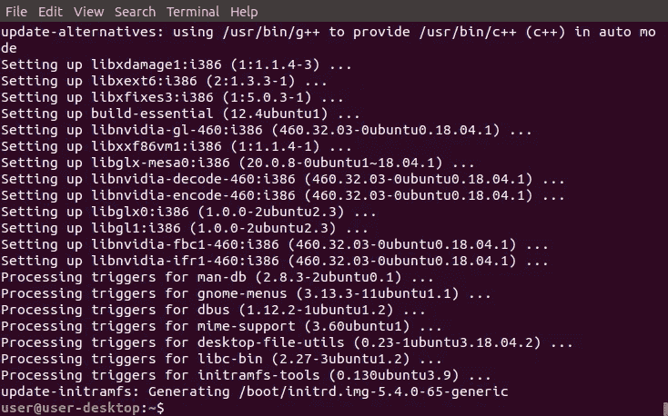

## 获取 NVIDIA 公钥:

1.  从下面这些指令中复制命令
2.  将命令粘贴到终端
3.  按“回车”

```
sudo apt-key adv --fetch-keys [http://developer.download.nvidia.com/compute/cuda/repos/ubuntu1804/x86_64/7fa2af80.pub](http://developer.download.nvidia.com/compute/cuda/repos/ubuntu1804/x86_64/7fa2af80.pub)
```

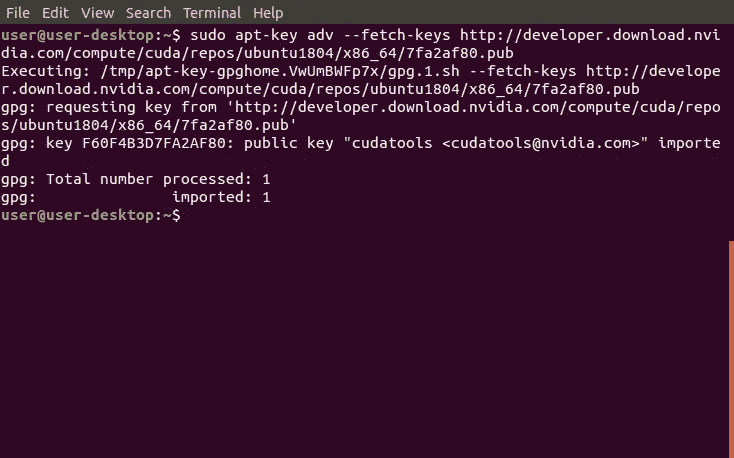

## 将 NVIDIA 添加到源列表目录:

1.  从下面这些指令中复制命令
2.  将命令粘贴到终端
3.  按“回车”

```
sudo sh -c 'echo "deb [http://developer.download.nvidia.com/compute/cuda/repos/ubuntu1804/x86_64](http://developer.download.nvidia.com/compute/cuda/repos/ubuntu1804/x86_64) /" > /etc/apt/sources.list.d/cuda.list'
```

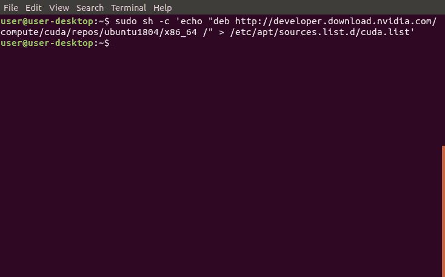

## 更新来源列表和来源列表目录:

1.  从下面这些指令中复制命令
2.  将命令粘贴到终端
3.  按“回车”

```
sudo apt-get update
```

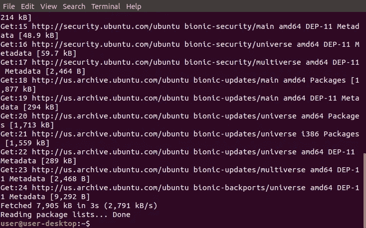

## 安装 NVIDIA CUDA 工具包 11:

1.  从下面这些指令中复制命令
2.  将命令粘贴到终端
3.  按“回车”

```
sudo apt-get --yes install cuda-toolkit-11-0 cuda-toolkit-10-2
```

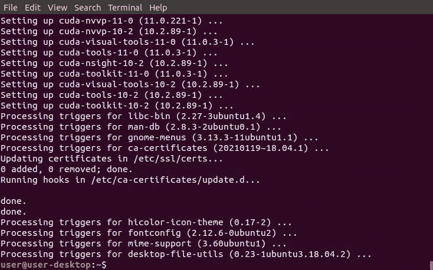

## 将 NVIDIA 添加到源列表目录:

1.  从下面这些指令中复制命令
2.  将命令粘贴到终端
3.  按“回车”

```
sudo sh -c 'echo "deb [http://developer.download.nvidia.com/compute/machine-learning/repos/ubuntu1804/x86_64](http://developer.download.nvidia.com/compute/machine-learning/repos/ubuntu1804/x86_64) /" > /etc/apt/sources.list.d/nvidia-machine-learning.list'
```

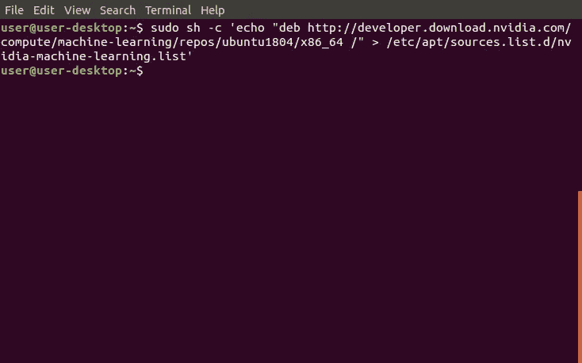

## 更新来源列表和来源列表目录:

1.  从下面这些指令中复制命令
2.  将命令粘贴到终端
3.  按“回车”

```
sudo apt-get update
```

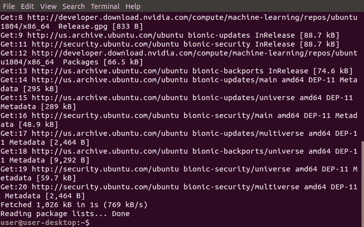

## 安装 CUDA 和 cuDDN 库:

1.  从下面这些指令中复制命令
2.  将命令粘贴到终端
3.  按“回车”

```
sudo apt-get install --yes --no-install-recommends cuda-11-0 libcudnn8=8.0.5.39-1+cuda11.0 libcudnn8-dev=8.0.5.39-1+cuda11.0
```

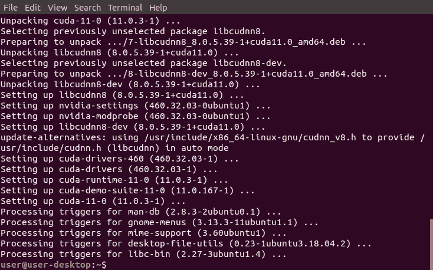

## 安装 TensorRT 库:

1.  从下面这些指令中复制命令
2.  将命令粘贴到终端
3.  按“回车”

```
sudo apt-get install --yes --no-install-recommends libnvinfer7=7.1.3-1+cuda11.0 libnvinfer-dev=7.1.3-1+cuda11.0 libnvinfer-plugin7=7.1.3-1+cuda11.0
```

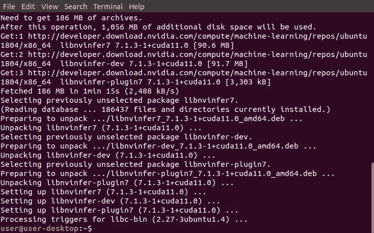

## 打开 BlackScholes 目录:

1.  从下面这些说明中找到 Python 版本
2.  复制提供的命令
3.  将命令粘贴到终端
4.  按“回车”

```
cd /usr/local/cuda-11.0/samples/4_Finance/BlackScholes
```

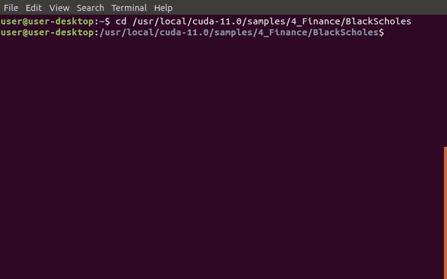

## 运行 MakeFile:

1.  从下面这些指令中复制命令
2.  将命令粘贴到终端
3.  按“回车”

```
sudo make
```

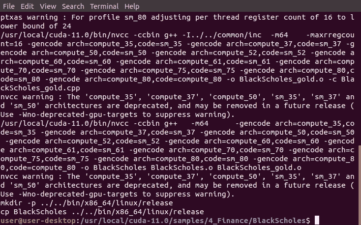

## 运行示例:

1.  从下面这些指令中复制命令
2.  将命令粘贴到终端
3.  按“回车”

```
./BlackScholes
```

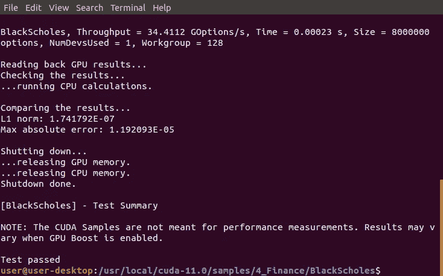

> “希望这篇文章能帮助您获得👯‍♀️🏆👯‍♀️，记得订阅获取更多内容🏅"

## 后续步骤:

这篇文章是一个迷你系列的一部分，帮助读者设置他们开始学习人工智能、机器学习、深度学习和/或数据科学所需的一切。它包括包含复制和粘贴代码的说明和截图的文章，以帮助读者尽快获得结果。它还包括一些文章，包含带有解释和截图的说明，以帮助读者了解正在发生的事情。

```
**Linux:**
01\. [Install Multiple Python Versions](https://medium.com/p/8bd6d301d78c)
02\. [Install the CUDA Driver and Toolkit](https://medium.com/p/3494a4436d6)
03\. [Install the Jupyter Notebook Server](https://medium.com/p/f5bbc07e184a)
04\. [Install Virtual Environments in Jupyter Notebook](https://medium.com/p/c93fd8d07ca0)
05\. [Install the Python Environment for AI](https://medium.com/p/d2937ce641b7)**WSL2:**
01\. [Install Windows Subsystem for Linux 2](https://medium.com/p/e01f92e98cc0)
02\. [Install Multiple Python Versions](https://medium.com/p/ba81f21109d6)
03\. [Install the CUDA Driver and Toolkit](https://medium.com/p/be38703fed5c)
04\. [Install the Jupyter Notebook Server](https://medium.com/p/3ea9bc06a0e5)
05\. [Install Virtual Environments in Jupyter Notebook](https://medium.com/p/d99de1d79fd4)
06\. [Install the Python Environment for AI](https://medium.com/p/6d73735b546)
07\. [Install Ubuntu Desktop GUI (Bonus)](https://medium.com/p/7c3730e33bb2)**Windows 10:**
01\. [Install Multiple Python Versions](https://medium.com/p/15a8685ec99d)
02\. [Install the CUDA Driver and Toolkit](https://medium.com/p/f103ea5eae4b)
03\. [Install the Jupyter Notebook Server](https://medium.com/p/c2ca45793e3b)
04\. [Install Virtual Environments in Jupyter Notebook](https://medium.com/p/a307b6524715)
05\. [Install the Python Environment for AI](https://medium.com/p/604168afbd6e)**MacOS:** 01\. [Install Multiple Python Versions](https://medium.com/p/a58b1966825f)
02\. [Install the Jupyter Notebook Server](https://medium.com/p/7b42d371ac21)
03\. [Install Virtual Environments in Jupyter Notebook](https://medium.com/p/557f23e55f99)
04\. [Install the Python Environment for AI](https://medium.com/p/ed5c93639301)
```