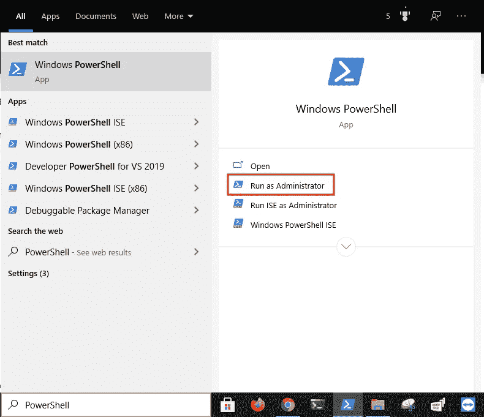

# 在 Windows 10 上安装 CUDA 驱动程序和工具包

> 原文：<https://levelup.gitconnected.com/install-the-cuda-driver-and-toolkit-on-windows-10-f103ea5eae4b>

## 系列:人工智能

## 附有说明和截图的简明指南


图片由 [Denys Nevozhai](https://unsplash.com/@dnevozhai)

> [扩展指南](https://medium.com/p/55febc19b58)使用术语和命令的定义来帮助您了解正在发生的事情。

## 加入 NVIDIA 开发者计划:

1.  访问[官网](https://developer.nvidia.com/developer-program)。
2.  点击“立即加入”
3.  输入电子邮件地址
4.  点击“下一步”
5.  点击“创建账户”
6.  输入用户信息
7.  点击“创建账户”
8.  验证电子邮件地址
9.  点击“提交”
10.  输入用户信息
11.  点击“提交”


## 下载 Visual Studio 2019:

1.  访问[官网](https://visualstudio.microsoft.com/downloads/)
2.  点击 Visual Studio 2019 旁边的“社区”
3.  单击“下载 Visual Studio”


## 安装 Visual Studio 2019:

1.  打开下载的文件
2.  点击“继续”
3.  检查“用 C++进行桌面开发”
4.  点击“安装”


## 下载 CUDA 驱动程序:

1.  访问[官网](https://www.nvidia.com/Download/index.aspx?lang=en-us)
2.  输入图形卡信息
3.  选择“工作室驱动程序”
4.  点击“搜索”
5.  点击“下载”
6.  点击“下载”


## 安装 CUDA 驱动程序:

1.  打开下载的文件
2.  单击“确定”
3.  选择“NVIDIA 图形驱动程序”
4.  点击“同意并继续”
5.  点击“下一步”
6.  点击“关闭”


## 下载 CUDA 工具包:

1.  访问官网:[[10.0](https://developer.nvidia.com/cuda-10.0-download-archive)][[10.1](https://developer.nvidia.com/cuda-10.1-download-archive-update2)][[10.2](https://developer.nvidia.com/cuda-10.2-download-archive)][[11.0](https://developer.nvidia.com/cuda-11.0-update1-download-archive)][[11.1](https://developer.nvidia.com/cuda-11.1.1-download-archive)][[11.2](https://developer.nvidia.com/cuda-downloads)]
2.  按“回车”
3.  点击“窗口”
4.  单击“x86_64”
5.  点击“10”
6.  单击“Exe(本地)”
7.  点击“下载”


## 安装 CUDA 工具包:

1.  打开下载的文件
2.  单击“确定”
3.  点击“同意并继续”
4.  单击“自定义(高级)”
5.  点击“下一步”
6.  取消选中“NVIDIA GeForce 体验组件”
7.  取消选中“驱动程序组件”
8.  取消选中“其他组件”
9.  点击“下一步”
10.  点击“下一步”
11.  点击“关闭”


## 下载 cuDNN 库:

1.  访问[官方网站](https://developer.nvidia.com/rdp/cudnn-download)
2.  单击“我同意 cuDNN 软件许可协议的条款”
3.  点击“下载 cud nn v 8 . 0 . 5(2020 年 11 月 9 日)，针对 CUDA 11.1”
4.  单击“适用于 Windows (x86)的 cuDNN 库”


## 打开 PowerShell:

1.  按下“⊞之窗”
2.  在搜索栏中输入“PowerShell”
3.  单击“以管理员身份运行”



## 打开下载目录:

1.  从下面这些指令中复制命令
2.  将命令粘贴到 PowerShell 中
3.  按“回车”

```
cd $HOME\downloads
```


## 解压缩 cuDNN 库:

1.  从下面这些指令中复制命令
2.  将命令粘贴到 PowerShell 中
3.  按“回车”

```
expand-archive cudnn-11.1-windows-x64-v8.0.5.39.zip -destinationpath cudnn-11.1
```


## 复制 DLL 文件:

1.  从下面这些指令中复制命令
2.  将命令粘贴到 PowerShell 中
3.  按“回车”

```
cp cudnn-11.1\cuda\bin\cudnn*.dll "c:\program files\nvidia gpu computing toolkit\cuda\v11.1\bin"
```


## 复制 H 文件:

1.  从下面这些指令中复制命令
2.  将命令粘贴到 PowerShell 中
3.  按“回车”

```
cp cudnn-11.1\cuda\include\cudnn*.h "c:\program files\nvidia gpu computing toolkit\cuda\v11.1\include"
```


## 复制库文件:

1.  从下面这些指令中复制命令
2.  将命令粘贴到 PowerShell 中
3.  按“回车”

```
cp cudnn-11.1\cuda\lib\x64\cudnn*.lib "c:\program files\nvidia gpu computing toolkit\cuda\v11.1\lib\x64"
```


## 下载 TensorRT:

1.  访问[官方网站](https://developer.nvidia.com/nvidia-tensorrt-download)
2.  点击“TensorRT 7”
3.  完成调查
4.  勾选“我同意 NVIDIA TensorRT 许可协议的条款”
5.  点击“TensorRT 7.2.2”
6.  点击“用于 Windows10 和 CUDA 11.1 和 11.2 ZIP 包的 TensorRT 7.2.2”


## 解压缩 TensorRT:

1.  从下面这些指令中复制命令
2.  将命令粘贴到 PowerShell 中
3.  按“回车”

```
expand-archive tensorrt-7.2.2.3.windows10.x86_64.cuda-11.1.cudnn8.0.zip -destinationpath tensorrt
```


## 复制 TensorRT 库:

1.  从下面这些指令中复制命令
2.  将命令粘贴到 PowerShell 中
3.  按“回车”

```
cp tensorrt\tensorrt-7.2.2.3\lib\*.dll "c:\program files\nvidia gpu computing toolkit\cuda\v11.1\bin"
```


## 安装图形外科医生:

1.  从下面这些指令中复制命令
2.  将命令粘贴到 PowerShell 中
3.  按“回车”

```
python -m pip install tensorrt\tensorrt-7.2.2.3\graphsurgeon\graphsurgeon-0.4.5-py2.py3-none-any.whl
```


## 安装通用框架格式:

1.  从下面这些指令中复制命令
2.  将命令粘贴到 PowerShell 中
3.  按“回车”

```
python -m pip install tensorrt\tensorrt-7.2.2.3\uff\uff-0.6.9-py2.py3-none-any.whl
```


## 安装 ONNX GraphSurgeon:

1.  从下面这些指令中复制命令
2.  将命令粘贴到 PowerShell 中
3.  按“回车”

```
python -m pip install tensorrt\tensorrt-7.2.2.3\onnx_graphsurgeon\onnx_graphsurgeon-0.2.6-py2.py3-none-any.whl
```


## 打开 Visual Studio 文件:

1.  从下面这些指令中复制命令
2.  将命令粘贴到 PowerShell 中
3.  按“回车”

```
start-process “c:\programdata\nvidia corporation\cuda samples\v11.1\4_finance\blackscholes\BlackScholes_vs2019.sln”
```


## 编辑链接器输入属性:

1.  单击“项目”菜单
2.  单击“属性”
3.  双击“链接器”
4.  点击“输入”
5.  单击“其他依赖项”
6.  单击向下箭头
7.  点击“编辑”


## 添加 cuDNN 库:

1.  从下面这些说明中复制库名
2.  将库名粘贴到 Visual Studio 2019 中
3.  单击“确定”
4.  单击“确定”

```
cudnn.lib
```


## 构建示例:

1.  单击“构建”菜单
2.  单击“构建解决方案”


## 运行示例:

1.  从下面这些指令中复制命令
2.  将命令粘贴到 PowerShell 中
3.  按“回车”

```
cmd /k "c:\programdata\nvidia corporation\cuda samples\v11.1\bin\win64\debug\blackscholes.exe"
```


> “希望这篇文章能帮助您获得👯‍♀️🏆👯‍♀️，记得订阅获取更多内容🏅"

## 后续步骤:

这篇文章是一个迷你系列的一部分，帮助读者设置他们开始学习人工智能、机器学习、深度学习和/或数据科学所需的一切。它包括包含复制和粘贴代码的说明和截图的文章，以帮助读者尽快获得结果。它还包括一些文章，包含带有解释和截图的说明，以帮助读者了解正在发生的事情。

```
**Linux:**
01\. [Install Multiple Python Versions](https://medium.com/p/8bd6d301d78c)
02\. [Install the CUDA Driver and Toolkit](https://medium.com/p/3494a4436d6)
03\. [Install the Jupyter Notebook Server](https://medium.com/p/f5bbc07e184a)
04\. [Install Virtual Environments in Jupyter Notebook](https://medium.com/p/c93fd8d07ca0)
05\. [Install the Python Environment for AI](https://medium.com/p/d2937ce641b7)**WSL2:**
01\. [Install Windows Subsystem for Linux 2](https://medium.com/p/e01f92e98cc0)
02\. [Install Multiple Python Versions](https://medium.com/p/ba81f21109d6)
03\. [Install the CUDA Driver and Toolkit](https://medium.com/p/be38703fed5c)
04\. [Install the Jupyter Notebook Server](https://medium.com/p/3ea9bc06a0e5)
05\. [Install Virtual Environments in Jupyter Notebook](https://medium.com/p/d99de1d79fd4)
06\. [Install the Python Environment for AI](https://medium.com/p/6d73735b546)
07\. [Install Ubuntu Desktop GUI (Bonus)](https://medium.com/p/7c3730e33bb2)**Windows 10:**
01\. [Install Multiple Python Versions](https://medium.com/p/15a8685ec99d)
02\. [Install the CUDA Driver and Toolkit](https://medium.com/p/f103ea5eae4b)
03\. [Install the Jupyter Notebook Server](https://medium.com/p/c2ca45793e3b)
04\. [Install Virtual Environments in Jupyter Notebook](https://medium.com/p/a307b6524715)
05\. [Install the Python Environment for AI](https://medium.com/p/604168afbd6e)**MacOS:** 01\. [Install Multiple Python Versions](https://medium.com/p/a58b1966825f)
02\. [Install the Jupyter Notebook Server](https://medium.com/p/7b42d371ac21)
03\. [Install Virtual Environments in Jupyter Notebook](https://medium.com/p/557f23e55f99)
04\. [Install the Python Environment for AI](https://medium.com/p/ed5c93639301)
```