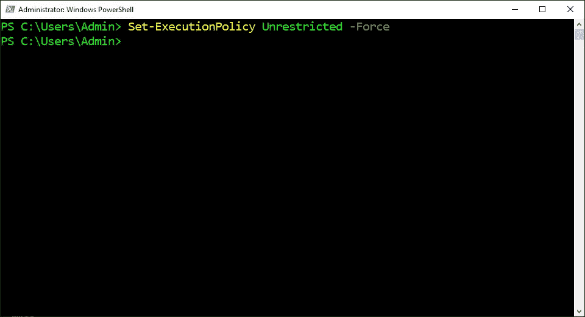
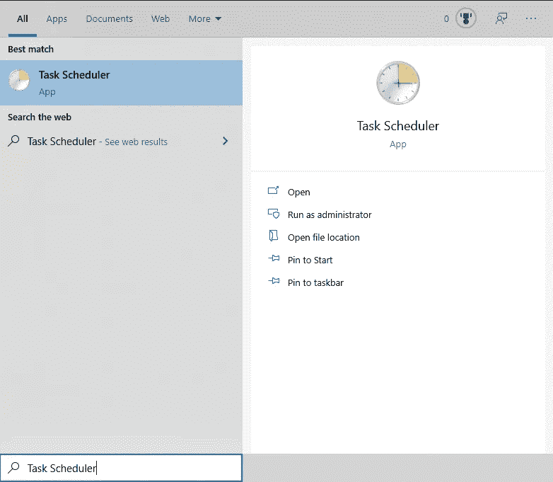
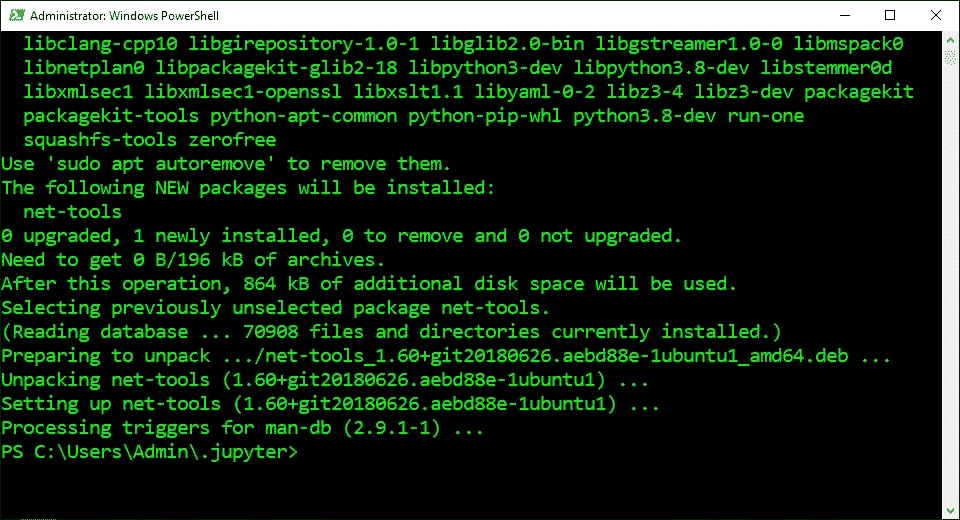
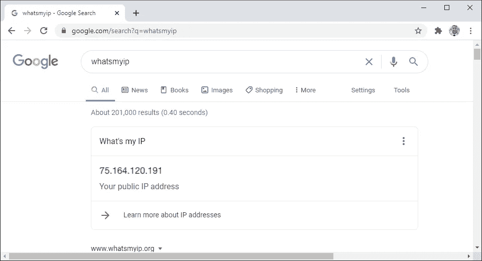

# 在 WSL2 中安装 Jupyter 笔记本服务器

> 原文：<https://levelup.gitconnected.com/install-the-jupyter-notebook-server-in-wsl2-3ea9bc06a0e5>

## 系列:人工智能

## 附有说明和截图的简明指南


图像由[晶体 C](https://unsplash.com/@nightwxnderer)

> [扩展指南](https://medium.com/p/7c96b3705df1)使用术语和命令的定义来帮助您了解正在发生的事情。

## 打开 PowerShell:

1.  按下“⊞之窗”
2.  在搜索栏中输入“PowerShell”
3.  单击“以管理员身份运行”


## 打开 WSL2:

1.  从下面这些指令中复制命令
2.  将命令粘贴到 PowerShell 中
3.  按“回车”

```
wsl
```


## 安装 Jupyter 笔记本:

1.  从下面这些指令中复制命令
2.  将命令粘贴到 PowerShell 中
3.  按“回车”

```
python -m pip install jupyter
```


## 安装 WebSocket 扩展:

1.  从下面这些指令中复制命令
2.  将命令粘贴到 PowerShell 中
3.  按“回车”

```
python -m pip install jupyter_http_over_ws
```


## 创建配置文件:

1.  从下面这些指令中复制命令
2.  将命令粘贴到 PowerShell 中
3.  按“回车”

```
jupyter notebook --generate-config
```


## 打开 Jupyter 目录:

1.  从下面这些指令中复制命令
2.  将命令粘贴到 PowerShell 中
3.  按“回车”

```
cd $HOME/.jupyter
```


## 创建 SSL 证书:

1.  从下面这些指令中复制命令
2.  将命令粘贴到 PowerShell 中
3.  按“回车”
4.  在“国家名称”中输入“美国”
5.  按“回车”
6.  输入“.”到剩余的字段中
7.  按“回车”

```
openssl req -x509 -nodes -days 365 -newkey rsa:2048 -keyout mykey.key -out mycert.pem
```


## 创建 JSON 文件:

1.  从下面这些指令中复制命令
2.  将命令粘贴到 PowerShell 中
3.  按“回车”

```
echo "" > $HOME/.jupyter/jupyter_notebook_config.json
```


## 打开 JSON 文件:

1.  从下面这些指令中复制命令
2.  将命令粘贴到 PowerShell 中
3.  按“回车”

```
notepad $HOME/.jupyter/jupyter_notebook_config.json
```


## 编辑 JSON 文件:

1.  从这些说明下面复制 JSON
2.  将 JSON 粘贴到记事本中
3.  将“Admin”更改为 Windows 用户名
4.  将“用户”更改为 Unix 用户名
5.  单击“文件”菜单
6.  点击“保存”


## 创建密码:

1.  从下面这些指令中复制命令
2.  将命令粘贴到 PowerShell 中
3.  按“回车”

```
jupyter notebook password
```


## 打开防火墙设置:

1.  按下“⊞之窗”
2.  在搜索栏中输入“Windows Defender Firewall”
3.  单击“Windows Defender 防火墙”
4.  单击左侧面板中的“高级设置”


## 创建入站规则:

1.  单击左侧面板中的“入站规则”
2.  单击右侧面板中的“新建规则…”


## 指定端口:

1.  选择“端口”
2.  点击“下一步”
3.  选择“特定本地端口”
4.  输入“8888”
5.  点击“下一步”


## 允许连接:

1.  选择“允许连接”
2.  点击“下一步”


## 完成入站规则:

1.  检查“域”、“私有”和“公共”
2.  点击“下一步”
3.  从这些说明下面抄下名字
4.  将名称粘贴到“名称”文本框中
5.  点击“完成”

```
Jupyter Notebook Server (WSL2)
```


## 退出 WSL2:

1.  从下面这些指令中复制命令
2.  将命令粘贴到 PowerShell 中
3.  按“回车”

```
exit
```


## 更改执行策略:

1.  从下面这些指令中复制命令
2.  将命令粘贴到 PowerShell 中
3.  按“回车”

```
Set-ExecutionPolicy Unrestricted -Force
```



## 创建 Visual Basic 脚本文件:

1.  从下面这些指令中复制命令
2.  将命令粘贴到 PowerShell 中
3.  按“回车”

```
echo "" > $HOME\.jupyter\jupyter_notebook_server_wsl2.vbs
```


## 打开 Visual Basic 脚本文件:

1.  从下面这些指令中复制命令
2.  将命令粘贴到 PowerShell 中
3.  按“回车”

```
notepad $HOME\.jupyter\jupyter_notebook_server_wsl2.vbs
```


## 编辑 Visual Basic 脚本文件:

1.  从这些指令下面复制代码
2.  将代码粘贴到笔记本中
3.  单击“文件”菜单
4.  点击“保存”

```
set object = [createobject](#5163)("[wscript](#668e).[shell](#e9a4)") 
object.[run](#ac18) "bash.exe -c '~/.pyenv/shims/jupyter-notebook --no-browser --config ~/.jupyter/jupyter_notebook_config.json'", 0
```


## 打开任务计划程序:

1.  按下“⊞之窗”
2.  在搜索栏中输入“任务计划程序”
3.  单击“任务计划程序”



## 创建任务:

1.  单击右侧面板中的“创建基本任务”
2.  从这些说明下面抄下名字
3.  将名称粘贴到“名称”文本字段中
4.  点击“下一步”
5.  选择“电脑启动时”
6.  点击“下一步”
7.  选择“启动程序”
8.  点击“下一步”

```
Jupyter Notebook Server (WSL2)
```


## 指定操作:

1.  从下面这些指令中复制路径
2.  将路径粘贴到“程序/脚本”文本字段中
3.  点击“下一步”
4.  选中“打开属性对话框…”
5.  点击“完成”

```
%USERPROFILE%\.jupyter\jupyter_notebook_server_wsl2.vbs
```


## 指定触发器:

1.  单击顶部选项卡栏中的“触发器”
2.  单击“启动时”
3.  点击“编辑”
4.  选中“延迟任务时间”
5.  输入“30 秒”
6.  单击“确定”


## 以用户身份运行任务:

1.  单击标签栏中的“常规”
2.  选中“以最高权限运行”


## 取消时间限制:

1.  点击标签栏中的“设置”
2.  取消选中“如果任务运行时间超过，则停止任务”
3.  单击“确定”
4.  重新启动计算机


## 获取网络配置信息:

1.  从下面这些指令中复制命令
2.  将命令粘贴到 PowerShell 中
3.  按“回车”
4.  记下 IPv4 地址、子网掩码和默认网关。
5.  记下 DNS 服务器。

```
powershell.exe ipconfig /all
```


## 登录路由器:

1.  打开 web 浏览器
2.  从下面这些说明中复制路由器 IP 地址
3.  将路由器 IP 地址粘贴到 web 浏览器中
4.  按“回车”
5.  登录路由器

```
192.168.0.1
```


## 设置端口转发:

1.  找到“端口转发”页面
2.  将 IPv4 地址粘贴到“输入 IP 地址”文本字段中
3.  从下面复制端口这些说明
4.  将端口粘贴到“WAN 起始端口”文本字段中
5.  将端口粘贴到“WAN 终端端口”文本字段中
6.  选择“所有 IP 地址”
7.  点击“应用”

```
8888
```


## 打开网络适配器属性:

1.  按下“⊞之窗”
2.  输入“网络状态”
3.  单击“网络状态”
4.  单击“更改适配器选项”
5.  右键单击连接到互联网的网络适配器
6.  单击“属性”


## 设置静态 IP 地址:

1.  选择“互联网协议版本 4 (TCP/IPv4)”
2.  单击“属性”
3.  选择“使用以下 IP 地址”
4.  输入之前的 TCP/IP 信息
5.  选择“使用下列 DNS 服务器地址”
6.  输入之前的 TCP/IP 信息
7.  单击“确定”


## 安装网络工具:

1.  从下面这些指令中复制命令
2.  将命令粘贴到 PowerShell 中
3.  按“回车”

```
wsl --exec sudo apt install net-tools
```



## 打开 Jupyter 目录:

1.  从下面这些指令中复制命令
2.  将命令粘贴到 PowerShell 中
3.  按“回车”

```
cd $home\.jupyter
```


## 创建 PowerShell 文件:

1.  从下面这些指令中复制命令
2.  将命令粘贴到 PowerShell 中
3.  按“回车”

```
Set-Content jupyter_notebook_port_wsl2.ps1 "" -Encoding ASCII
```


## 打开 PowerShell 文件:

1.  从下面这些指令中复制命令
2.  将命令粘贴到 PowerShell 中
3.  按“回车”

```
notepad jupyter_notebook_port_wsl2.ps1
```


## 编辑 PowerShell 文件:

1.  从这些说明下面复制脚本
2.  将脚本粘贴到记事本中
3.  单击“文件”菜单
4.  点击“保存”


## 打开任务计划程序:

1.  按下“⊞之窗”
2.  在搜索栏中输入“任务计划程序”
3.  单击“任务计划程序”


## 创建任务:

1.  单击右侧面板中的“创建基本任务”
2.  从这些说明下面抄下名字
3.  将名称粘贴到“名称”文本字段中
4.  点击“下一步”
5.  选择“电脑启动时”
6.  点击“下一步”
7.  选择“启动程序”
8.  点击“下一步”

```
Jupyter Notebook Port (WSL2)
```


## 指定操作:

1.  从下面这些指令中复制路径
2.  将路径粘贴到“程序/脚本”文本字段中
3.  点击“下一步”
4.  单击“是”
5.  选中“打开属性对话框…”
6.  点击“完成”

```
powershell.exe -File %userprofile%\.jupyter\jupyter_notebook_port_wsl2.ps1
```


## 指定触发器:

1.  单击顶部选项卡栏中的“触发器”
2.  单击“启动时”
3.  点击“编辑”
4.  选中“延迟任务时间”
5.  输入“30 秒”
6.  单击“确定”


## 在后台运行任务:

1.  单击标签栏中的“常规”
2.  选择“无论用户是否登录都运行”
3.  选中“以最高权限运行”
4.  单击“确定”
5.  重新启动计算机


## 从本地网络访问服务器:

1.  登录到不同的计算机或笔记本电脑
2.  连接到同一个 WiFi 网络
3.  在 web 浏览器中输入 IPv4 地址
4.  在 IP 地址前添加“https://”
5.  在 IP 地址后附加“8888”
6.  按“回车”
7.  键入“thisisunsafe”
8.  输入密码
9.  点击“登录”


## 获取公共 IP 地址:

1.  从这些说明下面复制 URL
2.  将 URL 粘贴到 web 浏览器中
3.  记下公共 IP 地址

```
[https://www.google.com/search?q=whatsmyip](https://www.google.com/search?q=whatsmyip)
```



## 从远程网络访问服务器:

1.  登录到不同的计算机或笔记本电脑
2.  连接到不同的 WiFi 网络
3.  在 web 浏览器中输入公共 IP 地址
4.  在 IP 地址前添加“https://”
5.  在 IP 地址后附加“8888”
6.  按“回车”
7.  键入“thisisunsafe”
8.  输入密码
9.  点击“登录”


> “希望这篇文章能帮助您获得👯‍♀️🏆👯‍♀️记得订阅以获取更多内容🏅"

## 后续步骤:

这篇文章是一个迷你系列的一部分，帮助读者设置他们开始学习人工智能、机器学习、深度学习和/或数据科学所需的一切。它包括包含复制和粘贴代码的说明和截图的文章，以帮助读者尽快获得结果。它还包括一些文章，包含带有解释和截图的说明，以帮助读者了解正在发生的事情。

```
**Linux:**
01\. [Install Multiple Python Versions](https://medium.com/p/8bd6d301d78c)
02\. [Install the CUDA Driver and Toolkit](https://medium.com/p/3494a4436d6)
03\. [Install the Jupyter Notebook Server](https://medium.com/p/f5bbc07e184a)
04\. [Install Virtual Environments in Jupyter Notebook](https://medium.com/p/c93fd8d07ca0)
05\. [Install the Python Environment for AI](https://medium.com/p/d2937ce641b7)**WSL2:**
01\. [Install Windows Subsystem for Linux 2](https://medium.com/p/e01f92e98cc0)
02\. [Install Multiple Python Versions](https://medium.com/p/ba81f21109d6)
03\. [Install the CUDA Driver and Toolkit](https://medium.com/p/be38703fed5c)
04\. [Install the Jupyter Notebook Server](https://medium.com/p/3ea9bc06a0e5)
05\. [Install Virtual Environments in Jupyter Notebook](https://medium.com/p/d99de1d79fd4)
06\. [Install the Python Environment for AI](https://medium.com/p/6d73735b546)
07\. [Install Ubuntu Desktop GUI (Bonus)](https://medium.com/p/7c3730e33bb2)**Windows 10:**
01\. [Install Multiple Python Versions](https://medium.com/p/15a8685ec99d)
02\. [Install the CUDA Driver and Toolkit](https://medium.com/p/f103ea5eae4b)
03\. [Install the Jupyter Notebook Server](https://medium.com/p/c2ca45793e3b)
04\. [Install Virtual Environments in Jupyter Notebook](https://medium.com/p/a307b6524715)
05\. [Install the Python Environment for AI](https://medium.com/p/604168afbd6e)**MacOS:** 01\. [Install Multiple Python Versions](https://medium.com/p/a58b1966825f)
02\. [Install the Jupyter Notebook Server](https://medium.com/p/7b42d371ac21)
03\. [Install Virtual Environments in Jupyter Notebook](https://medium.com/p/557f23e55f99)
04\. [Install the Python Environment for AI](https://medium.com/p/ed5c93639301)
```