# 在 Linux 上安装 Jupyter 笔记本服务器

> 原文：<https://levelup.gitconnected.com/install-the-jupyter-notebook-server-on-linux-f5bbc07e184a>

## 系列:人工智能

## 附有说明和截图的简明指南


图像由[晶体 C](https://unsplash.com/@nightwxnderer)

> [扩展指南](https://medium.com/p/b2c14c47b446)使用术语和命令的定义来帮助您了解正在发生的事情。

## 开放终端:

1.  点击左上角的“活动”
2.  在搜索栏中输入“终端”
3.  点击“终端”


## 安装 Jupyter 笔记本:

1.  从下面这些指令中复制命令
2.  将命令粘贴到终端
3.  按“回车”

```
python -m pip install jupyter
```

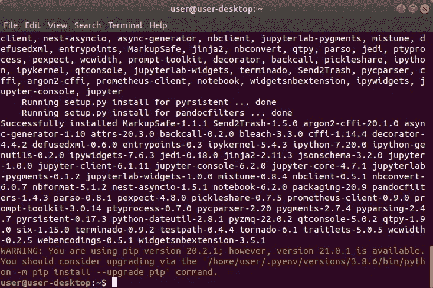

## 安装 WebSocket 扩展:

1.  从下面这些指令中复制命令
2.  将命令粘贴到终端
3.  按“回车”

```
python -m pip install jupyter_http_over_ws
```

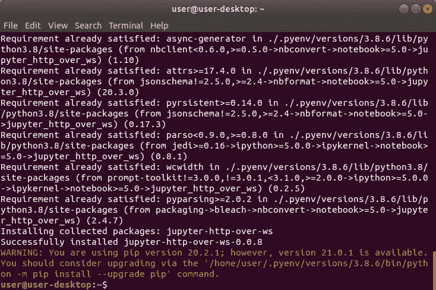

## 重新启动 Bash:

1.  从下面这些指令中复制命令
2.  将命令粘贴到终端
3.  按“回车”

```
exec $SHELL
```

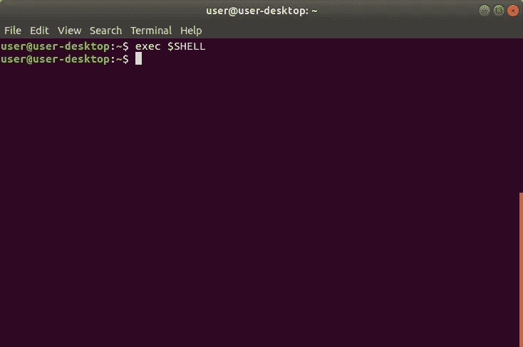

## 创建配置文件:

1.  从下面这些指令中复制命令
2.  将命令粘贴到终端
3.  按“回车”

```
jupyter notebook --generate-config
```

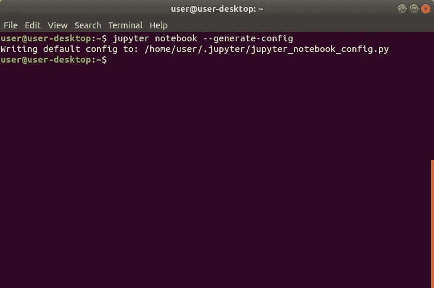

## 打开 Jupyter 目录:

1.  从下面这些指令中复制命令
2.  将命令粘贴到终端
3.  按“回车”

```
cd $HOME/.jupyter
```

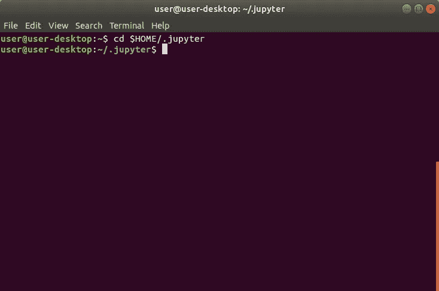

## 创建 SSL 证书:

1.  从下面这些指令中复制命令
2.  将命令粘贴到终端
3.  按“回车”
4.  在“国家名称”中输入“美国”
5.  按“回车”
6.  输入“.”到剩余的字段中
7.  按“回车”

```
openssl req -x509 -nodes -days 365 -newkey rsa:2048 -keyout mykey.key -out mycert.pem
```

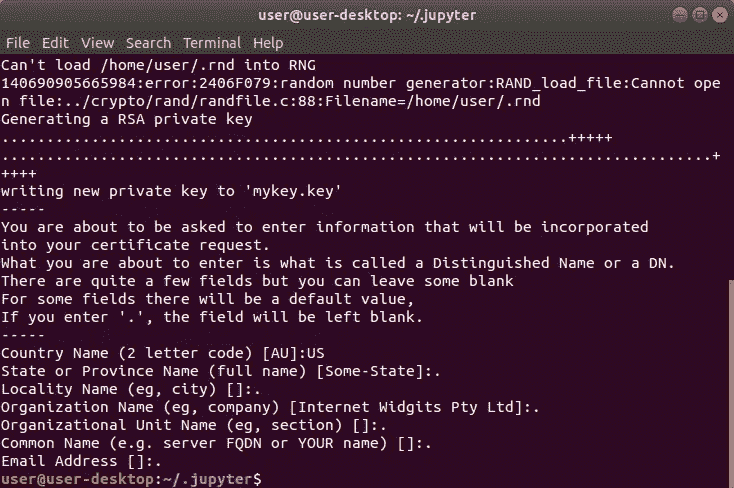

## 创建 JSON 文件:

1.  从下面这些指令中复制命令
2.  将命令粘贴到终端
3.  按“回车”

```
echo "" > $HOME/.jupyter/jupyter_notebook_config.json
```

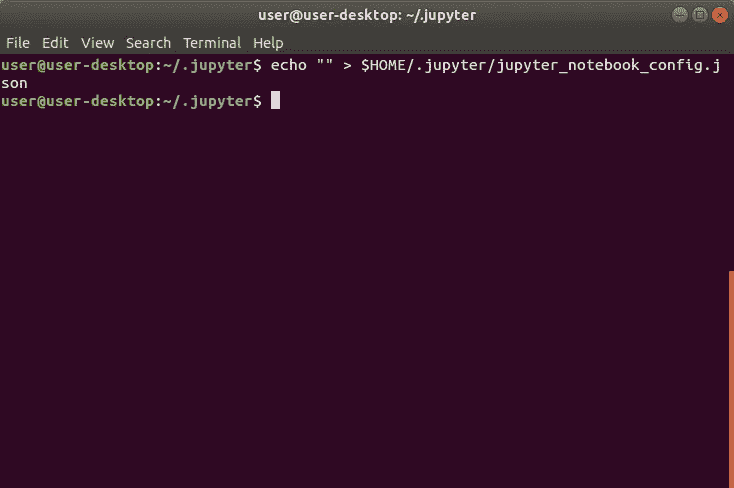

## 打开 JSON 文件:

1.  从下面这些指令中复制命令
2.  将命令粘贴到终端
3.  按“回车”

```
gedit $HOME/.jupyter/jupyter_notebook_config.json
```

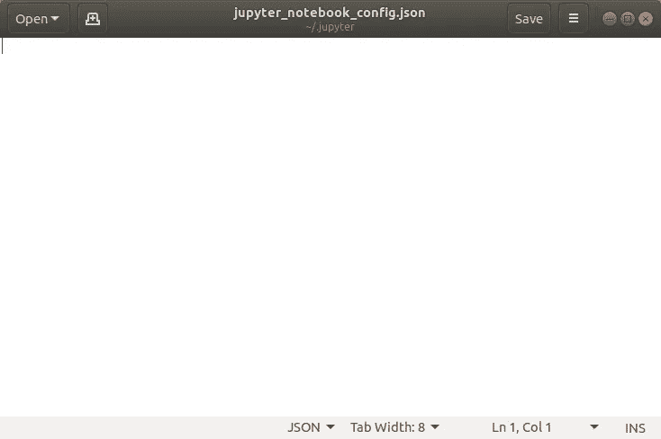

## 编辑 JSON 文件:

1.  从这些说明下面复制 JSON
2.  将 JSON 粘贴到文本编辑器中
3.  将“用户”更改为 Unix 用户名
4.  单击“文件”菜单
5.  点击“保存”

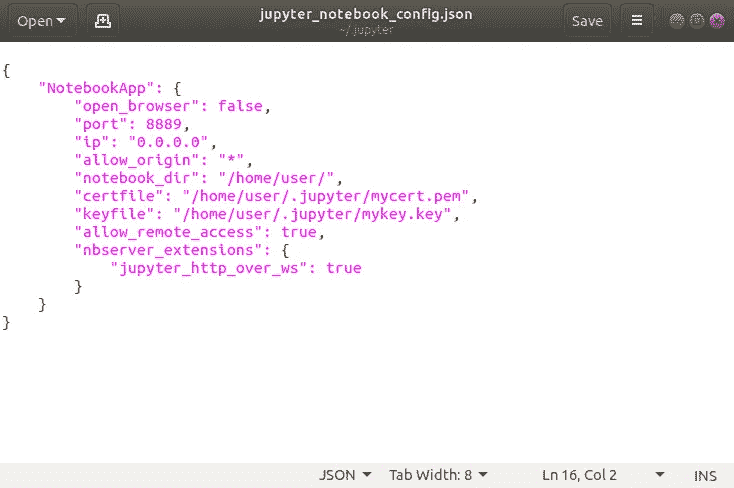

## 创建密码:

1.  从下面这些指令中复制命令
2.  将命令粘贴到终端
3.  按“回车”

```
jupyter notebook password
```

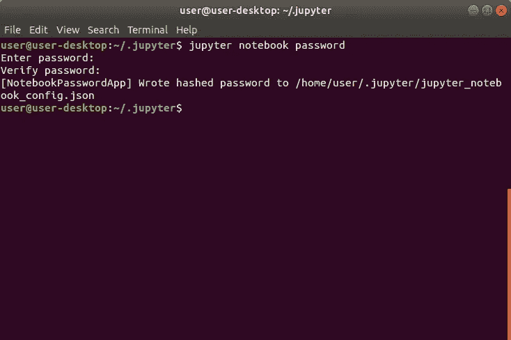

## 安装网络工具:

1.  从下面这些指令中复制命令
2.  将命令粘贴到终端
3.  按“回车”

```
sudo apt-get install net-tools
```

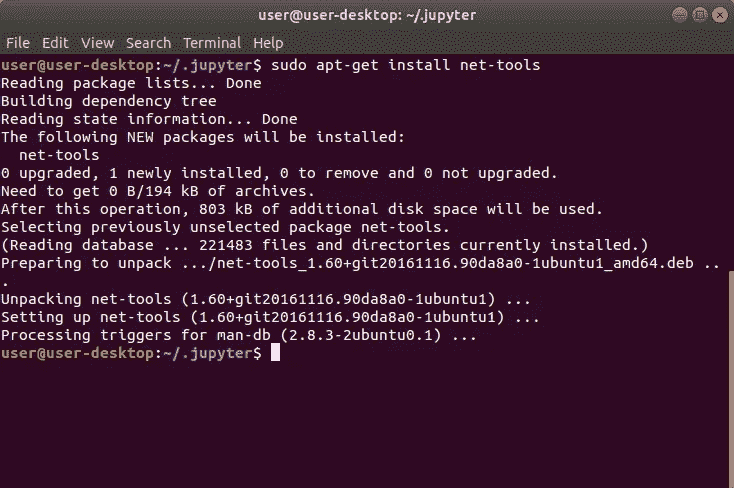

## 获取 IPv4 地址网络掩码:

1.  从下面这些指令中复制命令
2.  将命令粘贴到终端
3.  按“回车”
4.  写下“IPv4 地址”和“网络掩码”

```
ifconfig
```

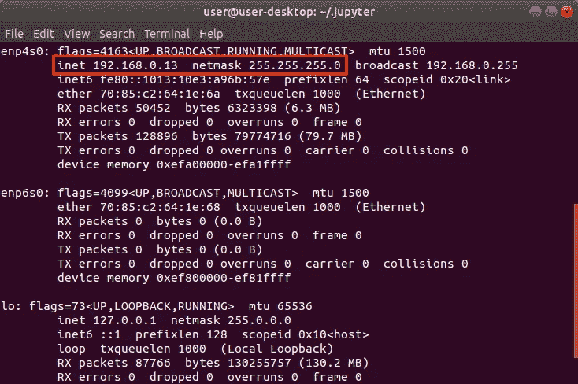

## 登录路由器:

1.  打开 web 浏览器
2.  从下面这些说明中复制路由器 IP 地址
3.  将路由器 IP 地址粘贴到 web 浏览器中
4.  按“回车”
5.  登录路由器

```
192.168.0.1
```

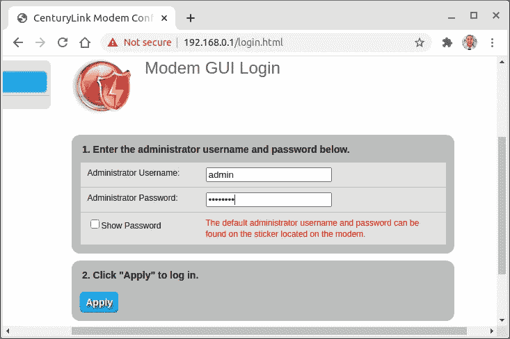

## 设置端口转发:

1.  找到“端口转发”页面
2.  将 IPv4 地址粘贴到“输入 IP 地址”文本字段中
3.  从下面复制端口这些说明
4.  将端口粘贴到“[万](#1274)起始端口”文本字段中
5.  将端口粘贴到“WAN 终端端口”文本字段中
6.  选择“所有 IP 地址”
7.  点击“应用”

```
8889
```

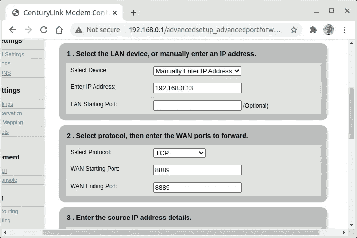

## 获取默认路由和 DNS:

1.  从下面这些指令中复制命令
2.  将命令粘贴到终端
3.  按“回车”
4.  点按“Wifi”或“网络”
5.  点击“⚙”
6.  记下“[默认路由](#ff9e)和“ [DNS](#fd1d) ”

```
gnome-control-center
```

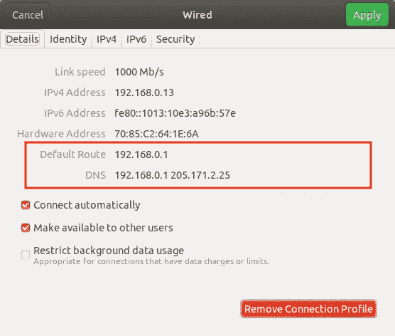

## 设置静态 IP 地址:

1.  单击“IPv4”选项卡
2.  选择“手动”
3.  输入之前的“IPv4 地址”、“网络掩码”、“网关”和 DNS
4.  点击“应用”

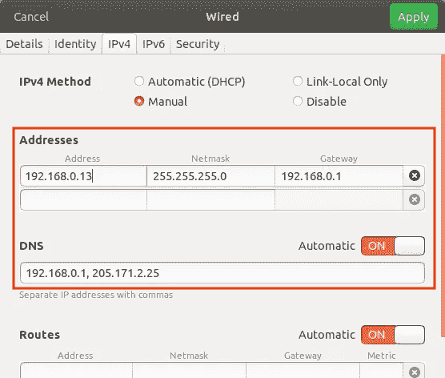

## 打开 Crontab:

1.  从下面这些指令中复制命令
2.  将命令粘贴到终端
3.  按“回车”

```
crontab -e
```

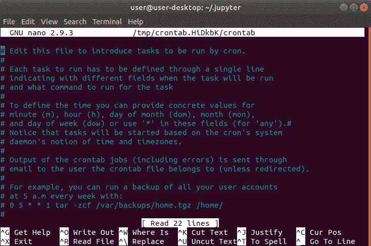

## 编辑 Crontab 文件:

1.  使用“↓”键导航到文件的底部
2.  从这些指令下面复制代码
3.  按“Shift”+“Control”+“V”将代码粘贴到终端
4.  按“控制”+“S”保存更改
5.  按“Control”+“X”退出 Crontab
6.  重新启动计算机

```
[@reboot](http://twitter.com/reboot) cd; source /.bashrc; /home/user/.pyenv/shims/jupyter-notebook >> ~/cronrun.log 2>&1
```

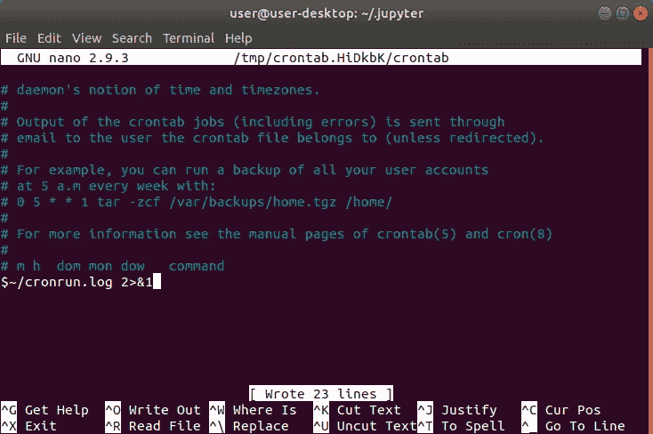

## 从本地网络访问服务器:

1.  登录到不同的计算机或笔记本电脑
2.  连接到同一个 WiFi 网络
3.  在 web 浏览器中输入 IPv4 地址
4.  在 IP 地址前添加“https://”
5.  在 IP 地址后附加“8889”
6.  按“回车”
7.  键入“thisisunsafe”
8.  输入密码
9.  点击“登录”

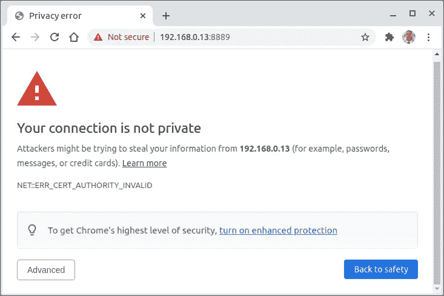

## 获取公共 IP 地址:

1.  从这些说明下面复制 URL
2.  将 URL 粘贴到 web 浏览器中
3.  记下公共 IP 地址

```
[https://www.google.com/search?q=whatsmyip](https://www.google.com/search?q=whatsmyip)
```

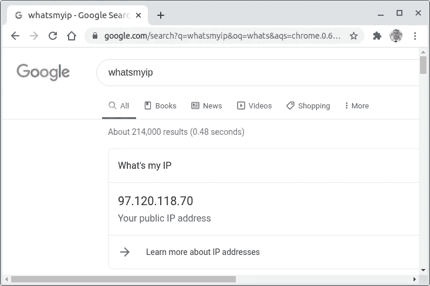

## 从远程网络访问服务器:

1.  登录到不同的计算机或笔记本电脑
2.  连接到不同的 WiFi 网络
3.  在 web 浏览器中输入公共 IP 地址
4.  在 IP 地址前添加“https://”
5.  在 IP 地址后附加“8889”
6.  按“回车”
7.  键入“thisisunsafe”
8.  输入密码
9.  点击“登录”

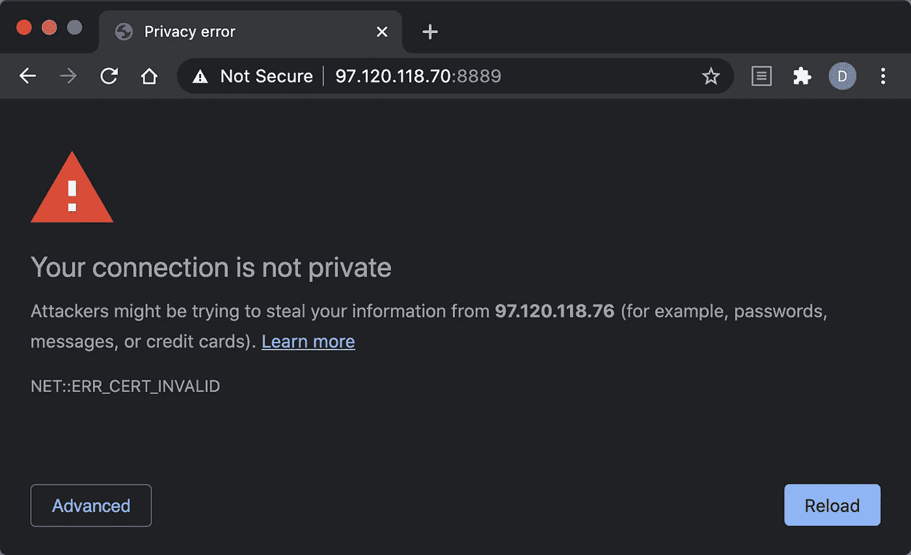

> “希望这篇文章能帮助您获得👯‍♀️🏆👯‍♀️记得订阅以获取更多内容🏅"

## 后续步骤:

这篇文章是一个迷你系列的一部分，帮助读者设置他们开始学习人工智能、机器学习、深度学习和/或数据科学所需的一切。它包括包含复制和粘贴代码的说明和截图的文章，以帮助读者尽快获得结果。它还包括一些文章，包含带有解释和截图的说明，以帮助读者了解正在发生的事情。

```
**Linux:**
01\. [Install Multiple Python Versions](https://medium.com/p/8bd6d301d78c)
02\. [Install the CUDA Driver and Toolkit](https://medium.com/p/3494a4436d6)
03\. [Install the Jupyter Notebook Server](https://medium.com/p/f5bbc07e184a)
04\. [Install Virtual Environments in Jupyter Notebook](https://medium.com/p/c93fd8d07ca0)
05\. [Install the Python Environment for AI](https://medium.com/p/d2937ce641b7)**WSL2:**
01\. [Install Windows Subsystem for Linux 2](https://medium.com/p/e01f92e98cc0)
02\. [Install Multiple Python Versions](https://medium.com/p/ba81f21109d6)
03\. [Install the CUDA Driver and Toolkit](https://medium.com/p/be38703fed5c)
04\. [Install the Jupyter Notebook Server](https://medium.com/p/3ea9bc06a0e5)
05\. [Install Virtual Environments in Jupyter Notebook](https://medium.com/p/d99de1d79fd4)
06\. [Install the Python Environment for AI](https://medium.com/p/6d73735b546)
07\. [Install Ubuntu Desktop GUI (Bonus)](https://medium.com/p/7c3730e33bb2)**Windows 10:**
01\. [Install Multiple Python Versions](https://medium.com/p/15a8685ec99d)
02\. [Install the CUDA Driver and Toolkit](https://medium.com/p/f103ea5eae4b)
03\. [Install the Jupyter Notebook Server](https://medium.com/p/c2ca45793e3b)
04\. [Install Virtual Environments in Jupyter Notebook](https://medium.com/p/a307b6524715)
05\. [Install the Python Environment for AI](https://medium.com/p/604168afbd6e)**MacOS:** 01\. [Install Multiple Python Versions](https://medium.com/p/a58b1966825f)
02\. [Install the Jupyter Notebook Server](https://medium.com/p/7b42d371ac21)
03\. [Install Virtual Environments in Jupyter Notebook](https://medium.com/p/557f23e55f99)
04\. [Install the Python Environment for AI](https://medium.com/p/ed5c93639301)
```