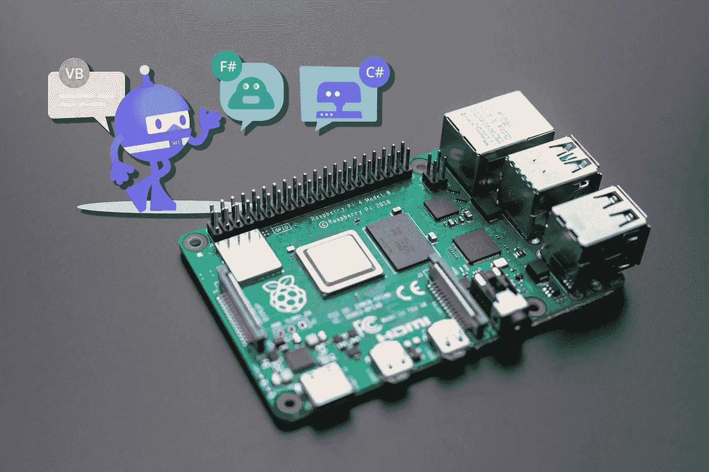
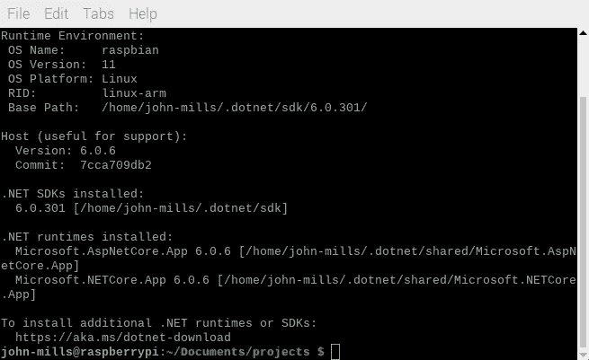
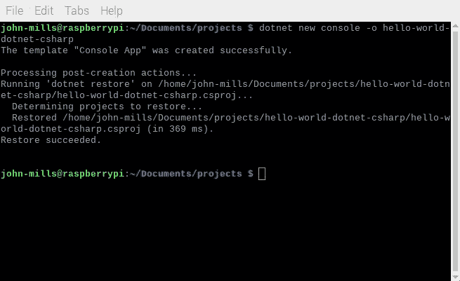
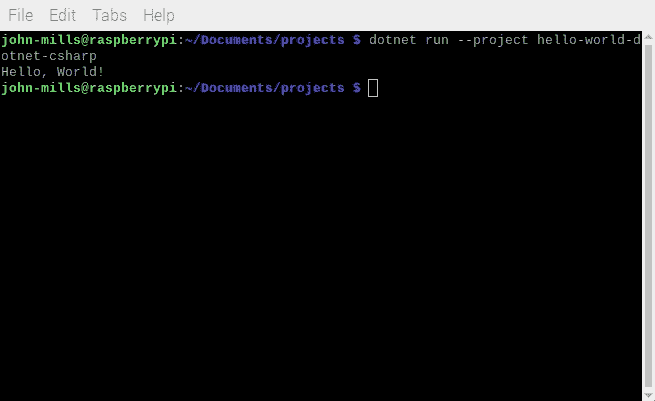

# 安装。NET 6.0 SDK 只需简单的两步

> 原文：<https://levelup.gitconnected.com/install-the-net-6-0-sdk-on-a-raspberry-pi-in-two-easy-steps-27993c1bd68d>

## **并学习如何创建和运行用 C#、F#或 VB 编写的项目**



本教程的目标是让您安装。NET 6.0 SDK 在运行 32 位版本的 Raspberry Pi 操作系统的 Raspberry Pi 上运行。我们将通过创建和运行一个简单的 hello world 控制台应用程序来验证它是否已安装并正常工作。

要继续学习，您应该熟悉 Raspberry Pi，并了解如何启动终端和执行命令。

以下树莓 Pi 模型能够运行。NET 6.0:

*   树莓派 Zero 2 W
*   树莓 Pi 2
*   树莓 Pi 3 A+/B(+)
*   树莓 Pi 4 B
*   树莓派 400

这些型号都支持 ARMv7 指令集，这是的最低要求。NET 6.0。

微软没有提供专门针对 Raspberry Pi 的安装程序或软件包。所以我们将使用另一种方法来安装它。

# **1。安装脚本**

微软制作了一个 Linux shell 脚本用于安装。NET 在临时环境中的应用，如临时构建服务器。

我们将利用这个脚本来完成繁重的工作，然后扩充安装，以便。NET 工具很容易使用。

打开终端并运行以下命令:

```
curl -sSL [https://dot.net/v1/dotnet-install.sh](https://dot.net/v1/dotnet-install.sh) | bash
```

需要几分钟才能完成。


在 Raspberry Pi 400 上执行该脚本大约需要 4 分钟

# **2。修改。bashrc**

使用文本编辑器(如 nano 或 mousepad)将下面两行添加到。bashrc 文件。

```
export DOTNET_ROOT=$HOME/.dotnet
export PATH=$PATH:$DOTNET_ROOT:$DOTNET_ROOT/tools
```

添加`$DOTNET_ROOT/tools`到`PATH`使`dotnet`命令找到刀具命令。例如，如果安装实体框架核心 6.0 等附加工具。除非 tools 文件夹在`PATH`环境变量中，否则您将无法正常运行`dotnet ef`。

# **3。验证安装**

打开一个新的终端窗口，以便。bashrc 更改已应用。运行`dotnet—-info`。如果一切按预期运行，您应该会看到类似下面的内容:



运行`**dotnet --info**`命令的输出

# **4。创建并运行一个简单的 Hello World 应用程序**

SDK 安装完成后，我们准备创建一个 hello-world 风格的应用程序来测试构建工具。

创建 hello world 应用程序最简单的方法是使用`dotnet new`命令。

导航到您的代码项目文件夹。我喜欢在`~/Documents/projects`吃我的。

运行以下命令创建一个 C# hello world 控制台应用程序:

```
dotnet new console -o hello-world-dotnet-csharp
```

将出现一个新的项目文件夹，其中包含两个文件—一个项目文件和一个 C#代码文件。



运行**点网新控制台**命令的输出

运行`**dotnet new console**`创建的文件

要构建并运行应用程序，请运行以下命令:

```
dotnet run --project hello-world-dotnet-csharp
```

应用程序将运行并打印— ***你好，世界！***



运行我们新的控制台应用程序的输出

# **Visual Basic 和 F#**

要为 Visual Basic 或 F#生成 hello world 控制台应用程序，请添加`—-language` / `-lang`参数。

**用途:**

```
dotnet new console -lang vb -o hello-world-dotnet-vb
```

**或:**

```
dotnet new console -lang f# -o hello-world-dotnet-fsharp
```

以与 C#示例相同的方式运行应用程序，记住用项目名称替换正确的名称。

```
dotnet run --project <project-folder-path>
```

# **总结**

在本教程中，我们快速介绍了如何安装？NET 6.0 SDK，并验证它的工作。然后我们学习了如何用 C#、F#和 VB 创建 hello-world 风格的控制台应用程序。我们从命令行运行它，证明我们可以构建和运行。Pi 上的. NET 应用。

如果你喜欢阅读这样的文章，并想支持我成为一名作家，可以考虑[注册成为一名媒体会员](https://john-mills.medium.com/membership)。每月 5 美元，你可以无限制地阅读媒体上的所有故事。如果你用我的链接注册，我会赚一点佣金。

[](https://john-mills.medium.com/membership) [## 通过我的推荐链接-约翰·米尔斯加入媒体

### 阅读约翰·米尔斯的每一个故事(以及媒体上成千上万的其他作家)。你的会员费直接支持约翰…

john-mills.medium.com](https://john-mills.medium.com/membership) 

# 分级编码

感谢您成为我们社区的一员！更多内容请参见[升级编码出版物](https://levelup.gitconnected.com/)。
跟随:[推特](https://twitter.com/gitconnected)，[领英](https://www.linkedin.com/company/gitconnected)，[通迅](https://newsletter.levelup.dev/)
**升一级正在转型的理工大招聘➡️** [**加入我们的人才集体**](https://jobs.levelup.dev/talent/welcome?referral=true)