# 在 Linux 上为 AI 安装 Python 环境

> 原文：<https://levelup.gitconnected.com/install-the-python-environment-for-ai-on-linux-d2937ce641b7>

## 系列:人工智能

## 附有说明和截图的简明指南


图片由[尼克·琼斯](https://unsplash.com/@nickxjones_)

> [扩展指南](https://medium.com/p/765678fcb4fb)使用术语和命令的定义来帮助您了解正在发生的事情。

## 开放终端:

1.  点击左上角的“活动”
2.  在搜索栏中输入“终端”
3.  点击“终端”


## 打开主目录:

1.  从下面这些指令中复制命令
2.  将命令粘贴到 PowerShell 中
3.  按“回车”

```
cd $HOME/Desktop/
```

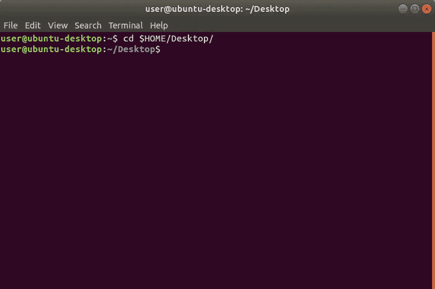

## 设定电脑的默认版本:

1.  从下面这些指令中复制命令
2.  将命令粘贴到终端
3.  按“回车键”

```
**Python 3.5:**
pyenv global 3.5.4**Python 3.6:**
pyenv global 3.6.8**Python 3.7:**
pyenv global 3.7.9**Python 3.8:**
pyenv global 3.8.6**Python 3.9:**
pyenv global 3.9.0
```

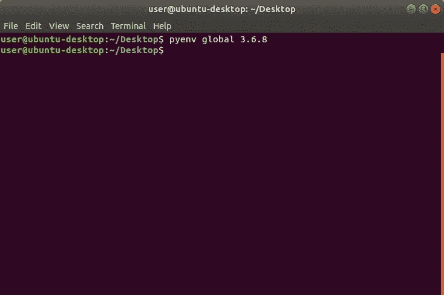

## 创建虚拟环境:

1.  从下面这些说明中找到 Python 版本
2.  复制提供的命令
3.  将命令粘贴到终端
4.  按“回车键”

```
**Python 3.5:** python -m venv venv35**Python 3.6:**
python -m venv venv36**Python 3.7:**
python -m venv venv37**Python 3.8:**
python -m venv venv38**Python 3.9:**
python -m venv venv39
```

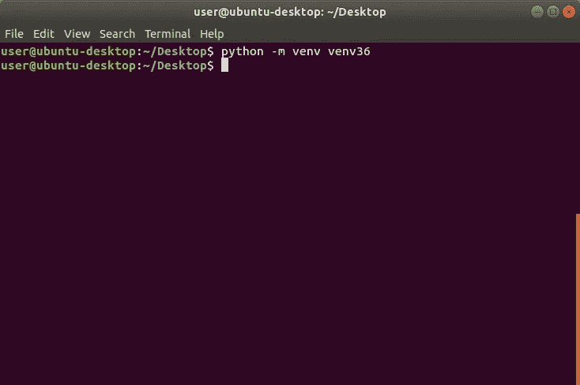

## 激活虚拟环境:

1.  从下面这些说明中找到 Python 版本
2.  复制提供的命令
3.  将命令粘贴到终端
4.  按“回车键”

```
**Python 3.5:**
source venv35/bin/activate**Python 3.6:**
source venv36/bin/activate**Python 3.7:**
source venv37/bin/activate**Python 3.8:**
source venv38/bin/activate**Python 3.9:**
source venv39/bin/activate
```

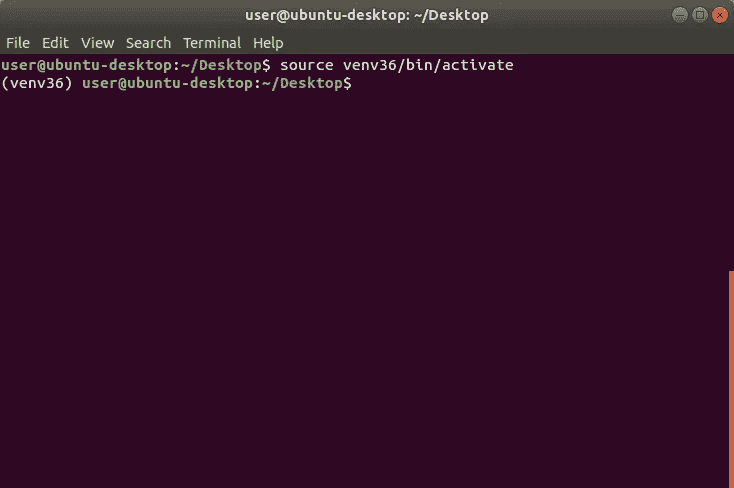

## 安装 NumPy:

1.  从下面这些指令中复制命令
2.  将命令粘贴到 PowerShell 中
3.  按“回车”

```
python -m pip install numpy
```

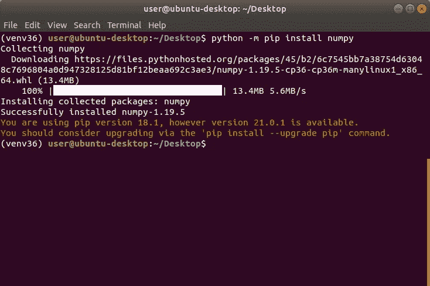

## 安装熊猫:

1.  从下面这些指令中复制命令
2.  将命令粘贴到 PowerShell 中
3.  按“回车”

```
python -m pip install pandas
```

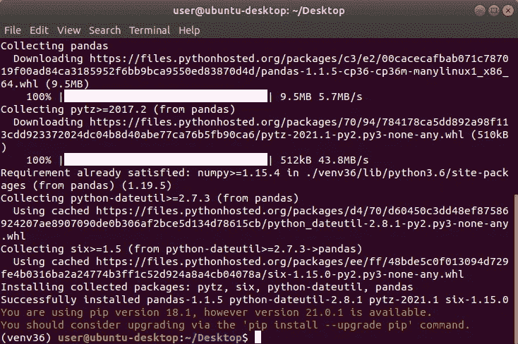

## 安装 SciPy:

1.  从下面这些指令中复制命令
2.  将命令粘贴到 PowerShell 中
3.  按“回车”

```
python -m pip install scipy
```

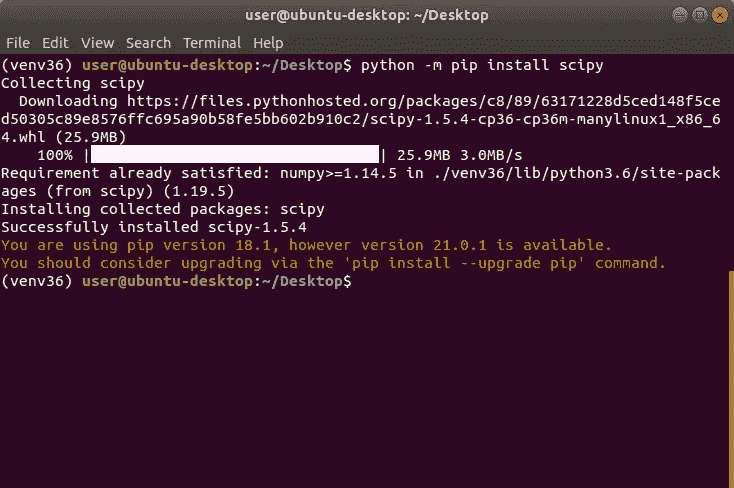

## 安装枕头:

1.  从下面这些指令中复制命令
2.  将命令粘贴到 PowerShell 中
3.  按“回车”

```
python -m pip install pillow
```

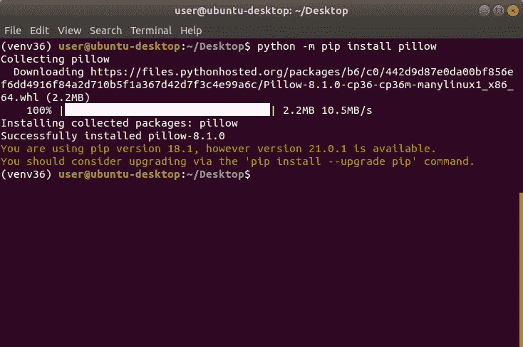

## 安装 Matplotlib:

1.  从下面这些指令中复制命令
2.  将命令粘贴到 PowerShell 中
3.  按“回车”

```
python -m pip install matplotlib
```

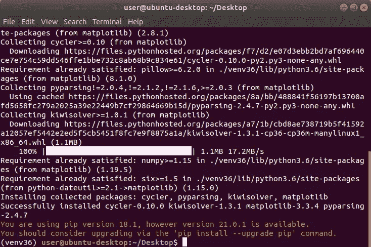

## 安装 OpenCV:

1.  从下面这些指令中复制命令
2.  将命令粘贴到 PowerShell 中
3.  按“回车”

```
python -m pip install opencv-python
```

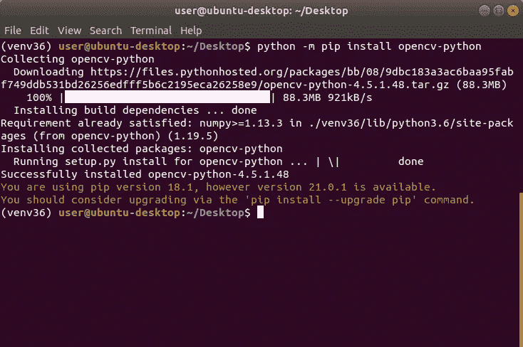

## 安装 Scikit-Learn:

1.  从下面这些指令中复制命令
2.  将命令粘贴到 PowerShell 中
3.  按“回车”

```
python -m pip install scikit-learn
```

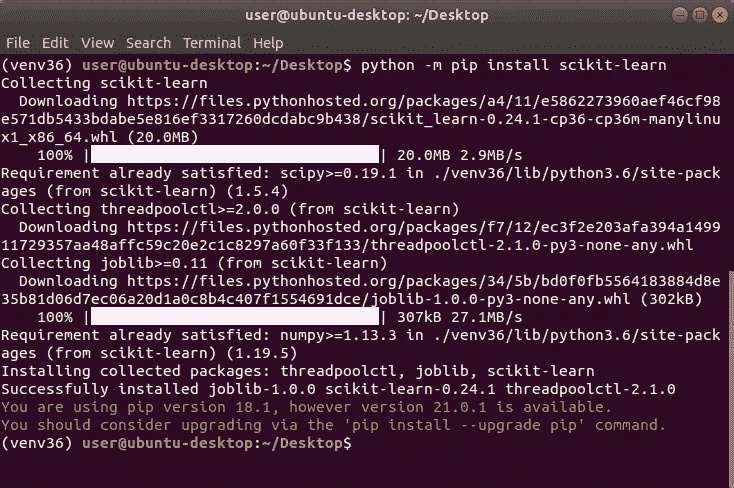

## 安装 Keras:

1.  从下面这些指令中复制命令
2.  将命令粘贴到 PowerShell 中
3.  按“回车”

```
python -m pip install keras
```

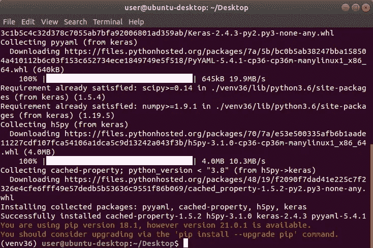

## 安装 TensorFlow:

1.  从下面这些指令中复制命令
2.  将命令粘贴到 PowerShell 中
3.  按“回车”

```
python -m pip install tensorflow tensorflow-gpu
```

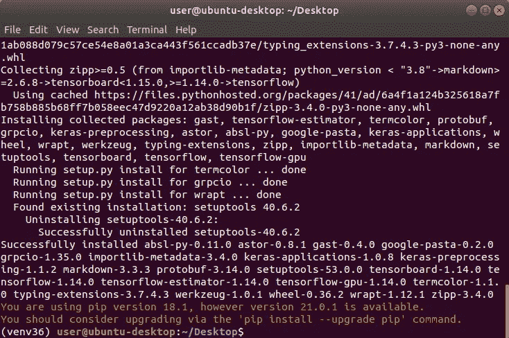

## 安装 PyTorch:

1.  从下面这些指令中复制命令
2.  将命令粘贴到 PowerShell 中
3.  按“回车”

```
**CUDA 11.0:**
python -m pip install torch==1.7.1+cu110 torchvision==0.8.2+cu110 torchaudio===0.7.2 -f [https://download.pytorch.org/whl/torch_stable.html](https://download.pytorch.org/whl/torch_stable.html)**CUDA 10.2:**
python -m pip install torch torchvision**CPU:**
python -m pip install torch==1.7.1+cpu torchvision==0.8.2+cpu torchaudio==0.7.2 -f [https://download.pytorch.org/whl/torch_stable.html](https://download.pytorch.org/whl/torch_stable.html)
```

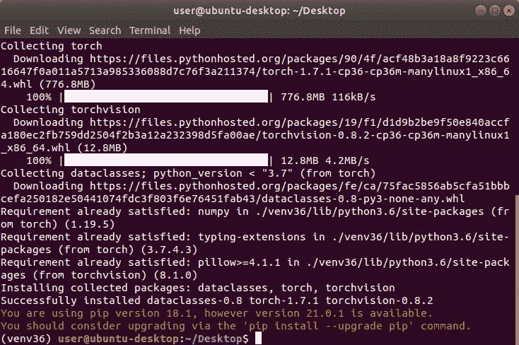

## 安装 MxNet:

1.  从下面这些指令中复制命令
2.  将命令粘贴到 PowerShell 中
3.  按“回车”

```
**CUDA 10.2**:
python -m pip install mxnet-cu102 -f [https://dist.mxnet.io/python](https://dist.mxnet.io/python)**CPU:** python -m pip install mxnet
```

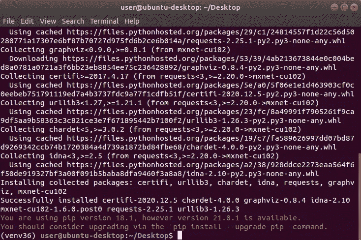

> “希望这篇文章能帮助您获得👯‍♀️🏆👯‍♀️，记得订阅获取更多内容🏅"

## 后续步骤:

这篇文章是一个迷你系列的一部分，帮助读者设置他们开始学习人工智能、机器学习、深度学习和/或数据科学所需的一切。它包括包含复制和粘贴代码的说明和截图的文章，以帮助读者尽快获得结果。它还包括一些文章，包含带有解释和截图的说明，以帮助读者了解正在发生的事情。

```
**Linux:**
01\. [Install Multiple Python Versions](https://medium.com/p/8bd6d301d78c)
02\. [Install the CUDA Driver and Toolkit](https://medium.com/p/3494a4436d6)
03\. [Install the Jupyter Notebook Server](https://medium.com/p/f5bbc07e184a)
04\. [Install Virtual Environments in Jupyter Notebook](https://medium.com/p/c93fd8d07ca0)
05\. [Install the Python Environment for AI](https://medium.com/p/d2937ce641b7)**WSL2:**
01\. [Install Windows Subsystem for Linux 2](https://medium.com/p/e01f92e98cc0)
02\. [Install Multiple Python Versions](https://medium.com/p/ba81f21109d6)
03\. [Install the CUDA Driver and Toolkit](https://medium.com/p/be38703fed5c)
04\. [Install the Jupyter Notebook Server](https://medium.com/p/3ea9bc06a0e5)
05\. [Install Virtual Environments in Jupyter Notebook](https://medium.com/p/d99de1d79fd4)
06\. [Install the Python Environment for AI](https://medium.com/p/6d73735b546)
07\. [Install Ubuntu Desktop GUI (Bonus)](https://medium.com/p/7c3730e33bb2)**Windows 10:**
01\. [Install Multiple Python Versions](https://medium.com/p/15a8685ec99d)
02\. [Install the CUDA Driver and Toolkit](https://medium.com/p/f103ea5eae4b)
03\. [Install the Jupyter Notebook Server](https://medium.com/p/c2ca45793e3b)
04\. [Install Virtual Environments in Jupyter Notebook](https://medium.com/p/a307b6524715)
05\. [Install the Python Environment for AI](https://medium.com/p/604168afbd6e)**MacOS:** 01\. [Install Multiple Python Versions](https://medium.com/p/a58b1966825f)
02\. [Install the Jupyter Notebook Server](https://medium.com/p/7b42d371ac21)
03\. [Install Virtual Environments in Jupyter Notebook](https://medium.com/p/557f23e55f99)
04\. [Install the Python Environment for AI](https://medium.com/p/ed5c93639301)
```