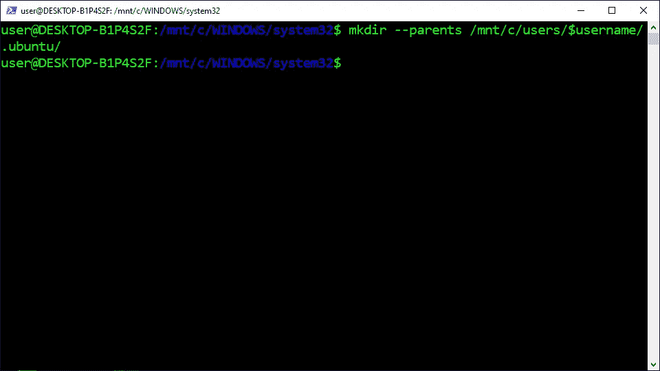

# 在 WSL2 中安装 Ubuntu 桌面 GUI

> 原文：<https://levelup.gitconnected.com/install-ubuntu-desktop-gui-in-wsl2-7c3730e33bb2>

## 系列:人工智能

## 附有说明和截图的简明指南


图片由[杰克·威瑞克](https://unsplash.com/@weirick)拍摄

> “注意:本文经过了重新编写，以简化流程并包含流程更新。点击查看[的更新文章](https://medium.com/p/71f4b78431a4/)

## 下载 VcXsrv:

1.  访问[官方网站](https://sourceforge.net/projects/vcxsrv/)
2.  点击“下载”


## 安装 VcXsrv:

1.  打开“vcx SRV-64 . 1 . 20 . 8 . 1 . installer . exe”
2.  点击“下一步”
3.  点击“安装”
4.  点击“关闭”


## 允许访问 VcXsrv:

1.  检查“专用网络”
2.  单击“允许访问”


## 打开 PowerShell:

1.  按下“⊞之窗”
2.  在搜索栏中输入“PowerShell”
3.  右键单击“Windows PowerShell”
4.  单击“以管理员身份运行”


## 更改执行策略:

1.  从下面这些指令中复制命令
2.  将命令粘贴到 PowerShell 中
3.  按“回车”

```
Set-ExecutionPolicy Unrestricted -Force
```


## 打开 WSL2:

1.  从下面这些指令中复制命令
2.  将命令粘贴到 PowerShell 中
3.  按“回车”

```
wsl
```


## 安装 Ubuntu 桌面:

1.  从下面这些指令中复制命令
2.  将命令粘贴到 PowerShell 中
3.  按“回车”

```
sudo apt --yes install ubuntu-desktop
```


## 设置用户名变量:

1.  从下面这些指令中复制命令
2.  将命令粘贴到 PowerShell 中
3.  按“回车”

```
username=$([wslvar](#8fc7) USERNAME)
```


## 创建 Ubuntu 目录:

1.  从下面这些指令中复制命令
2.  将命令粘贴到 PowerShell 中
3.  按“回车”

```
mkdir --parents /mnt/c/users/$username/.ubuntu/
```



## 打开 Ubuntu 目录:

1.  从下面这些指令中复制命令
2.  将命令粘贴到 PowerShell 中
3.  按“回车”

```
cd /mnt/c/users/$username/.ubuntu
```


## 获取 Microsoft 公钥:

1.  从下面这些指令中复制命令
2.  将命令粘贴到 PowerShell 中
3.  按“回车”

```
sudo apt-key adv --fetch-keys [https://packages.microsoft.com/keys/microsoft.asc](https://packages.microsoft.com/keys/microsoft.asc)
```


## 将 Microsoft 添加到源列表目录:

1.  从下面这些指令中复制命令
2.  将命令粘贴到 PowerShell 中
3.  按“回车”

```
**Ubuntu 20.04:**
sudo sh -c 'echo "deb [arch=amd64] [https://packages.microsoft.com/ubuntu/20.04/prod](https://packages.microsoft.com/ubuntu/18.04/prod) focal main" > /etc/apt/sources.list.d/microsoft-prod.list'**Ubuntu 18.04:**
sudo sh -c 'echo "deb [arch=amd64] [https://packages.microsoft.com/ubuntu/18.04/prod](https://packages.microsoft.com/ubuntu/18.04/prod) bionic main" > /etc/apt/sources.list.d/microsoft-prod.list'
```


## 更新存储库:

1.  从下面这些指令中复制命令
2.  将命令粘贴到 PowerShell 中
3.  按“回车”

```
sudo apt update
```


## 下载。Net 5.0 运行时:

1.  访问[官方网站](https://dotnet.microsoft.com/download/dotnet/5.0/runtime)
2.  单击“下载 x64”


## 安装。Net 5.0 运行时:

1.  单击“windows desktop-runtime-5 . 0 . 5-win-x64 . exe”文件
2.  点击“安装”
3.  点击“下一步”
4.  点击“关闭”


## 以 Root 用户身份输入 Shell:

1.  从下面这些指令中复制命令
2.  将命令粘贴到 PowerShell 中
3.  按“回车”

```
sudo --shell
```


## 安装 Apt 运输 HTTPS:

1.  从下面这些指令中复制命令
2.  将命令粘贴到 PowerShell 中
3.  按“回车”

```
apt install apt-transport-https
```


## 下载 GPG 密钥:

1.  从下面这些指令中复制命令
2.  将命令粘贴到 PowerShell 中
3.  按“回车”

```
wget --output-document /etc/apt/trusted.gpg.d/wsl-transdebian.gpg [https://arkane-systems.github.io/wsl-transdebian/apt/wsl-transdebian.gpg](https://arkane-systems.github.io/wsl-transdebian/apt/wsl-transdebian.gpg)
```


## 更改访问权限:

1.  从下面这些指令中复制命令
2.  将命令粘贴到 PowerShell 中
3.  按“回车”

```
chmod a+r /etc/apt/trusted.gpg.d/wsl-transdebian.gpg
```


## 将 Arkane 系统添加到源列表目录:

1.  从下面这些指令中复制命令
2.  将命令粘贴到 PowerShell 中
3.  按“回车”

```
cat << EOF > /etc/apt/sources.list.d/wsl-transdebian.list
deb https://arkane-systems.github.io/wsl-transdebian/apt/ $(lsb_release -cs) main
deb-src https://arkane-systems.github.io/wsl-transdebian/apt/ $(lsb_release -cs) main
EOF
```


## 更新存储库:

1.  从下面这些指令中复制命令
2.  将命令粘贴到 PowerShell 中
3.  按“回车”

```
apt update
```


## 以 Root 用户身份退出 Shell:

1.  从下面这些指令中复制命令
2.  将命令粘贴到 PowerShell 中
3.  按“回车”

```
exit
```


## 安装精灵:

1.  从下面这些指令中复制命令
2.  将命令粘贴到 PowerShell 中
3.  按“回车”

```
sudo apt install --yes systemd-genie
```


## 将精灵添加到 Sudoers 目录:

1.  从下面这些指令中复制命令
2.  将命令粘贴到 PowerShell 中
3.  按“回车”

```
echo "$USER ALL=(ALL) NOPASSWD:/usr/bin/genie" | sudo EDITOR="tee" visudo --file /etc/sudoers.d/$USER
```


## 创建桌面环境脚本:

1.  从这些指令下面复制代码
2.  将代码粘贴到 PowerShell 中
3.  按“回车”


## 下载 Ubuntu 设计图片:

1.  从下面这些指令中复制命令
2.  将命令粘贴到 PowerShell 中
3.  按“回车”

```
wget [https://assets.ubuntu.com/v1/9fbc8a44-circle-of-friends-web.zip](https://assets.ubuntu.com/v1/9fbc8a44-circle-of-friends-web.zip)
```


## 安装解压缩:

1.  从下面这些指令中复制命令
2.  将命令粘贴到 PowerShell 中
3.  按“回车”

```
sudo apt --yes install unzip
```


## 解压缩 Ubuntu 设计图像:

1.  从下面这些指令中复制命令
2.  将命令粘贴到 PowerShell 中
3.  按“回车”

```
unzip 9fbc8a44-circle-of-friends-web.zip
```


## 安装 ImageMagick:

1.  从下面这些指令中复制命令
2.  将命令粘贴到 PowerShell 中
3.  按“回车”

```
sudo apt --yes install imagemagick
```


## 创建 Ubuntu 图标:

1.  从下面这些指令中复制命令
2.  将命令粘贴到 PowerShell 中
3.  按“回车”

```
convert -resize 64x64 ./circle-of-friends-web/png/cof_orange_hex.png ubuntu.ico
```


## 退出 WSL2:

1.  从下面这些指令中复制命令
2.  将命令粘贴到 PowerShell 中
3.  按“回车”

```
exit
```


## 关闭 WSL2:

1.  从下面这些指令中复制命令
2.  将命令粘贴到 PowerShell 中
3.  按“回车”

```
wsl --shutdown
```


## 创建 VcXsrv 脚本:

1.  从这些指令下面复制代码
2.  将代码粘贴到 PowerShell 中
3.  按“回车”


## 创建 Ubuntu 桌面脚本:

1.  从这些指令下面复制代码
2.  将代码粘贴到 PowerShell 中
3.  按“回车”


## 创建快捷图标:

1.  从这些指令下面复制代码
2.  将代码粘贴到 PowerShell 中
3.  按“回车”


## 打开 Ubuntu 目录:

1.  从下面这些指令中复制命令
2.  将命令粘贴到 PowerShell 中
3.  按“回车”

```
cd $HOME\.ubuntu
```


## 启动 Ubuntu 桌面:

1.  从下面这些指令中复制命令
2.  将命令粘贴到 PowerShell 中
3.  按“回车”
4.  双击“Ubuntu”快捷方式
5.  等待 180 秒，让 Ubuntu 桌面启动

```
explorer.exe .\
```


## 开放终端:

1.  点击左上角的“活动”
2.  在搜索栏中输入“终端”
3.  点击“终端”


## 禁用屏幕锁定:

1.  从下面这些指令中复制命令
2.  将命令粘贴到终端
3.  按“回车”

```
gsettings set org.gnome.desktop.lockdown disable-lock-screen true
```


## 安装快照存储:

1.  从下面这些指令中复制命令
2.  将命令粘贴到终端
3.  按“回车”

```
sudo snap install snap-store
```


> “希望这篇文章能帮助您获得👯‍♀️🏆👯‍♀️，记得订阅获取更多内容🏅"

## 后续步骤:

这篇文章是一个迷你系列的一部分，帮助读者设置他们开始学习人工智能、机器学习、深度学习和/或数据科学所需的一切。它包括包含复制和粘贴代码的说明和截图的文章，以帮助读者尽快获得结果。它还包括一些文章，包含带有解释和截图的说明，以帮助读者了解正在发生的事情。

```
**Linux:**
01\. [Install Multiple Python Versions](https://medium.com/p/8bd6d301d78c)
02\. [Install the CUDA Driver and Toolkit](https://medium.com/p/3494a4436d6)
03\. [Install the Jupyter Notebook Server](https://medium.com/p/f5bbc07e184a)
04\. [Install Virtual Environments in Jupyter Notebook](https://medium.com/p/c93fd8d07ca0)
05\. [Install the Python Environment for AI](https://medium.com/p/d2937ce641b7)**WSL2:**
01\. [Install Windows Subsystem for Linux 2](https://medium.com/p/e01f92e98cc0)
02\. [Install Multiple Python Versions](https://medium.com/p/ba81f21109d6)
03\. [Install the CUDA Driver and Toolkit](https://medium.com/p/be38703fed5c)
04\. [Install the Jupyter Notebook Server](https://medium.com/p/3ea9bc06a0e5)
05\. [Install Virtual Environments in Jupyter Notebook](https://medium.com/p/d99de1d79fd4)
06\. [Install the Python Environment for AI](https://medium.com/p/6d73735b546)
07\. [Install Ubuntu Desktop GUI (Bonus)](https://medium.com/p/7c3730e33bb2)**Windows 10:**
01\. [Install Multiple Python Versions](https://medium.com/p/15a8685ec99d)
02\. [Install the CUDA Driver and Toolkit](https://medium.com/p/f103ea5eae4b)
03\. [Install the Jupyter Notebook Server](https://medium.com/p/c2ca45793e3b)
04\. [Install Virtual Environments in Jupyter Notebook](https://medium.com/p/a307b6524715)
05\. [Install the Python Environment for AI](https://medium.com/p/604168afbd6e)**MacOS:** 01\. [Install Multiple Python Versions](https://medium.com/p/a58b1966825f)
02\. [Install the Jupyter Notebook Server](https://medium.com/p/7b42d371ac21)
03\. [Install Virtual Environments in Jupyter Notebook](https://medium.com/p/557f23e55f99)
04\. [Install the Python Environment for AI](https://medium.com/p/ed5c93639301)
```