# 在 WSL2 的 Jupyter 笔记本中安装虚拟环境

> 原文：<https://levelup.gitconnected.com/install-virtual-environments-in-jupyter-notebook-in-wsl2-d99de1d79fd4>

## 系列:人工智能

## 附有说明和截图的简明指南


图片由[西恩·佛利](https://unsplash.com/@_stfeyes)

> [扩展指南](https://medium.com/p/3e6bf456041b)使用术语和命令的定义来帮助您了解正在发生的事情。

## 开放终端:

1.  打开 web 浏览器
2.  输入 Jupyter 笔记本电脑服务器的 IP 地址
3.  按“回车”
4.  点击“新建”
5.  点击“终端”

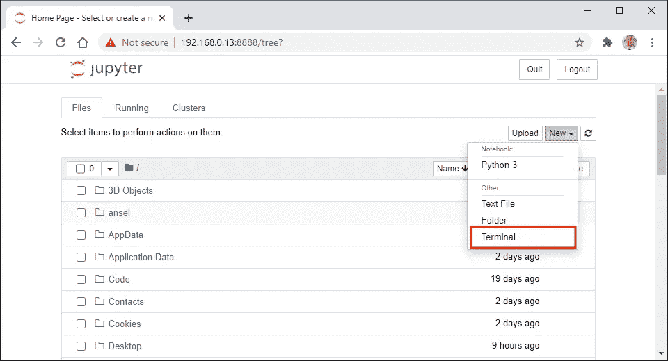

## 设置用户名变量:

1.  从下面这些指令中复制命令
2.  将命令粘贴到终端
3.  按“回车”

```
username=$([wslvar](#32fa) username)
```

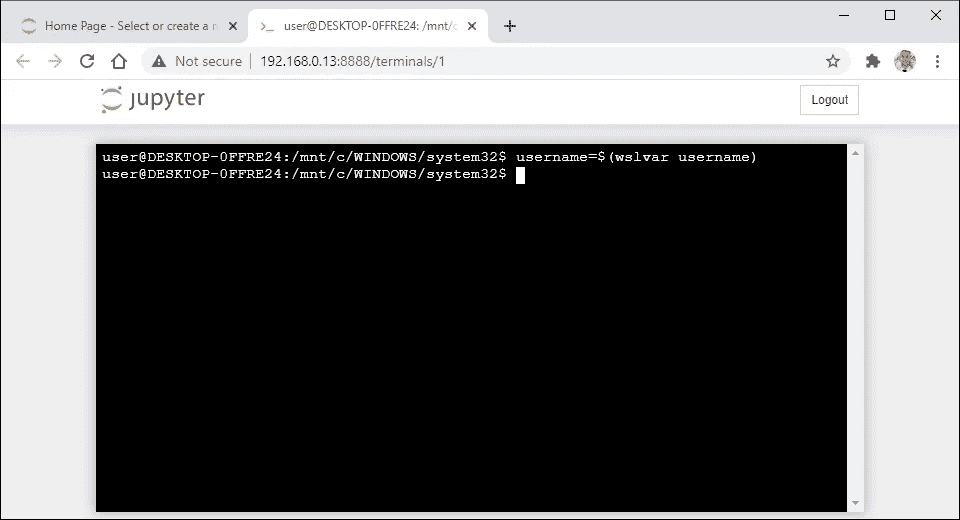

## 打开桌面目录:

1.  从下面这些指令中复制命令
2.  将命令粘贴到终端
3.  按“回车”

```
cd /mnt/c/users/$username/desktop/
```

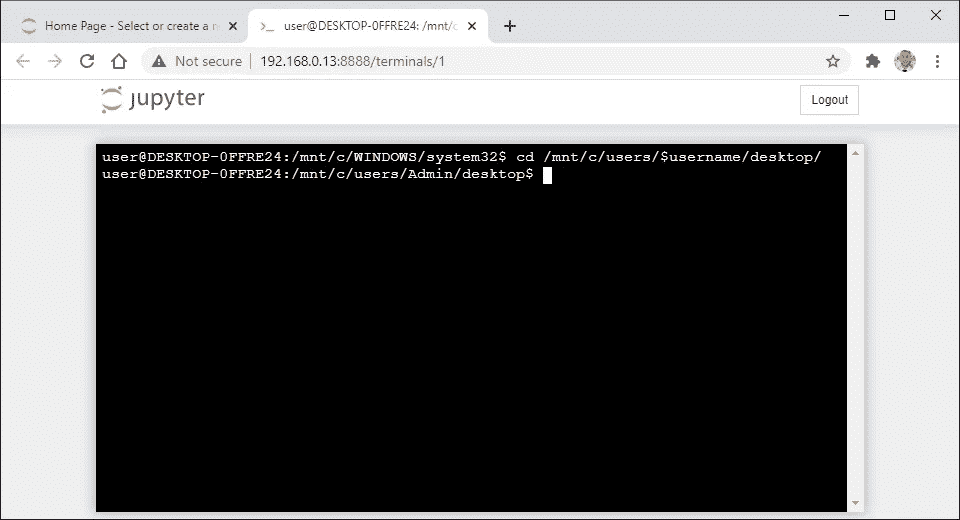

## 克隆存储库:

1.  从下面这些指令中复制命令
2.  将命令粘贴到终端
3.  按“回车”

```
git clone --recursive [https://github.com/zzh8829/yolov3-tf2.git](https://github.com/zzh8829/yolov3-tf2.git)
```

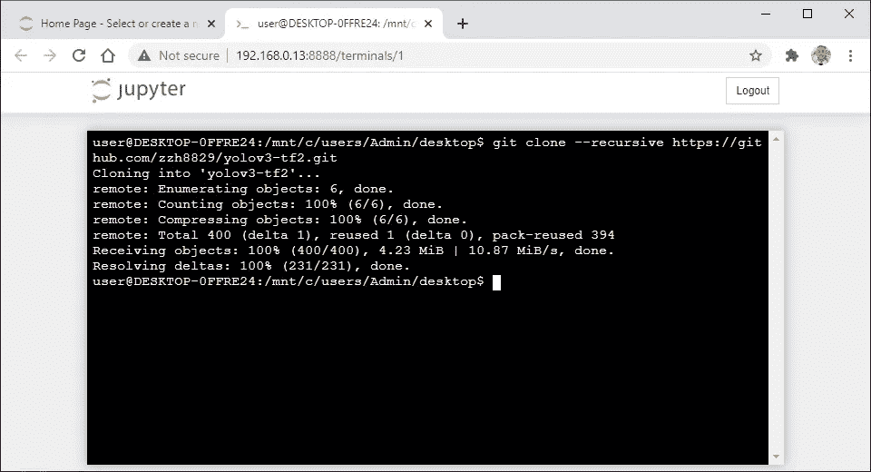

## 打开 YoloV3-Tf2 目录:

1.  从下面这些指令中复制命令
2.  将命令粘贴到终端
3.  按“回车”

```
cd yolov3-tf2
```


## 设置 Pyenv 版本环境变量:

1.  从下面这些指令中复制命令
2.  将命令粘贴到终端
3.  按“回车”

```
PYENV_VERSION=3.6.8
```


## 创建虚拟环境:

1.  从下面这些说明中找到 Python 版本
2.  复制提供的命令
3.  将命令粘贴到终端
4.  按“回车”

```
**Python 3.5:** python -m venv venv35**Python 3.6: <----------**
python -m venv venv36**Python 3.7:**
python -m venv venv37**Python 3.8:**
python -m venv venv38
```

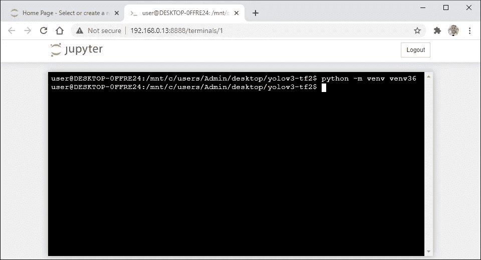

## 激活虚拟环境:

1.  从下面这些说明中找到 Python 版本
2.  复制提供的命令
3.  将命令粘贴到终端
4.  按“回车”

```
**Python 3.5:**
[source](#768b) venv35/bin/activate**Python 3.6: <----------**
source venv36/bin/activate**Python 3.7:**
source venv37/bin/activate**Python 3.8:**
source venv38/bin/activate
```

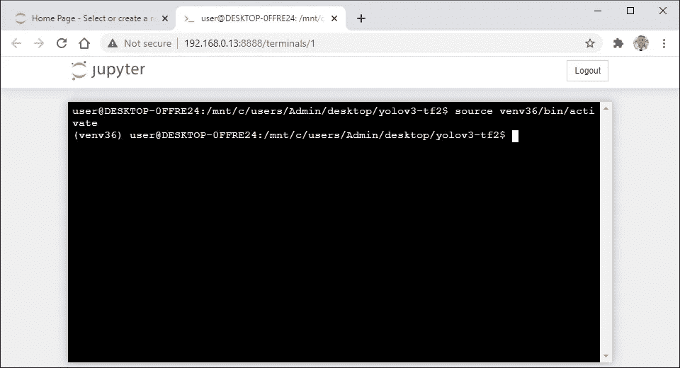

## 升级 Pip:

1.  从下面这些指令中复制命令
2.  将命令粘贴到终端
3.  按“回车”

```
python -m pip install --[upgrade](#33fe) pip
```

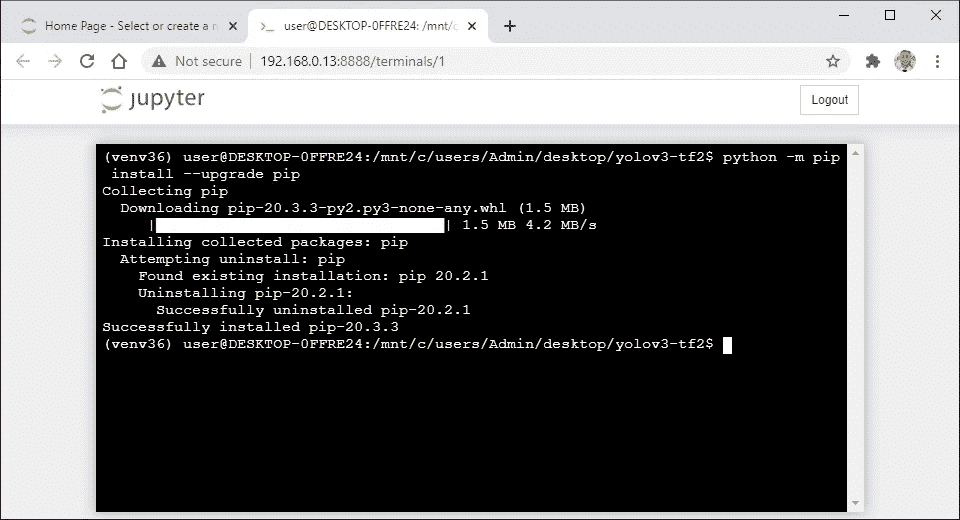

## 安装要求:

1.  从下面这些指令中复制命令
2.  将命令粘贴到终端
3.  按“回车”

```
python -m pip install --requirement requirements-gpu.txt
```

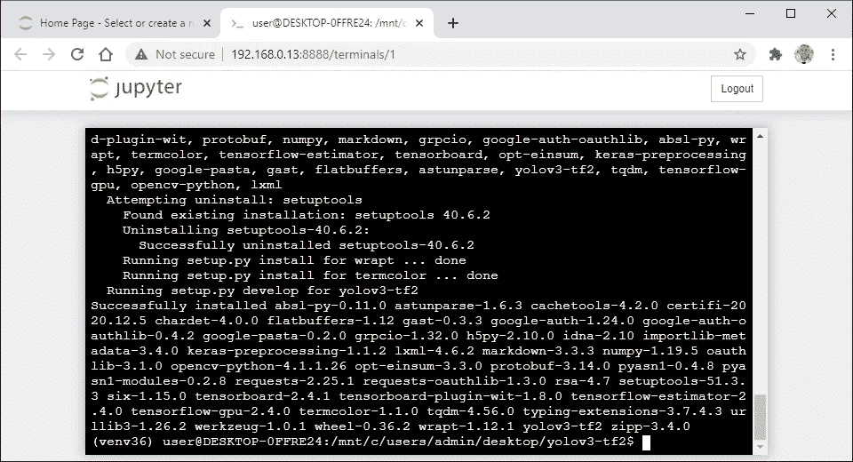

## 下载重量:

1.  从下面这些指令中复制命令
2.  将命令粘贴到终端
3.  按“回车”

```
wget [https://pjreddie.com/media/files/yolov3.weights](https://pjreddie.com/media/files/yolov3.weights) -O data/yolov3.weights
```

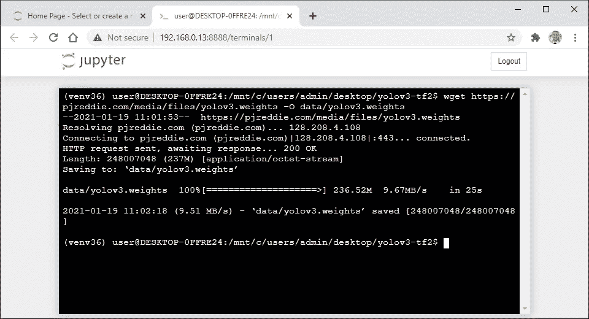

## 转换重量:

1.  从下面这些指令中复制命令
2.  将命令粘贴到终端
3.  按“回车”

```
python convert.py --weights ./data/yolov3.weights --output ./checkpoints/yolov3.tf
```

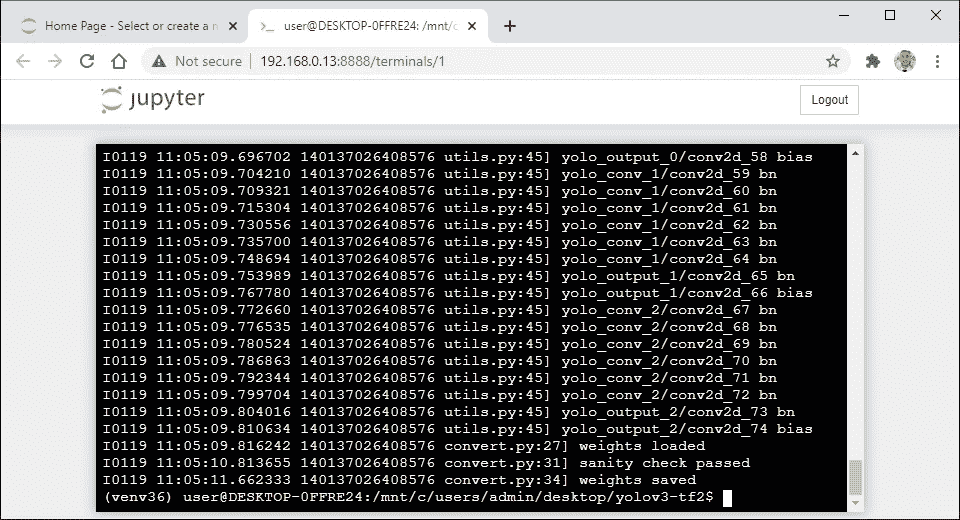

## 使用存储库:

1.  从下面这些指令中复制命令
2.  将命令粘贴到终端
3.  按“回车”

```
venv36/bin/python detect.py --image ./data/meme.jpg
```

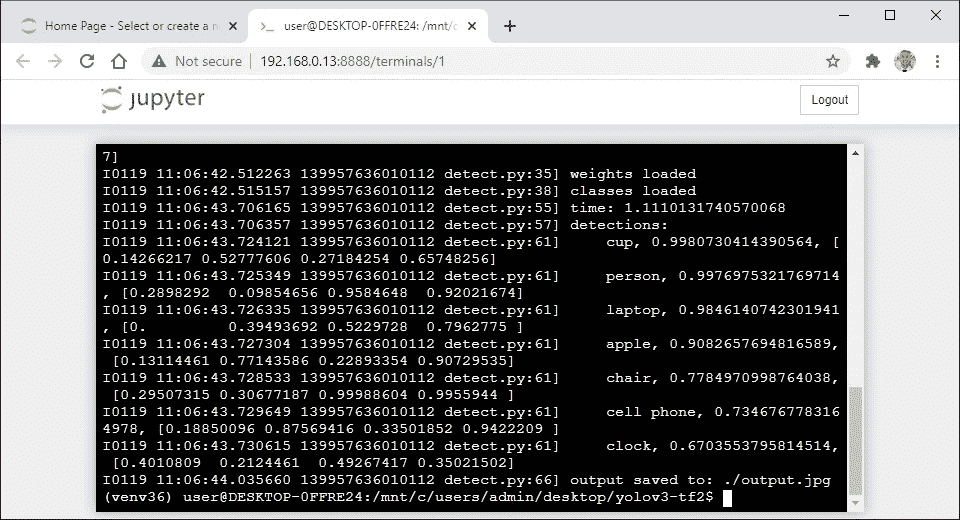

## 安装 IPython 内核:

1.  从下面这些指令中复制命令
2.  将命令粘贴到终端
3.  按“回车”

```
python -m pip install ipykernel
```

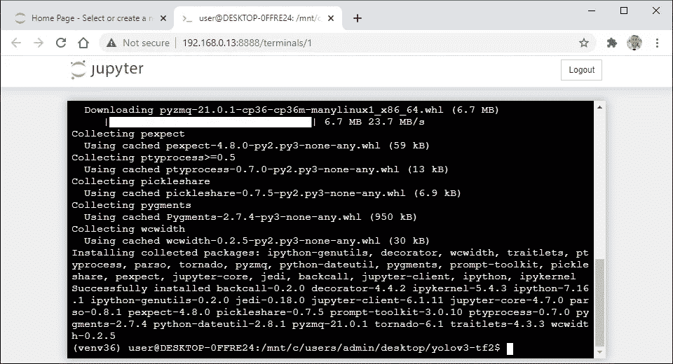

## 安装虚拟环境:

1.  从下面这些指令中复制命令
2.  将命令粘贴到终端
3.  按“回车”

```
**Python 3.5:**
sudo venv35/bin/python -m ipykernel install --name "yolov3-tf2" --display-name "yolov3-tf2"**Python 3.6: <----------**
sudo venv36/bin/python -m ipykernel install --name "yolov3-tf2" --display-name "yolov3-tf2"**Python 3.7:**
sudo venv37/bin/python -m ipykernel install --name "yolov3-tf2" --display-name "yolov3-tf2"**Python 3.8:**
sudo venv38/bin/python -m ipykernel install --name "yolov3-tf2" --display-name "yolov3-tf2"
```

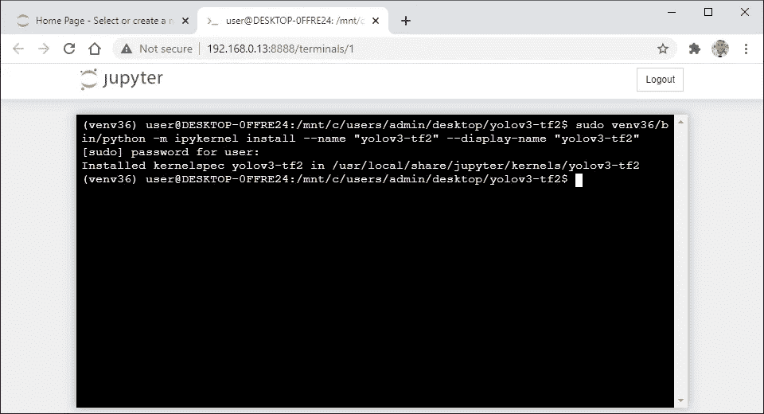

## 打开 YoloV3-Tf2 目录:

1.  重新打开 Jupyter 笔记本
2.  单击“桌面”文件夹
3.  单击“YoloV3-Tf2”文件夹

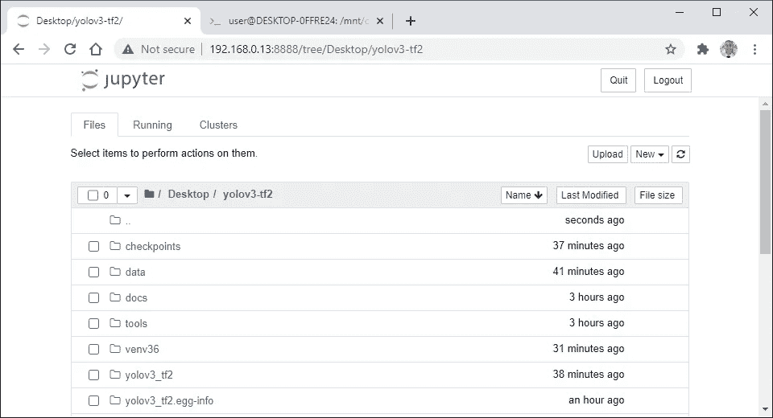

## 使用虚拟环境:

1.  刷新页面
2.  点击“新建”
3.  点击“yolov3-tf2”

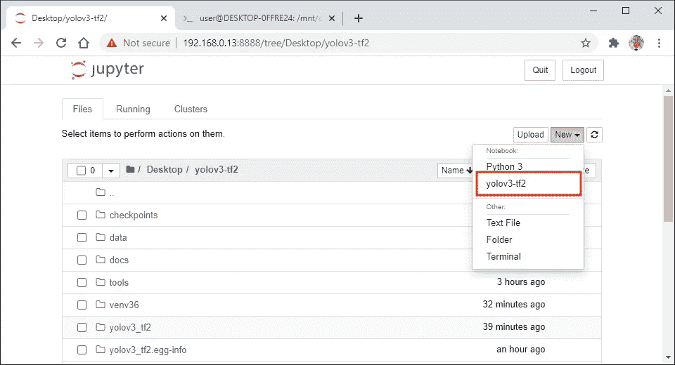

## 运行代码单元格:

1.  从这些指令下面复制代码
2.  单击 Jupyter 笔记本中的空白单元格
3.  将代码粘贴到空单元格中
4.  按“Shift”+“Enter”

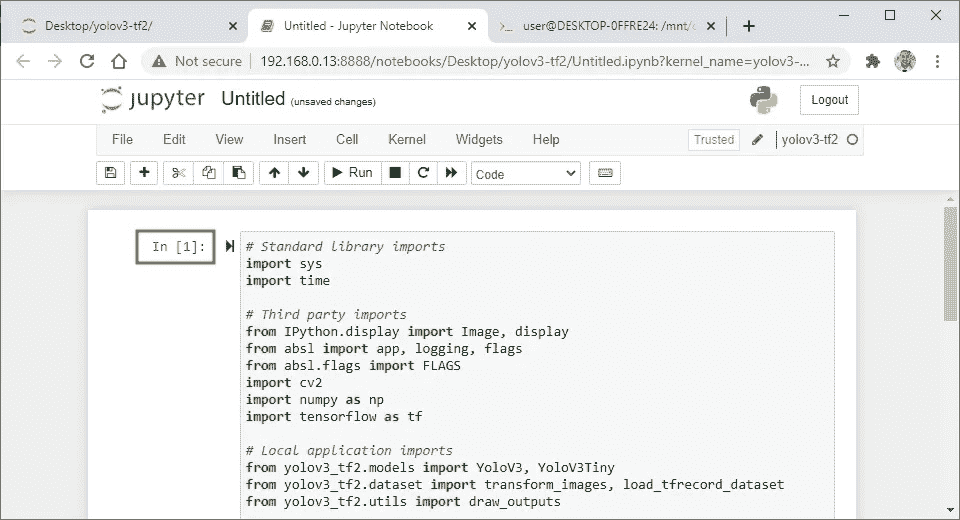

## 运行代码单元格:

1.  从这些指令下面复制代码
2.  单击 Jupyter 笔记本中的空白单元格
3.  将代码粘贴到空单元格中
4.  按“Shift”+“Enter”

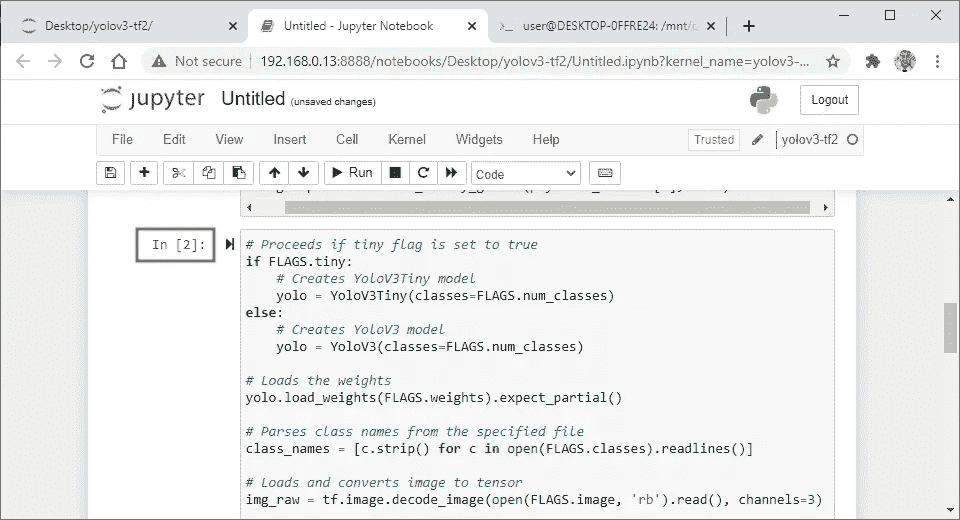

## 停用虚拟环境:

1.  从下面这些指令中复制命令
2.  将命令粘贴到终端
3.  按“回车”

```
deactivate
```

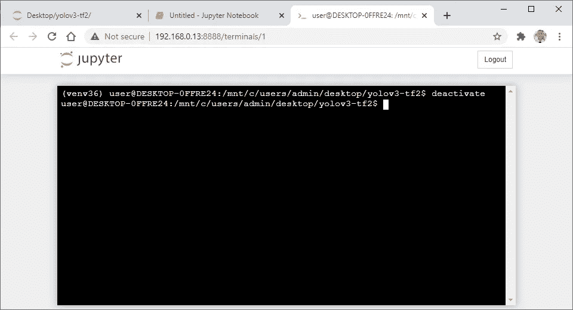

## 取消设置 Pyenv 版本环境变量:

1.  从下面这些指令中复制命令
2.  将命令粘贴到终端
3.  按“回车”

```
PYENV_VERSION=""
```

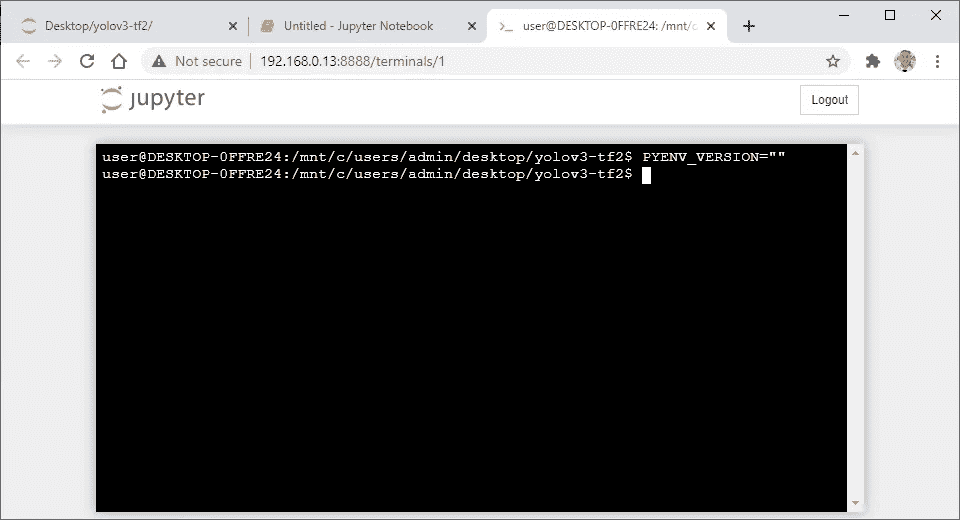

## 列出已安装的虚拟环境:

1.  从下面这些指令中复制命令
2.  将命令粘贴到终端
3.  按“回车”

```
jupyter kernelspec list
```

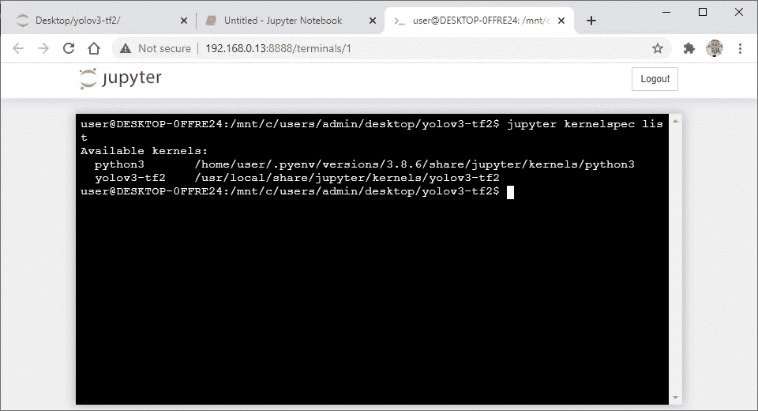

## 卸载虚拟环境:

1.  从下面这些指令中复制命令
2.  将命令粘贴到终端
3.  按“回车”

```
sudo ~/.pyenv/shims/jupyter kernelspec uninstall yolov3-tf2
```

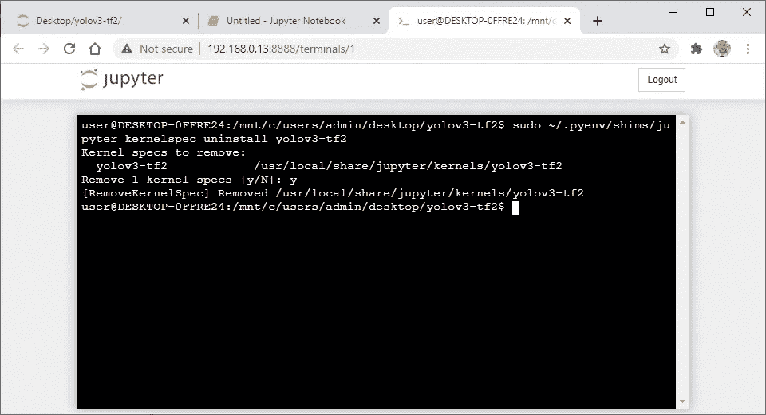

> 希望这篇文章能帮助您获得👯‍♀️🏆👯‍♀️，记得订阅获取更多内容🏅"

## 后续步骤:

这篇文章是一个迷你系列的一部分，帮助读者设置他们开始学习人工智能、机器学习、深度学习和/或数据科学所需的一切。它包括包含复制和粘贴代码的说明和截图的文章，以帮助读者尽快获得结果。它还包括一些文章，包含带有解释和截图的说明，以帮助读者了解正在发生的事情。

```
**Linux:**
01\. [Install Multiple Python Versions](https://medium.com/p/8bd6d301d78c)
02\. [Install the CUDA Driver and Toolkit](https://medium.com/p/3494a4436d6)
03\. [Install the Jupyter Notebook Server](https://medium.com/p/f5bbc07e184a)
04\. [Install Virtual Environments in Jupyter Notebook](https://medium.com/p/c93fd8d07ca0)
05\. [Install the Python Environment for AI](https://medium.com/p/d2937ce641b7)**WSL2:**
01\. [Install Windows Subsystem for Linux 2](https://medium.com/p/e01f92e98cc0)
02\. [Install Multiple Python Versions](https://medium.com/p/ba81f21109d6)
03\. [Install the CUDA Driver and Toolkit](https://medium.com/p/be38703fed5c)
04\. [Install the Jupyter Notebook Server](https://medium.com/p/3ea9bc06a0e5)
05\. [Install Virtual Environments in Jupyter Notebook](https://medium.com/p/d99de1d79fd4)
06\. [Install the Python Environment for AI](https://medium.com/p/6d73735b546)
07\. [Install Ubuntu Desktop GUI (Bonus)](https://medium.com/p/7c3730e33bb2)**Windows 10:**
01\. [Install Multiple Python Versions](https://medium.com/p/15a8685ec99d)
02\. [Install the CUDA Driver and Toolkit](https://medium.com/p/f103ea5eae4b)
03\. [Install the Jupyter Notebook Server](https://medium.com/p/c2ca45793e3b)
04\. [Install Virtual Environments in Jupyter Notebook](https://medium.com/p/a307b6524715)
05\. [Install the Python Environment for AI](https://medium.com/p/604168afbd6e)**MacOS:** 01\. [Install Multiple Python Versions](https://medium.com/p/a58b1966825f)
02\. [Install the Jupyter Notebook Server](https://medium.com/p/7b42d371ac21)
03\. [Install Virtual Environments in Jupyter Notebook](https://medium.com/p/557f23e55f99)
04\. [Install the Python Environment for AI](https://medium.com/p/ed5c93639301)
```