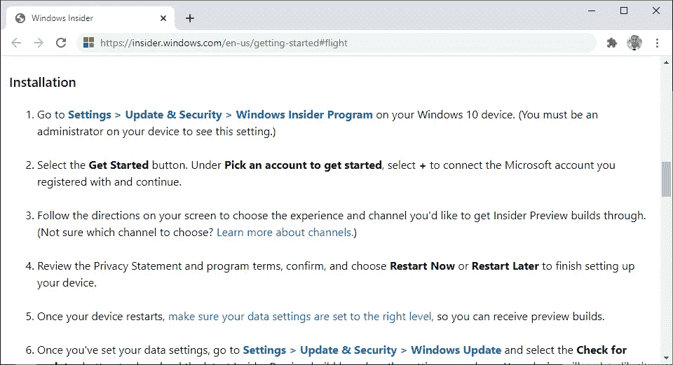
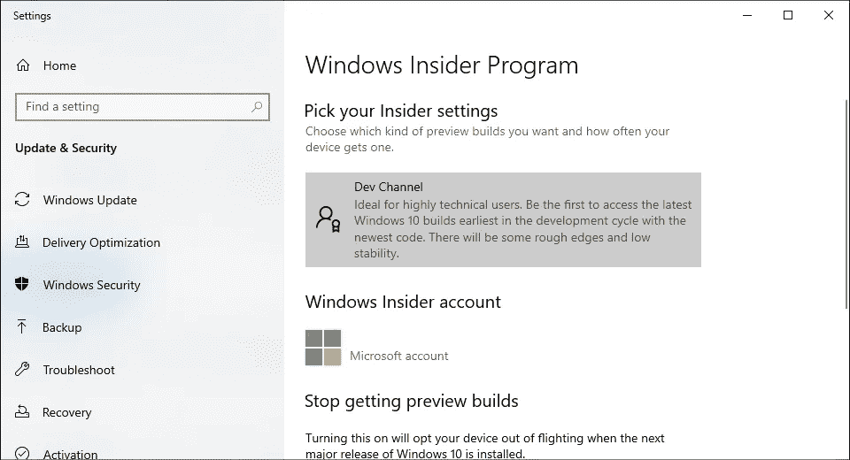
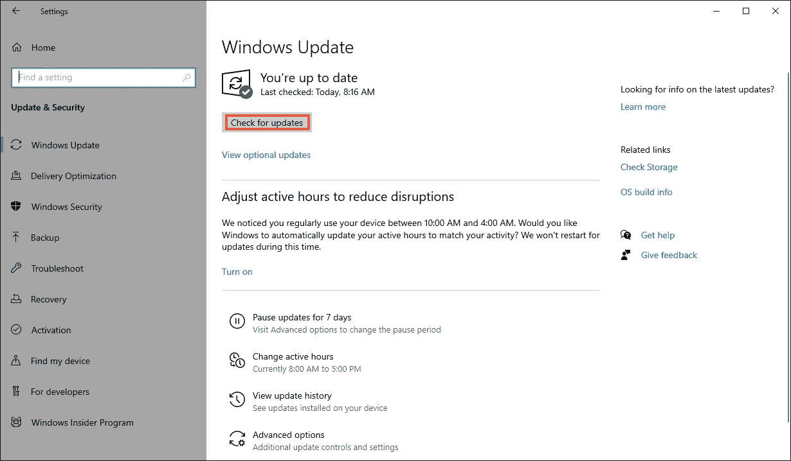
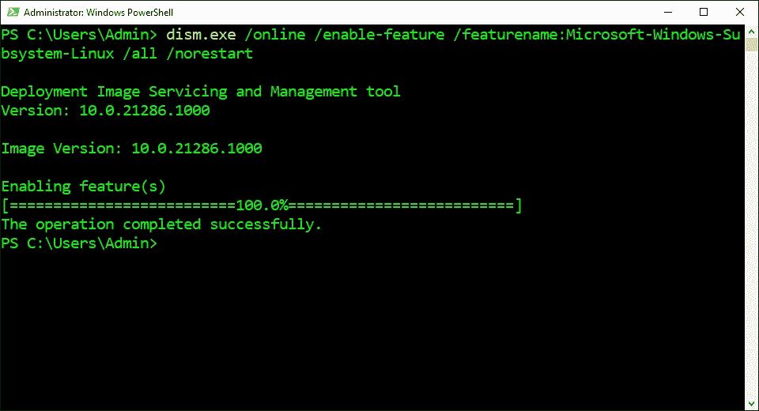
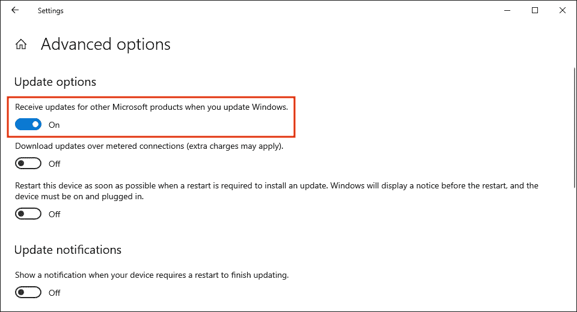
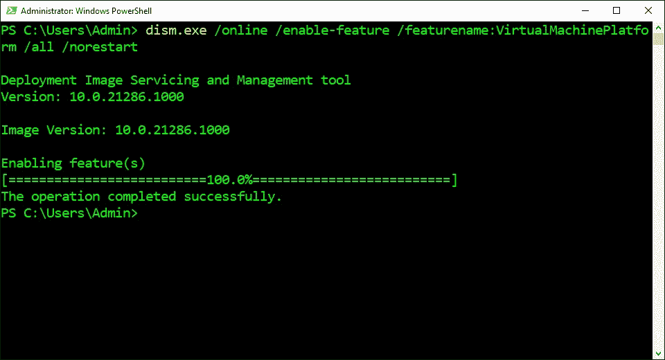
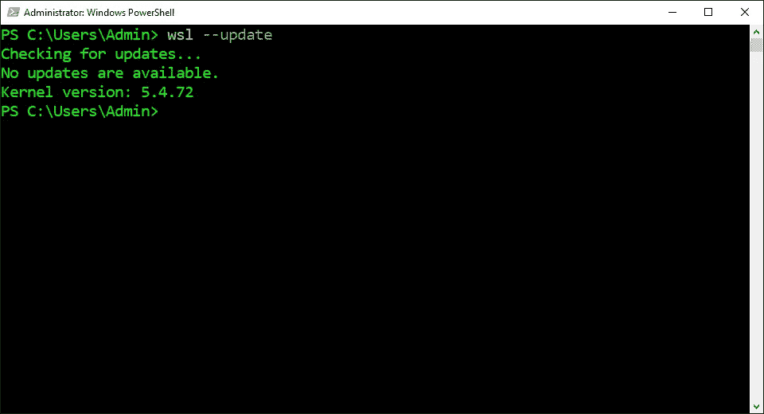
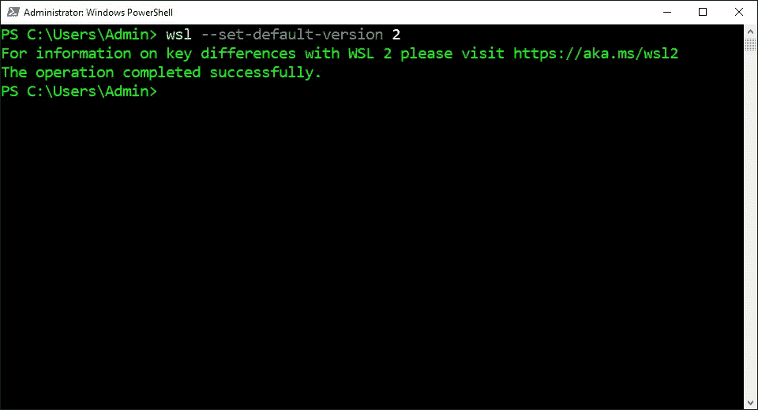
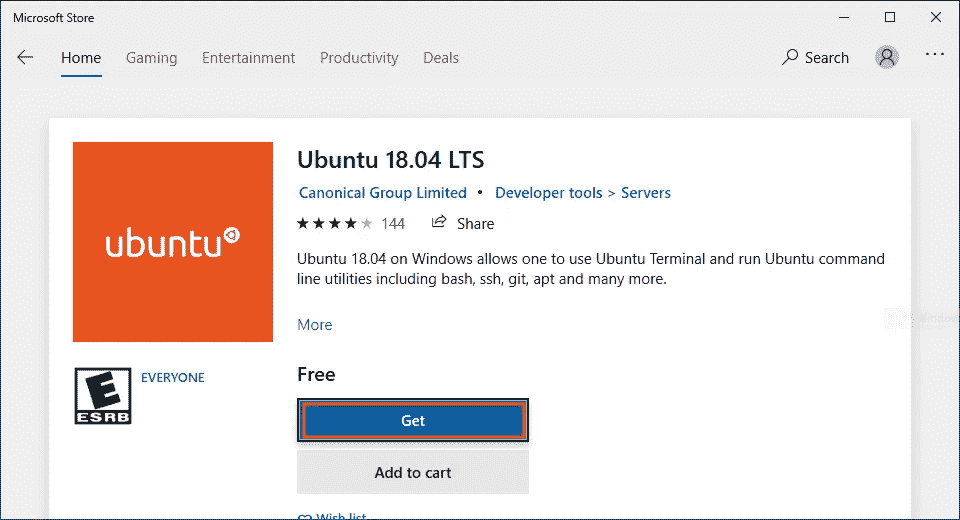
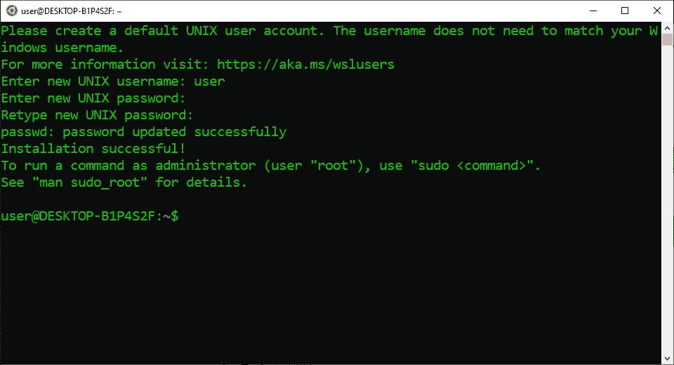

# 为 Linux 2 安装 Windows 子系统

> 原文：<https://levelup.gitconnected.com/install-windows-subsystem-for-linux-2-e01f92e98cc0>

## 系列:人工智能

## 附有说明和截图的简明指南


图片由[西恩·佛利](https://unsplash.com/@_stfeyes)

> [扩展指南](https://medium.com/p/cbdd835612fb)使用术语和命令的定义来帮助您了解正在发生的事情。

## 加入 Windows Insider 计划:

1.  访问[官方网站](https://insider.windows.com/en-us/getting-started)
2.  点击“注册”
3.  点击“立即登录”
4.  登录 Microsoft
5.  选中“我接受本协议的条款”
6.  点击“立即注册”
7.  点击“立即飞行”



## 选择开发频道:

1.  单击“打开设置”
2.  点击“开始”
3.  单击“链接帐户”
4.  登录 Microsoft
5.  选择“开发频道”
6.  点击“确认”
7.  单击“立即重启”



## 检查 Windows 更新:

1.  按下“⊞之窗”
2.  在搜索栏中输入“检查更新”
3.  单击“检查更新”
4.  单击“检查更新”



## 打开 PowerShell:

1.  按下“⊞之窗”
2.  在搜索栏中输入“PowerShell”
3.  单击“以管理员身份运行”


## 启用 WSL2:

1.  从下面这些指令中复制命令
2.  将命令粘贴到 PowerShell 中
3.  按“回车”

```
[dism.exe](#8c00) /online /enable-feature /featurename:Microsoft-Windows-Subsystem-Linux /all /norestart
```



## 检查 Windows 更新:

1.  按下“⊞之窗”
2.  在搜索栏中输入“检查更新”
3.  单击“检查更新”
4.  单击“高级选项”
5.  单击“接收其他 Microsoft 产品的更新”
6.  点击“↓”
7.  单击“检查更新”



## 启用虚拟机平台:

1.  从下面这些指令中复制命令
2.  将命令粘贴到 PowerShell 中
3.  按“回车”
4.  重新启动计算机

```
dism.exe /online /enable-feature /featurename:VirtualMachinePlatform /all /norestart
```



## 更新内核:

1.  从下面这些指令中复制命令
2.  将命令粘贴到 PowerShell 中
3.  按“回车”

```
wsl --update
```



## 设置默认版本:

1.  从下面这些指令中复制命令
2.  将命令粘贴到 PowerShell 中
3.  按“回车”

```
wsl --set-default-version 2
```



## 安装 Ubuntu:

1.  打开[微软商店](https://www.microsoft.com/en-us/p/ubuntu-1804-lts/9n9tngvndl3q)
2.  点击“获取”
3.  点击“安装”
4.  点击“启动”



## 创建用户帐户:

1.  在 PowerShell 中输入用户名
2.  在 PowerShell 中输入密码
3.  在 PowerShell 中重新输入密码



> “希望这篇文章能帮助您获得👯‍♀️🏆👯‍♀️，记得订阅获取更多内容🏅"

## 后续步骤:

这篇文章是一个迷你系列的一部分，帮助读者设置他们开始学习人工智能、机器学习、深度学习和/或数据科学所需的一切。它包括包含复制和粘贴代码的说明和截图的文章，以帮助读者尽快获得结果。它还包括一些文章，包含带有解释和截图的说明，以帮助读者了解正在发生的事情。

```
**Linux:**
01\. [Install Multiple Python Versions](https://medium.com/p/8bd6d301d78c)
02\. [Install the CUDA Driver and Toolkit](https://medium.com/p/3494a4436d6)
03\. [Install the Jupyter Notebook Server](https://medium.com/p/f5bbc07e184a)
04\. [Install Virtual Environments in Jupyter Notebook](https://medium.com/p/c93fd8d07ca0)
05\. [Install the Python Environment for AI](https://medium.com/p/d2937ce641b7)**WSL2:**
01\. [Install Windows Subsystem for Linux 2](https://medium.com/p/e01f92e98cc0)
02\. [Install Multiple Python Versions](https://medium.com/p/ba81f21109d6)
03\. [Install the CUDA Driver and Toolkit](https://medium.com/p/be38703fed5c)
04\. [Install the Jupyter Notebook Server](https://medium.com/p/3ea9bc06a0e5)
05\. [Install Virtual Environments in Jupyter Notebook](https://medium.com/p/d99de1d79fd4)
06\. [Install the Python Environment for AI](https://medium.com/p/6d73735b546)
07\. [Install Ubuntu Desktop GUI (Bonus)](https://medium.com/p/7c3730e33bb2)**Windows 10:**
01\. [Install Multiple Python Versions](https://medium.com/p/15a8685ec99d)
02\. [Install the CUDA Driver and Toolkit](https://medium.com/p/f103ea5eae4b)
03\. [Install the Jupyter Notebook Server](https://medium.com/p/c2ca45793e3b)
04\. [Install Virtual Environments in Jupyter Notebook](https://medium.com/p/a307b6524715)
05\. [Install the Python Environment for AI](https://medium.com/p/604168afbd6e)**MacOS:** 01\. [Install Multiple Python Versions](https://medium.com/p/a58b1966825f)
02\. [Install the Jupyter Notebook Server](https://medium.com/p/7b42d371ac21)
03\. [Install Virtual Environments in Jupyter Notebook](https://medium.com/p/557f23e55f99)
04\. [Install the Python Environment for AI](https://medium.com/p/ed5c93639301)
```