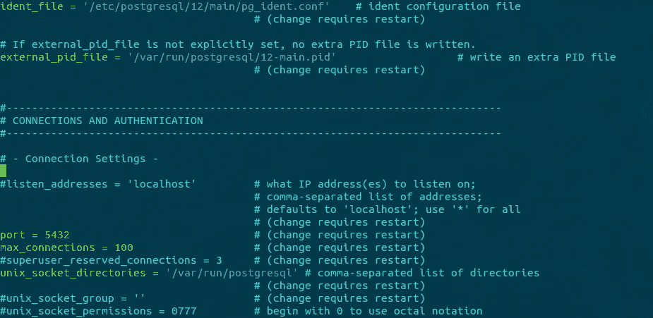
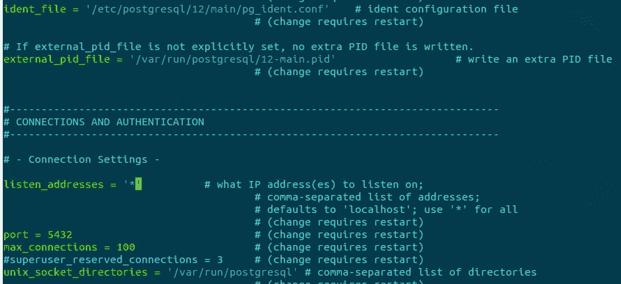
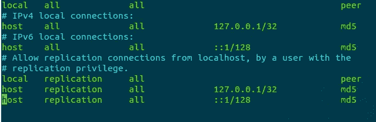
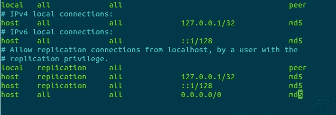

# 在 Ubuntu 20.04 上安装和配置 PostgreSQL

> 原文：<https://levelup.gitconnected.com/installing-and-configuring-postgresql-on-ubuntu-20-04-e50122635927>


我最喜欢的数据库！

如果我们所有的数据都可以保存在这样的抽屉里，那岂不是简单多了！有形的，具体的，就在你眼前。你永远不必担心腐败或安全漏洞(仔细想想…)。一个新用户来到你的网站，你把所有的用户数据转录到一张便笺上，并把它归档在适当的地方，没有机器(虚拟的或真实的)，终端，错误信息等等。…听起来不错，对吧？呃，也许不是。虽然 DBMS 可能很难处理，特别是在初始配置和安装时，但它们比上面图中的 DMS(抽屉管理系统)好得多。也就是说，希望本文和本系列中的其他文章能够让处理 DBMS 不那么痛苦。

这是旨在让您的 DBMS 在 Ubuntu 20.04 上运行的系列文章的第一篇。这些指南旨在简单快捷。您可能需要更多的配置选项。可以把这些看作是准备好最基本的数据库并配置成可以从外部资源访问的一种方式。今天选择的数据库是 PostgreSQL (PG)。

# 有用的命令

这里有一些有用的命令，我将在本文后面引用。在处理您的 PG 实例时，它们应该对您非常有用。

## 开始

```
sudo systemctl start postgresql
```

## 状态

```
sudo systemctl status postgresql
```

## 停止

```
sudo systemctl stop postgresql
```

## 重新开始

```
sudo systemctl restart postgresql
```

这些命令将启动、停止、重新启动，并告诉您机器上 PG 的状态。它们有助于调试。此外，为了使配置更改生效，您可能需要重新启动(或停止并启动)。

# 装置

运行以下两个命令

```
sudo apt update
sudo apt install postgresql postgresql-contrib
```

注意:posgresql-contrib 是可选的。它包含更新的包和模块，这些包和模块还不是 postgresql 核心的一部分，但可能会有用！

一旦运行了这些命令，就可以使用这个命令来检查 PG 的版本

```
sudo -u postgres psql -c "SELECT version();"
```

如果你得到这样的东西:

```
PostgreSQL 12.5 (Ubuntu 12.5-0ubuntu0.20.04.1) on x86_64-pc-linux-gnu, compiled by gcc (Ubuntu 9.3.0-17ubuntu1~20.04) 9.3.0, 64-bit
```

您已经成功地在您的机器上安装了 PG。现在，在上面运行 status 命令来确保一切正常运行可能是个好主意！当您运行这个命令时，您应该得到一些关于 PG 信息！应该说是*主动*并且已经*启动*！

# 接近

现在它已经安装并运行了(希望如此！)您可能想进入 psql shell 来探索一下。

当 PG 被安装后，它会在你的机器上创建一个名为 *postgres* 的用户。这是您的 PG 实例的超级用户。您可以将用户切换到 *postgres* 来访问 psql shell。然而，我的首选方法是使用-u 参数来指定我希望用来访问 psql 的用户。这样我就不会关掉我的机器超级用户！要从机器上的超级用户访问 psql，请运行以下命令:

```
sudo -u postgres psql
```

您应该会看到类似这样的内容:

```
psql (12.5 (Ubuntu 12.5-0ubuntu0.20.04.1))
Type "help" for help.postgres=#
```

既然您已经进入了 shell，那么您可能想要更改用户 *postgres* 的密码。这可以增加您的 PG 实例的安全性，并有助于下面的外部连接！要更改密码，请在 psql shell 中运行以下命令**。**

```
ALTER USER postgres PASSWORD 'writeANewPasswordHereDon'tJustCopyThis';
```

您可能还想添加或修改用户。在这里可以找到添加和更改用户的所有命令:

【https://www.postgresql.org/docs/8.0/sql-createuser.html 

恭喜您，您现在已经成功安装并访问了您的 PG 实例！现在让我们转到一些允许外部连接到数据库的基本配置。

# 配置

## 重要说明:进入配置前，请阅读:

下面的步骤将向您展示如何打开 PG 实例进行外部连接，从而降低安全性！如果您需要允许外部机器连接到您的实例，应该采取这些步骤。例如，您的应用程序在一台机器上运行，而 PG 实例在另一台机器上运行。为了让您的应用程序与 PG 实例通信并从中获取数据，您可能需要打开 PG 实例。这是一个基本的配置，如果你需要更高级的安全，我建议你用其他方式配置它(你机器上的安全，AWS 安全组等。)或修改下面的一些命令来满足您的安全需求！

首先需要编辑 *postgresql.conf* 文件。为此，使用您喜欢的文本编辑器(例如，vim、nano 等)运行以下命令。).注意:如果您有不同版本的 PG(即不是 12)，您可能需要更改下面的数字。

```
sudo vim /etc/postgresql/12/main/postgresql.conf
```

向下滚动，直到看到 CONNECTIONS AND AUTHENTICATION(对我来说在第 55 行附近)部分。取消对 listen_addresses 行的注释，并在单引号之间添加一个*。

## 以前



以前

## 在...之后



在...之后

之后，运行上面的重启命令。

接下来，您需要对 *pg_hba.conf* 文件进行更改。上面的相同注释适用于此处(关于:文本编辑器和 PG 版本)。为此，请运行以下命令:

```
sudo vim /etc/postgresql/12/main/pg_hba.conf
```

一直向下滚动到底部，并将其添加到文件的最后一行:

```
host all all 0.0.0.0/0 md5
```

## 以前



以前

## 在...之后



在...之后

再次重启您的 PG 实例。

最后，您需要运行以下命令来打开您的防火墙设置。您可能需要修改此命令以满足您的安全需求。

```
sudo ufw allow from any to any port 5432 proto tcp
```

您应该会在终端中看到一条消息，告诉您您的规则已经更新。

你有它！我们从世界末日开始，也许我们应该把抽屉和文件柜中的所有数据存储到一个可远程访问的 Postgres 实例中！敬请关注即将发布的 DBMS 安装和配置文章！感谢阅读！

注意:这些命令中的一些可能与其他 Linux 发行版或 Ubuntu 版本的命令相似或相同，但是本文附带了一个 **DBMS hold 无害条款**(也就是说，如果这些命令在您的发行版或 Ubuntu 版本上不起作用，我很抱歉！).