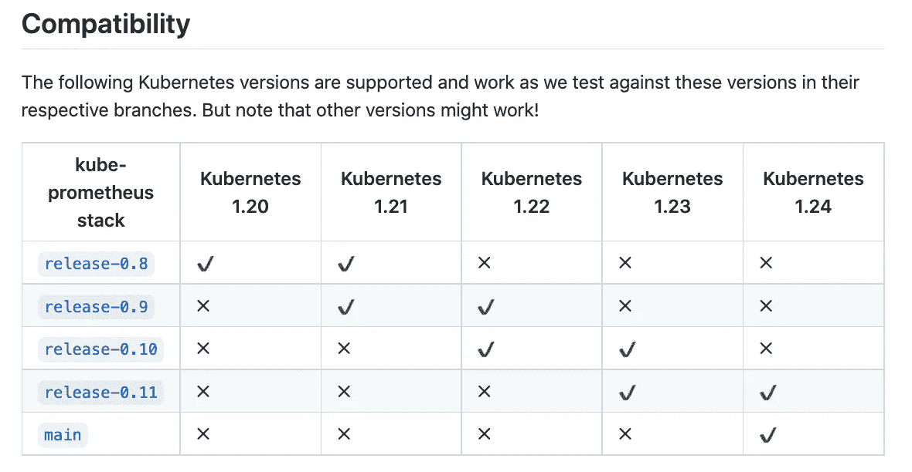
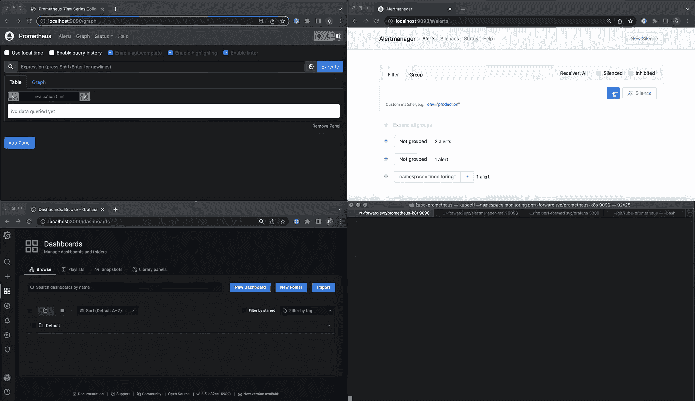
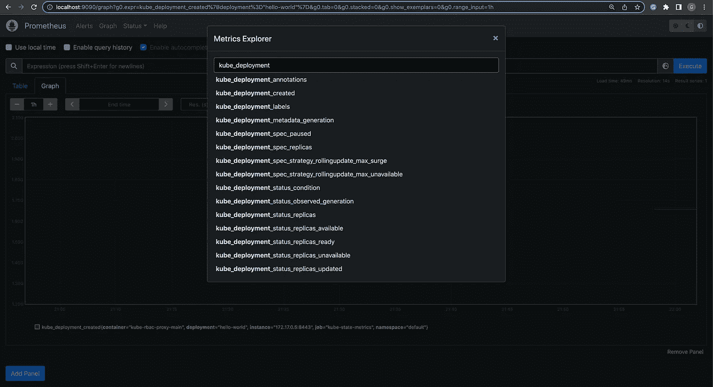
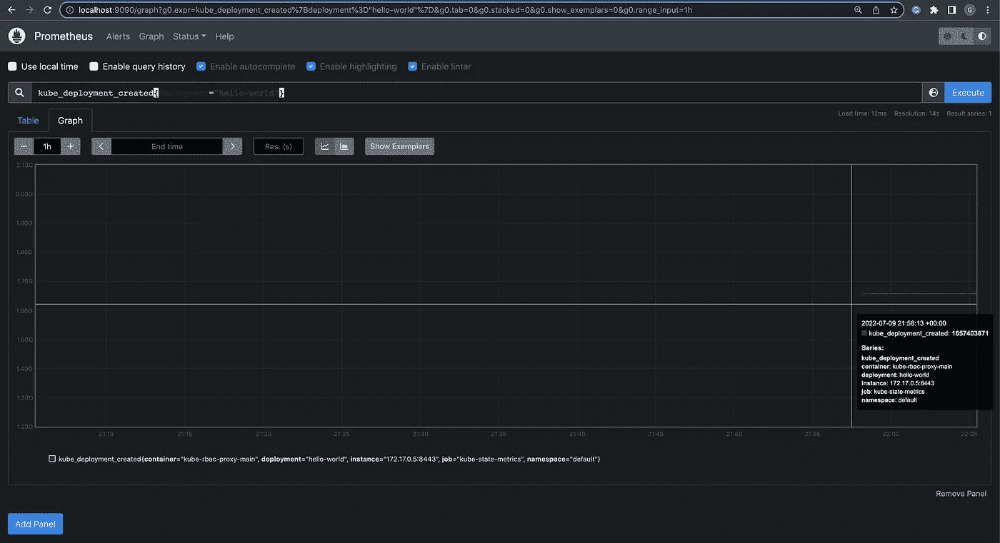
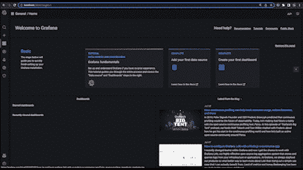

# 安装和探索 Kube-Prometheus 项目

> 原文：<https://levelup.gitconnected.com/installing-exploring-the-kube-prometheus-project-eef375d49f6b>


https://cncf-branding.netlify.app/projects/prometheus/

正在寻找 Kubernetes 集群监控堆栈吗？kube-prometheus 项目使得安装 prometheus 操作器以及 Grafana 仪表板和 Prometheus 规则变得很容易。

作为一个潜在用户，我记录了我在 Minikube 集群上安装和探索`kube-prometheus`栈的经历:跟随它快速掌握这个栈的高级功能。

本文有四个部分:

1.  运行 Minikube(使用正确的配置)
2.  安装 Kube-Prometheus 项目
3.  探索堆栈(我安装了什么？)
4.  Prometheus & Grafana 仪表板的简单用法

请注意，这些操作的来源都可以在项目的自述文件和入门文档中找到——但是在这里以一步一步的格式结合了额外的可视化、实验和对我在此过程中遇到的一些错误的评论。

## 第 1 部分:运行 Minikube(使用正确的配置)

第一步是确保 Minikube 已经安装并运行在您的机器上。然而，检查`minikube status`还不足以满足这一步。

文档指定将 authentication-token-webhook 设置为 true，将 authorization-mode 设置为 webhook。基本原理是，我们可以使用服务令牌，而不是为 Prometheus 创建客户端证书:

> kubelet 将使用 API 执行一个 RBAC 请求，以确定请求实体(在本例中是 Prometheus)是否被允许访问资源

通过这种配置，堆栈可以定义具有适当权限的 ClusterRole，就像[Prometheus-k8s](https://github.com/prometheus-operator/kube-prometheus/blob/main/manifests/prometheus-clusterRole.yaml)cluster role 如何具有特定的规则，比如获得/metrics URL 的能力。

该项目的 README.md 还包括一个关于 minikube 的章节，其中推荐了一些配置命令。因此，我运行了以下命令来启动和运行:

```
minikube delete && \
minikube start \
    --kubernetes-version=v1.23.0 \
    --memory=6g \
    --bootstrapper=kubeadm \
    --extra-config=kubelet.authentication-token-webhook=true \
    --extra-config=kubelet.authorization-mode=Webhook \
    --extra-config=scheduler.bind-address=0.0.0.0 \
    --extra-config=controller-manager.bind-address=0.0.0.0 &&
minikube addons disable metrics-server
```

注意:我用 Docker 桌面运行 minikube，得到以下错误:

```
❌  Exiting due to MK_USAGE: Docker Desktop has only 1987MB memory but you specified 6144MB
```

结果，我不得不打开 Docker 桌面→首选项→资源→并将内存提升到 7.50GB。

## 第 2 部分:安装 Kube-Prometheus 项目

在安装之前，必须检查 kube-prometheus 版本与您的 Kubernetes 的兼容性。自述文件中的[兼容性](https://github.com/prometheus-operator/kube-prometheus#compatibility)部分对此进行了详细说明。



[https://github . com/Prometheus-operator/kube-Prometheus/blob/main/readme . MD](https://github.com/prometheus-operator/kube-prometheus/blob/main/README.md)

我运行的是 Kubernetes v1.23.0，所以我决定继续使用 0.11 版。为了准备安装，我[将存储库](https://github.com/gsweene2/kube-prometheus)分支到我的组织中，并导航到所需的发布标签。

```
git clone [git@github.com](mailto:git@github.com):gsweene2/kube-prometheus.git
cd kube-prometheus
git checkout v0.11.0
# Ensure I'm on the correct commit
git log --oneline -1
```

该项目提供了几个命令来安装堆栈:第一个命令建立名称空间和 CRD，第二个命令等待它们可用，第三个命令创建项目资源的其余部分。

```
kubectl apply --server-side -f manifests/setupuntil kubectl get servicemonitors --all-namespaces ; do date; sleep 1; echo ""; donekubectl apply -f manifests/
```

注意:首先运行清单/安装程序；如果您看到以下错误，请重新运行 until 命令或重试清单/分步安装:`error: the server doesn’t have a resource type “servicemonitors”`。

## 第 3 部分:探索堆栈(我安装了什么？)

我们现在在 monitoring 名称空间中有三个仪表板:Prometheus、Alertmanager 和 Grafana。让我们打开它们，浏览一下产品:

```
kubectl --namespace monitoring port-forward svc/prometheus-k8s 9090kubectl --namespace monitoring port-forward svc/alertmanager-main 9093kubectl --namespace monitoring port-forward svc/grafana 3000
```

在浏览器中，我们可以打开 localhost:9090、localhost:9093 和 localhost:3000 来查看 Prometheus、Alertmanager 和 Grafana。



Prometheus、Alertmanager 和 Grafana 仪表板

让我们来了解这三者，以及本例的使用情形:

**普罗米修斯是什么？**

从[马嘴](https://prometheus.io/docs/introduction/overview/)中，我们看到它是一个时间序列数据库:

> Prometheus 是一款开源系统监控和警报工具包…
> 
> Prometheus 将其指标作为时间序列数据进行收集和存储，即指标信息与记录时的时间戳一起存储，还有可选的键值对，称为标签。

普罗米修斯将收集并储存我们的数据。

**Grafana 呢？**

Grafana 有多个项目，但专注于他们的[仪表板产品](https://grafana.com/grafana/)，它声明开源版本可用于:

> 集中所有数据的分析、可视化和警报

Grafana 将用于可视化我们与普罗米修斯收集的数据。

【AlertManager 怎么样？

[项目的 GitHub](https://github.com/prometheus/alertmanager) 声明 Alertmanager:

> 处理客户端应用程序(如 Prometheus 服务器)发送的警报。它负责重复数据删除、分组，并将其路由到正确的接收器集成

我们通过 Prometheus 定义的任何警报都可以通过 Alertmanger 推送给我们。

让我们继续在集群上创建一些 Kubernetes 资源来测试 Prometheus 和 Grafana 仪表板。

## 第 4 部分:Prometheus & Grafana 仪表板的简单使用

首先，直接从 Kubernetes 文档中创建示例部署和状态集:

```
# Create a Deployment with 5 replicaskubectl apply -f [https://raw.githubusercontent.com/kubernetes/website/main/content/en/examples/service/load-balancer-example.yaml](https://raw.githubusercontent.com/kubernetes/website/main/content/en/examples/service/load-balancer-example.yaml)# Create a StatefulSetkubectl apply -f [https://raw.githubusercontent.com/kubernetes/website/main/content/en/examples/application/web/web.yaml](https://raw.githubusercontent.com/kubernetes/website/main/content/en/examples/application/web/web.yaml)
```

对于 Prometheus，让我们检查一下 Metrics Explorer，看看我们有什么可用的。在我的版本中，指标浏览器位于执行按钮的左侧:



因为我刚刚创建了一个部署，所以让我们试用一下`kube_deployment_created`，然后将`deployment`过滤为`hello-world`。

```
kube_deployment_created{deployment="hello-world"}
```

正如预期的那样，我们正在获取在本步骤开始时创建的最近 hello-world 部署的数据:



对于 Grafana，让我们导入一个通用的 Kubernetes 仪表板。Grafana 在他们的网站上有许多可以轻松导入的仪表盘[。例如，](https://grafana.com/grafana/dashboards/)[Kubernetes Cluster(Prometheus)](https://grafana.com/grafana/dashboards/6417)看起来像一个有用的仪表板，它被频繁使用，下载量超过 25 万次。

复制仪表板号→点击左侧窗格中的导入→粘贴仪表板号→选择 Prometheus 作为数据源→导入。TaDa！



看看这个导入仪表板的很酷的 gif。

就是这样！总的来说，这是一个简单的安装过程，清单可以直接在您的项目中使用。我将探索的未来事物包括如何[公开仪表板](https://prometheus-operator.dev/docs/exposing-prometheus-alertmanager-grafana-ingress/)使它们在互联网上可用，以及使用 ArgoCD 的[持续部署](https://github.com/prometheus-operator/kube-prometheus/tree/main/examples/continuous-delivery/argocd)。

[](https://garrettdsweeney.medium.com/subscribe) [## 每当加勒特发表文章时就收到一封电子邮件。

### 每当加勒特发表文章时就收到一封电子邮件。注册后，如果您还没有中型帐户，您将创建一个…

garrettdsweeney.medium.com](https://garrettdsweeney.medium.com/subscribe) [](https://garrettdsweeney.medium.com/membership) [## 通过我的推荐链接加入媒体-加勒特·斯威尼

### 阅读加勒特(以及 Medium 上成千上万的其他作家)的每一个故事。你的会员费直接支持加勒特…

garrettdsweeney.medium.com](https://garrettdsweeney.medium.com/membership) 

# 分级编码

感谢您成为我们社区的一员！更多内容见[级编码出版物](https://levelup.gitconnected.com/)。
跟随:[推特](https://twitter.com/gitconnected)，[领英](https://www.linkedin.com/company/gitconnected)，[通迅](https://newsletter.levelup.dev/)
**升一级正在改造理工大招聘➡️** [**加入我们的人才集体**](https://jobs.levelup.dev/talent/welcome?referral=true)