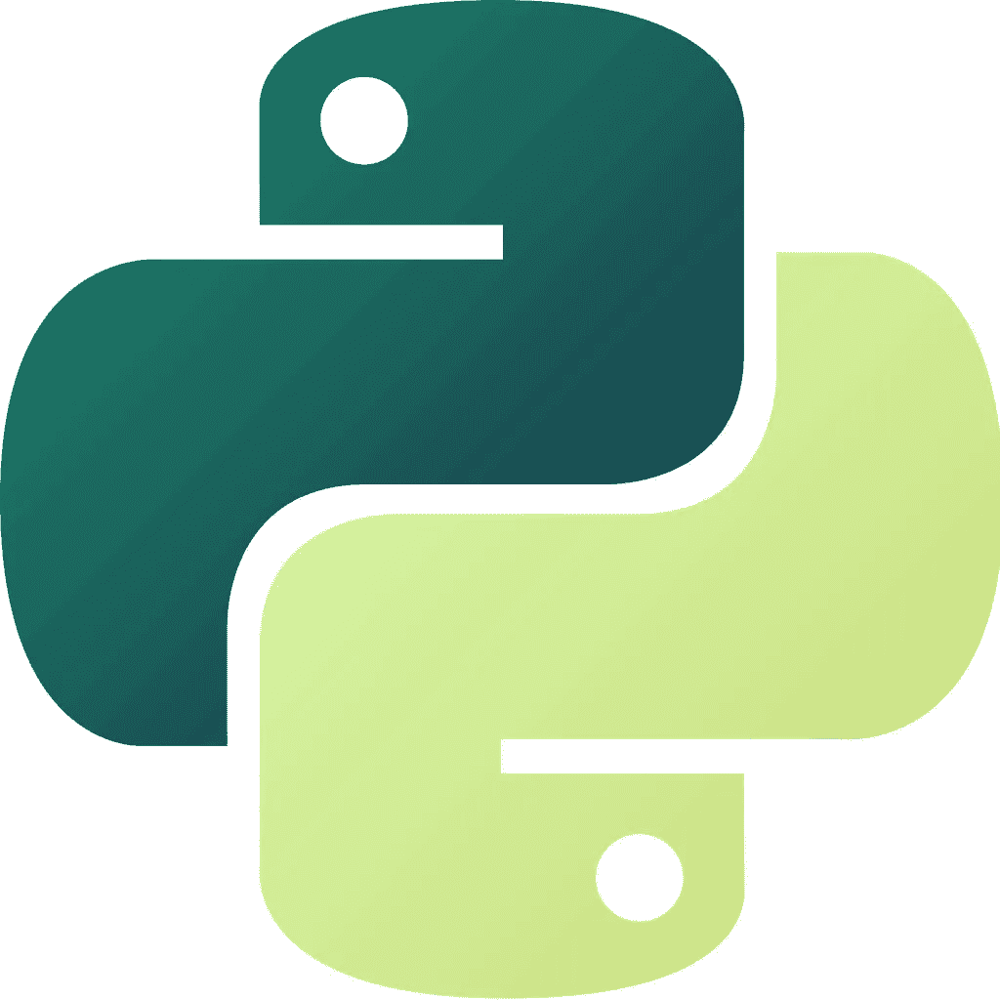
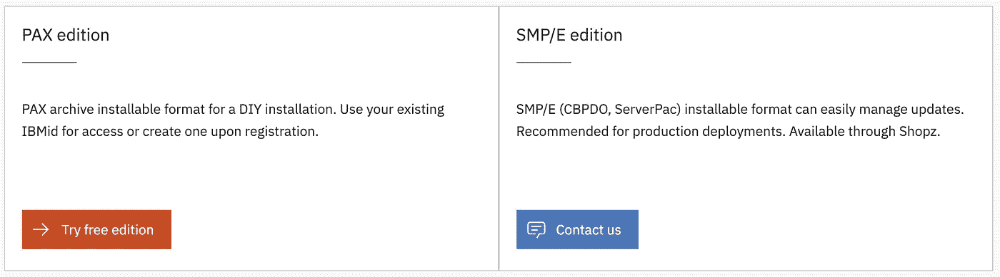
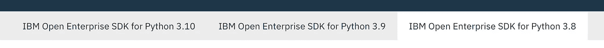
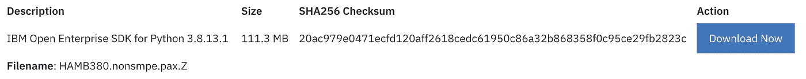
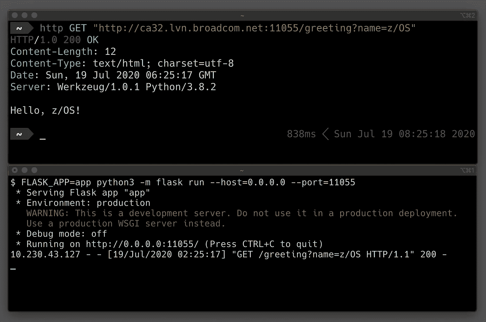

# 安装 IBM Open Enterprise Python 3.8 for z/OS

> 原文：<https://levelup.gitconnected.com/installing-ibm-open-enterprise-python-3-8-for-z-os-dbe4e701be47>

Python 已经流行了很长时间，在最近几年，它的流行程度达到了顶级水平。它通常用于 web 应用程序开发、自动化、数据分析和机器学习。过去几年，它可以在大型机和 z/OS 上很好地运行，将来我们会在 z/OS 上看到更多的 Python。

这个故事提供了如何将 IBM Python 安装到 z/OS 以及如何使用它的说明。

这个故事涵盖了 3.8 版本。如果您正在寻找更新的版本，请参见:

[](https://plape.medium.com/installing-ibm-open-enterprise-python-3-10-for-z-os-40bf77ebc20d) [## 为 z/OS 安装 IBM Open Enterprise Python 3.10

### Python 已经流行了很长时间，在最近几年，它的流行程度达到了顶级水平。你能使用…

plape.medium.com](https://plape.medium.com/installing-ibm-open-enterprise-python-3-10-for-z-os-40bf77ebc20d) 

仍然支持 3.8 版。这些说明已更新，以匹配 2022 年 8 月的最新更新。



# 安装 IBM Python 3.8

IBM Python for z/OS 的主页是:【https://www.ibm.com/products/open-enterprise-python-zos 

它有两个版本:



PAX 版具有 SMP/E 版的一些功能。唯一的区别是您可以选择 IBM 对 SMP/E 版本的支持。

任何人都可以安装 PAX 帕克思版本。它是免费的。

Python 应用程序不符合 IBM z 集成信息处理器(zIIP)标准。此外，部署在 z/OS 上的总体成本也可以降低，因为工作负载可能有资格针对新的生产工作负载使用新的应用程序解决方案定价模型。

我们将安装 PAX 帕克思版本。要开始，请按主页上的以下按钮:


选择 Python 3.8 的旧版本:



下载唯一可用的文件 **HAMB380.nonsmpe.pax.Z** :



# 为 Python 创建 zFS 文件系统

您将需要大约 2GB 的空间。建议为它分配一个新的 zFS 文件系统。您可以使用以下作业模板，用您的作业卡替换`${jobcard}`和`${prefix}`变量，用 zFS 文件系统替换数据集的前缀。

**在 z/OS 上创建 zFS 文件系统的 JCL:**

```
${jobcard}
//DEFINE EXEC PGM=IDCAMS
//SYSPRINT DD SYSOUT=*
//SYSIN DD *
  DEFINE CLUSTER (NAME(${prefix}.ZFS) -
    LINEAR -
    TRACKS(40000 40000) -
    SHAREOPTIONS(3))
//CREATE EXEC PGM=IOEFSUTL,REGION=0M,COND=(0,LT),
//  PARM=('format -aggregate ${prefix}.ZFS')
//SYSPRINT DD SYSOUT=*
```

您可以使用 Zowe CLI 轻松提交这个 JCL。在您喜欢的文本编辑器中编辑文件并替换变量。然后你就可以提交了:

```
*# On your computer:*
zowe zos-jobs submit local-file create_zfs.jcl
```

试试 Zowe CLI 吧！它允许您在工作站上与 z/OS 作业、数据集、z/OS UNIX 文件等进行交互。

[](https://medium.com/zowe/getting-started-with-zowe-cli-7a29420c6be7) [## Zowe CLI 入门

### Zowe CLI 用于 z/OS，就像 AWS CLI 用于 AWS 一样。这是一个客户端 CLI，允许访问所有基础架构…

medium.com](https://medium.com/zowe/getting-started-with-zowe-cli-7a29420c6be7) 

作业完成后，您需要挂载文件系统。通过 ssh 或 Putty 登录到您的 z/OS 系统。发出以下命令(需要替换`${python_dir}`和`${prefix}`变量):

```
*# In z/OS UNIX System Services:*
export PYTHON_DIR=***${python_dir}***
mkdir $PYTHON_DIR
/usr/sbin/mount -o aggrgrow -f ***${prefix}***.ZFS $PYTHON_DIR
cd $PYTHON_DIR
mkdir download# At least 600 MB in /tmp is required. Use the new zFS for it if you are not sure:
mkdir tmp
export TMPDIR=$PYTHON_DIR/tmp
```

现在，您需要回到工作站终端，将包复制到 zFS:

```
*# On your computer:* zowe zos-files upload file-to-uss --binary HAMB380.nonsmpe.pax.Z ***${python_dir}***/download/HAMB380.nonsmpe.pax.Z
```

让我们回到 z/OS UNIX shell 并将其打包:

```
*# On z/OS in $PYTHON_DIR directory*
pax -p p -r -f download/HAMB380.nonsmpe.pax.Z
```

Python 被解包到`$PYTHON_DIR/usr/lpp/IBM/cyp/v3r8/pyz`目录。

让我们创建(例如使用`vi`编辑器)一个 shell 脚本，它将初始化所有需要的环境变量(您需要用您的目录替换`*${python_dir}*`):

```
# Environment variables for PAX archive installation# Configure the PATH and LIBPATH environment variables to include the bin/ directories for IBM Open Enterprise Python for z/OS:
export PYTHON_DIR=***${python_dir}***
export PYTHONHOME=$PYTHON_DIR/usr/lpp/IBM/cyp/v3r8/pyz
export PATH=$PYTHONHOME/bin:$PATH
export LIBPATH=$PYTHONHOME/lib:$LIBPATH
# Set the auto conversion:
export _BPXK_AUTOCVT='ON'
export _CEE_RUNOPTS='FILETAG(AUTOCVT,AUTOTAG) POSIX(ON)'
# Set the file tagging:
export _TAG_REDIR_ERR=txt
export _TAG_REDIR_IN=txt
export _TAG_REDIR_OUT=txt
# Set the temporary directory (optional):
export TMPDIR=$PYTHON_DIR/tmp
```

您可以使用以下方式激活这些变量:

```
. ${python_dir}/pyenv.sh
```

您可以将这一行添加到您的`~/.profile`文件中，以便在登录后激活它。

您可以通过以下方式验证它是否正常工作:

```
python3 --version
```

你应该得到`Python 3.8.13`。您的 Python 已经可以使用了！

# 安装 Python 包

Python 的这个发行版没有附带任何额外的第三方包。您需要使用`pip3`命令来安装它们。例如，使用以下命令安装 Flask:

```
pip3 install flask
```

如果一切正常，您将得到类似的输出:

```
Collecting flask
  Downloading Flask-1.1.2-py2.py3-none-any.whl (94 kB)
     |████████████████████████████████| 94 kB 1.3 MB/s
Collecting Werkzeug>=0.15
  Downloading Werkzeug-1.0.1-py2.py3-none-any.whl (298 kB)
     |████████████████████████████████| 298 kB 3.5 MB/s
Collecting Jinja2>=2.10.1
  Downloading Jinja2-2.11.2-py2.py3-none-any.whl (125 kB)
     |████████████████████████████████| 125 kB 6.5 MB/s
Collecting click>=5.1
  Downloading click-7.1.2-py2.py3-none-any.whl (82 kB)
     |████████████████████████████████| 82 kB 916 kB/s
Collecting itsdangerous>=0.24
  Downloading itsdangerous-1.1.0-py2.py3-none-any.whl (16 kB)
Collecting MarkupSafe>=0.23
  Downloading MarkupSafe-1.1.1.tar.gz (19 kB)
Using legacy setup.py install for MarkupSafe, since package 'wheel' is not installed.
Installing collected packages: Werkzeug, MarkupSafe, Jinja2, click, itsdangerous, flask
    Running setup.py install for MarkupSafe ... done
Successfully installed Jinja2-2.11.2 MarkupSafe-1.1.1 Werkzeug-1.0.1 click-7.1.2 flask-1.1.2 itsdangerous-1.1.0
```

# 简单 HTTP 服务器

我们将使用 Flask 框架创建一个非常简单的 HTTP 服务器。

只有一个文件`app.py`:

```
from flask import Flask, request
app = Flask(__name__)@app.route('/greeting')
def hello():
    name = request.args.get('name')
    return f"Hello, {name}!"
```

如果您已经将文件存储在 EBCDIC 中，那么您需要标记它，以便 Python 可以正确地打开它:

```
chtag -tc IBM-1047 app.py
```

关于 z/OS 上 Python 代码页和翻译的更多细节，请参见[代码集和翻译](https://www.ibm.com/support/knowledgecenter/SSCH7P_3.8.0/codesets_and_translation.html)。

可以使用一个命令启动 web 服务器:

```
FLASK_APP=app python3 -m flask run --host=0.0.0.0 --port=11055
```

它是这样工作的:



上图:通过 HTTPie 客户端请求，下图:z/OS 上的 Flask

# 摘要

Python 终于有了 IBM 支持的 z/OS 版本。它有 PAX 和 SMP/E 两种版本。

您已经看到了如何安装它、设置环境以及创建一个非常简单的 HTTP 服务器。

您可以从 IBM Python 的[文档](https://www.ibm.com/support/knowledgecenter/SSCH7P_3.8.0/welcome.html)中了解更多关于 IBM Python 的信息。

如果您对如何使用 Python 进行大型机工作感兴趣，请参阅以下故事:

[](https://medium.com/@kalebporter/writing-python-3-extensions-in-c-c-with-z-os-support-d057af3b90ba) [## 用 C/C++编写 Python 3 扩展(支持 z/OS)

### 样板代码和 z/OS 技巧，用于构建和测试您自己的 C/C++ Python 扩展。

medium.com](https://medium.com/@kalebporter/writing-python-3-extensions-in-c-c-with-z-os-support-d057af3b90ba) [](https://medium.com/@kalebporter/z-os-job-management-with-python-6f740144636) [## 使用 Python 进行 z/OS 作业管理

### 使用 Z Open Automation Utilities 中的最新作业功能创建一个 Flask 应用程序，用于 z/OS 作业管理。

medium.com](https://medium.com/@kalebporter/z-os-job-management-with-python-6f740144636) [](https://medium.com/@kalebporter/flask-on-z-os-with-dataset-example-3f3ed26c455b) [## z/OS 上的 Flask(带有数据集示例)

### z/OS 上的一个简单 Flask 示例，使用 Z Open Automation Utilities 从我们的浏览器中查看数据集。

medium.com](https://medium.com/@kalebporter/flask-on-z-os-with-dataset-example-3f3ed26c455b)