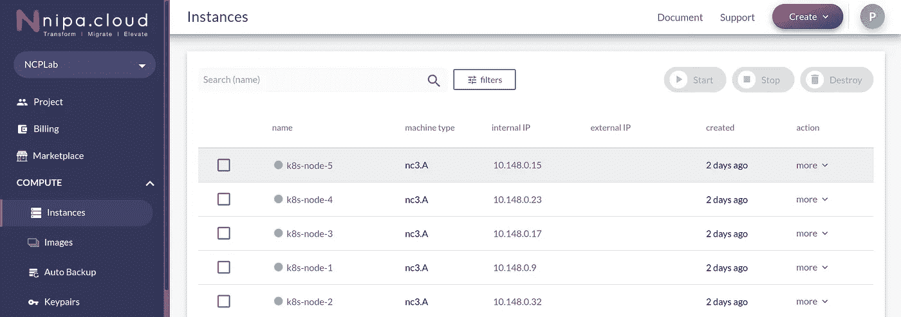

# 在帕尼云上使用 Kubespray 安装 Kubernetes

> 原文：<https://levelup.gitconnected.com/installing-kubernetes-with-kubespray-on-nipa-cloud-a4fbeefb47ff>

> 在这里，我们将部署一个生产就绪的 Kubernetes HA-Cluster，其中有 5 个虚拟机，3 个主节点和 2 个工作节点。

# 准备基础设施

## 在[帕尼云](https://portal.nipa.cloud)上启动实例

> 帕尼云平台(NCP)是泰国领先的云提供商之一。[https://portal . nipa . cloud](https://portal.nipa.cloud/launchinstance)

我们从创建虚拟机开始。如果您已经准备好机器，可以跳过这一步。对于本地应用程序，我选择使用帕尼云，它提供无限的国内带宽和合理的项目启动价格。



用 nc3 启动了 5 个实例。NCP 上的机器类型

在这个集群中，我们使用 6 个 nc3 实例。NCP 上的一种机器类型，其中每一种都具有下列特性:

*   1 个 CPU，2 GB 内存
*   Ubuntu 18.04(目前 20.04 不工作)
*   允许所有云防火墙规则


NCP 中的防火墙规则示例

```
# Check if IP forwarding is enabled
$ sudo sysctl net.ipv4.ip_forward
$ sudo sysctl -w net.ipv4.ip_forward=1
# net.ipv4.ip_forward = 1$ sudo ufw status
# Status: inactive
$ sudo ufw disable
```

# 设置 Kubespray

Kubespray 提供了一种使用 Ansible playbooks 和 Kubeadm 安装 Kubernetes 集群引导的简单方法。它具有易用性和灵活性，可以定制您的部署和 Kubernetes 附加组件。

## 易变主机

在本例中，我使用其中一个虚拟机(即 k8s-node-1)作为一个可运行的主机来运行部署脚本。为了做到这一点，我们需要为 Ansible 提供 SSH 密钥来访问所有远程主机。

生成 **SSH 密钥**并将公钥传送给所有远程主机。

```
ssh-keygen -t rsa -b 2048
eval "$(ssh-agent -s)"
ssh-add ~/.ssh/id_rsa# transfer the public key to all nodes.
ssh-copy-id user@<ip-address-1>
ssh-copy-id user@<ip-address-n>
# the public key will be added to ~/.ssh/authorized_keys# add SSH key fingerprints to know_hosts
ssh-keyscan -H <ip-address-1> >> ~/.ssh/known_hosts
ssh-keyscan -H <ip-address-n> >> ~/.ssh/known_hosts
```

## Kubespray 配置

设置了主机和工作节点。下一步是为集群引导配置 Kubespray，我们将使用 Kubespray 版本 2 . 13 . 1(2020 年 5 月发布)。

我们首先将 kubespray 存储库克隆到 Ansible 主机中，并安装 python 依赖项(例如 ansible v2.9.6)。然后，我们使用来自`inventory/sample`的清单作为我们的配置模板。

```
git clone --branch v2.13.1 [https://github.com/kubernetes-sigs/kubespray](https://github.com/kubernetes-sigs/kubespray) && cd kubespray# install dependencies
sudo apt install -y python3-dev python3-pip python3-setuptools
sudo pip3 install -r requirements.txt# copy `inventory/sample` as `inventory/mycluster`
cp -r inventory/sample inventory/mycluster
```

从`inventory`模板看可行的行动手册结构。

```
inventory
  + mycluster
    + group_vars:
      + all
        - all.yml
    + k8s-cluster
      - addons.yml
      - k8s-cluster.yml
    - host.yml
requirements.txt
cluster.yml
```

现在，我们可以自定义 **group_vars** 目录下的库存变量。

例如:

1.  inventory/my cluster/group _ vars/**all/all . yml**

```
# The read-only port for the Kubelet to serve on with 
# no authentication/authorization. 
# It should be enabled in order to metrics-server work.
kube_read_only_port: 10255
```

2.inventory/my cluster/group _ vars/**k8s-cluster/k8s-cluster . yml**

3.inventory/my cluster/group _ vars/**k8s-cluster/addons . yml**

您可以配置符合您需求的**插件**或者保留默认值。对于我来说，我选择启用这些特性，因为我发现它们非常有用。

```
# Kubernetes dashboard
dashboard_enabled: true# Helm deployment
helm_enabled: true# Metrics Server deployment
metrics_server_enabled: true# Nginx ingress controller deployment
ingress_nginx_enabled: true*# Cert manager deployment* cert_manager_enabled: true
cert_manager_namespace: "cert-manager"
```

## 库存生成器

[Inventory builder](https://github.com/kubernetes-sigs/kubespray/blob/v2.13.0/contrib/inventory_builder/inventory.py) 给出了一个自动化脚本来更新 Ansible inventory 文件(现在只输出 YAML 文件)。

```
# see example usage
python3 contrib/inventory_builder/inventory.py help
```

配置环境变量

```
# just to make it looks nicer
# host prefix for generated hosts. Default: node
export HOST_PREFIX=k8s-node-# custom number of 3 master nodes. Default: 2
export KUBE_MASTERS_MASTERS=3
```

使用清单生成器添加具有不同 IP 地址的主机

```
declare -a IPS=(10.148.0.9 10.148.0.32 10.148.0.17 10.148.0.23 10.148.0.15)CONFIG_FILE=inventory/mycluster/hosts.yml python3 contrib/inventory_builder/inventory.py ${IPS[@]}cat inventory/mycluster/hosts.yml
```

来自`hosts.yml`的输出

从上面的主机配置文件中，我们可以查看这些属性[ `kube-master`、`kube-nodes`和`etcd`，以确保集群规范。

## Kubespray 与 Ansible Playbook

现在，我们正在构建 Kubernetes 集群。Kubespray 以 root 用户身份运行剧本，因此需要选项`--become`。

```
**ansible-playbook** -i inventory/mycluster/**hosts.yml** --become --become-user=root cluster.yml
```

***可选*** : `--user REMOTE_USER`作为您的用户连接，`--timeout TIMEOUT`作为我曾经在“链接 calico-node 的 etcd 证书”任务中遇到的`timeout(12s) waiting for privilege escalation prompt`进行故障排除，或者`--flush-cache`清除清单中每个主机的缓存。


成功安装 Kubernetes 集群。

最后，我们可以使用`kubectl`来管理 Kubernetes 集群。


是的，我们做到了！！。它将显示节点及其属性的列表。

# 测试集群

## 你好，库伯内特！

部署 hello-kubernetes 应用程序，它包含入口、服务和部署对象的定义，[https://github.com/paulbouwer/hello-kubernetes](https://github.com/paulbouwer/hello-kubernetes)

现在，我们将主机名映射到/etc/hosts 文件中的 IP 地址:`<your-ip-address>> hello-kubernetes.mycluster.com`来访问网站。传入的请求将通过入口和服务转发到 pods。

至于 Kubernetes IDE，我们使用 [**K8s-Lens**](https://k8slens.dev/) 来监控、操作和调试 Kubernetes 集群。

