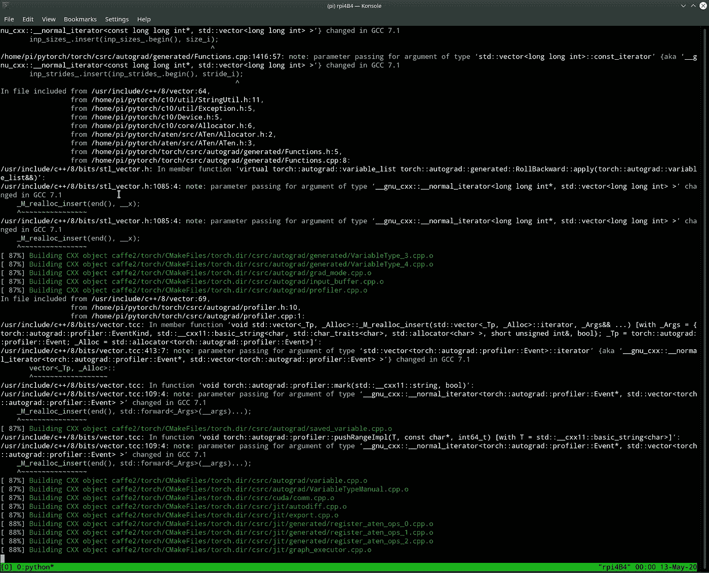

# 在覆盆子 Pi 4 上安装 Mozilla TTS

> 原文：<https://levelup.gitconnected.com/installing-mozilla-tts-on-a-raspberry-pi-4-e6af16459ab9>

## 如何在最少痛苦的情况下完成此操作的分步说明！


覆盆子 Pi 4 准备好安装 TTS 了！

本文的标题应该给出一个相当明确的概念，但在我们深入研究说明之前。我将简要概述一些背景，并解释自己尝试的动机。

考虑到高质量语音合成所需的计算机和覆盆子 Pi 相对较低的功率，你可能想知道为什么地球上有人会决定尝试这个。这个想法最近闪过我的脑海，但它是那些“T0”之一，因为它在那里“T1”类的挑战，我发现自己拥有一个闪亮的新的[覆盆子 Pi 4](https://www.raspberrypi.org/products/raspberry-pi-4-model-b/) ，面对一个长周末，我会花很多时间在室内(和最近的全球环境，我不孤独在最后一个方面，我敢肯定！).所以，在一顿丰盛的早餐后，我出发了，下面的内容浓缩了我在努力让它成功安装和工作的同时找到的解决方案。

[Mozilla TTS](https://github.com/mozilla/TTS) 是一个了不起的项目，自 2018 年初以来一直作为其共同声音计划的一部分进行，旨在开放声音软件和资源。实际上，它意味着任何拥有计算机的人都可以用数据训练合成语音模型，然后让系统输出你想要的任何语音。随着项目的进展，最佳模型的输出在质量上变得越来越像人类。

本文展示的是，即使在一个低级的覆盆子 Pi 上，你也可以使用一个预先训练好的模型生成高质量的语音。诚然，目前的实现运行相当缓慢，但事实上，像这样一个合理的计算密集型任务可以在一台便宜的 55 美元的计算机上完成，这本身就很了不起。

> 目前，语音生成速度比实时慢 6 倍左右，但仍有许多实际用途

虽然这种速度排除了交互式语音场景，但仍有许多场景可以增加价值。有了批量制作的演讲，你可以输出任何你想要的东西:阅读新闻文章，私人笔记，任何你喜欢的东西。

如果你的口语句子落入一个可预测的模式，你可能只需要用一个圆周率就能提前计算出来。随着未来的发展，速度很可能会提高，尤其是 TFLite 的实现工作已经在进行中，尽管用目前的算法在有限的硬件上不可能达到实时性。

> 一个主要好处是，这一切都可以在当地发生

你的数据不会与云中的第三方共享:尽管他们的服务令人印象深刻，但你可能不想分享一切，或者你可能只是不想向他们付费。

显然，对于更大容量的演讲，一台更强大的计算机会更好地满足你的需求，但这是一个有趣的开始。

下面的细节是截至 2020 年年中，随着项目的发展，步骤可能会改变，但通过分享这些，我希望它能帮助其他人克服我面临的一些障碍。如果/当可靠的[车轮](https://www.piwheels.org/)可用于某些所需的包装时，有一些简化的步骤和可能的进一步优化。最慢的步骤是安装 PyTorch 和 librosa(这又需要 llvmlite)。总时间是四个小时多一点(*，但是你可以在相当长的一段时间里不去管它*)。

# 说明

## 先决条件

1.  一个 RPi4(理想 4Gb 未经其他型号测试)
2.  拉斯边巴斯特精简版(版本:2020 年 2 月)

## 安装前准备

*   做所有常识性的事情:保护你的设备(passwd)，设置网络访问，通过 raspi-config 的任何调整等等。
*   更新所有标准包

```
sudo apt update
sudo apt full-upgrade
```

*   *可选地:*安装 [tmux](https://medium.com/@tholex/what-is-tmux-and-why-would-you-want-it-for-frontend-development-e43e8f370ef2) (或者使用 screen 或者你喜欢的任何东西)——如果连接到 headless 并且你想在它编译的时候分离会话，这是明智的，但是如果直接访问 Pi，这不是真正必要的

```
sudo apt install tmux
```

*   在完成准备步骤后，重启是值得的

```
sudo reboot
```

*   通过 ssh(和 tmux 等，如果你愿意)连接

## 一起运行所有 apt 安装步骤

*   如果您在这里一步完成所有这些操作，会更容易

```
sudo apt install git python3-venv libopenblas-dev libblas-dev m4 cmake cython python3-dev python3-yaml python3-setuptools libatomic-ops-dev llvm espeak libsndfile1 libzstd1 liblcms2–2 libjbig0 libopenjp2–7 libwebpdemux2 libtiff5 libwebpmux3 libwebp6 libatlas3-base
```

*   在下面的相关章节中，我保留了单独的等价步骤，但是用前面的散列符号注释掉了(这样你就知道不会再运行它们)。将它们留在那里可以让您看到它们整体上是如何组合在一起的，如果您将来需要修改指令，例如某些东西发生变化或损坏，这可能会很有帮助！

## 从 Github 签出 TTS

*   如上所述，下面是注释掉的步骤之一:

```
# sudo apt install git
```

*   这些指令建议使用一个特定的提交( **2e2221f** )，以便它们在后续的回购更新中继续工作
*   如果你不介意事情被破坏的风险，那么尽一切办法尝试其他的提交(*如果在你遵循这些指令的时候有一个更晚的提交存在；截至发稿*[*2e 2221 f*](https://github.com/mozilla/TTS/tree/2e2221f146f1ca301a3b2b547d8f26b9009676de)*为最新*
*   并非绝对必要，但我们可以通过只检查一个分支来节省 SD 卡上的空间:

```
git clone — single-branch — branch master [https://github.com/mozilla/TTS.git](https://github.com/mozilla/TTS.git)cd TTSgit checkout 2e2221f
```

## 创建虚拟环境

*   有几种方法可以做到这一点，我将使用内置的

```
# sudo apt install python3-venvpython3 -m venv venv
source venv/bin/activate
```

*   为了确保您使用的是正确的 python 和 pip，请使用下面的命令。从现在开始，我将省去“3 ”,因为在虚拟环境中，您将不再需要它

```
which python
python --version
which pip
pip --version
```

*   我建议将 pip 更新到最新版本

```
pip install -U pip
```

*   为了进一步简化，我建议这一个 pip 安装步骤包括所有需要的底层包，除了那些我们需要手动安装的包
*   为了与 apt 安装步骤保持一致，为了清楚起见，我在下面的相关地方注释掉了这些步骤

```
pip install numpy==1.16.1 matplotlib==3.2.1 bokeh==1.4.0 Flask pyyaml attrdict segments scipy tensorboard tensorboardX Pillow Unidecode>=0.4.20 tqdm soundfile phonemizer
```

**NB:** 上面的命令几乎重复了 setup.py 中的内容(加上一些依赖项)，但是由于我们稍后需要在没有依赖项的情况下运行 setup.py(为了避免 it 试图安装与此处所需版本不同的 numpy 版本的问题),这种方法是一种变通方法。还有其他方法可以解决这个问题。

## 安装 PyTorch

*   如果 PiWheels 成功地为 PyTorch ( [查看此处的最新状态](https://www.piwheels.org/project/pytorch/))制造出一个轮子，这将大大加快安装速度并简化安装
*   PyTorch 有由个人分发的轮子——如果您对使用您在 1.0.0 版中找到的轮子没有问题，那么您可以自由地这样做(这将比这一步中的方法快得多，尽管除了下面的方法之外，我没有测试过)
*   本节的说明是受这篇文章的启发:[https://medium . com/hardware-interfacing/how-to-install-py torch-v4-0-on-raspberry-pi-3 b-o droids-and-other-arm-based-devices-91d 62 f 2933 c 7](https://medium.com/hardware-interfacing/how-to-install-pytorch-v4-0-on-raspberry-pi-3b-odroids-and-other-arm-based-devices-91d62f2933c7)

```
cd .. # gets you out of TTS directorygit clone --recursive [https://github.com/pytorch/pytorch](https://github.com/pytorch/pytorch) -- branch=v1.0.0cd pytorch
```

*   设置各种环境变量

```
export NO_CUDA=1
export NO_DISTRIBUTED=1
export NO_MKLDNN=1 
export NO_NNPACK=1
export NO_QNNPACK=1
```

*   如果你在一个更受限制的 Pi ( *YMMV* )上，你可能需要建议的交换指令，但是在 4Gb Pi 上，你似乎可以跳过这个细节

```
# pip install pyyaml# sudo apt install libopenblas-dev libblas-dev m4 cmake cython python3-dev python3-yaml python3-setuptools # for PyTorch
```

*   似乎需要对此进行设置以允许其完成编译(基于[https://github . com/py torch/py torch/issues/22898 # issue comment-549877452](https://github.com/pytorch/pytorch/issues/22898#issuecomment-549877452))

```
# sudo apt install libatomic-ops-dev
## above is for PyTorch. Note the package is libatomic-ops-dev
## and not libatomics-ops-dev (with an s)sed -i ‘/set(CMAKE_EXPORT_COMPILE_COMMANDS ON)/a set(CMAKE_CXX_FLAGS “${CMAKE_CXX_FLAGS} -latomic”)’ CMakeLists.txt
```

*   下面是两个非常长的步骤，大约需要四个小时

> 在这个阶段，您可能希望看到命令正在工作，然后休息一下！

```
python setup.py build
python setup.py install
cd ..
```



安装 PyTorch 时终端的典型输出

您现在应该已经安装了 PyTorch 1.0.0😃

## 安装 LLVM 和 llvmlite

```
# sudo apt install llvmllvm-config — version
llvm-config — libdir
which llvm-config
LLVM_CONFIG=/usr/bin/llvm-config pip install llvmlite
```

*   使用以下工具进行测试:

```
python -m llvmlite.tests
```

## 安装 numba

*   注意，要实现这一点，我们需要一个特定版本的 numpy(不是 0.15.x，所以用 0.16.1，因为它最接近 TTS requirements.txt)

```
# sudo apt install libatlas3-base
```

*   这在以前是不可能的，因为它需要 llvmlite:

```
pip install numba==0.49.0
```

*   通过进入 python 并运行以下代码来测试它:

```
import numba
```

*   应该会成功(不显示错误，只显示下一个提示)


安装 PyTorch、llvmlite 和 numba 的步骤，并快速检查导入 numba 是否有效！

## 安装 librosa

*   这在以前是做不到的，因为它需要 numba 和 llvmlite:

```
pip install librosa==0.6.2
```

## 其他包

```
# sudo apt install espeak libsndfile1# sudo apt install libzstd1 liblcms2–2 libjbig0 libopenjp2–7 libwebpdemux2 libtiff5 libwebpmux3 libwebp6 # these are for Pillow
```

*   下面的 setup.py 会发现这些问题，但是直接安装可以避免 setup.py 试图安装不同版本的 numpy 而导致的问题

```
# pip install matplotlib==3.2.1
# pip install Flask
# pip install attrdict
# pip install segments
# pip install tensorboard
# pip install tensorboardX
# pip install scipy
# pip install Pillow
# pip install Unidecode>=0.4.20
# pip install tqdm
# pip install soundfile
# pip install bokeh==1.4.0
```

## 完成 TTS 本身的最终安装

```
cd TTS
python setup.py develop — no-deps
```

*   这是获得合适的检查点的一种简单方法(你可以通过其他更聪明的方法找到兼容的检查点)

```
mkdir wheels
cd wheels/wget [https://github.com/reuben/TTS/releases/download/ljspeech-fwd-attn-pwgan/TTS-0.0.1+92aea2a-py3-none-any.whl](https://github.com/reuben/TTS/releases/download/ljspeech-fwd-attn-pwgan/TTS-0.0.1+92aea2a-py3-none-any.whl)unzip TTS-0.0.1+92aea2a-py3-none-any.whlcd .. # so you’re back in TTS directory
mkdir -p server/model/tts
cp wheels/TTS/server/model/tts/checkpoint.pth.tar ../server/model/tts/
cp wheels/TTS/server/model/tts/config.json ../server/model/tts/
```

*   您不需要做任何必要的更改，但是可以在这里检查服务器配置文件:

```
nano config.json
```

## 测试一下

*   您可以在 Pi 上运行它，然后通过本地网络上的浏览器访问它:

```
python -m TTS.server.server
```

*   在您的终端中，您会看到一些 numba 弃用警告，然后您应该会看到:

**>加载 TTS 模型…**


服务器启动时的终端输出

*   在出现一些其他配置详细信息后，现在应该可以从可以访问同一网络上的 Pi 的浏览器中使用它了


演示服务器的简单 web 界面。


通过 web 表单或 API 调用请求后，您将在终端中看到的输出

*   除了使用浏览器，您还可以向服务器 API 发送请求，如下所示:

*   幸运的话，你现在应该有一个可用的工作装置，你的可以免费运行(除了象征性的电费)。

# 后续步骤

如果你想进一步探索它，可以看看这里的回购自述文件:【https://github.com/mozilla/TTS】T4，其中有各种选项的丰富信息，以及如何了解更多关于这个项目的信息，包括如何训练语音模型——尽管这肯定需要比树莓 Pi 提供的能力多一个数量级！

最后，为了证明它确实有效，这里有一个在 Pi 上生成的样本😃：