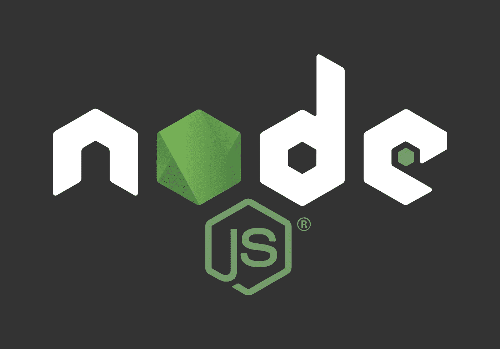
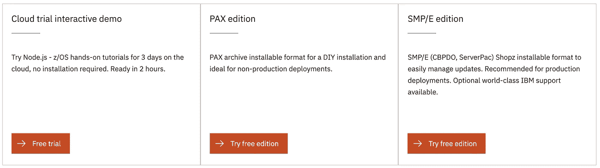
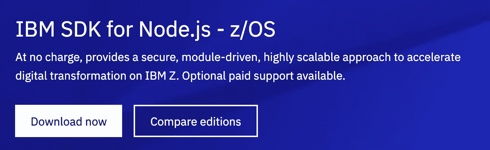
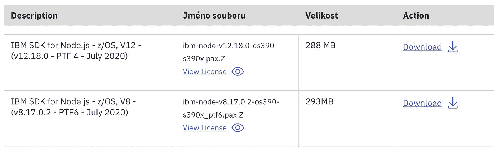

# 在 z/OS 上安装 Node.js 12

> 原文：<https://levelup.gitconnected.com/installing-node-js-12-on-z-os-e5bf419826e6>

Node.js 是基于 [Chrome 的 V8 JavaScript 引擎](https://v8.dev/)构建的 JavaScript 运行时。

在这里，我将展示如何在 z/OS 上安装 Node.js 12.18.0 的最新版本，并且我们将使用 Express framework 创建一个简单的 web 服务器应用程序。

Node.js 被很多企业用来开发 web 应用和 REST API 服务。z/OS 上的 Node.js 可以利用 IBM Z 上的数据和现有应用程序的协同定位，显著提高吞吐量并减少响应时间。



# 下载软件包

z/OS 的 Node.js 主页是 https://www.ibm.com/products/sdk-nodejs-compiler-zos/。

有三种方法可以开始。



我们将使用 PAX 版本，它非常适合在您的系统上尝试 Node.js。

它是免费的。IBM 为 SMP/E 版本提供的可选订阅和支持(S&S)。

Node.js 应用程序不符合 IBM z Integrated Information Processor(zIIP)标准。但是，当作为批准的新应用程序解决方案的一部分进行部署时，您可以使用量身定制的定价新应用程序解决方案来隔离 Node.js 工作负载，而不会影响现有工作负载的 MLC 成本。



按**立即下载**并登录。选择 v12 文件并将其下载到您的计算机上。z/OS 之外的 Node.js 的最新 LTS 版本是 12.18.2，所以 z/OS 上的 Node.js 只差两个次要版本。



# 为 Node.js 创建 zFS 文件系统

建议为 Node.js 分配一个新的 zFS 文件系统。您可以使用以下作业模板，用您的作业卡替换`${jobcard}`和`${prefix}`变量，用 zFS 文件系统替换数据集的前缀。

**在 z/OS 上创建 zFS 文件系统的 JCL:**

```
${jobcard}
//DEFINE EXEC PGM=IDCAMS
//SYSPRINT DD SYSOUT=*
//SYSIN DD *
  DEFINE CLUSTER (NAME(${prefix}.ZFS) -
    LINEAR -
    TRACKS(40000 40000) -
    SHAREOPTIONS(3))
//CREATE EXEC PGM=IOEFSUTL,REGION=0M,COND=(0,LT),
//  PARM=('format -aggregate ${prefix}.ZFS')
//SYSPRINT DD SYSOUT=*
```

在您喜欢的文本编辑器中编辑文件并替换变量。有关参数的更多详细信息，请参见[定义集群](https://www.ibm.com/support/knowledgecenter/SSLTBW_2.4.0/com.ibm.zos.v2r4.idai200/defclu.htm)。

然后您可以提交它并使用 [Zowe CLI](https://github.com/zowe/zowe-cli#zowe-cli--) 检查它的状态:

```
$ zowe zos-jobs submit local-file create_zfs.jcl
jobid:   JOB41333
retcode: null
jobname: PLAPE03Z
status:  ACTIVE$ zowe zos-jobs view job-status-by-jobid JOB41333
jobid: JOB41333
retcode: CC 0000
jobname: PLAPE03Z
status: OUTPUT
```

0000 返回代码意味着 zFS 已分配，我们需要使用 SSH 或 telnet 登录到 z/OS，然后发出以下命令来挂载 zFS 文件系统:

```
export NODE_DIR=***{node_dir}***
mkdir ${NODE_DIR}
/usr/sbin/mount -f ***{prefix}***.ZFS ${NODE_DIR}
cd ${NODE_DIR}
mkdir downloads
```

# 在 z/OS 上安装

我们有一个很大的文件系统，所以我们可以使用 Zowe CLI 上传 Node.js 包:

```
zowe zos-files upload file-to-uss --binary ibm-node-v12.18.0-os390-s390x.pax.Z ***{node_dir}***/downloads/ibm-node-v12.18.0-os390-s390x.pax.Z
```

在 z/OS shell 中:

```
cd ***{node_dir}***
pax -rzf downloads/ibm-node-v12.18.0-os390-s390x.pax.Z -p p
```

让我们创建一个为 Node.js 设置环境的文件。键入`vi nodeenv.sh`并在其中插入(按`i`然后 *Ctrl/Cmd+V* )以下几行:

```
export NODE_DIR=***{node_dir}*** export _BPXK_AUTOCVT=ON
export _CEE_RUNOPTS="FILETAG(AUTOCVT,AUTOTAG) POSIX(ON)"
export PATH=${NODE_DIR}/node-v12.18.0-os390-s390x/bin/:$PATH
```

保存并离开 Vi ( `:wq`)后，您激活环境:

```
. nodeenv.sh
```

让我们测试一下安装:

```
$ node -v; npm version; npx -v
12.18.0
{
  npm: '6.14.4',
  ares: '1.16.0',
  brotli: '1.0.7',
  cldr: '37.0',
  http_parser: '2.9.3',
  icu: '67.1',
  llhttp: '2.0.4',
  modules: '72',
  napi: '6',
  nghttp2: '1.41.0',
  node: '12.18.0',
  openssl: '1.1.1g',
  tz: '2019c',
  unicode: '13.0',
  uv: '1.37.0',
  v8: '7.8.279.23-node.37',
  zlib: '1.2.11'
}
6.14.4
```

您已经将 Node.js 安装到 z/OS。这个安装可以很好地运行 JavaScript 程序，但是我们跳过了在 z/OS 上安装 Node.js 的 C/C++编译器。这是用本机代码构建扩展所需要的。我们将在另一个故事中讲述它。

您可以在[https://www . IBM . com/support/knowledge center/sstr RS _ 12 . 0 . 0/com . IBM . nodejs . zos . v 12 . doc/welcome . html](https://www.ibm.com/support/knowledgecenter/SSTRRS_12.0.0/com.ibm.nodejs.zos.v12.doc/welcome.html)找到 Node.js for z/OS 文档。

# 简单 HTTP 服务器

让我们使用 [Express](https://expressjs.com/) 框架开发一个简单的服务。

登录到 z/OS UNIX 会话，启动一个空项目并在其中安装 Express:

```
mkdir server
cd server
npm init -f
npm install express --save
```

我们需要创建一个 ASCII 编码的源代码文件:

```
touch index.js
chtag -t -c ISO8859-1 index.js
vi index.js
```

有以下内容。您应该将端口更改为可用的端口:

```
const express = require('express')
const app = express()
const port = 10055
app.get('/', (req, res) => res.send('Hello, world!'))
app.listen(port, () => console.log(`Example app listening on port ${port}!`))
```

我们可以启动它，看看它是否绑定到端口:

```
$ node index.js
Example app listening on port 10055!
```

我们可以使用 HTTP 客户端连接到它(例如 [HTTPie](https://httpie.org/) ):

```
http GET "[http://ca32.lvn.broadcom.net:10055/](http://ca32.lvn.broadcom.net:10055/)" HTTP/1.1 200 OK
Connection: keep-alive
Content-Length: 13
Content-Type: text/html; charset=utf-8
Date: Mon, 20 Jul 2020 07:33:45 GMT
ETag: W/"c-Lve95gjOVATpfV8EL5X4nxwjKHE"
X-Powered-By: ExpressHello, world!
```

# 摘要

Node.js 很容易安装在 z/OS 上，Linux 很容易安装在 System z 上。在这两个平台上，它都使用 ASCII，所以当您在 Node.js 中开发应用程序时，您不需要与 EBCDIC 斗争。

在下一个故事中，我们将安装安装和构建 Node.js 的本地扩展所需的 C++编译器。我们将回顾现有的 z/OS 特定的可用扩展。