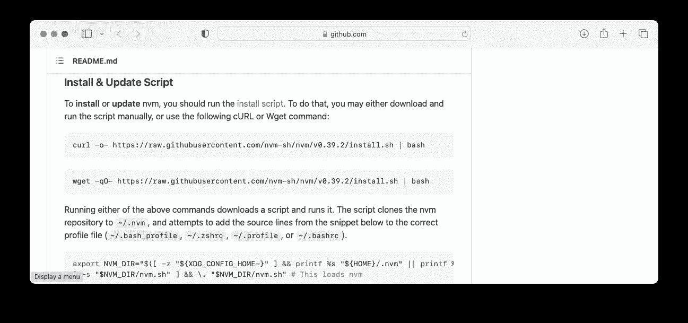
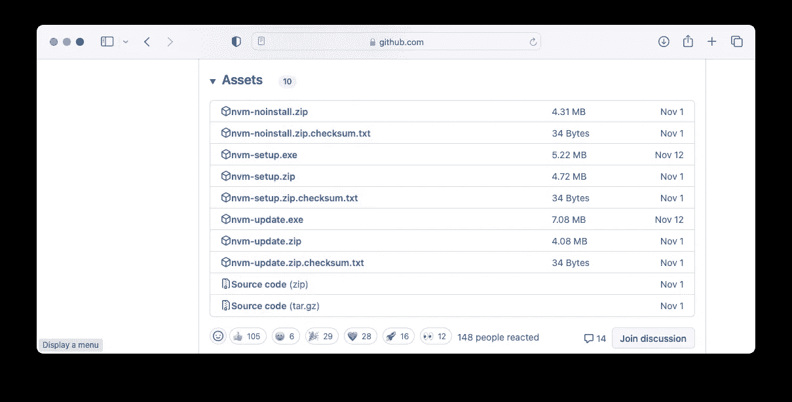

# 使用 nvm 安装 Node.js

> 原文：<https://levelup.gitconnected.com/installing-node-js-using-nvm-b47a44a46605>

## 了解如何使用 nvm 轻松安装不同版本的 Node.js


加布里埃尔·海因策在 [Unsplash](https://unsplash.com?utm_source=medium&utm_medium=referral) 上的照片

您可能听说过 Node.js，这是一个用于开发服务器端和网络应用程序的开源跨平台运行时环境。Node.js 使用 JavaScript，支持 macOS、Windows、Linux 和 IBM AIX 等平台。Node.js 常用于编写 REST APIs 等服务器端应用，React 等 web 应用，以及 React Native 等移动应用。

由于 Node.js 有不同的版本，如果您没有安装应用程序所需的正确 Node.js 版本，使用特定版本 Node.js 的应用程序将无法正常运行。为了方便管理 Node.js 的不同版本，你需要 **nvm** (节点版本管理器)。

# **nvm 是什么？**

**nvm** 是一个管理 Node.js 不同版本的工具，它:

*   帮助您轻松管理和切换不同的 Node.js 版本
*   提供了一个命令行，您可以用一个命令安装不同的版本，设置默认值，在它们之间切换等等

在接下来的几节中，我将向您展示在您的计算机上安装 Node.js 的最简单的方法。

# 步骤 1 —安装 nvm

## 对于 macOS

*   在**终端**中输入以下命令，安装 **nvm** :

```
$ curl -o- https://raw.githubusercontent.com/nvm-sh/nvm/v0.39.2/install.sh | bash
```

你也可以从[https://github.com/creationix/nvm](https://github.com/creationix/nvm)获得上述命令，在那里你可以找到 nvm 的最新版本:



*   安装完成后，在**终端**中输入以下命令:

```
$ nano ~/.zshrc
```

*   将以下几行添加到文件中并保存:

```
export NVM_DIR="$([ -z "${XDG_CONFIG_HOME-}" ] && printf %s "${HOME}/.nvm" || printf %s "${XDG_CONFIG_HOME}/nvm")"

[ -s "$NVM_DIR/nvm.sh" ] && \. "$NVM_DIR/nvm.sh"
```

*   重启**端子**。

## 对于 Windows

*   从[https://github.com/coreybutler/nvm-windows/releases](https://github.com/coreybutler/nvm-windows/releases)下载最新的**nvm-setup.exe**文件。



*   双击**nvm-setup.exe**文件，在 **C:\nvm** 中安装 **nvm** ，在 **C:\Program Files\nodejs** 中安装 **nodejs** 。

> nvm 安装路径不能有空格，这一点很重要。否则你以后使用 nvm 会有问题。

# 步骤 2 —安装 Node.js

一旦安装了 nvm，您现在就可以使用 nvm 安装想要的 Node.js 版本。

## 检查 nvm 的版本

```
nvm --version
```

## 安装 Node.js 的最新版本

```
nvm install node
```

## 安装特定版本的 Node.js

```
nvm install 4.6.2
```

## 使用 Node.js 的最新版本

```
nvm use node
```

## 使用 Node.js 的特定版本

```
nvm use 4.6.2
```

## 检查计算机上安装的 Node.js 的不同版本

```
nvm list
```

## 检查可用于安装的 Node.js 的不同版本

```
nvm list-remote
```

## 卸载特定版本的 Node.js

```
nvm uninstall 4.6.2
```

[](https://weimenglee.medium.com/membership) [## 加入媒介与我的介绍链接-李伟孟

### 阅读李维孟(以及媒体上成千上万的其他作家)的每一个故事。您的会员费直接支持…

weimenglee.medium.com](https://weimenglee.medium.com/membership) 

# 摘要

我希望这篇短文能让您在计算机上管理不同版本的 Node.js 变得更加容易。如果你有其他管理 Node.js 的技巧和诀窍，请给我留言！