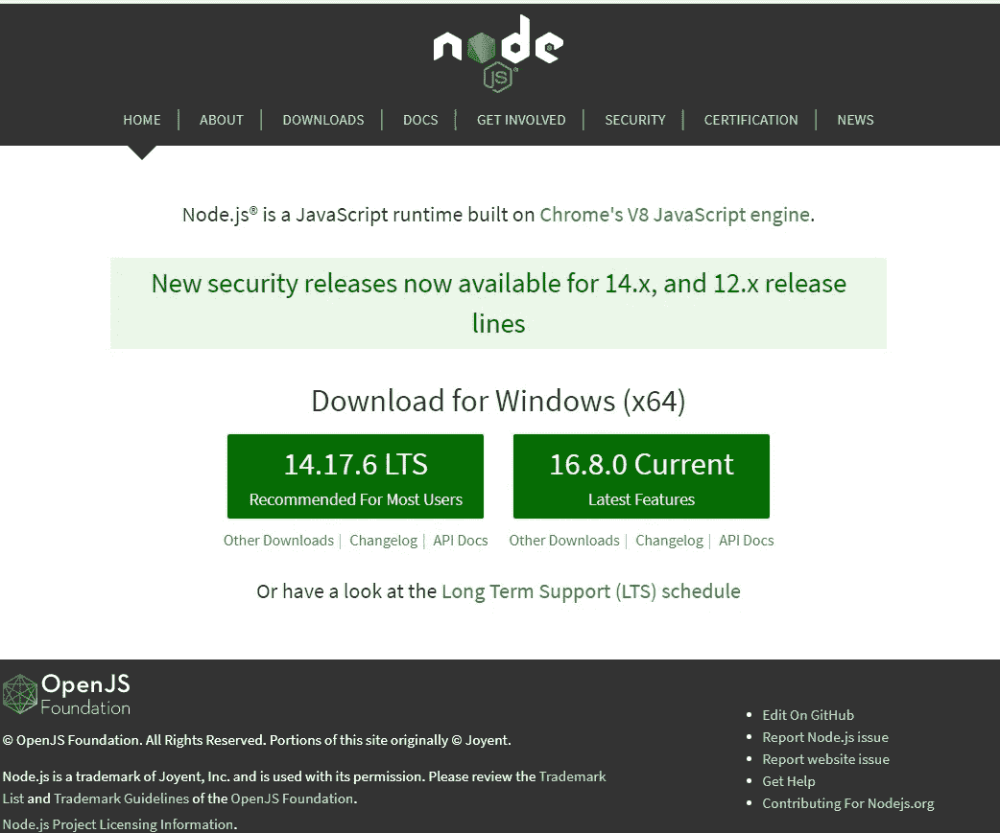
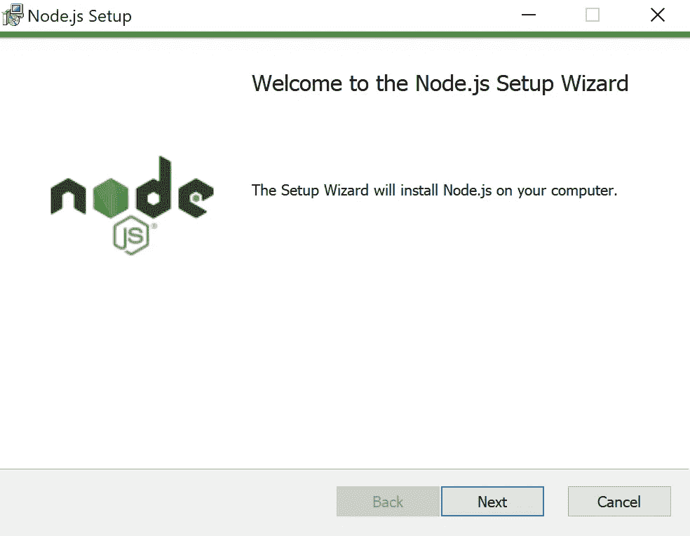
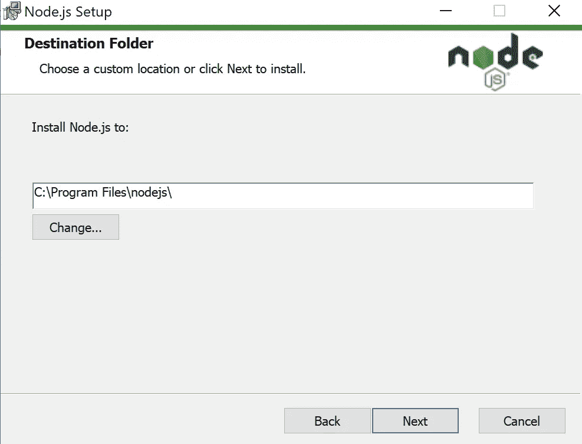
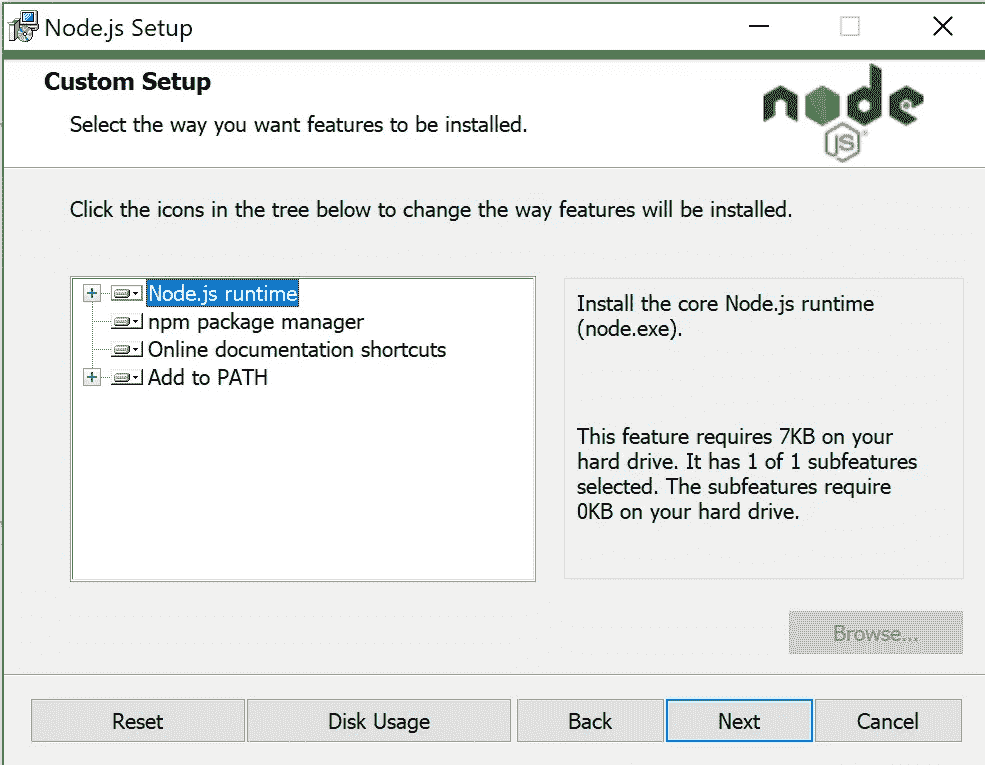
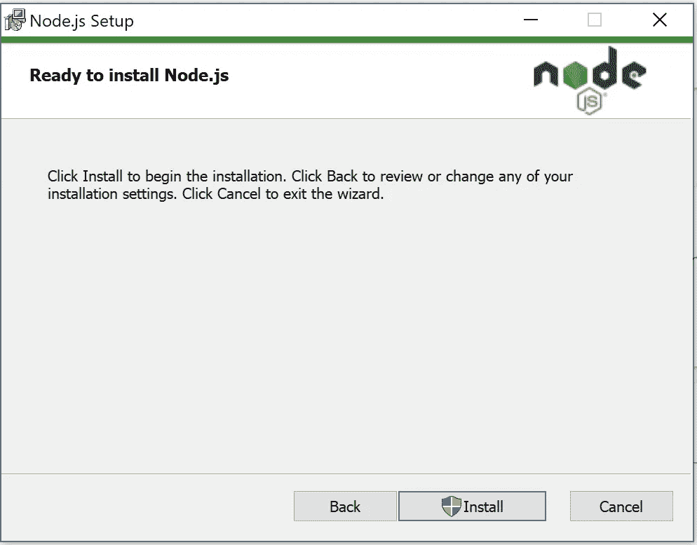
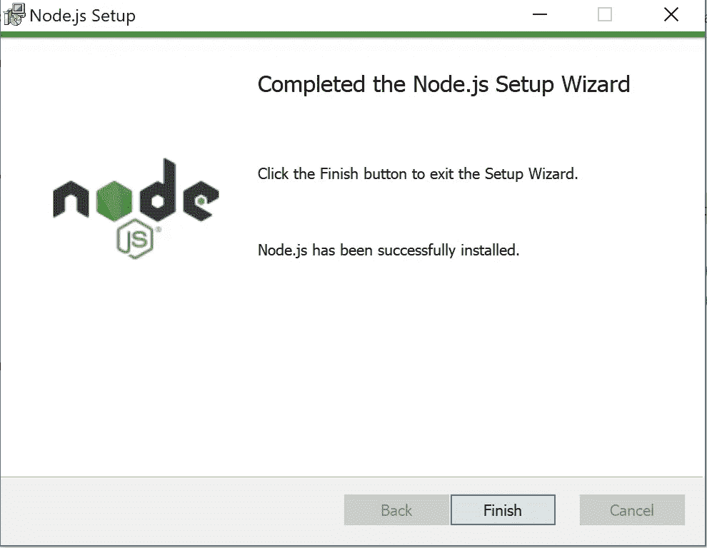
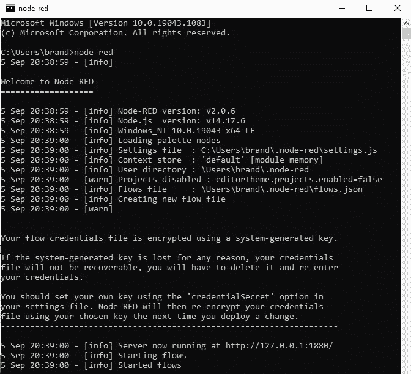
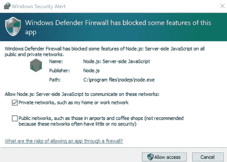
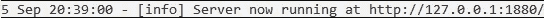

# 在 Windows 计算机上本地安装 Node-RED。

> 原文：<https://levelup.gitconnected.com/installing-node-red-locally-on-a-windows-computer-7570a893633>

在本教程中，我们将学习如何在您的 Windows 10 电脑上安装 Node-RED。但是在我们开始之前，我们必须在我们的电脑上安装 *npm 和 Node.js* 。

我们将首先访问 [Node.js 基金会网站](https://nodejs.org/en/)，下载 Node.js 的最新软件，其中包括 npm 的当前版本。点击 14.17.6 LTS*(或最高 LTS 版本)。

* **注**:你可以选择任何一个版本(即 **LTS** 或**当前**)，但我们将专注于 **LTS** 。



点击 [Node.js 基金会网站](https://nodejs.org/en/)下载 14.17.6 LTS

**将**安装程序保存到你的电脑上，一旦驱动下载完毕，**双击**安装 Node.js。

Node.js 安装向导将向您问候；让我们点击**下一个**！



Node.js 安装向导入门

我们会让同意最终用户许可协议。

下一个提示询问您是否要更改目标文件夹以安装 Node.js。我们不会更改我们的目标文件夹，因此我们将选择**下一个**继续。



单击“下一步”使用默认的目标文件路径

对于自定义设置提示，我们将选择下一个的**，因为我们不想改变功能的安装方式。**



选择下一步，仅选择“Node.js 运行时”

在下面的提示中，您可以单击**下一步**而不做任何检查，因为我们不想安装 Chocolatey、C/C++、Visual Studio 构建工具和 Python。

点击下一步！

在下一个提示中，点击**安装**。



单击 Install 开始安装 Node.js

当 Node.js 安装向导完成安装后，点击**完成**关闭安装向导。



Node.js 安装成功！

让我们使用 Windows 命令提示符检查我们的 npm 和 Node.js 版本。

运行以下命令:

```
node --version && npm --version
```

节点版本:14 . 17 . 6；npm 版本:6.14.15

您的 Node 和 npm 版本应该类似于我的版本，除非您在撰写本文时已经升级到不同的版本。

现在我们已经安装了 *Node.js 和 npm，*我们可以使用以下命令安装 Node-RED:

```
npm install -g --unsafe-perm node-red
```

接下来，让我们使用以下命令启动 Node-RED:

```
node-red
```



微软的 Windows 安全警报可能会向您问候 Windows Defender 防火墙，声明 Node.js 的某些功能可能会被阻止在网络上运行。我选择了“允许访问”专用网络连接。



无论如何，当设置完成后，在命令提示符下查找文本:“服务器现在运行在 http://…”。



**复制 HTTP URL** ，**粘贴**到你的网络浏览器。红色节点编辑器将出现在 web 浏览器中。

你已经完成了！祝贺您将 Node-RED 安装到您的 Windows 计算机上！