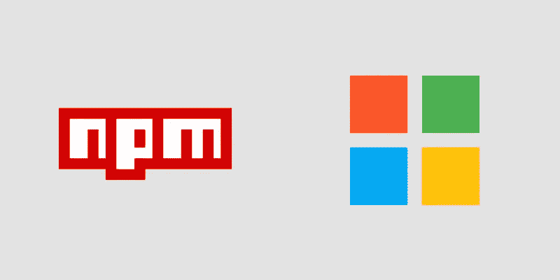

# 如何在 Microsoft AppCenter CI/CD 中安装私有 NPM 软件包

> 原文：<https://levelup.gitconnected.com/installing-private-npm-packages-in-microsoft-appcenter-ci-cd-13d61f02aab2>



## 这篇文章假设你对 NPM、应用中心和 CI/CD 有一个大致的了解。

尝试为您的移动构建管道设置 CI/CD，无论是 Android 还是 iOS，都可能有点令人生畏。因为这个[微软应用中心](https://appcenter.ms)是很多人，尤其是单人开发者登陆的地方。

你可能遇到的一个问题是如何在构建过程中安装你的[私有 NPM 包](https://docs.npmjs.com/creating-and-publishing-private-packages)。如果设置不正确，您将在构建输出中看到类似如下的错误:

```
error An unexpected error occurred: "https://registry.yarnpkg.com/your-pacakge-name-1.1.3.tgz: Request failed "404 Not Found".
```

这是由于 NPM 在运行管道时拒绝 AppCenter 下载您的包而引发的错误。

## 怎么修

1.  在项目的根目录下创建一个`.npmrc`文件
2.  在该文件中添加以下行:`//registry.npmjs.org/:_authToken=${NPM_TOKEN}`
3.  签入文件，提交并推送到 AppCenter 构建的分支。
4.  在 AppCenter 中，通过单击分支，然后在右上角找到扳手，转到分支配置设置。
5.  在环境变量部分添加一个名为`NPM_TOKEN`的新变量
6.  前往 NPMJS.com = >登录= >点击您的个人资料头像并选择“授权令牌”
7.  创建具有只读状态的新身份验证令牌。复制令牌并将其作为`NPM_TOKEN`的值输入到 AppCenter 中
8.  单击配置面板中的“保存并构建”。

完成了。您的私有包现在应该安装了。

# 开发无服务器时，希望恢复您的控制台日志吗？签出树枝…

[](https://www.twig.im/)