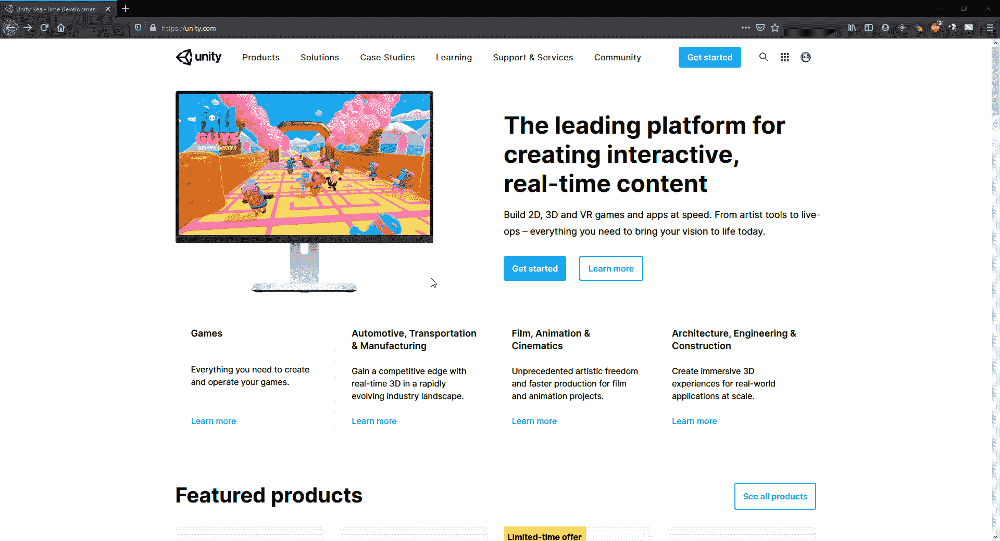
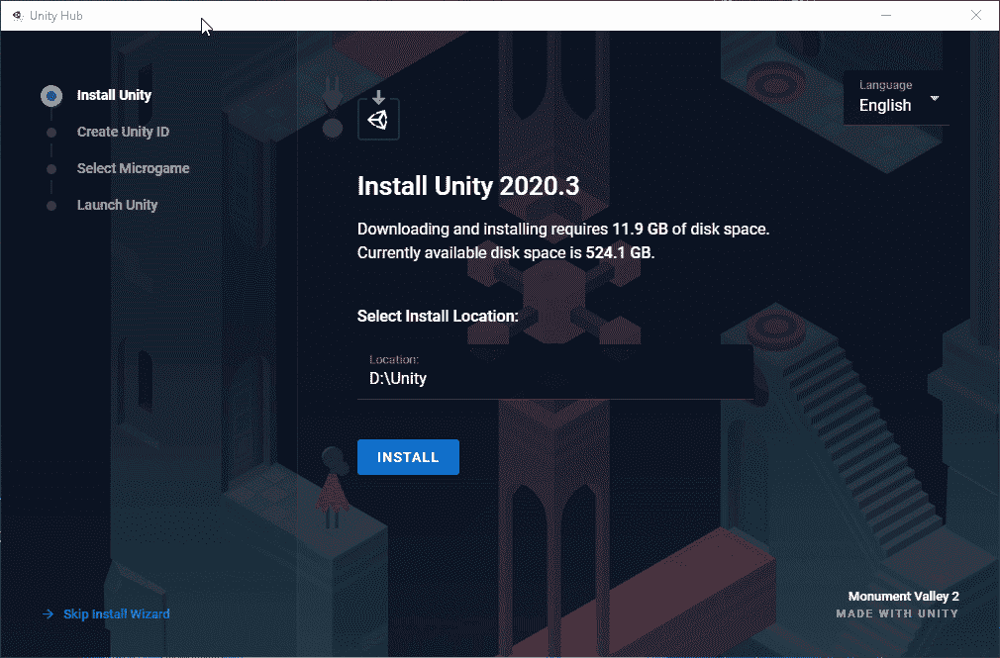
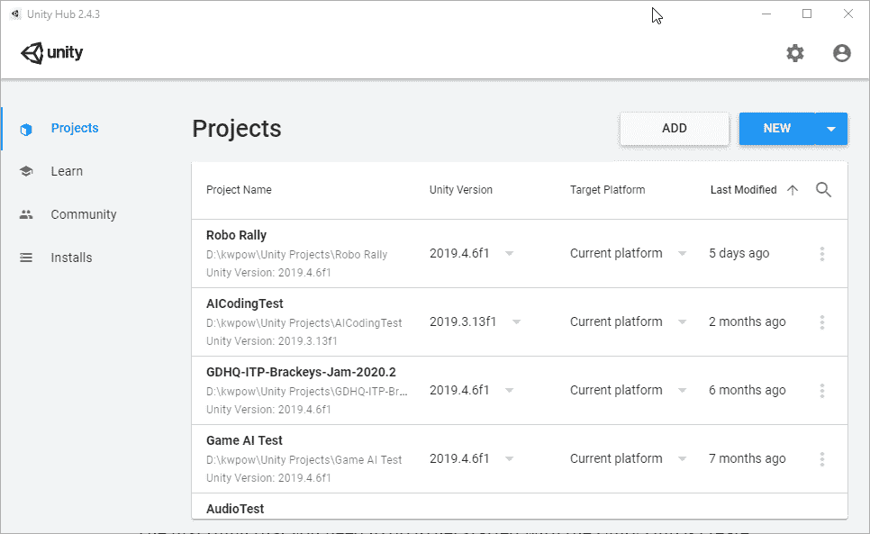
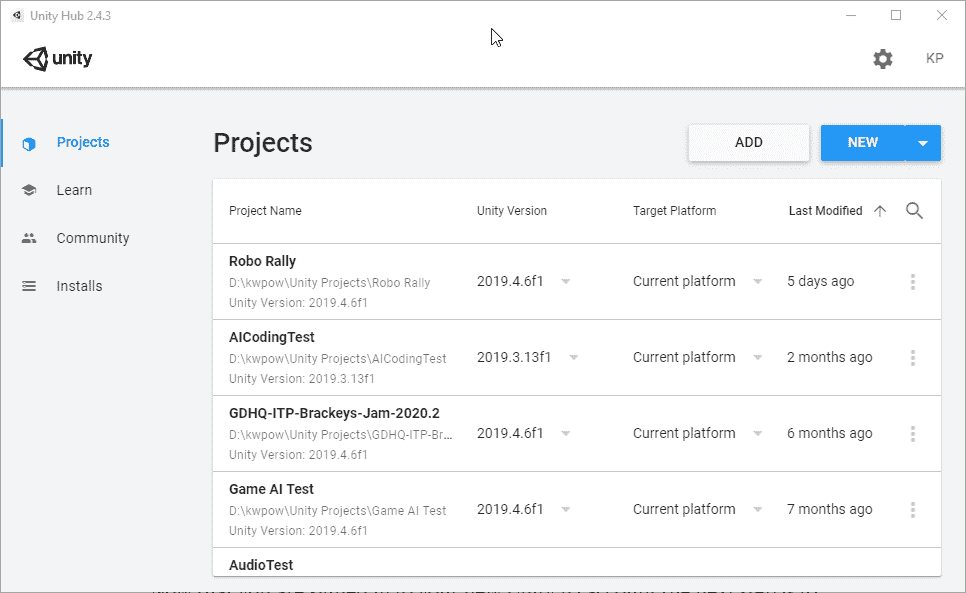
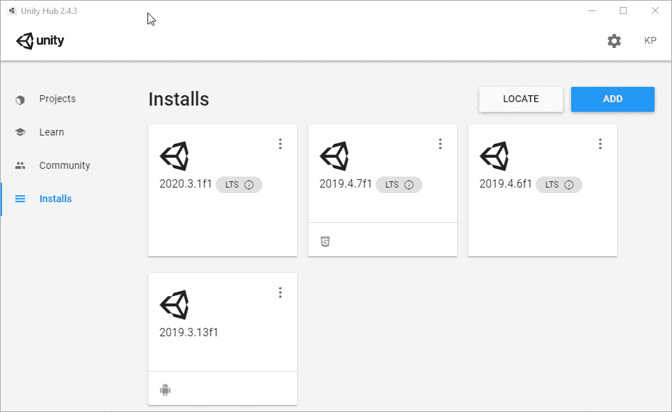

# 安装 Unity 并创建项目

> 原文：<https://levelup.gitconnected.com/installing-unity-and-starting-game-development-a9cd98b03005>

首先要做的是进入 [Unity](https://unity.com/) 主页，点击开始按钮。

下载 Unity Hub

点击“开始”按钮后，您将进入[计划和定价](https://store.unity.com/)。在这里，单击“个人”选项卡，然后单击“个人”下的“开始”按钮。这将带你到一个页面，在那里你可以开始你的统一之旅。单击“从这里开始”按钮，系统会提示您接受使用 Unity Personal 的条款并下载 Unity Hub 安装程序可执行文件。

下载完成后，转到下载可执行文件的位置，开始安装过程。对于本文，我将跳过安装向导。这将在项目选项卡上打开基础 Unity Hub。

跳过安装向导

开始使用 Unity Hub 的第一件事是创建一个 Unity ID 帐户。为此，请转到 Unity Hub 窗口的左上角，单击一个人的图标，然后向下并单击登录。这将打开一个新窗口，Unity Hub 登录。在这个新窗口中，在登录到您的 Unity ID 下，您会看到‘如果您没有 Unity ID，请[创建一个](https://id.unity.com/en/conversations/dacd6bc5-0848-4a09-a416-96630c2b43a7019f?view=register)’点击创建一个。输入您希望与您的 Unity ID 帐户关联的电子邮件、密码和用户名。然后接受条款和隐私政策，并点击创建 Unity ID 按钮。

这将向您输入的地址发送一封确认电子邮件。去那里确认你的电子邮件地址。现在回到 Unity Hub 登录窗口，点击“继续”按钮登录您的新 Unity ID 帐户。现在您已登录新的 Unity ID 帐户，下一步是安装 Unity engine 版本。

创建 Unity 帐户

在 Unity Hub 窗口中，单击“安装”选项卡，然后单击“添加”按钮。这将打开添加 Unity 版本窗口，您可以在其中选择要安装的版本。我建议从长期支持(LTS)版本开始，因为 Unity 将会在很长一段时间内保持稳定和支持。一旦你选择了你想要安装的 Unity 版本，点击下一步按钮，这将带你进入下一步选择你想要添加到 Unity 版本的模块。如果您计划使用此版本的 Unity 为设备而不是独立的 Windows 创建程序，您只需添加模块。您随时可以在以后回来添加模块，所以现在，单击 Done 按钮，下载和安装将开始。

安装新版本的 Unity

安装完成后，就该开始新的 Unity 项目了。在左侧的 Unity Hub 窗口中，单击“项目”选项卡。现在单击“新建”按钮，这将打开一个新窗口。在这个新窗口中，您可以选择 Unity 项目要使用的模板、项目名称以及项目文件夹的放置位置。一旦你做出选择，点击创建按钮，你将开始创建你的 Unity 项目！这可能需要一段时间，取决于您的计算机和您选择的模板。

创建新的 Unity 项目

现在你已经有了一个全新的 Unity 项目，请继续关注我，在我记录我所学到的东西的同时，对它进行扩展。