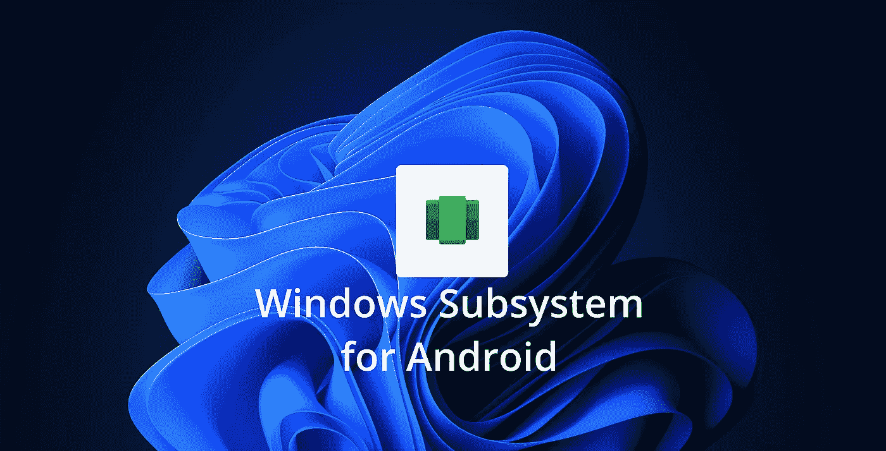

# 在 Windows 11 中为 Android 安装 Windows 子系统

> 原文：<https://levelup.gitconnected.com/installing-windows-subsystem-for-android-in-windows-11-c33e98c4071c>

如何在任何版本的 Windows 11(家庭版、专业版、企业版或教育版)上安装和使用 WSA，并在没有任何仿真器的情况下运行 Android 应用！



微软最近为内部人员发布了 Android 的 Windows 子系统(又名 WSA)，这是 Windows 的一个功能，允许 Android 应用程序运行，根本不需要设置任何模拟器。在这个故事中，我将介绍如何在任何版本的 Windows 11 上安装它，即使你不是 Windows Insider。

# Android 的 Windows 子系统是什么？

android 的 Windows 子系统是一种新的 Windows 平台技术，允许 Android 应用程序在不需要仿真器的情况下在操作系统内运行，该子系统包括 Linux 内核和 Android OS 11，它还包括预装的亚马逊 Appstore，因此您可以轻松安装任何可用的 Android 应用程序，就像它是 Windows 应用程序一样。

# 要求

要安装 WSA，有几个要求，你需要一个能够进行硬件虚拟化的 CPU，Windows 11 支持的大多数 CPU 都有这个功能，所以这应该不是问题，但有时它在 BIOS 中默认是不启用的。

## 步骤 1:检查虚拟化是否已启用

要检查是否在 BIOS 中启用了虚拟化，请在 windows 中搜索并打开命令提示符，在其中写入“systeminfo”并按 enter 键，然后等待它运行，这可能需要几秒钟，但一旦完成，请搜索“Hyper-V 要求”部分(通常是最后一部分)


如果“在固件中启用虚拟化”说“否”，您将需要在 BIOS 中启用虚拟化(更多详细信息在步骤 2 中)，否则它已经启用，您可以跳过步骤 2。

## 步骤 2:实现虚拟化

根据主板制造商的不同，实现虚拟化的过程可能会有很大差异，但可以总结为几个步骤:

1.  关闭计算机并再次打开，继续按键打开 BIOS(通常是 Del、F1、F2、F4、F11 或 F12)
2.  一旦进入 BIOS，搜索 CPU 配置部分，它可能被称为“CPU 配置”、“处理器”、“北桥”或“芯片组”，并且可能在“高级”或“高级模式”标签或菜单下。
3.  现在，您需要寻找虚拟化选项并启用它，它可以有不同的名称，如“Hyper-V”、“Vanderpool”、“SVM”、“AMD-V”、“英特尔虚拟化技术”或“VT-X”。
4.  现在保存并重启你的电脑。

下面是一个小视频，展示了如何在采用英特尔处理器的华硕主板上实现这一点:

在采用英特尔处理器的华硕主板上实现虚拟化

## 步骤 3:检查您的 Windows 版本

WSA 的另一个要求是 Hyper-v，这是 Windows 的一个可选功能，允许创建虚拟机，如果您有 Windows Enterprise、Pro 或 Education，这个过程非常简单，只需要一个命令，对于 windows home tough，您需要升级 Windows 或运行脚本来手动启用该功能。

要检查你的 windows 版本，打开设置，点击“系统”,然后点击“关于”,你会发现你的 Windows 版本。


如果您有 Windows Enterprise、Pro 或 Education，请转到步骤 4.1，如果没有，请转到步骤 4.2。

## 步骤 4.1:启用 Hyper-V (Windows 企业版、专业版或教育版):

在 Windows Enterprise、Pro 或 Education 上启用 Hyper-V 非常简单，以管理员权限打开 PowerShell，键入以下命令并按 ENTER 键:

```
Enable-WindowsOptionalFeature -Online -FeatureName Microsoft-Hyper-V -All
```

安装完成后，重新启动计算机，Hyper-V 就应该安装好了。如果你愿意，你可以点击这里查看微软官方指南。

## 第 4.2 步:启用 Hyper-V (Windows 11 Home):

如果您有 Windows Home，启用 Hyper-V 的最佳选择是升级到 pro，但您也可以通过使用下面的脚本创建一个. bat 文件并以管理员权限运行它来强制 Windows 启用它。

完成后，重新启动计算机，Hyper-V 应该已启用。

# 正在为 Android 安装 Windows 子系统

目前 WSA 的预览版只对 Windows 内部人员正式开放，如果你是其中一员，你现在要做的就是在微软商店上搜索亚马逊 Appstore 就可以了！现在你可以在 appstore 安装和运行 android 应用程序，但如果你不是 Windows Insider，你需要手动安装，但请记住:这是 WSA 的**预览版，**错误和问题是意料之中的，我自己没有发现任何错误和问题，但请记住这一点。

首先，让我们下载 WSA 包，为此，[单击此处](https://store.rg-adguard.net/)打开一个在线工具，该工具可生成指向 Microsoft Store 包的直接链接。在左侧的第一个下拉菜单中，选择“productId”，键入“ **9P3395VX91NR** ”，这是 WSA 的产品 Id，并为右侧的下拉菜单选择“slow”。


链接生成器将显示该产品 ID 的所有可用链接的列表，我们正在寻找的是一个. msixbundle 文件，大小略大于 1 GB，对我来说，它是列表中的最后一项。


右键单击文件名并选择“另存为…”，然后将其保存在计算机中的某个位置。
现在是真正安装 WSA 的时候了，为此，以管理员权限打开 PowerShell 并执行以下命令:

```
Add-AppxPackage -Path <path_to_msixbundle_file>
```

我将文件保存到 C:/，所以对我来说命令是`Add-AppxPackage -Path C:/MicrosoftCorporationII.WindowsSubsystemForAndroid_1.7.32812.0_neural__8wekyb3d8bbwe.Msixbundle`。

这将安装 WSA，现在重新启动您的计算机，它应该出现在您的开始菜单。


# 使用 Android 的 Windows 子系统

终于安装了 WSA，我们可以在 Windows 中使用 Android 应用程序了！首先，让我们打开“Android 的 Windows 子系统”应用程序，并检查这里可用的设置。


在设置中，你可以将子系统资源设置为“连续”以保持 WSA 一直打开，或者“按需”以在每次打开应用程序时启动它，然后关闭它，我建议使用“按需”,因为该功能仍在预览中，即使没有打开应用程序，它也会消耗 CPU 和内存资源(约 1Gb 的 RAM)。在设置中，你还可以打开“文件”应用程序来访问 WSA 的内部文件系统，重置为默认值，关闭它，甚至启用开发者模式！

要安装应用，你可以打开亚马逊 Appstore，它已经默认安装了 WSA，所以你可以在开始菜单中搜索它，然后只需用你的亚马逊账户登录，下载你想要的应用。


您下载的每个应用程序都会出现在开始菜单中，就好像它是一个原生的 Windows 应用程序一样，您甚至可以右键单击它们并直接从 Windows 中卸载！

Android 的 Windows 子系统是 Windows 的一个非常棒的特性，也是非常需要的一个特性！新的 M1 macbook 可以运行 iOS 应用程序，ChromeOS 可以运行 Android 应用程序，因此在 Windows 上支持移动应用程序只是时间问题。WSA 并不完美，它有许多小故障，有时可能会崩溃，但它是这个功能的一个很好的起点，它对最终用户和开发人员来说有很大的潜力，他们现在可以在 windows 中开发和测试应用程序，具有可调整大小的窗口和蓝牙支持！如果您想了解如何为移动开发设置 WSA，请查看下面我的故事！

[](/will-windows-subsystem-for-android-replace-emulators-d93ab4dbcb14) [## 如何使用 Android 的 Windows 子系统作为开发工具

### 如何使用 Windows 子系统进行 Android 和 Flutter app 开发…但是应该吗？

levelup.gitconnected.com](/will-windows-subsystem-for-android-replace-emulators-d93ab4dbcb14)