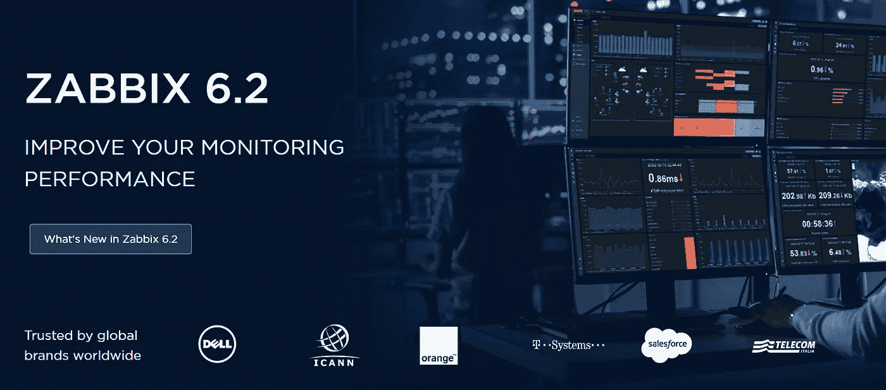
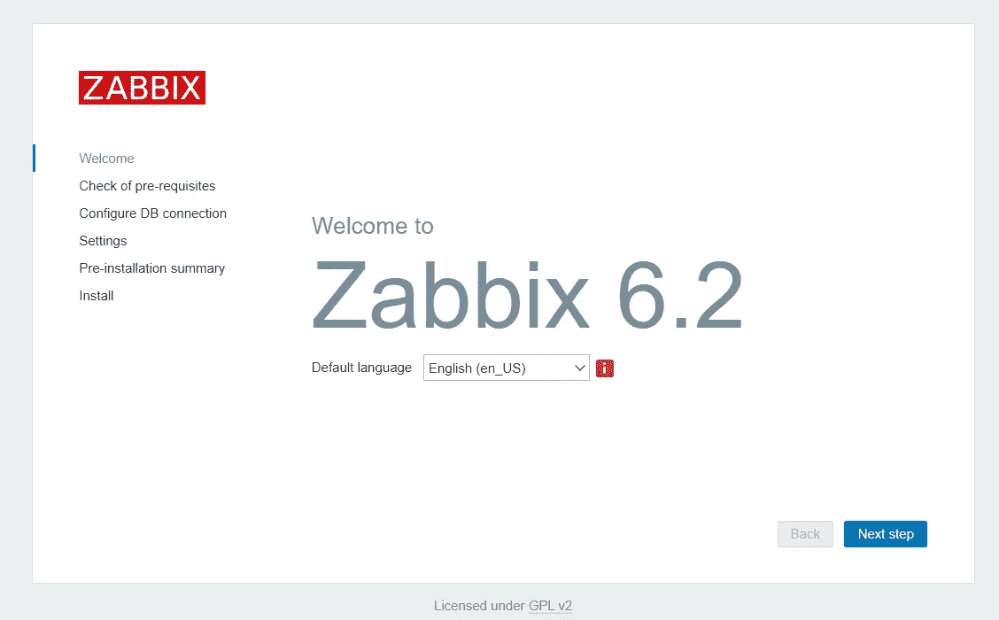
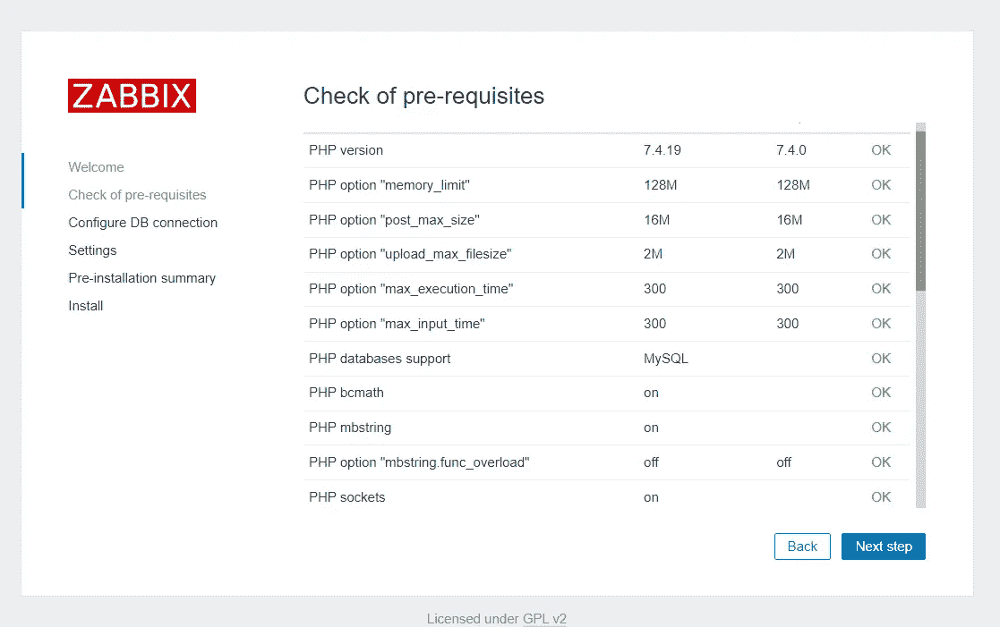
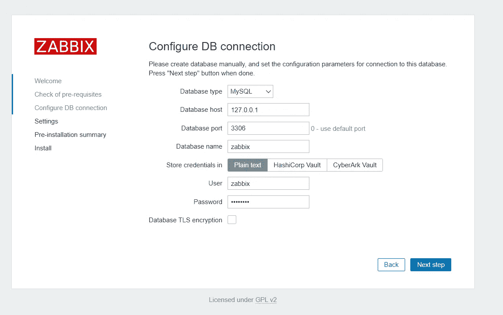
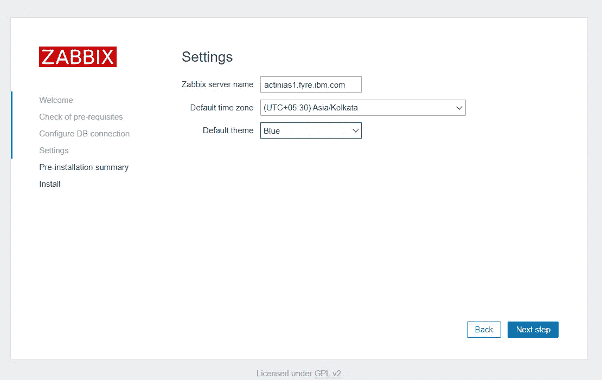
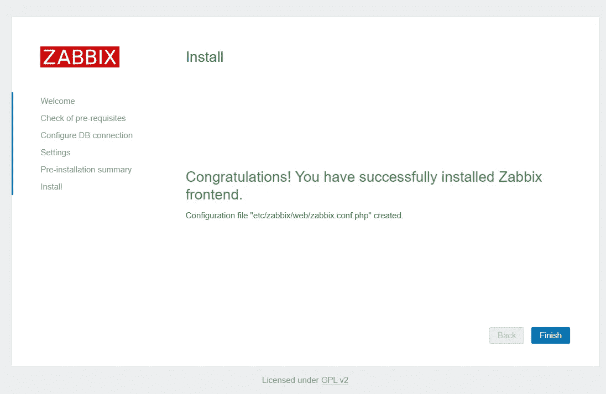
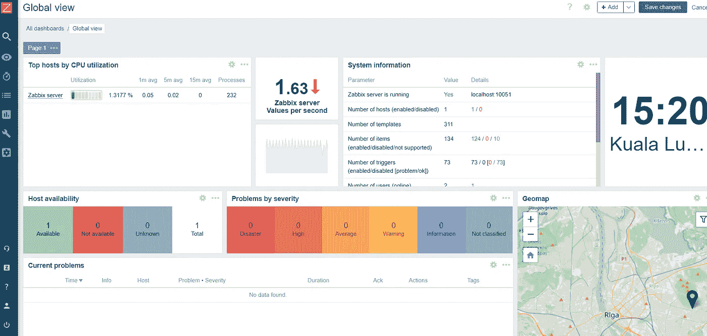

# 使用 Xampp DB 安装 Zabbix 软件

> 原文：<https://levelup.gitconnected.com/installing-zabbix-software-with-xampp-db-4c5b3c2d6c68>

在 Red hat 8.4 上安装带有 Nginx web 服务器和 Xampp DB 的 Zabbix 软件版本 6.2



照片来自[zabbix.com](https://www.zabbix.com/)

## **Zabbix 是什么？**

Zabbix 是一个企业级开源分布式监控解决方案。Zabbix 软件可以监控

1.  *应用，*
2.  *服务，*
3.  *服务器，*
4.  *虚拟机，*
5.  *网络，*
6.  *数据库，*
7.  *网站&*
8.  *云*。

Zabbix 通知框架允许用户为每个事件配置基于电子邮件的警报。它还提供了一个基于 web 的仪表板，用于数据可视化和存储数据的报告。

## Zabbix 是如何工作的？

Zabbix 软件主要由一个*服务器*和一个*代理*组成。

***服务器*** : Zabbix 服务器是 Zabbix 软件的中央进程。它执行轮询、捕获数据，并根据配置的触发器向用户发送通知。它是一个中央存储库，保存所有配置、统计&操作数据。

***代理*** : Zabbix 代理对其部署的目标进行监控。它收集操作信息并将数据报告给 Zabbix 服务器进行处理。它可以执行主动和被动检查

## **监控虚拟机的 Zabbix 设置过程**

**步骤 1 —设置 Zabbix 服务器**

*   去 zabbix 下载网页。[https://www.zabbix.com/download](https://www.zabbix.com/download)
*   挑选

> - Zabbix 版本:6.2
> - OS 发行版:红帽企业 Linux
> - OS 版本:8
> - Zabbix 组件:服务器、前端、代理
> -数据库:MySQL(mariaDB)
> - Web 服务器:Nginx

*   运行以下命令来配置 zabbix repo

```
rpm -Uvh [https://repo.zabbix.com/zabbix/6.2/rhel/8/x86_64/zabbix-release-6.2-3.el8.noarch.rpm](https://repo.zabbix.com/zabbix/6.2/rhel/8/x86_64/zabbix-release-6.2-3.el8.noarch.rpm)yum clean all
```

*   Zabbix 要求 php 最低版本为 7.4。使用切换 php 模块

```
yum module switch-to php:7.4
```

*   安装所有 zabbix 包

```
yum install zabbix-server-mysql zabbix-web-mysql zabbix-nginx-conf zabbix-sql-scripts zabbix-selinux-policy zabbix-agent -y
```

## 步骤 2 —安装 Xampp 并设置 MySQL

*   确保您已经安装了 *libnsl* 库，如果没有运行的话

```
yum -y install libnsl
```

*   从[sourceforge.net](https://sourceforge.net/projects/xampp/files/)或[apachefriends.org](https://www.apachefriends.org/download.html)获得 xampp 的最新版本

```
wget [https://sourceforge.net/projects/xampp/files/XAMPP%20Linux/8.1.10/xampp-linux-x64-8.1.10-0-installer.run](https://sourceforge.net/projects/xampp/files/XAMPP%20Linux/8.1.10/xampp-linux-x64-8.1.10-0-installer.run)
```

*   添加适当的权限并执行文件

```
chmod 755 xampp-linux-x64–8.1.6–0-installer.run ./xampp-linux-x64–8.1.6–0-installer.run
```

*   启动服务器为 zabbix 配置 mysql

```
/opt/lampp/lampp start
```

*   使用默认的*根用户*登录 mysql

```
/opt/lampp/bin/mysql -u root -p (default password is blank)
```

*   运行下面的代码来创建一个 *zabbix* db，一个用户 *zabbix* ，使用*密码*和必要的*权限*来访问这个 db

```
mysql> create database zabbix character set utf8mb4 collate utf8mb4_bin;
mysql> create user zabbix@localhost identified by ‘password’;
mysql> grant all privileges on zabbix.* to zabbix@localhost;
mysql> quit;
```

*   运行以下命令来创建 zabbix 服务器所需的所有表

```
zcat /usr/share/doc/zabbix-sql-scripts/mysql/server.sql.gz | /opt/lampp/bin/mysql -uzabbix -p password
```

*   编辑文件*/etc/zabbix/zabbix _ server . conf*并设置 mysql 细节

```
DBPassword=password
DBSocket=/opt/lampp/var/mysql/mysql.sock AllowUnsupportedDBVersions=1
```

*   编辑文件*/etc/nginx/conf . d/zabbix . conf*取消注释 nginx *监听*端口和*服务器名*

```
listen 80;
server_name example.com;
```

*   停止 xampp，重启 zabbix & nginx 并启动 xampp

```
/opt/lampp/lampp stop
systemctl restart zabbix-server zabbix-agent nginx php-fpm
systemctl enable zabbix-server zabbix-agent nginx php-fpm
/opt/lampp/lampp start
```

*   如果您遇到任何问题，请查看日志

```
/var/log/zabbix/zabbix_server.log/var/log/nginx/access.log
```

## 步骤 3 —配置 Zabbix UI 以使用 Xampp DB

*   输入主机名和在 *zabbix.conf* 文件中设置的端口。这将带您到用户界面设置页面



*   单击“下一步”并确认所有先决条件都满足 **OK**



*   在“配置数据库”页面中，更新数据库端口和密码。该端口可以在*/opt/lampp/properties . ini*中找到



*   配置时区和主题



*   验证下一页中的所有安装细节并完成安装



*   您将被重定向到 Zabbix 登录页面。登录的默认凭证是 **Admin/zabbix**
*   登录后，您应该会被重定向到 zabbix 仪表板

