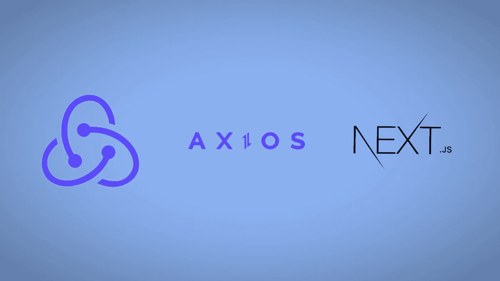
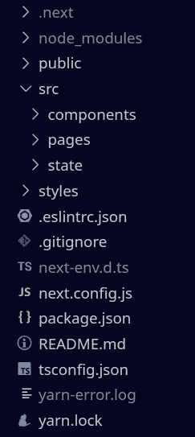
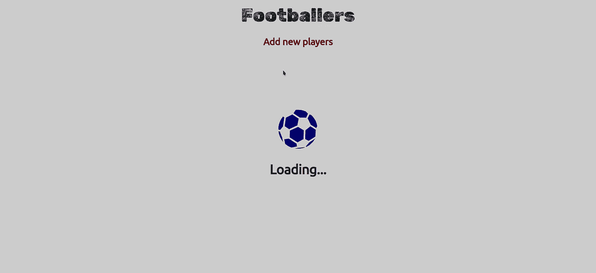

# 将 Next.js 中的 API 与 Redux 和 Axios 集成:10 步指南

> 原文：<https://levelup.gitconnected.com/integrate-apis-in-next-js-with-redux-and-axios-10-step-guide-3d20a2bc9365>

> 在本文中，我将介绍如何通过简单易懂的步骤在应用程序中建立一个标准的 redux 存储来进行 API 调用。
> 
> 在本文中，我将介绍:Next.js 中的项目设置，从头实现 redux store，React-Bootstrap 的基本 UI 增强(可选部分)。



Redux 是一个开源的 javascript 状态管理工具。当我们在应用程序中提到 redux 时，人们首先会想到与之相关的样板文件。如果我们是诚实的，那么是的，redux 确实有很多样板文件。然而，如果我们能够在开发过程中很好地管理这些复杂性，那么 redux 对于我们的前端应用程序来说是一个非常方便的工具。

**注意:**对于 API，我将使用我在我的[上一篇文章](/datasource-in-typeorm-a-new-way-to-connect-to-your-database-cdc6622f9bbc)中创建的现有 express 项目。它由一个足球运动员 API 和四个端点组成，用于获取、发布、上传和删除请求。要设置你的项目，你可以参考我的文章— [用 express.js 和 typeScript 设置 node.js 项目环境:最佳实践](https://medium.com/geekculture/setting-up-a-node-js-project-environment-with-express-js-and-typescript-best-practices-284cc37c5aa1)

## 步骤 1:next . js 中的项目设置。

我将使用 typescript 来设置我们的 Next.js 应用程序。但是在这样做之前，请确保您的系统上安装了 node 和 npm。您可以通过在终端中运行以下命令来实现这一点:

```
node -v // Checks the version of node.js installed
npm -v // Checks the version of npm installed
```

如果您没有安装它，您可以从这里安装[(对于 Linux 系统)](https://linuxize.com/post/how-to-install-node-js-on-ubuntu-20-04/)和从这里安装[(对于 Windows 系统)](https://phoenixnap.com/kb/install-node-js-npm-on-windows)。对于任何使用 yarn 的人，您可以运行以下命令:

```
yarn -v // Checks the version of yarn installed
```

**注意:**为了安装所有的依赖项，我将使用 yarn。你可以自由使用 npm 来安装我们在这个项目过程中需要的所有依赖项。你可以从这里[(对于 Linux 系统)](https://linuxize.com/post/how-to-install-yarn-on-ubuntu-20-04/)和这里[(对于 Windows)](https://phoenixnap.com/kb/yarn-windows) 安装 yarn。

之后，我们将在 next.js 中创建我们的应用程序，并用 typescript 初始化它。在您的终端中执行以下代码行:

```
yarn create next-app --typescript
```

在运行这个命令时，你会被询问一些基本的权限，以及诸如你的应用程序的名称等问题。完成后，您的应用程序就可以使用了。

我们现在将对 next.js 默认提供的标准项目结构进行一些更改。以下是标准结构:


带有 TypeScript 标准项目布局的 Next.js

从**‘pages’**文件夹中，删除名为**‘API’**的文件夹，因为我们不会在任何地方使用它。同时，在你的项目结构的根目录下创建一个名为**‘src’**的文件夹。然后只需将 **pages 文件夹移到‘src’**中。在**‘src’**文件夹中，再创建两个名为 **components** 和 **state** 的文件夹(我将在本文的后面部分介绍这些文件夹的重要性)。完成这些步骤后，我们的新项目结构就可以使用了。现在，您可以通过执行以下操作来启动服务器:

```
yarn run dev
```



修改的项目结构

## 步骤 2:安装依赖项。

我们现在将安装一个依赖项列表，我们将在需要时在整个应用程序中使用它。

```
yarn add redux // Adds redux as a dependency
yarn add react-redux // Adds react-redux to our project
yarn add axios // Axios will be used to make API calls
yarn add redux-thunk // Adds redux-thunk
```

注意，这里我们安装了 redux-thunk。Redux-Thunk 是一个中间件，它允许我们返回函数，而不仅仅是用 Redux 返回普通的动作。这个中间件用于处理异步动作。这些都是我们需要的依赖。

## 步骤 3:创建操作。

在 redux 中，动作在我们希望商店实现的目标中起着关键作用，这一点我们将在后面定义。动作基本上是简单的对象，返回一个带有两个**键值对的对象，即类型和有效负载**。您定义的任何操作都需要导出以供将来使用。

在**‘state’**文件夹内创建一个名为**‘actions’**的新文件夹。在这个文件夹中，我们创建了一个名为 **'footballerActions.ts'** 的新文件。在该文件中，您可以粘贴以下代码:

这里我定义了三个不同的动作来获取数据，创建新的球员数据和更新现有的球员数据。这些动作将被称为 reducers 的东西访问。请注意，我用附加参数填充了 payload 属性，我们将在进行 API 调用时设置这些参数的值。

## 步骤 4:创建减速器:

redux 中的 redux 函数从您已经定义的动作(参见第 3 步)和应用程序的先前状态中获取动作类型和有效负载，并返回您的状态的新实例。我们将返回到**‘src’**中的【T22’‘state’文件夹，并创建一个名为**‘reducers’**的新文件夹。在这个文件夹中，我们将创建一个名为**' footballers reducers . ts '**的新文件。您可以复制下面提供的代码来初始化您的缩减器:

为了实现一个缩减器，我们定义了一个初始状态，在由于某种错误而无法设置或找到新状态的情况下，可以访问这个初始状态。缩减器接受两个参数，初始状态和动作。根据所提供的动作类型，我使用 switch case 语句来执行 reducer 中的某些功能。您也可以使用 if-else 语句来创建您的 reducer。我们将**‘action . types’**作为我们的表达式传递给 switch 语句。然后对于每一种情况，我们使用**‘action . payload’**返回状态和与之相关的相应负载。

## 步骤 5:初始化 Redux 存储以便在应用程序范围内使用。

商店是我们所有减速器连接的地方。这个存储必须在整个应用程序中可用。但是在初始化存储之前，我们需要向 reducers 文件夹添加另一个名为 index.ts 的文件，在这个文件中，我们将组合所有的 reducers，以便它可以为我们的存储返回一个 reducer。您可以复制下面的代码来组合所有的减速器:

combineReducers 辅助函数将所有的 reducer 组合成一个具有键-值对的函数，其中每个 reducer 都作为一个值传递给其对应的键。这个现在可以传给 redux 商店了。

要创建存储，请在名为 store.ts 的状态文件夹中创建一个新文件夹。在该文件夹中，创建一个名为 store.ts 的新文件。向该文件添加下面提到的代码:

这里我们从 redux 导入了' **legacy_createStore '作为** ' **createStore'** 和 **applyMiddleware** 。然后，我们声明一个名为 store 的命名导出，其中“createStore”接受三个参数，即 reducers、一个空对象和作为中间件的 thunk，该中间件用 applyMiddleware 初始化。传递空对象来定义初始状态或默认状态。

最后，我们需要我们的整个应用程序能够访问这个商店，这可以通过使用 react-redux 中的一个组件来实现，这个组件叫做 **Provider** 。您可以将提供程序导入为:

```
import { Provider } from 'react-redux'; 
```

除了提供者，我们还需要导入我们的商店。要使用提供者来访问应用程序中的商店，只需将此代码块复制并粘贴到您的 **'_app.tsx'** 文件中:

提供者组件将我们导入的商店作为道具，并将我们完整的应用程序组件包装在其中。这样，我们就完成了商店的实现。

## 步骤 6:请求从我们的 API 中获取球员的数据:

现在让我们回到 src，在那里我们创建了一个名为 components 的文件夹。在组件内部，我们将创建一个名为 FootballerDetails 的新文件夹。在其中，我们将创建一个名为 **'basicDetails.tsx'** 的新文件。在这个文件中，我们需要从 **footballersAction** 文件中导入 Axios、react-redux 提供的两个钩子即 **useSelector** 和 **useDispatch** 以及 **getFootballersData** 动作。除此之外，我还创建了一个加载器组件，只要我们的状态没有被填充，它就会显示出来。一旦状态被填充，将显示从我们的状态形成的 UI，而不是加载器。下面是加载器组件的代码:

您可以通过参考下面的代码来创建 BasicDetails 组件:

这里我们使用了 **useSelector** 钩子，它将状态作为一个参数，以便从我们的存储中检索关于足球运动员的数据。在下一行中，我们定义了一个名为 dispatch 的**常量，它被设置为 useDispatch 钩子。接下来，我们有一个名为 **fetchFootballers** 的函数，我们在其中实现 Axios GET 请求。请注意，我们正在将我们的 API 响应(即 **res.data** )分派给 getFootballersData 动作，该动作采用我们在上面定义的参数。之后，我们将这个函数传递给一个 useEffect 块。最后，在返回时，我们将检查足球运动员数据是否可用，并且没有设置为未定义。如果它不可用并且一开始没有定义，那么我们将呈现加载器，否则我们将通过映射足球运动员数据(调用状态的常量变量)来呈现显示球员信息的 UI。**

我将把这个组件传递到我们的 index.tsx 页面，以便所有足球运动员的数据可以立即加载到我们的主页上。您可以参考下面的索引文件代码块。


我们如何提出 GET 请求的摘要

## 步骤 7:发布创建新玩家数据的请求:

在 src/components 中，我们将创建一个名为**new football**的新文件夹，其中将包含一个名为**createnewplayerdata . tsx**的文件。同样，在 pages 文件夹中，我们将创建一个名为 **newplayer.tsx** 的新页面。您可以参考下面的代码来创建您的新播放器组件:

在**CreateNewPlayerProfileComponent**中，当 postValStatus 设置为 true 时，我们返回了三个带有按钮和条件渲染的输入字段。我们使用 useState 钩子从各自的输入字段中获取值。为了将各个状态的值设置为用户在输入字段中输入的值，我们借助 onChange 属性向每个输入传递一个函数。在这些变更处理函数中，我们用 **event.target.value** 设置状态(event.target.value 用于获取输入字段的值)。

接下来，我们有发出 POST 请求的函数。createNewPlayer 函数调用 event 上的 preventDefault()方法。此方法防止浏览器执行相关元素的默认操作。然后，我们用 Axios 发出 POST 请求，它带有三个参数，您的 API 端点、有效负载，最后是指定有效负载中的数据类型和访问控制的配置。来自 POST 请求的响应随后被分派给 createFootballPlayerProfile 操作(该操作在步骤 3 中定义)，该操作随后填充其有效负载，并在以后供 reducer 使用。同时，当数据成功提交时，我们将 postValStatus 设置为 true。然后我们将这个函数传递给按钮的 onClick 属性。

最后，进入条件呈现部分，如果 postValStatus 没有设置为 true，也就是说，如果它保留了它的原始值 false，那么向用户显示输入字段和提交按钮。当 state 设置为 true 时，这种情况只在值被成功提交时才会发生，然后显示一个简单的路由器链接，该链接会将它们带回到主页。

导出 CreateNewPlayerProfileComponent 后，我们只需将其呈现到 newplayer 页面。这可以通过以下方式完成:


我们的帖子请求摘要

## 步骤 8:提交更新现有球员数据的请求:

在 src/components 中，我们将创建一个名为**的文件夹。在这个文件夹中创建一个名为**updateplayercomponent . tsx**的文件。并在 pages 文件夹中创建一个名为 **updateplayer.tsx** 的文件。在 basicDetails.tsx 中，我们将呈现一个按钮，通过单击触发重定向功能，将我们重定向到 updateplayer 页面。为了重定向到更新页面，我们需要从 next/router 导入 **useRouter** ，并在我们的功能组件内部和 return 语句之上调用它。**

```
// Add routing
import { useRouter } from "next/router";const router = useRouter();
```

这个重定向函数的目的是获取玩家 ID，最终用于更新玩家数据。我们将该函数定义如下:

我们将 ID 作为查询参数发送到我们希望重定向用户的页面。完成后，您的 URL 格式将如下所示:

```
[http://localhost:3001/updateplayer?id=7](http://localhost:3001/updateplayer?id=7)
```

我们将调用 footballersData.map 中的一个简单按钮来调用这个函数，这样我们就可以访问每个球员的 id。

```
<button onClick={() => {redirectToUpdatePage(individualPlayerData.id)}>
    Delete
</button>// In the basicDetails.tsx page
```

现在，要创建 **UpdatePlayerComponent** ，您可以执行以下操作:

在这个组件中，我们从 footballerActions.ts 文件中导入 **updateFootballerData 动作**(在步骤 3 中定义)。该组件与 CreateNewPlayerProfileComponent 非常相似。因此，定义的状态、变更处理函数和输入字段都没有变化。

我们已经定义了一个名为 **updateFootballPlayerData** 的函数，它将使我们能够更新所选球员的数据。Axios PUT 请求有两个参数，API 端点和更新数据所需的有效负载。就像前面的步骤一样，我们将把我们的有效负载分派给 updateFootballerData 动作。此外，我们将把 PostValStatus 设置为 true。

玩家更新后，postValStatus 设置为 true，我们将为用户提供一个返回主页的选项。

然后，该组件被传递到 updateplayer 页面。您可以按如下方式实现它:


我们的卖出请求摘要

## 步骤 9:删除请求:

在 basicDetails.tsx 文件中，我们将创建一个函数来处理我们的删除请求。这个函数也将一个 ID 作为参数。您可以将此函数定义为:

这个函数实际上只是获取 ID 并完成它的工作。为 delete 创建单独的操作是完全可选的，我认为没有必要，只是继续进行 API 调用。请注意，我正在进行 router.reload()调用，以便我们的更改在每次删除球员数据时都能得到反映。

然后我们需要调用这个函数来调用一个按钮，这个按钮将在 footballersData.map 中呈现

```
<button onClick={() => {deleteFootballer(individualPlayerData.id)}}>
    Delete
</button>
```

这也完成了我们的删除端点集成。

## 步骤 10(可选):使用 React-Bootstrap 增强用户界面:

这一部分是完全可选的，因为它主要处理我们的应用程序的样式，只是为了让它看起来更像样。同样，我将使用 React-Bootstrap。您可以通过在终端中运行以下命令来安装 React-Bootstrap:

```
yarn add react-bootstrap bootstrap
```

然后在 _app.tsx 文件中导入它的 CSS:

```
// Use React-Bootstrap
import 'bootstrap/dist/css/bootstrap.min.css';
```

对于图标，我将使用反应图标。

```
yarn add react-icons
```

长话短说，我将在最后提供 GitHub 库的链接，这样您就可以直接在您的系统上克隆它。

在添加了一点 React-Bootstrap 之后，我们的应用程序中的各个页面看起来是这样的:



当 AXIOS GET 请求从 API 获取响应时，加载程序被执行


index.tsx 中的 BasicDetails 组件


新玩家页面


更新玩家页面

这通过初始化 Redux 存储完成了我们与 Axios 的 Next.js 应用程序的 API 集成。

## 克隆这些存储库:

[**链接到我的 Next.js 项目 GitHub 资源库。**](https://github.com/chinmaykarmokar/next-redux-ts-integrations)

[**链接到我的 Express.js 足球运动员 API 库。**](https://github.com/chinmaykarmokar/node-express-ts-orm)

谢谢大家！