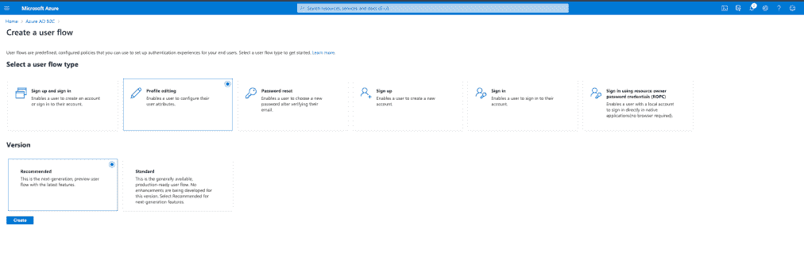
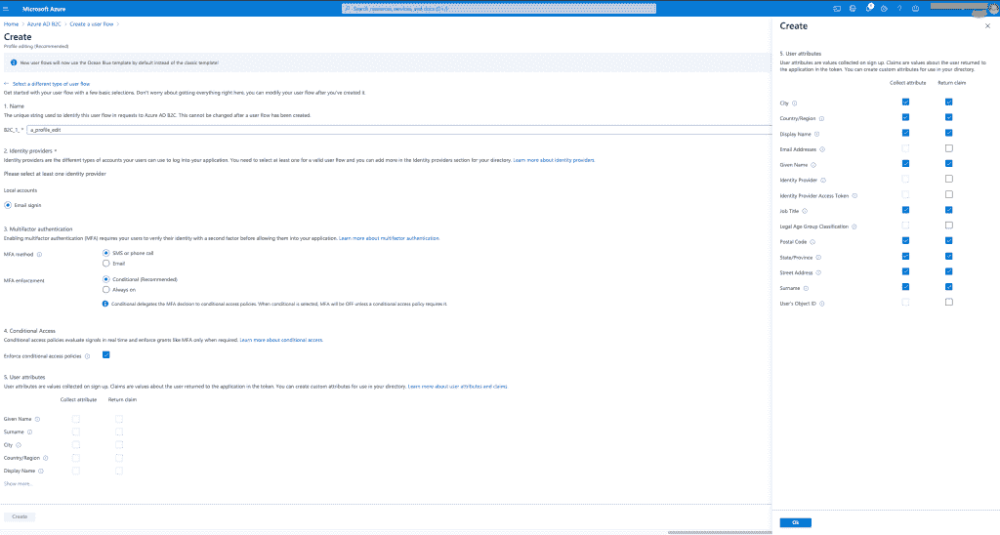
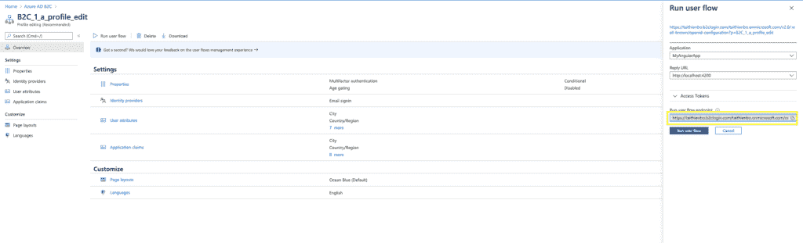
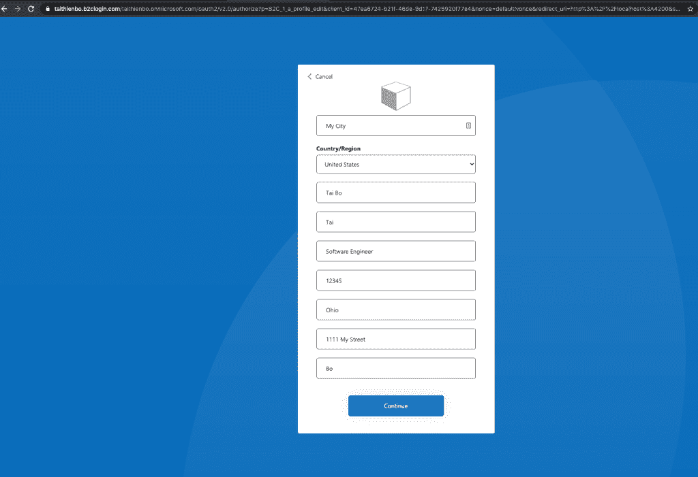
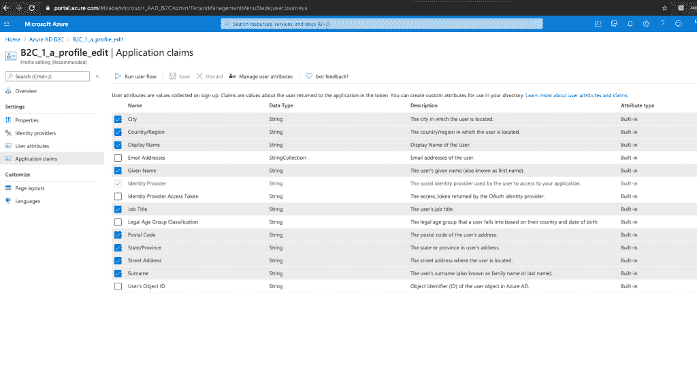
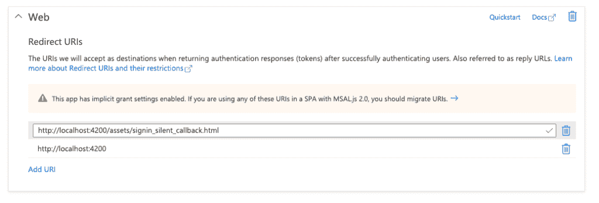

# 使用 oidc-client-js 在 angular 中集成 Azure AD B2C 配置文件编辑用户流。

> 原文：<https://levelup.gitconnected.com/integrate-azure-ad-b2c-profile-editing-user-flow-in-angular-using-oidc-client-js-81265f8e8fbf>


照片由来自 [Pexels](https://www.pexels.com/photo/internet-technology-computer-display-360591/?utm_content=attributionCopyText&utm_medium=referral&utm_source=pexels) 的 [Markus Spiske](https://www.pexels.com/@markusspiske?utm_content=attributionCopyText&utm_medium=referral&utm_source=pexels) 拍摄

这篇文章是我几个月前写的关于[如何使用 oidc-client-js](https://www.taithienbo.com/how-to-authenticate-user-against-azure-adb2c-from-angular-app-using-oidc-client-js/) 对来自 angular app 的 Azure ADB2C 用户进行身份验证的博客文章的延续。在那篇文章中，我讨论了如何集成 AD B2C 注册和登录流程，以允许用户针对 AD B2C 进行身份验证。在这篇文章中，我将展示一个集成编辑概要用户流的例子。您可以在这里找到附带的示例项目。

我假设您对 angular 和 Rxjs 有一些基本的了解，并且主要关注与集成编辑用户流相关的方面。如果您对代码有任何疑问，请随时联系我们。

此外，请查看下一篇与 oidc-client-js 相关的[帖子](https://www.taithienbo.com/integrate-azure-ad-b2c-reset-password-user-flow-in-angular-using-oidc-client-js/)，在这篇帖子中，我将介绍如何处理密码重置。

# 创建编辑简档用户流

您可以通过登录您的 AD B2C 租户并转到**策略**下的**用户流**来找到现有用户流列表。

在这篇文章中，我将创建一个新的配置文件编辑用户流。

*   点击顶部的新用户流按钮。
*   在选择用户流类型下，选择配置文件编辑。
*   选择推荐的版本，然后单击创建。

在撰写本文时，微软有一个更新的版本，似乎是在预览。我要用这个。



创建新的配置文件编辑用户流。

下一个屏幕显示流的选项，包括名称、禁用或启用多因素身份认证，以及您希望允许用户编辑的属性。

下面显示了一个属性示例:



配置文件编辑用户流属性

一旦创建了概要文件编辑流，就可以获得导航到该流的 URL。您可以通过选择流并点击**运行用户流**按钮来获取 URL。



配置文件编辑用户流 url。

# 以角度配置编辑配置文件 url。

在 angular 应用程序中，您可以将 URL 放在 environment.ts 或配置文件中。例如，我将配置放在 assets 文件夹下的一个单独的 json 文件中，并使用一个服务来加载配置。我遵循这种模式，因为我可以在 azure devops 上构建应用程序时动态替换密钥。你可以在这篇[帖子](https://www.taithienbo.com/using-azure-devops-file-transform-to-deploy-a-same-angular-build-to-multiple-environments/)中了解更多信息。另一件事是，我在服务中动态构建 URL，而不是使用我从 AD B2C 获得的确切 URL。如果您注意到，用户流的 url 遵循一种格式，该格式由租户名称、客户机 id、重定向 url 和其他参数组成。基于这一点，我可以动态地构造 url，这样，如果我更改了一个参数(如重定向 url ),就不必更改多个位置。

```
{
  "client_id": "47ea6724-b21f-46de-9d17-7425920f77e4",
  "baseUrl": "[http://localhost:4200](http://localhost:4200)",
  "signupSigninPolicy": "b2c_1_signupandsignin",
  "tenantName": "taithienbo",
  "response_type": "id_token token",
  "loadUserInfo": false,
  "response_mode": "fragment",
  "scope": "[https://taithienbo.onmicrosoft.com/mywebapi/user_impersonation](https://taithienbo.onmicrosoft.com/mywebapi/user_impersonation) openid profile",
  "editProfilePolicy": "B2C_1_a_profile_edit"
}
```

在上面的代码片段中，我只输入了配置文件编辑用户流的名称。在 SettingsService 中，我使用 httpClient 加载上述 json 并构建完整的 url。

```
private loadOidcConfigs() {
    return this.httpClient
      .get('assets/oidc-settings.json')
      .subscribe((settings) => {
        this.oidcSettingsSubject.next(new OidcSettings(settings));
      });
  }
```

# 将用户导航到简档编辑页面。

设置好 url 后，只需将用户导航到用于编辑配置文件的 url。在示例项目中，单击 Edit profile 按钮会调用以下代码:

```
editProfile() { window.location.href = this.authService.settings.editProfileRoute; }
```

在“编辑个人资料”页面上，用户可以看到他们可以编辑的属性。



在真实的应用程序中，您可能需要设计用户流的外观和感觉，这超出了本文的范围。如果你想了解更多，请查看[文档](https://docs.microsoft.com/en-us/azure/active-directory-b2c/customize-ui-overview)。

一旦用户点击继续，AD B2C 会根据注册应用程序时配置的重定向 URL 将用户重定向回应用程序。

# 处理来自广告 B2C 的响应

当在编辑配置文件时将用户重定向回应用程序时，AD B2C 包括基于 response_mode 值的 id 令牌。例如，在示例项目中，response_mode 是‘fragment ’,这意味着可以在 URL 的片段部分找到 id 标记。例如，下面是一个 url，用户编辑完个人资料后，AD B2C 会将用户重定向到该 URL。

```
[http://localhost:4200/#id_token=eyJ0eXAiOiJKV1QiLCJhbGciOiJSUzI1NiIsImtpZCI6Ilg1ZVhrNHh5b2pORnVtMWtsMll0djhkbE5QNC1jNTdkTzZRR1RWQndhTmsifQ.eyJleHAiOjE2MDMyNDgxNTEsIm5iZiI6MTYwMzI0NDU1MSwidmVyIjoiMS4wIiwiaXNzIjoiaHR0cHM6Ly90YWl0aGllbmJvLmIyY2xvZ2luLmNvbS9kMjk1YmFjMC1iNWEyLTQzZDMtYWNhZi1hMTk5Y2Q3MTNiYTcvdjIuMC8iLCJzdWIiOiJiNzM4NjQ1NS1lMDEzLTQ1YWItOWE4My00NjhhYWU1N2I4YWEiLCJhdWQiOiI0N2VhNjcyNC1iMjFmLTQ2ZGUtOWQxNy03NDI1OTIwZjc3ZTQiLCJub25jZSI6ImRlZmF1bHROb25jZSIsImlhdCI6MTYwMzI0NDU1MSwiYXV0aF90aW1lIjoxNjAzMjQ0NTUxLCJjaXR5IjoiTXkgQ2l0eSIsImNvdW50cnkiOiJVbml0ZWQgU3RhdGVzIiwibmFtZSI6IlRhaSBCbyIsImdpdmVuX25hbWUiOiJUYWkiLCJqb2JUaXRsZSI6IlNvZnR3YXJlIEVuZ2luZWVyIiwicG9zdGFsQ29kZSI6IjEyMzQ1Iiwic3RhdGUiOiJPaGlvIiwic3RyZWV0QWRkcmVzcyI6IjExMTEgTXkgU3RyZWV0IiwiZmFtaWx5X25hbWUiOiJCbyIsInRmcCI6IkIyQ18xX2FfcHJvZmlsZV9lZGl0In0.lQnuN6RKSos0i6dAp_PqPLHzVb5TpvH7N0OlRPvMvA8BdifI2TWWvySddeWemucySdnWvj64JS5XASiMPD97gtxAAUzGXdxpZ1qn8bALQ5jBVb4-FfA003aJwWgLQitzSr1wczKyQPPUJhRBPoCiOOm2Wu61DAt03lQQgLGRifspkw2L3zoIIu72QQc05H4YCB2zqATdUCOsAw6sNT5xxEO6cUWh_duYGxlUVQQJFUm_bMmN7kSZ-7sl2Xq3y-4QcfmDlqKF2GHknpxEbJ-m3lgPYqYVxa5QuEG5F7p06sba-6PI-i5QwP-tv7upk-JsVJJXLVs1NL9ajkh-fil37A](http://localhost:4200/#id_token=eyJ0eXAiOiJKV1QiLCJhbGciOiJSUzI1NiIsImtpZCI6Ilg1ZVhrNHh5b2pORnVtMWtsMll0djhkbE5QNC1jNTdkTzZRR1RWQndhTmsifQ.eyJleHAiOjE2MDMyNDgxNTEsIm5iZiI6MTYwMzI0NDU1MSwidmVyIjoiMS4wIiwiaXNzIjoiaHR0cHM6Ly90YWl0aGllbmJvLmIyY2xvZ2luLmNvbS9kMjk1YmFjMC1iNWEyLTQzZDMtYWNhZi1hMTk5Y2Q3MTNiYTcvdjIuMC8iLCJzdWIiOiJiNzM4NjQ1NS1lMDEzLTQ1YWItOWE4My00NjhhYWU1N2I4YWEiLCJhdWQiOiI0N2VhNjcyNC1iMjFmLTQ2ZGUtOWQxNy03NDI1OTIwZjc3ZTQiLCJub25jZSI6ImRlZmF1bHROb25jZSIsImlhdCI6MTYwMzI0NDU1MSwiYXV0aF90aW1lIjoxNjAzMjQ0NTUxLCJjaXR5IjoiTXkgQ2l0eSIsImNvdW50cnkiOiJVbml0ZWQgU3RhdGVzIiwibmFtZSI6IlRhaSBCbyIsImdpdmVuX25hbWUiOiJUYWkiLCJqb2JUaXRsZSI6IlNvZnR3YXJlIEVuZ2luZWVyIiwicG9zdGFsQ29kZSI6IjEyMzQ1Iiwic3RhdGUiOiJPaGlvIiwic3RyZWV0QWRkcmVzcyI6IjExMTEgTXkgU3RyZWV0IiwiZmFtaWx5X25hbWUiOiJCbyIsInRmcCI6IkIyQ18xX2FfcHJvZmlsZV9lZGl0In0.lQnuN6RKSos0i6dAp_PqPLHzVb5TpvH7N0OlRPvMvA8BdifI2TWWvySddeWemucySdnWvj64JS5XASiMPD97gtxAAUzGXdxpZ1qn8bALQ5jBVb4-FfA003aJwWgLQitzSr1wczKyQPPUJhRBPoCiOOm2Wu61DAt03lQQgLGRifspkw2L3zoIIu72QQc05H4YCB2zqATdUCOsAw6sNT5xxEO6cUWh_duYGxlUVQQJFUm_bMmN7kSZ-7sl2Xq3y-4QcfmDlqKF2GHknpxEbJ-m3lgPYqYVxa5QuEG5F7p06sba-6PI-i5QwP-tv7upk-JsVJJXLVs1NL9ajkh-fil37A)
```

id 令牌封装了 AD B2C 返回给 app 的属性。您可以在 AD B2C 中编辑用户配置文件的**应用程序声明**部分下选择在令牌中包含哪些属性。下面显示了我选择包含在令牌中的声明。



配置文件编辑用户流应用程序声明

如果我们可以用新的 id 令牌更新用户对象来获取更改，生活将会很美好。然而，这个库并没有公开一个仅仅处理 id 标记的方法。在不验证 id 标记的情况下设置 id 标记目录并不是一件好事。

```
// This does not work. Don't use. 
public updateIdToken(idToken: string) {
    this.userManager.getUser().then((user) => {
      user.id_token = idToken;
      this.userManager.storeUser(user);
      this.userSubject.next(user);
    });
  }
```

如果你的应用程序需要刷新个人资料，我知道的方法是进行静默登录。

在示例应用程序中，我检查 URL 是否只包含 id 标记，然后调用 signinSilent 方法，如下面的代码片段所示。

```
public loginSilent() {
    this.userManager.signinSilent().then((user) => {
      this.userSubject.next(user);
    });
  }
```

signinSilent 方法在用户不可见的 iFrame 中构造对授权端点的登录请求。静默登录请求和常规登录请求之间的区别在于，静默请求将参数“prompt”设置为“none ”,并将 id_token_hint 参数设置为当前 id 令牌。

无人值守登录完成后，AD B2C 会将用户重定向到无人值守登录调用中指定的重定向 url。您可以使用`UserManagerSettings`类的属性 silent_redirect_uri 来设置这个 url，您可以将它传递给 UserManager 的构造函数。该 url 需要与您在 AD B2C 中应用注册的身份验证下指定的 URL 之一相匹配。

# 处理来自广告 B2C 的无声签名响应

成功静默登录后，AD B2C 会将用户重定向回 iframe 中的应用程序。这里，我们必须检测并调用库的 signinSilentCallback()方法来更新用户数据。因为 iframe 在应用程序之外，我们还需要在处理结果后刷新应用程序。在示例应用程序以及项目 github 页面上的 [angular 示例](https://github.com/IdentityModel/oidc-client-js/tree/dev/samples)中，处理登录的代码在 angular 之外的 html 文件中。这是因为在 iframe 中加载整个 angular 应用程序是不必要的，也是低效的。

按照这种方法，在应用程序注册的身份验证中，我添加了静默登录的重定向 url，以指向 assets 文件夹下的 HTML 文件。



在 AD B2C 中添加静默登录重定向 url。

下面是 signin_silent_callback.html 中处理令牌的代码。

```
<!DOCTYPE html>
<html lang="en">
<head>
  <script type="text/javascript" src="https://cdnjs.cloudflare.com/ajax/libs/oidc-client/1.10.1/oidc-client.min.js"></script>
  <script>
    new Oidc.UserManager().signinSilentCallback();
  </script>
</head>
<body>
</body>
</html>
```

在上面的片段中需要注意一些事情:

*   在 oidc-client.min.js 中，UserManager 和其他对象都被分组并分配给 oidc 变量。
*   `signinSilentCallback`方法更新存储中的用户对象并关闭 iframe。
*   angular page 通过 Rxjs observable 向用户自动刷新数据。

我们差不多完成了。我们需要做的最后一件事是当用户取消编辑配置文件时处理重定向。

# 处理用户取消

如果用户点击取消，广告 B2C 重定向用户回到应用程序以及信息。例如，如果 response_mode 为“fragment”或“query ”,您可以在 URL 中看到类似以下内容的错误信息:

`[http://localhost:4200/#error=access_denied&error_description=AADB2C90091:+The+user+has+cancelled+entering+self-asserted+information....](http://localhost:4200/#error=access_denied&error_description=AADB2C90091:+The+user+has+cancelled+entering+self-asserted+information....)`

每次用户从 direct 返回时，应用程序组件都必须重新初始化。在示例应用程序中，我发现有必要重新加载用户对象，因为 oidc-client-js 不会在重定向后引发用户加载事件。似乎只有当我们调用一个登录回调方法时，才会引发用户加载事件。

总结一下，下面是 AppComponent 的完整 ngOnInit 方法。

```
import { Component, OnDestroy, OnInit } from '@angular/core';
import { Router, ActivatedRoute } from '@angular/router';
import { AuthService } from './services/auth.service';
import { Subscription } from 'rxjs';
import {
  HashLocationStrategy,
  LocationStrategy,
  Location,
} from '@angular/common';

@Component({
  selector: 'app-root',
  templateUrl: './app.component.html',
  styleUrls: ['./app.component.scss'],
  providers: [
    Location,
    { provide: LocationStrategy, useClass: HashLocationStrategy },
  ],
})
export class AppComponent implements OnInit, OnDestroy {
  user: any;

  userJson: string;

  private routeFragments$: Subscription;
  private authServiceIsReady$: Subscription;

  constructor(
    private router: Router,
    private route: ActivatedRoute,
    public authService: AuthService
  ) {}

  ngOnDestroy(): void {
    if (this.routeFragments$) {
      this.routeFragments$.unsubscribe();
    }
    if (this.authServiceIsReady$) {
      this.authServiceIsReady$.unsubscribe();
    }
  }

  ngOnInit() {
    console.log('AppComponent ngOnInit() called.');
    const idTokenKeyWord = 'id_token';
    const accessTokenKeyWord = 'access_token';
    const errorDescriptionKeyWord = 'error_description';
    const cancellationCode = 'AADB2C90091';
    const resetPasswordCode = 'AADB2C90118';
    this.authServiceIsReady$ = this.authService.isReady.subscribe((isReady) => {
      if (isReady) {
        this.route.fragment.subscribe((fragment) => {
          const params = new URLSearchParams(fragment);
          const idToken = params.get(idTokenKeyWord);
          const accessToken = params.get(accessTokenKeyWord);
          const errorDescription = params.get(errorDescriptionKeyWord);
          if (idToken && accessToken) {
            this.handleIdAndAccessToken();
          } else if (idToken) {
            this.handleIdToken();
          } else if (
            errorDescription &&
            errorDescription.includes(cancellationCode)
          ) {
            this.handleUserCancellation();
          } else if (
            errorDescription &&
            errorDescription.includes(resetPasswordCode)
          ) {
            this.handlePasswordReset();
          }
        });
      }
    });
  }

  login() {
    console.log('AppComponent: login() called.');
    this.authService
      .loginRedirect()
      .then(() => console.log('Login redirect finished.'));
  }

  logout() {
    console.log('AppComponent: logout() called.');
    this.authService.logoutRedirect().then();
  }

  editProfile() {
    const url = new URL(this.authService.settings.editProfileRoute);
    window.location.href = url.href;
  }

  keyWordInURLFound(searchWord: string, url: string): boolean {
    const index = url.indexOf(searchWord);
    if (index > -1) {
      return true;
    }
    return false;
  }

  private handlePasswordReset() {
    // we simply redirect the user to the reset password page.
    window.location.href = this.authService.settings.resetPasswordRoute;
  }

  private handleUserCancellation() {
    // The user has clicked Cancel from an azure adb2c user flow page (e.g.
    // user has cancelled the reset password or edit profile process).
    // In a real app, you may want to navigate the user back to the home
    // page or do something else. However, here, I simply ignore the result.
  }

  private handleIdAndAccessToken() {
    // if both id and access tokens are in the URL, it means the user
    // has come back from a successful authentication. We call the
    // library to handle the result (e.g. store the user and state in storage)
    this.authService.loginRedirectCallback().then((user) => {
      this.user = user;
    });
  }

  private handleIdToken() {
    // If the user has come back from the edit profile page, the
    // user object is still present in the storage, and we can do a
    // silent login to pick up any changes to the profile if desired. However,
    // if the user has reset the password, the user object is no longer
    // available, and the user needs to login again.
    this.authService.loadUser().then((user) => {
      if (user) {
        // user has come back after edit profile.
        this.authService.loginSilent().then((u) => {
          this.user = u;
        });
      } else {
        // user has come back after reset password and need to login again.
        this.authService.loginRedirect();
      }
    });
  }
}
```

作为最后一个技巧，您可以启用[日志](https://github.com/IdentityModel/oidc-client-js/wiki#logging)来帮助调试问题。

就是这样。希望你觉得这篇文章有用。保持冷静，继续编码。

# 参考

[静默刷新—使用隐式流时刷新访问令牌](https://www.scottbrady91.com/OpenID-Connect/Silent-Refresh-Refreshing-Access-Tokens-when-using-the-Implicit-Flow#:~:text=Silent%20refresh%20uses%20the%20assumption,without%20interrupting%20the%20user%20experience.)
[如何使用 oidc-client with Angular](https://stackoverflow.com/questions/55369023/how-to-get-logging-using-oidc-client-with-angular)
[oidc-client-js github 页面](https://github.com/IdentityModel/oidc-client-js/wiki)

*原载于 2020 年 10 月 24 日 https://www.taithienbo.com*[](https://www.taithienbo.com/integrate-azure-ad-b2c-profile-editing-user-flow-in-angular-using-oidc-client-js/)**。**