# 将 Google Drive API 与 React-Native 2021 教程集成—第 1 部分:iOS 和 API 配置

> 原文：<https://levelup.gitconnected.com/integrate-google-drive-api-with-react-native-2021-tutorial-part-1-ios-a4a9fb8a4928>

## 关于在 React Native 2021 上设置和使用 Google Drive 的 API 的完整端到端教程


Nubelson Fernandes 在 [Unsplash](https://unsplash.com?utm_source=medium&utm_medium=referral) 上的照片

如今，许多手机应用都有谷歌登录功能。该功能允许您使用您的谷歌帐户登录应用程序，根据提供的权限，应用程序可以从您的谷歌驱动器中读取数据，甚至写入数据。这是一个非常方便的功能，本教程将介绍如何在 iOS 和 Android 上使用 Google Drive 的 API 和 react-native(第 1 部分将只针对 iOS)。过程略长，犯错的空间很大。我找不到一个完整的针对 React-Native > 0.60 和 Google Drive V3 的教程，所以我想我应该做一个。

## 步骤 1:让我们创建一个空的 React-Native typescript 模板

只需转到您想要创建项目的目录并执行该命令(确保您首先安装了[节点](https://nodejs.org/en/)):

```
npx react-native init appName --template react-native-template-typescript
```

## 步骤 2:在 Google 开发者控制台上建立一个项目

你当然需要有一个谷歌账户。只需进入[这里](https://console.cloud.google.com/)并使用它登录。并创建一个项目(通过点击“新建项目”):

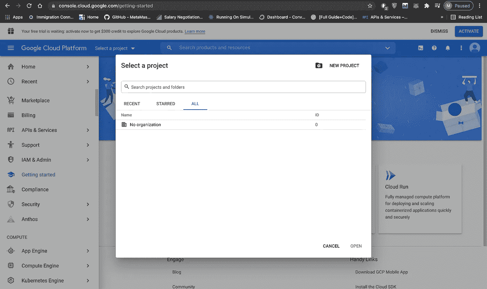

作者拍摄的图像

然后简单地输入一个项目名，点击 create。现在从顶部导航栏选择项目并转到 API，如果您找不到它，只需转到此[链接](https://console.cloud.google.com/apis)。下一步是点击“启用 API 和服务”，搜索“Google Drive”并启用它。

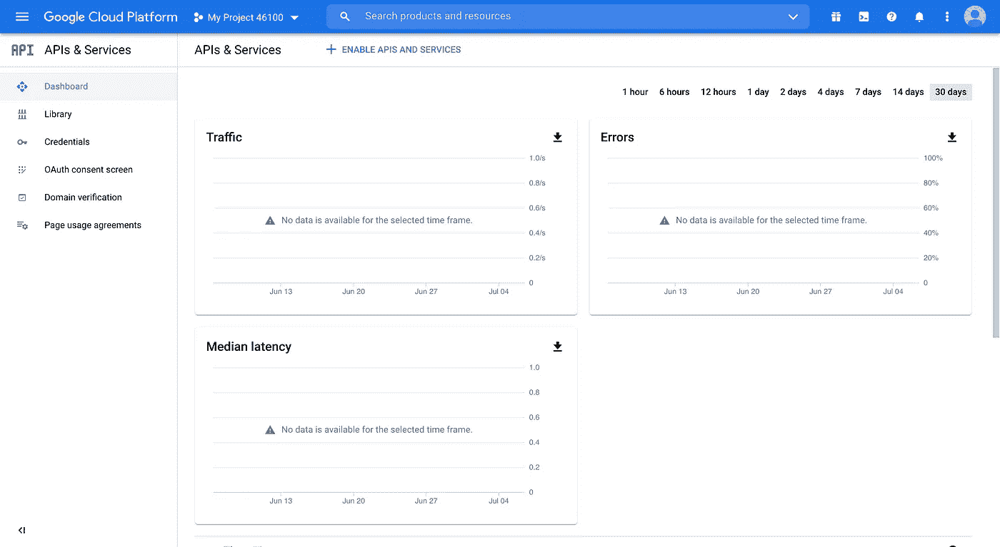

作者拍摄的图像

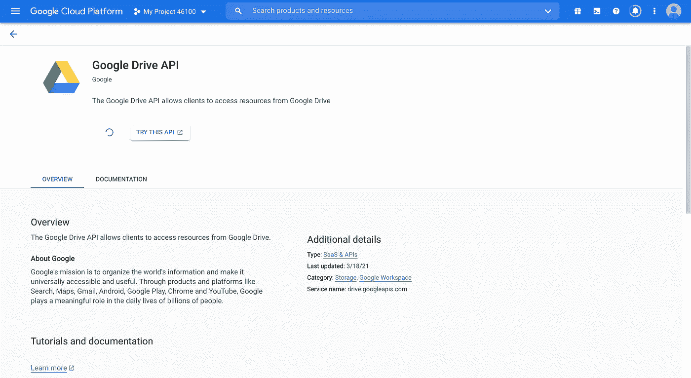

作者拍摄的图像

太好了，现在我们已经为我们的项目启用了 Google Drive API，我们需要创建 API 凭证来为我们的应用程序设置 [OAuth2.0](https://oauth.net/2/) 。因此，单击“CREATE CREDENTIALS ”,从下拉列表中选择“Google Drive API ”,在本例中，我们将选择“User data”作为我们要访问的数据类型:

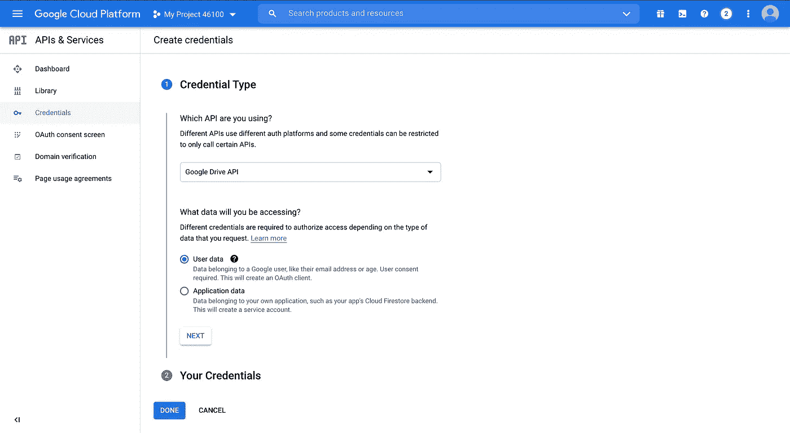

作者拍摄的图像

下一步是配置 OAuth 同意屏幕，所以单击它。选择“外部”(因为我们希望外部用户访问应用程序)，填写应用程序名称和开发者信息。对于第二步(范围)，只需点击保存并继续，我们可以稍后更改范围。对于测试用户来说，由于 API 最初将处于测试模式，**不要忘记在这里添加您将用于测试的电子邮件，如果您使用任何其他电子邮件登录应用程序，它将无法工作。一旦你把 API 推向生产并验证了应用，你就可以用任何电子邮件登录了。**

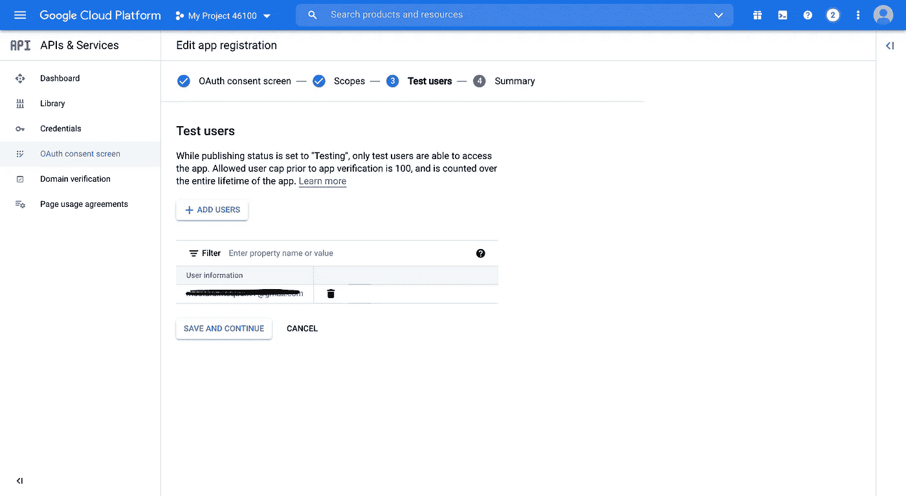

作者拍摄的图像

好了，现在我们完成了这个，让我们为 iOS 创建 API 凭证。单击左侧导航栏上的“凭据”，然后单击“创建凭据”->“OAuth 客户端 ID”:

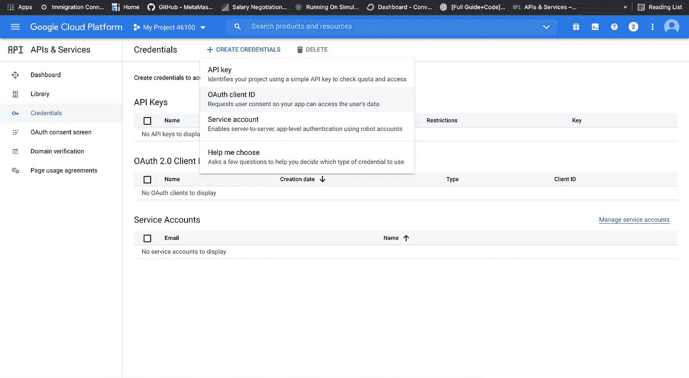

作者拍摄的图像

在应用程序类型中，选择“iOS”并输入您的应用程序的名称。现在我们需要找到包 ID，为此我们需要打开 react 本地项目的 ios 目录(从步骤 1 开始)。只需转到项目目录，然后:

```
cd appName
xed -b ios/
```

这将在 Xcode 中打开应用程序(如果您愿意，您可以手动操作。还要确保您首先更新了 Xcode)。之后，点击左侧导航栏上的应用名称，您可以找到捆绑包标识符:

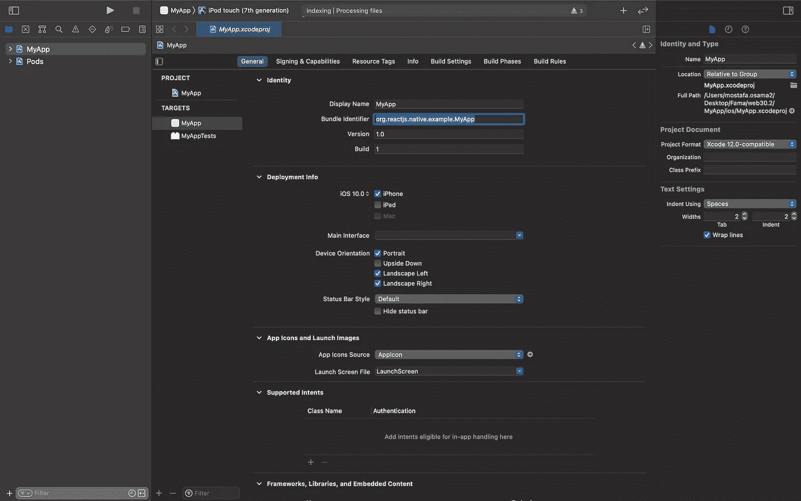

作者拍摄的图像

您可能应该更改这个值，使它更独特，并将其复制到 Google Drive 的 OAuth 部分的“Bundle Id”字段，然后点击 create。

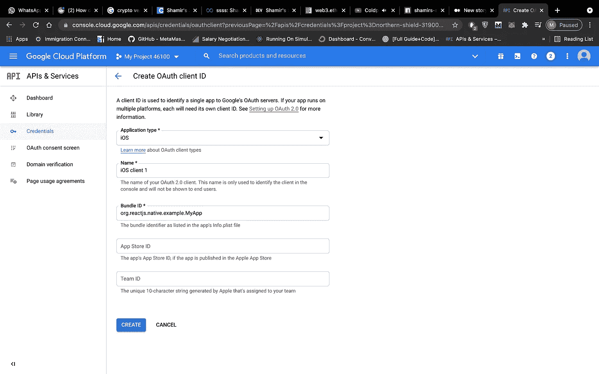

作者拍摄的图像

好了，现在我们终于完成了驱动器管理控制台的设置，让我们来看一些 React 本机代码！

## 步骤 3:让我们为 Google Drive 的 OAuth API 配置 react-native

这一步我们将使用这个[react-native-Google-sign in](https://github.com/react-native-google-signin/google-signin)，接下来的步骤很大一部分来自他们的指南。在 IDE 中打开一个终端和您的 react-native 项目。首先，让我们添加库和它的 pod(注意这是针对 React-Native > 0.6):

```
yarn add @react-native-google-signin/google-signin
cd ios/ && pod install && cd ..
```

现在我们需要将 API 使用的自定义 URL 方案添加到我们的 iOS 应用程序中。这是因为，与 web 应用程序不同，移动应用程序没有运行的前端服务器，因此它们的重定向 URIs 会有所不同。首先，我们需要从 google drive iOS OAuth 凭据中获取反向的客户端 ID，然后我们需要将其添加到应用程序中。在我们的 Google Drive 管理控制台中，您会在“OAuth 2.0 客户端 id”下找到您的 ios 客户端。单击该客户端右侧的下载按钮，这将下载其配置文件:

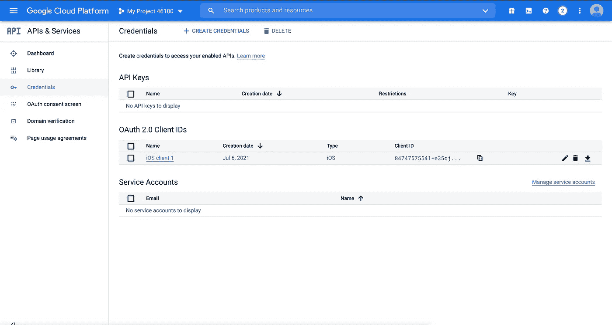

作者拍摄的图像

打开下载的。plist 文件，你会在那里找到“REVERSED_CLIENT_ID”字符串(它以“com.googleusercontent”开头)，复制那个字符串，然后在 Xcode 中打开 ios/目录(用 xed -b ios 或者手动)。转到我们获得包标识符的同一个地方，但是我们想要“Info”选项卡，而不是“General”选项卡(从中间的导航栏)。将反转的客户端 id 粘贴到“URL 方案”中:

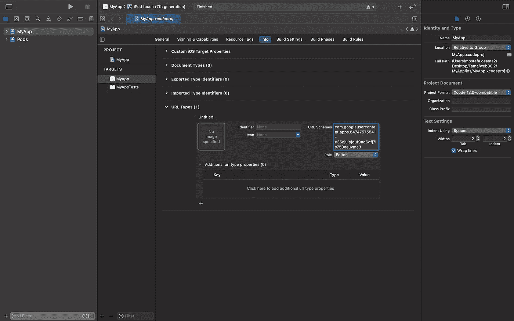

作者拍摄的图像

现在你需要将这个文件重命名为“GoogleService-Info.plist”并将其复制到我们项目的 ios/目录中。然后，您需要将它链接到项目的构建阶段。因此，不要选择“Info”选项卡，转到“Build Phases”并展开“Copy Bundle Resources”，点击“+”图标->“Add Other”并选择。plist:

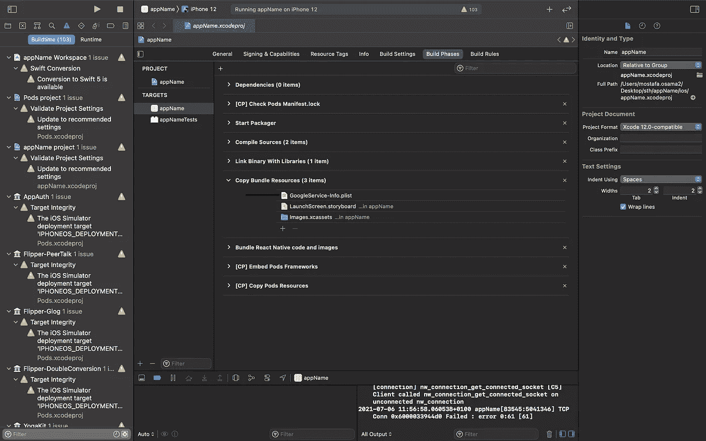

作者拍摄的图像

唷！我们需要做大量的配置，但是现在已经完成了，我们不需要再做了。下一点是关于添加连接 RN 中 API 的代码。

## 第四步:让我们把 react-native 连接到 Google Drive 的 OAuth API 上

首先，您需要获取您的 CLIENT_ID，您可以在同一个配置中找到它。我们之前下载的 plist 文件(它将位于 REVERSED_CLIENT_ID 的正上方)，您也可以在 Google Drive API 控制台上找到它。转到您的 App.tsx 并添加以下内容(您可能希望稍后将其重构为一个钩子):

补充这一点，您可能会发现用 Xcode 构建项目并查看是否一切正常非常有用。注意**第一次不要用 yarn ios 构建，先用 Xcode 构建应用上面的配置。**

接下来是签到功能，你可以在你的 App()上面添加这个渲染功能(来源: [Github](https://github.com/react-native-google-signin/google-signin) )

下一步是添加 UI google sign-in 按钮，并将其链接到登录函数，让我们暂时去掉样板 UI 视图，使我们的呈现看起来像这样(主要添加的组件是“GoogleSigninButton”:

最终的视图应该是这样的(不是花哨的，而是有效的):

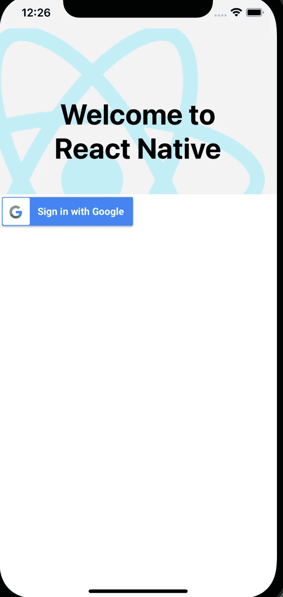

作者拍摄的图像

就是这样！点击模拟器上的按钮，检查流程是否正常。**注意，请确保您使用的是之前添加到 Google Drive API 控制台的测试电子邮件，否则，您将被拒绝访问。**

在下一个教程(第 2 部分)中，我们将设置 android 部分，我们将使用更多的 Google Drive API 函数来读写驱动器！