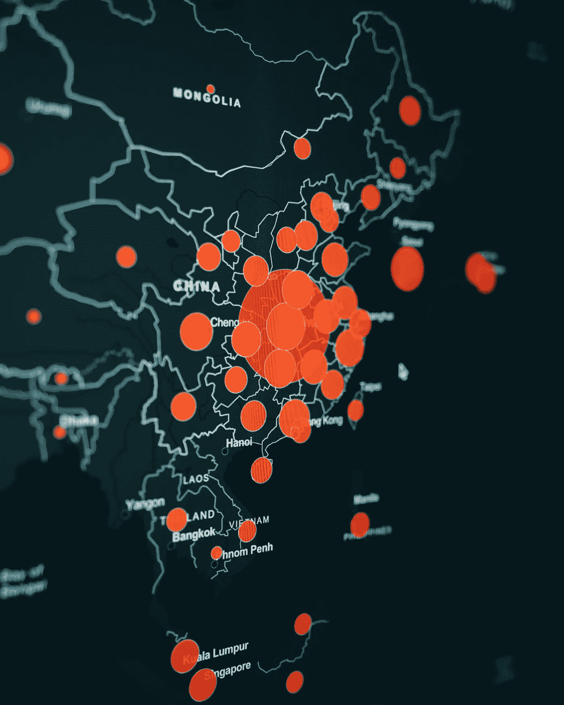
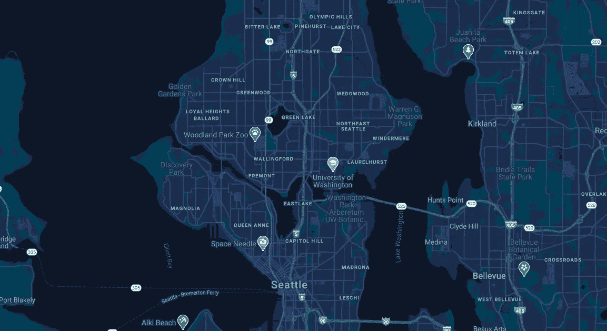

# 将谷歌地图集成到 React 应用程序中！

> 原文：<https://levelup.gitconnected.com/integrate-google-maps-to-your-react-application-fcd85c4b24e2>



如果你此刻问我，到目前为止，你在 web 开发中做过的最满意的事情是什么，答案之一会是 React 项目中 Google Maps 的整合。

整个过程中令人满意的是，集成很有趣，也相当容易。

不想浪费时间，我们开始流程吧。

所以我们需要名为[的 Google Maps React](https://www.npmjs.com/package/google-maps-react) 的库，你可以猜到 React 应用程序的 Google Map 库。

导航到您的项目后，您可以通过在“终端”中键入以下内容来安装它。

```
npm install --save google-maps-react
```

# 创建配置文件

首先，让我们创建一个 **config.js** 文件，它将包含经度，纬度，缩放级别，谷歌地图 API 键，你应该获得它来使用你的地图配置的地图和其他参数。

如果你想把整个项目发布到公共场所，你需要隐藏这个文件或者**特别是 apiKey。**如果你想把它推到 git，只需把 **config.js** 文件添加到你的**中。gitignore** 文件。

1.  **缩放级别**指定地图加载时的初始缩放级别
2.  **纬度聚焦地图**和**经度聚焦地图**指定地图加载时显示的初始位置
3.  **标记经度**和**标记纬度**指定标记在地图中的位置(如果你有标记的话)
4.  **apiKey** 是访问和使用谷歌地图的钥匙(对其他人隐藏)
5.  **useDefaultUI** 是地图环绕按钮(缩放级别按钮、全屏模式按钮、卫星和地图选项按钮以及 360°查看按钮)的设置。当它是假的时候，他们就会躲起来。默认情况下，这是正确的。
6.  **googleMapsMarkerIcon** 是标记的图标图像。它也有默认的红色标记。

# 创建主 MapComponent

这是地图组件的外观。

在第 7–9 行，我们指定了一些配置，然后将地图传递给他们。您可以直接从 config 中传递，但是为了更灵活地进行将来的更改，最好像本例中这样做。

> 注意:您需要指定默认的 **lat** 和 **lng** 参数，因为如果您不指定，地图将不会显示任何内容。

**标记**是地图上标记的组成部分。我们给它的坐标和自定义图标(可选)，它出现在地图上。您可以将许多标记作为子标记传递给**地图**组件。

除了标记，我们还可以添加信息窗口，当你点击一个特定的标记时，它可以显示一些信息。

这里可以看到两个方法( **onMarkerClick** 和 **onInfoWindowClose**

当用户点击**标记**时，我们调用 **onMarkerClick** ，该方法获取将在 infoWindow、标记引用上显示的文本，并将其设置为 state。它还通过设置 **showingInfoWindow: true 来显示信息窗口。**

如果用户切换到另一个标记或单击活动信息窗口上的关闭按钮，则 onInfoWindowClose 方法启动并关闭活动信息窗口。

# 创建自定义样式

你可以看到我们导入了 **mapStyles** 并将其传递给了 **styles** 参数**下的 maps。如果你想要一张这样的地图，这就是你地图的定制风格**



我们的 mapStyles 文件将如下所示

是的，它只是一个 JSON 对象。您可以在这个[地图配置器](https://mapstyle.withgoogle.com/)中对其进行定制并获得您独特风格的地图。

就是这样。感谢您阅读我的文章🤩

如果你想要更多，我建议你也看看我其他有趣的文章👇🏻

[您需要的顶级 Visual Studio 扩展](/top-visual-studio-code-extensions-you-should-install-161faa68952c)

[如何成为更好的开发者！编写更好代码的技巧](/how-to-be-a-better-developer-717a2f9bd68e)

你应该知道的技巧、诀窍和 JS 特性的终极指南！

[单链表:JavaScript 和 ES6 中的数据结构(第一部分)](/data-structures-linked-lists-in-javascript-es6-part-i-db9c83854d94)

[什么是 AI？耶还是奈？](https://medium.com/@danielmovsesyan/what-is-ai-yay-or-nay-781a5713b9cc)