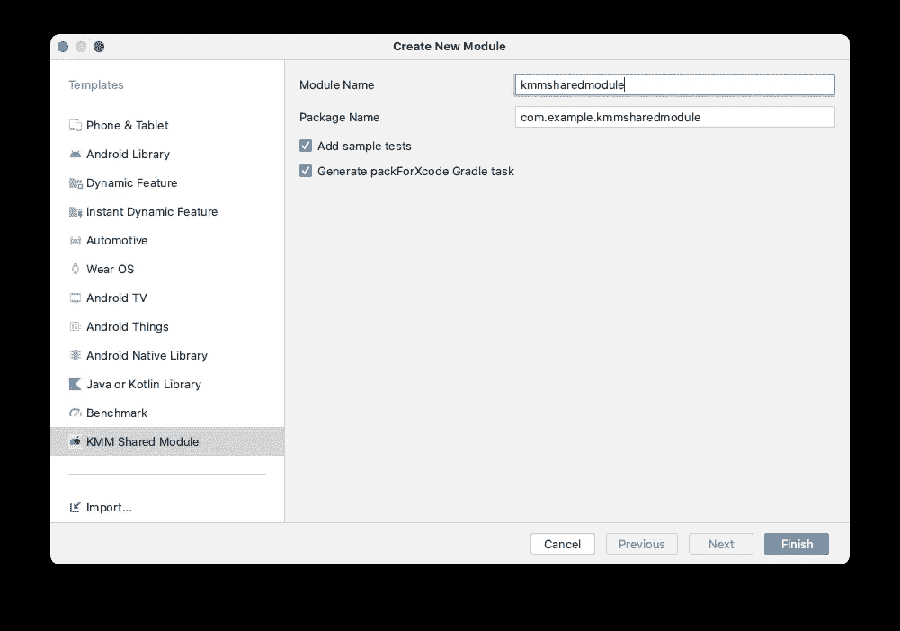
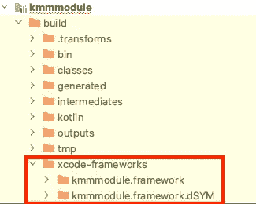
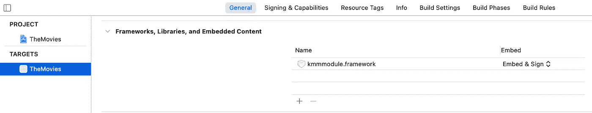
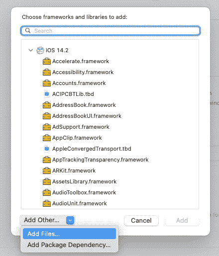
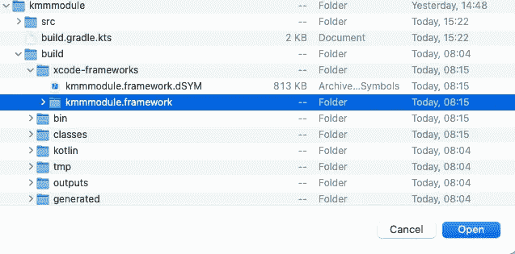
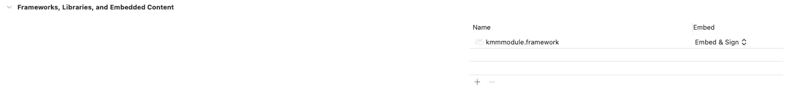
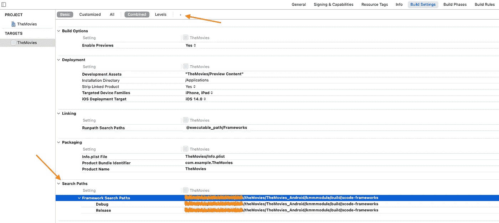
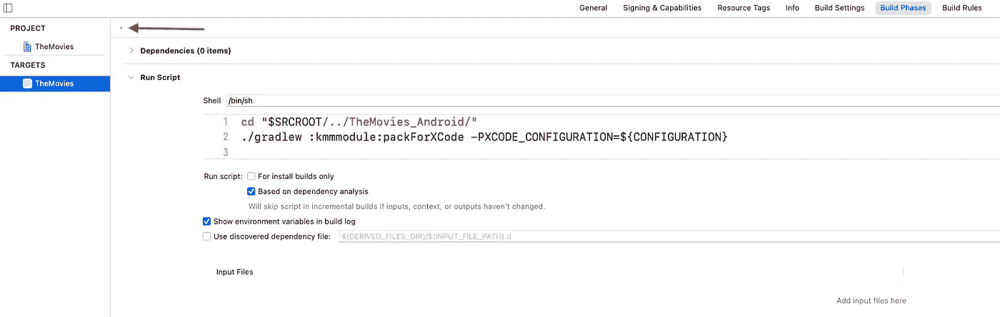
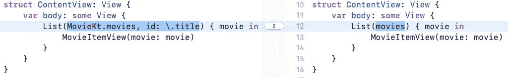
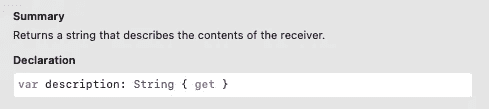

# 将 Kotlin 多平台移动应用集成到现有的 Android 和 iOS 应用中

> 原文：<https://levelup.gitconnected.com/integrate-kotlin-multiplatform-mobile-to-existing-android-and-ios-apps-93876060bff5>


马库斯·温克勒在 [Unsplash](https://unsplash.com/s/photos/sharing-computer?utm_source=unsplash&utm_medium=referral&utm_content=creditCopyText) 上的照片

Kotlin Multiplatform Mobile(KMM)是一个 SDK，它允许你使用一种你非常喜欢的语言，并在[多个目标](https://kotlinlang.org/docs/reference/mpp-supported-platforms.html)之间共享 Kotlin 代码。第一个 alpha 版本于 2020 年夏末发布，我相信我们很快会看到更多。

借此机会，我们来分享一下 Android 和 iOS 平台的常用代码。[上一个故事](https://medium.com/swlh/explore-swiftui-and-jetpack-compose-6c3efa6d8bb)探索 SwiftUI 和 Jetpack Compose 构建简单的 Android 和 iOS 应用程序，显示一系列被嘲笑的电影。因此，我们将重用现有的项目，创建一个共享的 KMM 模块，在那里放置公共代码，并配置项目来使用它。

## 开始之前🚧

确保您为 KMM 正确配置了工作机器。你可以在官方文档[这里](https://kotlinlang.org/docs/mobile/setup.html)找到详细的交互。

## 识别用于共享的代码🔍

最常见的选择是共享业务逻辑，也就是域层。目前，KMM 社区有很多图书馆，让我们可以分享更多。我们可以共享[网络通信](https://kotlinlang.org/docs/mobile/use-ktor-for-networking.html#connect-ktor)、[缓存](https://kotlinlang.org/docs/mobile/configure-sqldelight-for-data-storage.html)信息，甚至 [UI](https://github.com/icerockdev/moko-widgets) 层的逻辑。在任何情况下，共享代码库都会带来一些困难，尤其是对 iOS 开发人员来说，因为他们将依赖于一个带有公共代码的生成框架。

在你做出自己的决定之前，我建议你浏览一下这些案例研究。你可以找到大量知名公司正在使用这种技术并分享他们的经验。

在我们的例子中，我们将把常见的业务逻辑移到 KMM 模块，并在 Android 和 iOS 应用程序中重用它。

# 添加 Kotlin 多平台移动模块

由于我们已经有了 Android 应用程序，我们将在这个项目中创建一个 KMM 模块。该模块将作为普通的 Gradle 模块提供。因此，对于 Android 开发者来说，使用共享的 KMM 模块更加容易。

我们将使用 Kotlin 多平台移动[插件](https://plugins.jetbrains.com/plugin/14936-kotlin-multiplatform-mobile)为我们的应用程序创建一个 KMM 模块。该插件适用于 Android Studio 或更高版本的 macOS 用户。

要在 Android Studio 中添加一个新模块，我们应该打开
文件→新建→新建模块…



这是一个新的模块向导。根据 Android Studio 版本的不同，可能会有所不同。目前的 Android Studio 版本是北极狐| 2020.3.1 金丝雀 1

您可以在这里为您的 KMM 模块选择名称和包名。我强烈建议选择生成 packForXcode Gradle 任务。此任务将使用通用代码创建 Xcode 框架。我选择了`kmmmodule`作为模块名，`com.example.kmmmodule` 作为包名。一旦你按下完成按钮，KMM 插件将创建一个独立的 KMM 模块，默认代码模板。就是这样🚀。我们创建了一个多平台模块，但我们无法从应用程序访问它。

所以我们需要添加 **kmmmodule** 作为对 **app** 模块的依赖

```
// build.gradle in the app module
dependencies **{
    ...** implementation project(**path**: **':kmmmodule'**)
}
```

您可以在这个[提交](https://github.com/Y-Datsenko/TheMovies_Android/commit/aa006fcbb845d17b171be902a8be087a221398c9)中找到与 KMM 模块创建相关的所有更改。在这个提交的范围内，我将 **kmmmodule/build** 文件夹添加到。gitignore 和增加的 minSdkVersion。

另外，我在 **gradle.properties** 中添加了 iOS 项目的相对路径

```
xcodeproj=../TheMovies_iOS
```

我们可以将使用 Android 项目目录路径的路径作为起点。所以，上面的路径说:返回一个文件夹，打开 Movies_iOS。它工作得很好，因为我将两个项目放在一个公共文件夹中。KMM 插件使用这个路径来设置依赖的项目，并提供从 Android Studio 构建和运行 iOS 应用程序的能力。

> 如果 iOS 应用程序的运行/调试配置找不到*。xcodeproj 文件，检查[这个](https://stackoverflow.com/a/41536029)出来。它帮助我解决了这个问题)

# 将 KMM 模块连接到 iOS 项目

对于 iOS 开发者来说，与 KMM 模块的集成更加困难。因为我们必须向项目添加一个生成的框架，添加*运行脚本*构建阶段，并提供框架搜索路径。

## 将框架添加到 Xcode 项目中

packForXcode Gradle 任务负责 Xcode 框架的生成。这个框架将包含所有共享代码。KMM 插件增加了这个任务，并将其连接到 Android 应用程序的构建过程中。但是您可以导航到项目根目录并通过执行下面的`./gradlew packForXcode`手动生成框架

在执行上述任务时，我观察到 Xcode 配置错误的以下问题:

> KonanExternalToolFailure “/ usr/bin/xcrun 命令返回非零退出代码:72”

如果你有同样的问题，你可以看看这里的解决方案😃)任务应该在`:kmmmodule/build/xcode-frameworks`文件夹中生成 Xcode 框架。



这时，我们可以将生成的框架添加到 Xcode 中。为此，我们应该打开目标配置文件，选择 General 选项卡，并找到 Frameworks、Libraries 和 Embedded Content 部分。按加号->添加其他… ->添加文件… →选择框架文件夹



添加框架后，您将在项目配置中看到它，如下所示:



## 添加框架搜索路径

为了使框架可用，我们需要设置框架搜索路径。



如果您没有看到搜索路径部分，您可以通过单击顶部的加号图标来添加它。之后，您需要提供调试和发布版本的路径。

## 添加*运行脚本*构建阶段

每当我们构建 iOS 项目时，该步骤将触发 **packForXcode** Gradle 任务执行。

我们应该将运行脚本添加到目标配置的 Build Phases 选项卡中。如果你没有看到这一部分，你可以在顶部添加一个小加号。还有一件事☝️，确保你的运行脚本部分被放置在第二个位置。你可以通过拖放来改变它的位置。



就是这样🔥)我们创建了 KMM 模块，并将其集成到现有的 Android 和 iOS 项目中。是时候从 KMM 那里得到好处了。两个项目都包含类似的电影模型和模仿电影列表。因此，我们可以将这段代码移到 KMM 模块，并在任何地方重用它。

这真的很简单。对于 Android 项目，我们需要做的就是将`Movie.kt` 文件移动到 **kmmmodule** 中，并修复 MainActivity 中的导入( [commit](https://github.com/Y-Datsenko/TheMovies_Android/commit/0b23a631d950757ec453d9871cd16f8232d07701) )。运行项目并检查一切是否如预期的那样工作。

在 iOS 应用程序中重用代码也没什么大不了的。因为我们需要移除电影结构，导入 kmmmodule，使用公共代码，并调整一个 bit 实现( [commit](https://github.com/Y-Datsenko/TheMovies_iOS/commit/be4e1c003d7ea5cead6beda947bfb4f16cf943c2) )。

首先，我们可以通过自动生成的`MovieKt`接口访问全局`movies`变量。通用电影模型不符合 Hashable 协议。这就是为什么我们需要手动定义唯一标识电影项目的方式。结果，我们会得到这个:



最后一件事是将`description`改为`description_`，因为`description`是 Swift 提供的实例属性。



恭喜🎉 🙌。我们做得很好，为即将到来的变化配置了项目。多亏了 KMM，我们将能够一次编写代码，多次使用它。但是当你选择分享什么的时候要小心，因为每个选择都有利弊。

这些代码可以在 GitHub [Android](https://github.com/Y-Datsenko/TheMovies_Android) 和 [iOS](https://github.com/Y-Datsenko/TheMovies_iOS) 仓库中找到。

有用的链接:

 [## 为 KMM 开发设置环境-帮助| Kotlin 多平台移动文档

### 在开始创建第一个可以在 iOS 和 Android 上运行的应用程序之前，先建立一个环境…

kotlinlang.org](https://kotlinlang.org/docs/mobile/setup.html) [](https://kotlinlang.org/docs/mobile/create-first-app.html) [## 创建您的第一个多平台应用程序-帮助| Kotlin 多平台移动文档

### 在这里，您将学习如何创建和运行您的第一个 KMM 应用程序。通过以下方式为 KMM 开发建立您的环境…

kotlinlang.org](https://kotlinlang.org/docs/mobile/create-first-app.html)  [## 将 KMM 集成到现有应用程序中-帮助| Kotlin 多平台移动文档

### 在这里，您可以学习如何将 Kotlin 多平台移动(KMM)集成到现有的 Android 应用程序中，并使其…

kotlinlang.org](https://kotlinlang.org/docs/mobile/integrate-in-existing-app.html#mvp-for-legacy-ui-frameworks)  [## 发现您的 KMM 项目-帮助| Kotlin 多平台移动文档

### Kotlin 多平台移动(KMM)技术的目的是将应用程序的开发与

kotlinlang.org](https://kotlinlang.org/docs/mobile/discover-kmm-project.html) [](https://kotlinlang.org/lp/mobile/case-studies/) [## 个案研究

### 了解世界各地的移动团队如何使用 Kotlin 简化他们的开发工作。

kotlinlang.org](https://kotlinlang.org/lp/mobile/case-studies/) 

如果你喜欢这篇文章，我会很高兴在 Twitter 上有新的关注者。我将分享更多关于声明式 UI 和 Kotlin 多平台移动的故事。