# 使用 Redux 和 Axios 将 Laravel (Lumen) API 与 React-Native 移动应用程序集成。

> 原文：<https://levelup.gitconnected.com/integrate-laravel-lumen-api-with-react-native-mobile-app-using-redux-and-axios-c7506f3b5017>

**在这两部分系列中，我们将要经历；**

1.  使用 Laravel Lumen 框架创建简单的轻量级 RESTful API 的过程
2.  在使用 Axios 的 react-native 移动应用程序中使用此 API，Axios 是用于查询 API 的 Javascript 库，Redux 库用于状态管理。

所以，准备一杯咖啡或你最喜欢的饮料，放一些流畅的背景音乐，然后让我们开始吧:

**第一部分:使用 Lumen 框架构建一个简单的 API**

**流明**

流明微框架

Lumen 是一个很棒的 PHP 微框架，这里的“微”指的是它的极简主义方法或轻量级本质。微框架，比如我们的 lumen，另一个例子是 flask python 微框架，允许您启动并运行(就启动/构建 API 而言),而不会受到帐户、身份验证、授权和角色等功能的困扰，这些功能在您的简单应用程序中很可能不需要使用。这就是为什么我选择 Lumen，专注于后端 API 到 react-native(这也可以用于 react web 应用程序)移动应用程序的集成。

# **Lumen 的功能包括:**

## **1。路由**

用户必须在 routes/web.php 文件中为应用程序定义自己的路由。最基本的腔道只接受 URI 和闭合，即:

$router -> get('foo '，function() {

返回“Hello World”；

})

路由器允许注册响应任何 HTTP 动词的路由，例如 GET、POST、PUT、PATCH、DELETE、OPTIONS

## **2。自举**

Lumen 的引导过程位于文件 lumen/bootstrap/app.php 中，该文件执行以下操作:

1.  创建应用程序
2.  注册容器绑定
3.  注册配置文件
4.  注册应用中间件
5.  加载应用程序路由。

## **3。事件**

提供一个简单的 observer 实现，允许用户订阅和监听应用程序中的事件。事件类保存在 app/Events 目录中，它们各自的侦听器保存在应用程序文件 app/Listeners 中。

## **4。缓存**

缓存通常有助于加速应用程序并提高其效率。支持使用健壮的驱动程序，如 Memcached、Redis 和 Database。人们可以安装照明/Redis。

## 5.排队等候

排队服务类似于 laravel 提供的服务。Lumen 队列服务提供了跨各种不同队列后端的统一 API。队列允许用户将耗时任务的处理推迟到稍后进行，这大大加快了对应用程序的 web 请求。

# 在 Lumen 中构建需要以下依赖项

## 设计者

这是一个 PHP 的依赖管理器，如果你的电脑中没有安装，导航到 [Composer 官方网站](https://getcomposer.org/download/)并在你的机器中安装它。Composer 是绝对重要的，应该在继续本文的其余部分之前首先安装。

## 服务器端编程语言（Professional Hypertext Preprocessor 的缩写）

因为它是我们用来编写 API 的语言，所以应该安装在你的系统中。确保版本≥ 7.2，[在此获取](https://getcomposer.org/download/)。确保 PHP 扩展 [OpenSSL](https://www.openssl.org/source/) 、 [PDO](https://www.php.net/manual/en/pdo.drivers.php) 和 [Mbstring](https://pkgs.org/download/php-mbstring) 安装在你的系统中。

## MySQL 或 PostgreSQL

我个人更喜欢并将在本教程中使用 PostgreSQL，[在此处获取](https://www.postgresql.org/download/)，然而这是个人偏好，您可以选择使用 [MySQL](https://www.mysql.com/downloads/) 或任何其他您熟悉的数据库管理系统。

# 用 Lumen 快速构建图书和文字 API

API 将主要服务于两种资源；书籍和作者，我们将从外部 API 获取这些数据:[https://anapioficeandfire.com/api/](https://anapioficeandfire.com/api/)

这就是我们需要 API 做的事情:

*   从外部 API 填充图书资源
*   从外部 API 填充字符资源
*   获取所有书籍
*   获取所有字符
*   买一本
*   获取单个字符

此 API 的端点，给定书籍和角色资源将具有以下端点:

*   获取所有书籍—获取/API/书籍
*   获取一本书— GET /api/book/1
*   获取所有字符— GET /api/characters
*   获取一个字符— GET /api/characters/1

书籍和角色属性将包括以下内容

*   书:名称，ISBN，作者，发行日期，人物
*   人物:姓名、性别、文化、别名、书籍

## 安装 Lumen 微框架

如果您在 Linux 环境下，导航到/var/www，用您选择的名称创建一个文件夹，即 practice_folder，导航到这个文件夹，然后运行下面的命令，用 [Lumen](https://lumen.laravel.com/docs/9.x) 创建一个新项目。

cd 到新创建的项目中。

如果您现在从项目根目录运行"*PHP-S localhost:3000-t public "*，您的应用程序将在您的浏览器中提供服务，如下所示:

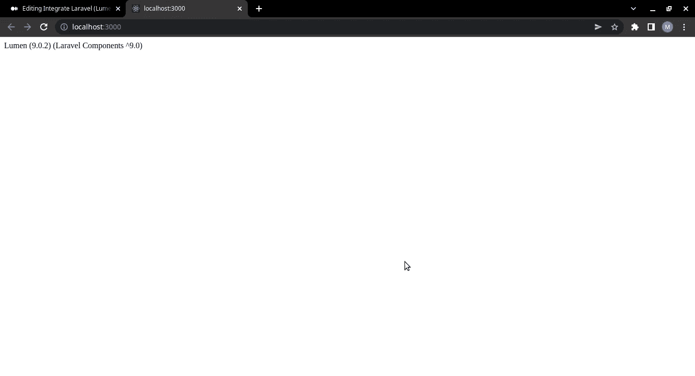

您的浏览器页面将如下所示

## 雄辩和门面

雄辩是一个对象关系映射器(ORM ),它使与数据库的交互变得轻而易举。当使用口才时，每个数据库表都有一个相应的“模型”，用于与该表进行交互。外观为应用程序服务容器中可用的类提供了一个“静态”接口。所有立面都在 Illuminate\Support\Facades 名称空间中定义

Lumen 的整个引导过程位于一个文件中。打开 bootstrap/app.php 并取消注释下面的代码行；

//app-> witheloquint

一旦取消注释，Lumen 将使用。环境文件。

## 创建数据库

移动到您的终端，键入以下内容登录到 postgress 终端:

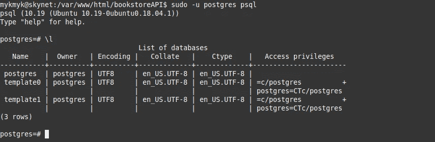

然后，您可以使用命令“\l”列出数据库，之后我们使用下面的命令为我们的 API 创建一个名为“BooksCharactersAPI”的数据库:

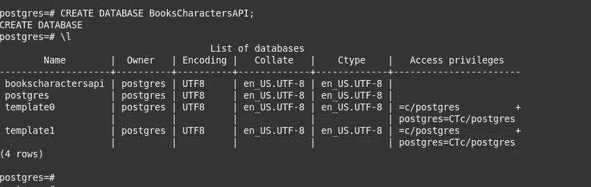

开门。env 文件，并设置正确的配置细节。env 文件如下所示；

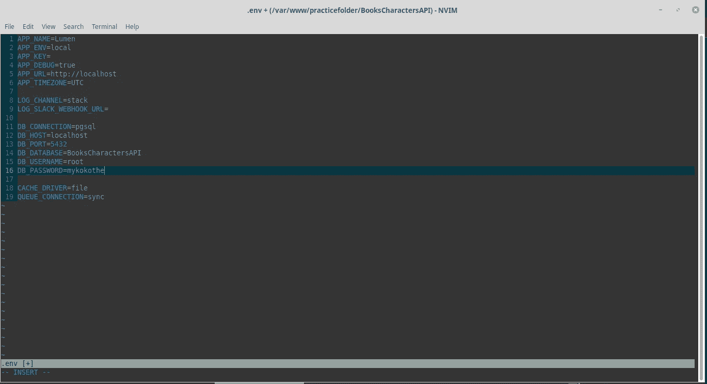

确保用数据库自己的值替换变量 DB_DATABASE、DB_USERNAME、DB_PASSWORD 的值，还要注意，对于 MySQL，除了两个值之外，大多数值保持不变；

*   DB_CONNECTION =MySQL
*   DB_PORT = 3306

在我们开始之前，我们必须添加一些库，因为 lumen 的精简特性，它排除了 laravel 中存在的一些库，例如，我们不能使用以下命令创建模型:

*   php 工匠制作:模型书

为此，请使用 composer 安装这些库:

然后在我们的 bootstrap/app.php 文件中启用它:

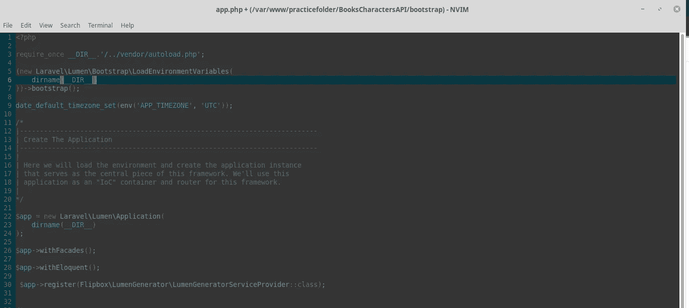

注意，在上图中，我们还取消了两行注释

*   $app->带有外观
*   $ app-> witheloquint

## 设置数据库模型和迁移

使用我们已经建立的名为“bookscharactersapi”的 PostgreSQL 数据库，我们现在将利用这个数据库:

首先，我们将为 books 表和 characters 表创建一个迁移。迁移是数据库的一种版本控制。它们允许团队修改数据库模式，并跟踪当前模式状态的数据。迁移通常与 Schema Builder 一起使用，以便轻松管理应用程序模式。

书籍进行迁移；

结果是

人物迁徙；

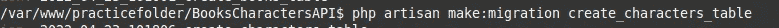

结果是

这些新的迁移将放在您的数据库/迁移目录中。每个迁移文件都包含一个时间戳，这允许 Lumen 确定迁移的顺序。我们现在将修改这些迁移，以包括我们的字符和书籍表的属性:

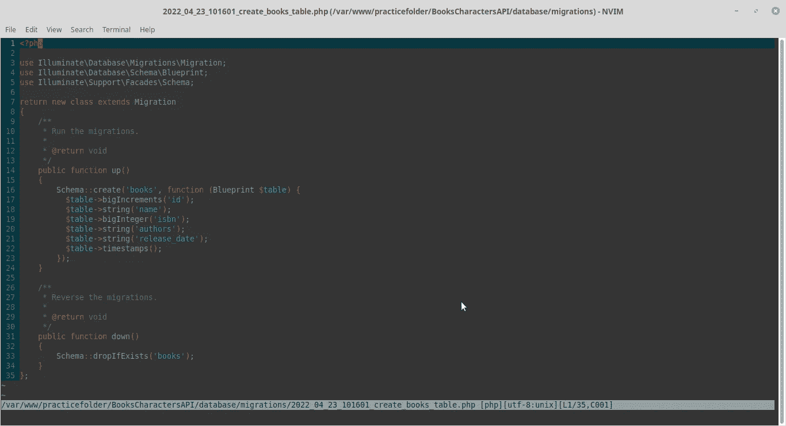

对于字符，结果为；

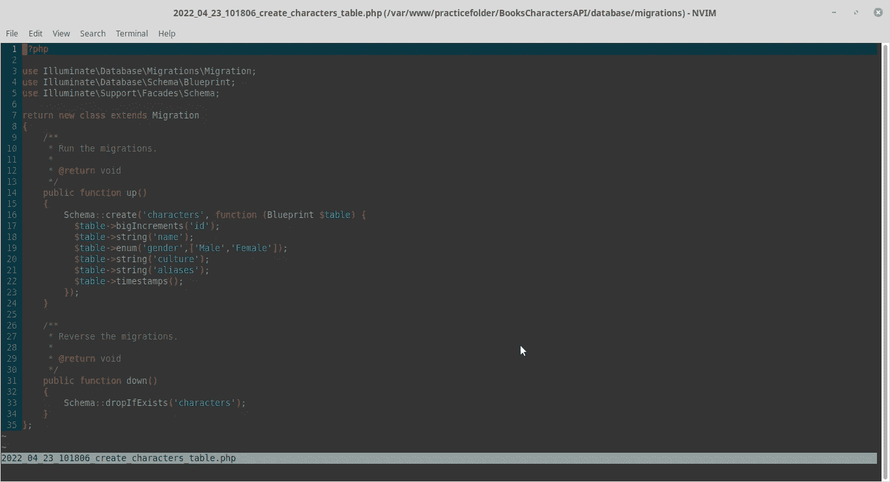

我

在上面的文件中，我们在书籍和角色表中增加了几个额外的列，即姓名、性别、角色别名和 ISBN、书籍名称。

现在，我们使用下面的命令运行迁移

如果您遇到以下错误，请放松。我们将在下面解决它:

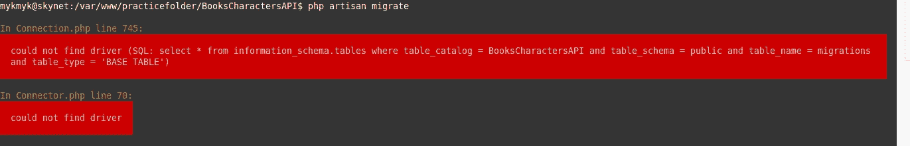

上述错误表明我们的系统缺少 PHP 的 PostgreSQL 数据库驱动程序，我们通过安装如下驱动程序来解决它:

如果失败，找出你的 PHP 版本号，比如我的版本号是 8.0.18，然后插入上面的命令，它看起来会像下面这样，

*   安装 php8.0-pgsql

成功的迁移命令将导致以下屏幕:

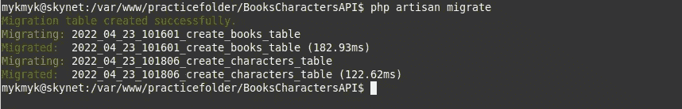

现在，如果您检查您的数据库，您应该有如下的书籍和迁移；

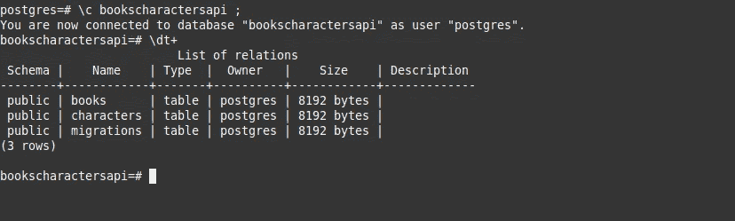

接下来，在根文件夹上运行下面的命令

*   php 工匠迁移:模型书
*   php artisan 迁移:模型角色

这将生成位于目录 app\Models 中的模型文件，该文件扩展了 Illuminate \ Database \ olesale \ Model，打开这两个文件并按如下方式填充它们:

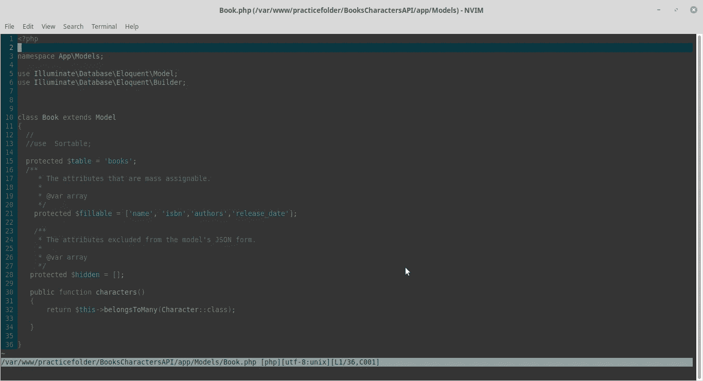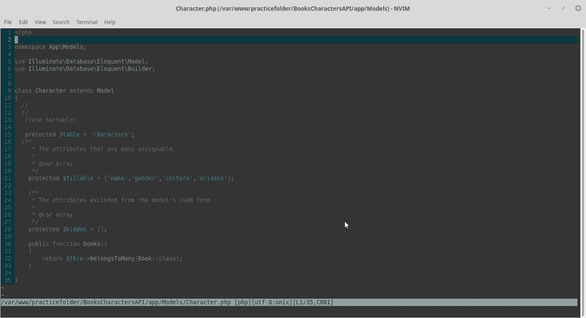

## 设置路线

Lumen 路由相当简单，我们在 routes/web.php 文件中定义了应用程序的所有路由。最基本的腔道只接受 URI 和闭合。

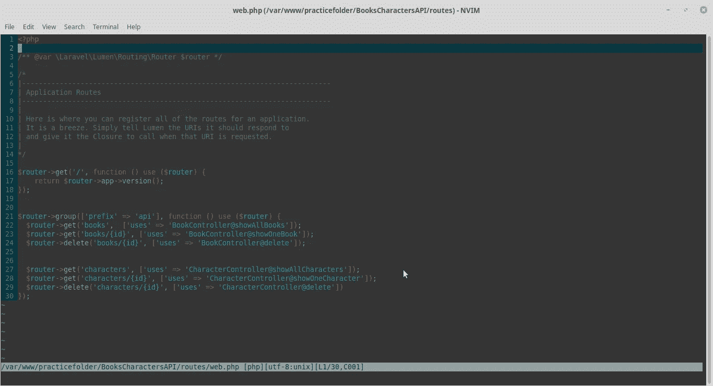

在上面的代码中，我们将每条路线的功能抽象为两个控制器，即 BookController 和 CharacterController。路由组允许共享路由属性，例如跨大量路由的中间件或名称空间，而不需要在每个路由上定义这些属性。因此，如上所述，每个路由都有一个前缀/api。接下来，让我们创建我们的图书控制器和角色控制器。

## 构建我们的图书控制器

在 app/Http/Controllers 文件夹下新建一个 BookController.php 文件，该文件的代码应该如下所示:

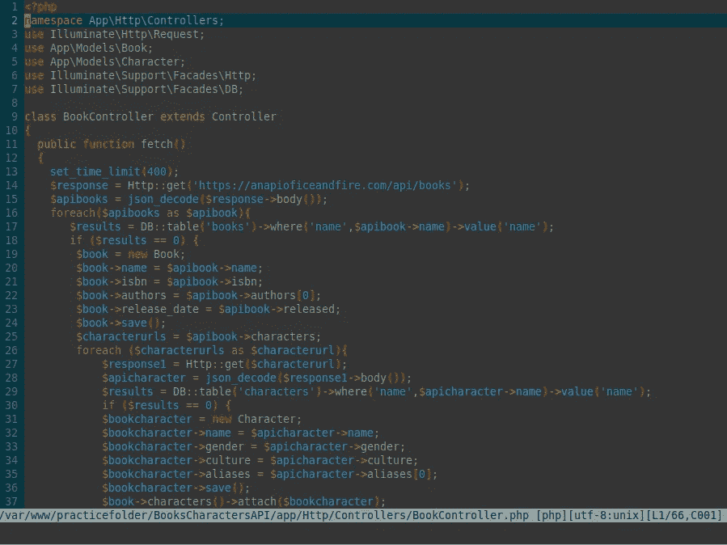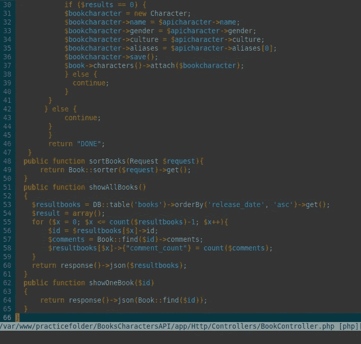

在上面的代码中我们有:

要求我们的两个模型使用以下代码行:“使用 App\Models\Book”作为我们的图书模型，“使用 App\Models\Character”作为我们之前创建的角色模型。

接下来，我们创建了以下方法:

*   fetch—/GET-用于从外部 API 获取所有书籍和角色
*   sort books—/GET——用于获取排序形式的书籍，可以按名称等进行排序。
*   showAllBooks — /GET -用于获取所有书籍，而不对搜索查询进行任何修改
*   showone book—/GET-用于从 API 获取特定的图书

对于我们的角色控制器，如下所示:

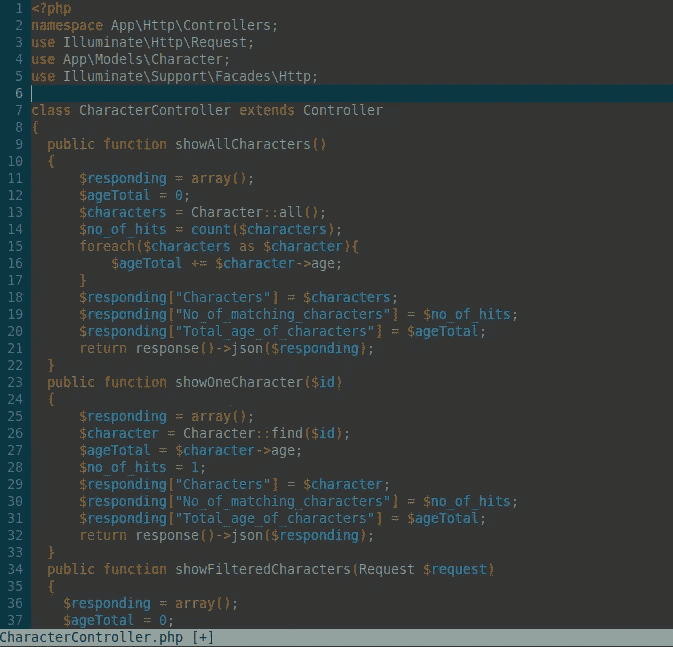

角色资源的端点

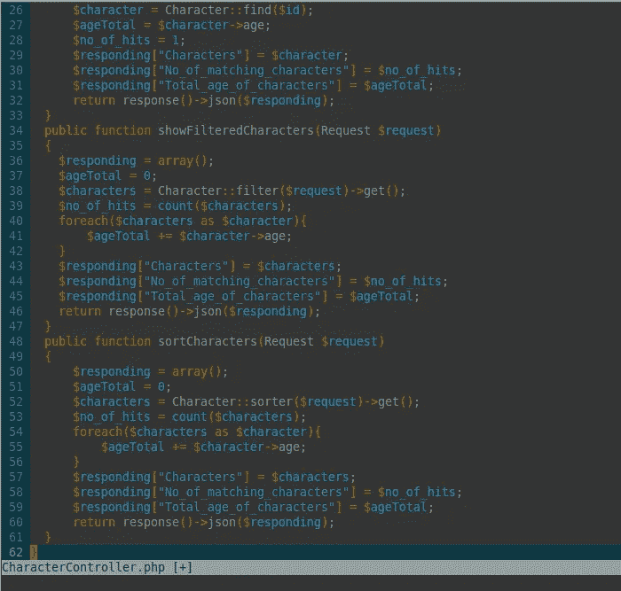

构建完控制器后，我们必须填充数据库，为此我们必须调用 fetch 端点，即 visit /api/fetch/，这将需要一些时间来同时填充 books 表和 characters 表。

如果您遇到错误“Class”guzzle http \ handler stack“not found”，请查看我关于堆栈溢出的答案[这里](https://stackoverflow.com/a/72063160/17837863)(记得投赞成票)。

这里可以参考最后变异的代码:【https://github.com/myk4040okothogodo/bookstoreAPI/T2

在下一个续集中，我将讨论使用我们自己的模块对我们的书籍和资源进行过滤和排序，然后我们将测试我们的 API(使用 POSTMAN ),最后构建我们的前端 react 本机应用程序来使用该 API。再见，到时见。