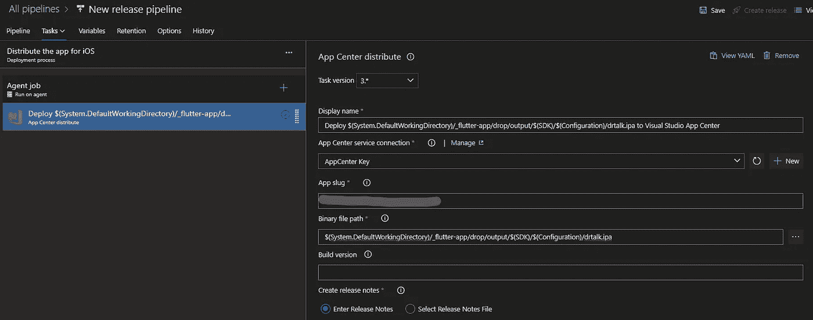

# 使用 Azure DevOps 和应用中心分发您的 Flutter 应用程序

> 原文：<https://levelup.gitconnected.com/integrate-your-flutter-application-with-azure-devops-and-app-center-6e5e5ee4a53>

作为开发人员，您希望自动化手动任务，以提高生产率和节省时间。使用 DevOps 工具，你可以很容易地做到这一点。在本文中，我将介绍如何为你的 flutter 应用程序创建一个**公关管道**和一个**部署管道**。

## 在 Azure DevOps 中安装[颤振任务](https://marketplace.visualstudio.com/items?itemName=Hey24sheep.flutter)

在我们做任何事情之前，我们需要安装上面的扩展“Flutter Tasks”来帮助我们处理管道。你可以从上面的链接下载或者去 [Visual Studio 市场](https://marketplace.visualstudio.com/)。安装后，您应该能够看到以下任务:

## 在 DevOps 中创建 PR 构建管道

首先，您需要连接到您的 Git 存储库:

然后，您可以选择您的存储库和启动管道。

## 公关 YAML 文件

由于这是一个 PR 管道，我们不必设置触发器，因为我们将在 develop 分支上添加这个管道作为构建策略。因此，当提交 PR 和开发目标时，构建将会运行。

然后，我们需要添加我们的颤振任务:

在这里，我添加了 3 个任务:
-**flutter install**-安装最新版本的 flutter(在稳定频道上)
-**flutter build**-然后构建适用于 android 和 ios 的应用程序。我们将 iosCodesign 设置为 false，因为我们不需要为 PR 管道签署应用程序。
还有其他可选参数可以设置，如构建风格、版本号等。
-**flutter test**-这运行我们在项目中的所有测试。

**PR 管道完成！**您现在可以进入开发分支策略(Repos->Branches->develop->Scroll to Build Validation)并将管道添加为新的构建策略:

然后，当创建 PR 时，您应该看到管道正在运行:

## 在 DevOps 中创建部署管道

通过部署管道，我们可以使用以前的 YAML，并在其上进行扩展。确保您将触发器添加到 YAML 的顶部，这样当代码被合并到“开发”(或任何您想要的分支)中时，它将运行这个管道:

我们现在需要在库中创建一些变量，以便在管道中使用。

对于 Android，您需要添加您的**密钥别名**、**密码、**和**密钥库**:

可变组

安全文件

对于 iOS，您需要添加您的**证书密码**、 **Certificates.p12** 和**预置描述文件**:

可变组

安全文件

既然我们已经建立了图书馆，让我们跳回 YAML。

## Android 签名和发布

我们现在签署并发布工件，这样我们可以在以后的发布管道中使用它。

## iOS 签名和发布

我们现在还可以签名并发布工件以备后用。

# 部署到应用中心

我们现在需要在 DevOps 中创建一个发布管道来使用之前发布的工件。

首先，我们将定义我们的工件:

然后，在添加我们的阶段之前，我们需要添加来自市场的 [App Center Distribute](https://marketplace.visualstudio.com/items?itemName=MsAppCenter.app-center-distribute-v3) :

安装完成后，我们可以将其添加到 Android 的第一阶段:

点击信息图标旁边的“管理”超链接，即可建立 App Center 服务连接。一旦您设置了密钥，您就可以在那里添加它。

app slug 的格式为**{用户名}/{app_identifier}** 。https://appcenter.ms/users/**【用户名】**/应用程序/**{应用程序标识符}** 。如果您使用的是 orgs，那么 app slug 的格式为**{ orgname }/{ app _ identifier }**。

然后，您还可以给出 APK 的文件路径(来自工件)。

那就是安卓搞定了！

然后，我们可以为 iOS 添加另一个阶段:

这与上面的几乎完全相同，除了我们的目标是 IPA。

现在 iOS 也搞定了！

当您运行部署管道时，您的应用应该会自动部署到应用中心！

注意:这些 app center 的最后步骤也可以直接在管道中完成，这完全取决于您想要如何处理它。

感谢阅读！

如果你有任何问题，你可以通过以下方式联系我: [LinkedIn](https://www.linkedin.com/in/luke-moody-0482651a6/) ， [Twitter](https://twitter.com/LukeMoody01)