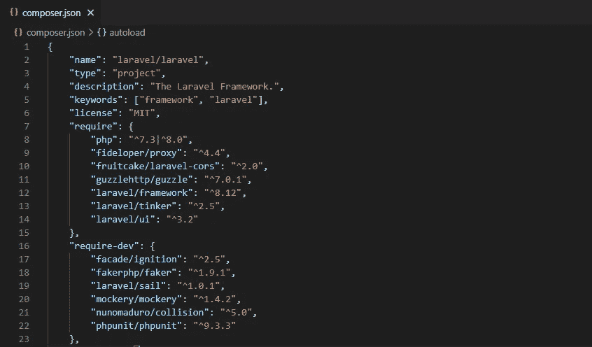
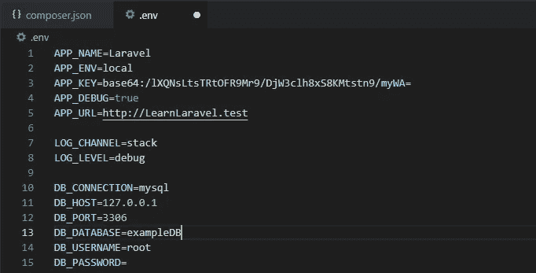
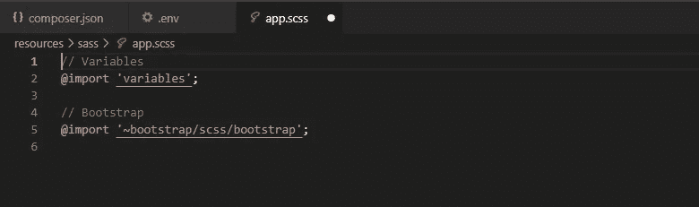
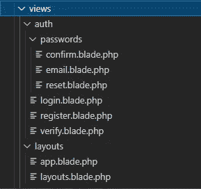
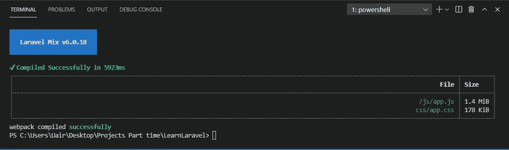

# 集成 AdminLTE 3 和 Laravel 8

> 原文：<https://levelup.gitconnected.com/integrating-adminlte-3-and-laravel-8-51c1555efa60>

## 如何在 Laravel 8 应用程序中使用 AdminLTE 3 模板


托马斯·索贝克在 [Unsplash](https://unsplash.com?utm_source=medium&utm_medium=referral) 上的照片

# 拉勒韦尔

[Laravel](https://laravel.com/) 是一个免费、开源、成熟的 PHP 框架，用于开发 Web 应用。它是目前最强大的框架之一，还有 CodeIgniter、Zend 等等。

Laravel 遵循基于 Symphony 的模型-视图-控制器架构。对于那些熟悉 ASP.NET 核心 MVC 的人来说，Laravel 与此非常相似，因为它是用 PHP 编写的。

# 管理 3

[Admin LTE](https://adminlte.io/) 是一个免费的开源管理仪表板和控制面板模板，构建于 [Bootstrap](https://getbootstrap.com/) 之上。AdminLTE 已经开发了多年，目前是 3.x 版本。

它的简单性和流畅性有助于减少使用 HTML 和 Bootstrap 的开发时间，因为许多组件都是预制的，可以很容易地获取和使用。

这是我们将在本次演示中使用的 AdminLTE 3 模板的预览:

[](https://adminlte.io/themes/dev/AdminLTE/index3.html) [## 管理 3 |仪表板 3

### 编辑描述

adminlte.io](https://adminlte.io/themes/dev/AdminLTE/index3.html) 

# 为什么选择 UI 模板

模板化是一种非常好的方法，它有助于减少时间并帮助快速开发应用程序。UI 模板化利用了 Brad Frost 提到的类似于[原子设计](https://bradfrost.com/blog/post/atomic-web-design/)的思想。通过遵循这一技巧，可以轻松获得以下好处:

*   **速度**:有了组件，就可以很容易地进行开发。
*   **一致性**:由于我们使用了特定的组件库，你可以自始至终保持一致的设计。
*   **可重用**:如有必要，您可以重用现有组件来制作新的定制组件。
*   **一系列可用资源**:可以轻松地在网上搜索多种资源。

网上有很多 UI 模板，我最喜欢的是 Bootstrap、Material UI 和 Admin LTE。在这个故事中，我们将使用 AdminLTE，它构建在 Bootstrap 组件之上，并使用字体很棒的图标。

# 将 Laravel 8 与 Admin LTE 3 集成

## Laravel 项目设置

要在你的机器上安装 Laravel，你需要安装 [Composer](https://getcomposer.org/doc/00-intro.md#installation-linux-unix-macos) 和 PHP。你可以安装 PHP 和 XAMPP T4 服务器。此外，您将需要[节点包管理器](https://nodejs.org/en/download/)。

以上方法是我在 y Windows 机器上安装 Laravel 所采取的方法。然而，我们还有许多其他方法可以安装 [Laravel](https://laravel.com/docs/8.x) 。

要使用 Composer 创建项目，您需要全局安装 Laravel 安装程序一次。在终端窗口上运行这行代码。

```
composer global require laravel/installer
```

然后，您可以继续创建项目。现在，让我们创建名为 example-app 的项目。在终端窗口上运行这些代码行。

```
laravel new example-app
cd example-app
```

目前，Laravel 的版本是 8 . x。Laravel 8 . x 的一个有趣的特性是它支持 PHP 7.x。当您的项目被创建时，可以在 composer.json 文件中看到这一点。



图片作者[作者](https://umayir10.medium.com/)

Laravel 在创建新的 Laravel 项目(如 Git support)时支持进一步的定制。你可以参考官方[文档](https://laravel.com/docs/8.x)来实现这些。

在环境文件`.env`中，您将看到以下信息:



图片作者[作者](https://umayir10.medium.com/)

首先，让我们将 DB_Database 属性设置为 exampleDB 或您选择的任何数据库名称。

打开 XAMPP 控制面板，启动 Apache 和 MySQL 服务器。在 web 浏览器中输入以下 URL:[http://localhost/phpmyadmin/](http://localhost/phpmyadmin/)并使用您为 DB_Database 指定的名称创建一个数据库。

Laravel 具有预定义的模型，可以通过在终端上运行以下命令将其迁移到数据库中:

```
php artisan migrate:fresh
```

当您在浏览器上访问 MySQL 时，您会看到所有的表都被迁移到了您的数据库中。

确认后，在终端上运行以下行:

```
php artisan serve
```

这将提供 URL[http://127 . 0 . 0 . 1:8000/](http://127.0.0.1:8000/)Laravel 应用程序的主页将在您的 web 浏览器上运行。

## AdminLTE 3 项目设置

要获得 AdminLTE 设置，你可以简单地按照官方的[文档](https://adminlte.io/docs/2.4/installation)。不过我用的是 [InfyOmLabs](https://github.com/InfyOmLabs) 的 [AdminLte 包](https://github.com/infyOmLabs/laravel-ui-adminlte)。我选择这个包是因为以下原因。它是一个开源项目，下载量为 5.08K。它有麻省理工学院的执照。

这个包可能没有很多用户，但这将安装基本的 AdminLTE 3 模板。它已经准备好了。这也可以通过安装他们官方文档中的 AdminLTE 3 来实现。

您可以使用 composer 安装项目:

```
composer require infyomlabs/laravel-ui-adminlte
```

要安装 AdminLTE 主题资产，请在终端中运行以下命令:

```
php artisan ui adminlte
```

在运行这个命令时，我们可以通过导航到下面的`resources > sass > app.scss`并找到添加的下面几行来确认这个包已经被添加。



图片作者[作者](https://umayir10.medium.com/)

这只会安装项目中所有的 AdminLTE 主题资产。

## 集成身份验证模板

选择这个包的另一个原因是，最重要的是，它有一个用于登录、注册、更改密码、忘记密码等等的验证用户界面。

这可以通过在您的终端上运行以下命令来实现:

```
php artisan ui adminlte --auth
```

在运行以下命令时，我们可以通过导航到`resources > views`来确认安装，在这里可以找到以下文件。



图片作者[作者](https://umayir10.medium.com/)

现在，我们已经将 adminLTE 的所有资产和视图集成到了 Laravel 项目中。

## 拉勒韦尔混合

假设我们已经安装了所有的组件和资产，那么是时候编译这些资产了。Laravel Mix 有助于实现这一目标。

[Laravel Mix](https://laravel.com/docs/8.x/mix) 是一个帮助定义`webpack`来编译和简化 CSS 和 JavaScript 文件的软件包。这可以通过在终端中运行以下命令来实现:

```
npm install && npm run dev
```

如果您的配置不支持上述命令，请单独运行它们。

```
npm install
npm run dev
```

这将运行混合，输出将显示如下:



图片作者[作者](https://umayir10.medium.com/)

运行以下命令，在浏览器上运行 Laravel 应用程序。

```
php artisan serve
```

在 web 浏览器上加载 Laravel 应用程序时，您会注意到屏幕右上角的登录和注册超链接。

现在我们已经成功启动并运行了应用程序，您可以导航到上面的超链接并开始使用 UI。

# 其他资源

这个故事只反映了将 AdminLTE 3 与 Laravel 集成的一种方式。然而，网上还有其他开源软件包，您可能会觉得很舒服，例如:

*   jeroen noten:[Laravel-AdminLTE](https://github.com/jeroennoten/Laravel-AdminLTE)
*   [行政 3](https://adminlte.io/docs/2.4/installation) 的官方文件
*   比特烟雾[多头](https://bitfumes.github.io/laravel-multiauth/)

上面的包非常棒，有助于用 Laravel 轻松实现 AdminLTE。只需要几分钟的时间来设置它们，让您的应用程序顺利运行。

# 结论

Laravel 和 AdminLTE 3 是我不得不为我的一个项目开始学习的两个新框架。整合这两者对我来说是一个相当大的研究。所以我决定把这个故事献给我的读者，他们可能面临着同样的挑战。享受乐趣，享受编码！