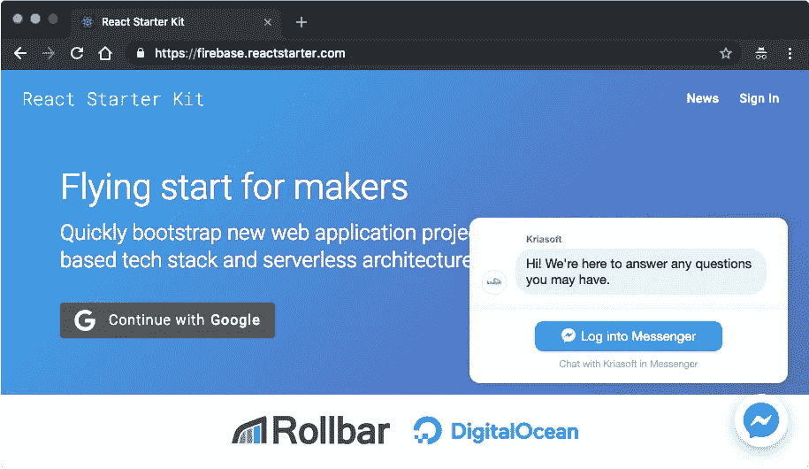

# 将脸书客户聊天集成到 React.js 应用程序中

> 原文：<https://levelup.gitconnected.com/integrating-facebook-customer-chat-into-a-react-js-app-5b7c21343048>

有了**脸书客户聊天**小工具，你现在可以和你的网站访问者(客户)保持联系，即使他们已经离开了你的网站。这多酷啊。)



在[https://github.com/kriasoft/react-firebase-starter](https://github.com/kriasoft/react-firebase-starter)查看源代码

你首先为你的应用或产品创建一个**脸书页面**。在 About 部分找到您的**页面 ID**——您将需要它用于小部件。然后进入**页面设置** > **Messenger 平台**将你的**域名**加入白名单，否则整合后 widget 不会在你的站点上显示。

通过将 [**客户聊天 SDK**](https://developers.facebook.com/docs/messenger-platform/discovery/customer-chat-plugin/sdk) 脚本注入到 React.js 应用程序中，可以集成小部件本身，该脚本包含**脸书 JavaScript SDK** 和其他一些使聊天工作的东西。

```
https://connect.facebook.net/en_US/sdk/xfbml.customerchat.js
```

# 它会对初始页面加载时间产生负面影响吗？

是的，有一点，但没有什么能阻止我们在应用程序完全呈现在浏览器中后缓慢地加载这个 SDK**。**

**为此，您将创建一个包装器函数，该函数允许**按需加载**客户聊天 SDK **以及排队您的应用程序可能发出的所有 API 调用，直到 SDK 完全加载并初始化。****

**该脚本依赖于一个包含您的**脸书应用 ID** 的全局`window.config`变量(该变量在服务器端呈现期间被水合并注入到 HTML 页面中，但这是另一个主题)。**

**现在，不直接调用脸书 SDK API，而是使用这个包装函数(因为没有更好的名字，在这个例子中我称它为`fb`):**

```
// BEFORE
FB.CustomerChat.show(true);// AFTER
fb(FB => FB.CustomerChat.show(true));
```

**请注意，在 SDK 完全初始化之前，您不能调用 API 方法，因此这个包装函数可以避免我们过早地使用 SDK。**

# **客户聊天反应组件**

**现在，让我们创建**客户聊天反应组件**本身，它看起来像这样:**

**你只需要将它放入你的顶级 React 组件(例如`Layout`)中，它就会完成任务。**

```
function Layout({ classes: s, children }) {
  return (
    <div className={s.root}>
      <Toolbar />
      <main className={s.content}>{children}</main>
      **<CutomerChat />**
    </div>
  );
}
```

**在未来的文章中，我将与你分享一些创建聊天机器人的代码方法。继续关注！查看 GitHub 上的[演示](https://firebase.reactstarter.com)并完成 [**React Starter Kit**](https://github.com/kriasoft/react-firebase-starter) 项目中的示例。试试吧！而且，我会在另一端和你聊天:)**

**[](https://gitconnected.com/learn/javascript) [## 学习 JavaScript -最佳 JavaScript 教程(2019) | gitconnected

### 50 大 JavaScript 教程-免费学习 JavaScript。课程由开发人员提交和投票，使…

gitconnected.com](https://gitconnected.com/learn/javascript)**