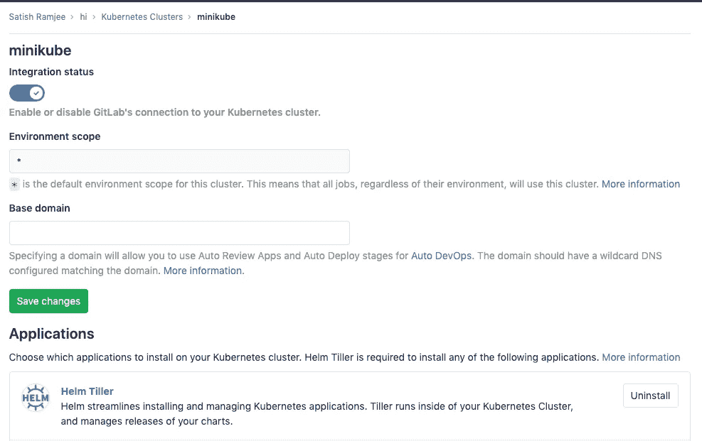

# 将 Kubernetes 与 Gitlab CI 集成

> 原文：<https://levelup.gitconnected.com/integrating-kubernetes-with-gitlab-ci-ed3497c41a66>


在这个系列的最后一篇文章中，我们将 Kubernetes (k8s)挂接到 Gitlab，并将我们的 Go 服务部署到我们的 k8s 系统。我们将使用 minikube 作为我们的 Kubernetes 供应商。

*本文的所有代码可以在* [*这里*](https://gitlab.com/lightphos/hi) 找到

提示:在 Visual Studio 代码中，您可以添加 Microsoft Kubernetes 扩展或云代码，以便从编辑器中查看 k8s 的详细信息

# 安装 kubernetes CLI

[https://kubernetes.io/docs/tasks/tools/install-kubectl/](https://kubernetes.io/docs/tasks/tools/install-kubectl/)

检查(这是在 mac 上):

`kubectl version`

```
Client Version: version.Info{Major:"1", Minor:"14", GitVersion:"v1.14.3", GitCommit:"5e53fd6bc17c0dec8434817e69b04a25d8ae0ff0", GitTreeState:"clean", BuildDate:"2019-06-06T01:44:30Z", GoVersion:"go1.12.5", Compiler:"gc", Platform:"darwin/amd64"}
Server Version: version.Info{Major:"1", Minor:"14", GitVersion:"v1.14.0", GitCommit:"641856db18352033a0d96dbc99153fa3b27298e5", GitTreeState:"clean", BuildDate:"2019-03-25T15:45:25Z", GoVersion:"go1.12.1", Compiler:"gc", Platform:"linux/amd64"}
```

# 安装 Minikube

[https://kubernetes.io/docs/tasks/tools/install-minikube/](https://kubernetes.io/docs/tasks/tools/install-minikube/)

开始

```
minikube start
```

## 从 minikube 内部启用 docker 登录

将第一篇文章中创建的密钥添加到 minikube:

*不幸的是，我们需要在您每次启动 minikube 时运行此程序。*

```
cat ~/.docker/certs.d/gitlab.lightphos.com\:5555/ca.crt | minikube ssh "sudo mkdir -p /etc/docker/certs.d/gitlab.lightphos.com:5555 && sudo tee /etc/docker/certs.d/gitlab.lightphos.com:5555/ca.crt"
```

重新启动:

`minikube ssh "sudo systemctl restart docker"`

检查登录:

```
minikube ssh docker login gitlab.lightphos.com:5555
```

如果成功，我们就可以走了。退出外壳。

# 手动将 Hi.go 服务部署到 MiniKube K8s

设置 docker 访问密码，将其命名为 gitlab.lightphos(使用 gitlab 用户名和密码作为 DOCKER_USER 和 DOCKER_PASSWORD)。注意:这将在 k8s 的默认名称空间内。

```
kubectl create secret docker-registry gitlab.lightphos --docker-server=https://gitlab.lightphos.com:5555 --docker-username=DOCKER_USER --docker-password=DOCKER_PASSWORD
```

使用以下内容创建文件**manifest/deployment . yml**:

```
apiVersion: apps/v1
kind: Deployment
metadata:
  name: hi-deployment
  labels:
    app: hi
spec:
  replicas: 1
  selector:
    matchLabels:
      app: hi
  template:
    metadata:
      labels:
        app: hi
    spec:
      containers:
      - name: hi
        image: gitlab.lightphos.com:5555/sr/hi:latest
        ports:
        - containerPort: 8090
      imagePullSecrets:
        - name: gitlab.lightphos
```

`kubectl apply -f manifest/deployment.yml`

如果由于某种原因部署没有按计划进行，首先删除它，然后重新开始

`kubectl delete deployment hi-deployment`

检查一下:

`kubectl get deployments`

```
NAME            READY   UP-TO-DATE   AVAILABLE   AGE
hi-deployment   1/1     1            1           10s
```

公开服务，以便我们可以从主机上看到它:

`kubectl expose deployment hi-deployment --type=NodePort --port=8090` `kubectl get services`

```
NAME              TYPE        CLUSTER-IP     EXTERNAL-IP   PORT(S)          hi-deployment     NodePort    10.110.54.136  <none>   8090:32326/TCP 
```

在浏览器上查看:

`minikube service hi-deployment`

应该会在浏览器中启动。

[http://192 . 168 . 99 . 101:32326/there](http://192.168.99.101:32326/there)

仪表板应显示服务/部署/pod 运行情况:


这将保持运行，即使当 pod 被删除。

尝试

```
kubectl get pods 
kubectl delete pod <pod> 
kubectl get pods
```

一个新的应该几乎立刻被竖起来。

导航回该 url。
应该还在运行。这，k8s 的威力。

删除部署和服务。

`kubectl delete deployment hi-deployment`

# Gitlab Kubernetes 集成

回到 http://gitlib.lightphos.com:30080[的本地 git lib](http://gitlib.lightphos.com:30080)

白名单 minikube ip，$(minikube ip):

以 root 用户身份登录

管理区->设置->网络->出站请求(勾选所有复选框)
添加以下内容(无论 minikube ip 是什么):

```
192.168.99.101
```

以您自己的身份登录导航到您的项目(嗨):

git lab-> hi-> Operations-> Kubernetes->添加现有集群

对于 API url，添加 192.168.99.101:8443 (minikube)

获取默认的 **CA 证书**:

```
kubectl get secret $(kubectl get secrets | grep default | cut -f 1 -d ' ') -o jsonpath="{['data']['ca\.crt']}" | base64 --decode 
```

使用 CA 证书的结果细节

对于服务令牌，创建一个文件 manifest/git lab-Service-account . yml。注意:这提供了广泛的权限，下面显示了一个更具限制性的 rbac.yml 文件。

```
apiVersion: v1
kind: ServiceAccount
metadata:
  name: gitlab-admin
  namespace: kube-system
---
apiVersion: rbac.authorization.k8s.io/v1beta1
kind: ClusterRoleBinding
metadata:
  name: gitlab-admin
roleRef:
  apiGroup: rbac.authorization.k8s.io
  kind: ClusterRole
  name: cluster-admin
subjects:
- kind: ServiceAccount
  name: gitlab-admin
  namespace: kube-system
```

应用于 k8s:

`kubectl apply -f manifest/gitlab-service-account.yml`

检索令牌:

`kubectl -n kube-system describe secret $(kubectl -n kube-system get secret | grep gitlab-admin | awk '{print $1}')`

将其添加到**服务令牌**字段。



检查 **Gitlab 管理的集群**选项。

添加 CA 和令牌后，minikube k8s 将与 Gitlab 集成。你可以通过安装舵柄来测试连接。

**注意**:K8s 中的命名空间默认为<project _ name>-<project _ id>-<environment>。关于如何将其设置为固定名称，请参见下文。

# 通过 Gitlab CI Automation 向 K8s 部署 Hi Go 服务

更新。gitlab-ci.yml 文件，我们在之前的帖子中有如下内容:

```
variables:
  REPO_NAME: ${CI_REGISTRY}/${CI_PROJECT_PATH}
  CONTAINER_IMAGE: ${CI_REGISTRY}/${CI_PROJECT_PATH}:${CI_BUILD_REF_NAME}_${CI_BUILD_REF}
  CONTAINER_IMAGE_LATEST: ${CI_REGISTRY}/${CI_PROJECT_PATH}:latest
  DOCKER_DRIVER: overlay2

before_script:
  - mkdir -p $GOPATH/src/$(dirname $REPO_NAME)
  - ln -svf $CI_PROJECT_DIR $GOPATH/src/$REPO_NAME
  - cd $GOPATH/src/$REPO_NAME  

stages:
  - test
  - build
  - release
  - deploy

format:
  image: golang:latest
  stage: test
  script:
    - go fmt $(go list ./... | grep -v /vendor/)
    - go vet $(go list ./... | grep -v /vendor/)
    - go test -race $(go list ./... | grep -v /vendor/)

compile:
  image: golang:latest
  stage: build
  script:
    - go build -race -ldflags "-extldflags '-static'" -o $CI_PROJECT_DIR/hi
  artifacts:
    paths:
      - hi

release:
  image: docker:19.03.1
  stage: release
  before_script:
    - echo ${CONTAINER_IMAGE}
    - echo  $CI_BUILD_TOKEN | docker login -u gitlab-ci-token --password-stdin ${CI_REGISTRY}
  script:
    - docker build -t ${CONTAINER_IMAGE} -t ${CONTAINER_IMAGE_LATEST} .
    - docker push ${CONTAINER_IMAGE}
    - docker push ${CONTAINER_IMAGE_LATEST}

deploy:
  image: dtzar/helm-kubectl
  stage: deploy
  environment:
    name: production  # you need to specify an environment to access KUBE vars
    url: http://hi.info/earth
  script:
   - echo CI_PROJECT_ID=$CI_PROJECT_ID
   - echo KUBE_URL=$KUBE_URL
   - echo KUBE_CA_PEM_FILE=$KUBE_CA_PEM_FILE
   - echo KUBE_TOKEN=$KUBE_TOKEN
   - echo KUBE_NAMESPACE=$KUBE_NAMESPACE
   - kubectl config set-cluster "$CI_PROJECT_ID" --server="$KUBE_URL" --certificate-authority="$KUBE_CA_PEM_FILE"
   - kubectl config set-credentials "$CI_PROJECT_ID" --token="$KUBE_TOKEN"
   - kubectl config set-context "$CI_PROJECT_ID" --cluster="$CI_PROJECT_ID" --user="$CI_PROJECT_ID" --namespace="$KUBE_NAMESPACE"
   - kubectl config use-context "$CI_PROJECT_ID"
   - kubectl delete secret gitlab.lightphos --namespace="$KUBE_NAMESPACE" --ignore-not-found
   - kubectl create secret docker-registry gitlab.lightphos --docker-server=${CI_REGISTRY} --docker-username="$CI_REGISTRY_USER" --docker-password="$CI_REGISTRY_PASSWORD" --namespace="$KUBE_NAMESPACE"
   - kubectl delete deployment hi-deployment --ignore-not-found
   - sed -i "s~__CI_REGISTRY_IMAGE__~${CI_REGISTRY_IMAGE}~" manifest/deployment.yml
   - sed -i "s/__CI_ENVIRONMENT_SLUG__/${CI_ENVIRONMENT_SLUG}/" manifest/deployment.yml manifest/service.yml manifest/ingress.yml 
   - sed -i "s/__VERSION__/${CI_BUILD_REF_NAME}_${CI_BUILD_REF}/" manifest/deployment.yml 
   - kubectl apply -f manifest/deployment.yml
   - kubectl apply -f manifest/service.yml
   - kubectl apply -f manifest/ingress.yml
   - kubectl rollout status -f manifest/deployment.yml
   - kubectl get all,ing -l ref=${CI_ENVIRONMENT_SLUG}
```

manifest/deployment.yml

```
apiVersion: apps/v1
kind: Deployment
metadata:
  name: hi-deployment
  labels:
    app: hi
    ref: __CI_ENVIRONMENT_SLUG__
spec:
  replicas: 1
  selector:
    matchLabels:
      app: hi
  template:
    metadata:
      labels:
        app: hi
        ref: __CI_ENVIRONMENT_SLUG__
    spec:
      containers:
      - name: hi
        image: __CI_REGISTRY_IMAGE__:__VERSION__
        ports:
        - containerPort: 8090
      imagePullSecrets:
        - name: gitlab.lightphos
```

manifest/service.yml

```
apiVersion: v1
kind: Service
metadata:
  name: hi-service
  labels:
    app: hi
    ref: __CI_ENVIRONMENT_SLUG__
spec:
  type: NodePort
  externalIPs:
    - 192.168.99.101
  selector:
    app: hi
  ports:
    - port: 3000
      nodePort: 30002
      protocol: TCP
      targetPort: 8090 
```

推动并查看部署在 k8s 上的管道。注意:在 minikube 中选择 **hi-3-production** 名称空间。(3 是我们本地 gitlabs 中的项目 id，你的可能不一样)。

管道运行后。我们应该看到以下内容。

K8s 部署:


图片:


服务:


仔细讨论

`minikube service hi-service --namespace=hi-3-production`

或者

点击服务链接按钮

或者

从 Gitlab 环境->生产->打开实时环境按钮

应该带你去
[http://192 . 168 . 99 . 101:3000/](http://192.168.99.101:31878/good)地球

# 进入

添加一个 Nginx 入口 LB。注意入口增加服务。yml 不需要节点端口或外部 IP。我们将通过主机名 hi.info 访问该站点。

```
minikube addons enable ingress
```

检查它是否启动:

`kubectl get pods -n kube-system | grep nginx-ingress-controller`

日志:

`kubectl logs -f -n kube-system $(kubectl get pods -n kube-system | grep nginx-ingress-controller | cut -f 1 -d ' ')`

配置:

`kubectl exec -it -n kube-system <nginx ingress controller> cat /etc/nginx/nginx.conf`

manifest/ingress.yml

```
apiVersion: networking.k8s.io/v1beta1 # for versions before 1.14 use extensions/v1beta1
kind: Ingress
metadata:
  name: hi-ingress
  labels:
    app: hi
    ref: __CI_ENVIRONMENT_SLUG__
  # annotations:
  #   nginx.ingress.kubernetes.io/rewrite-target: /$1 <- stops request parameters being passed
spec:
  rules:
  - host: hi.info
    http:
        paths:
        - path: /
          backend:
            serviceName: hi-service
            servicePort: 3000
```

应用它(添加到. gitlabci.yml 中的部署阶段，如下所示):

`kubectl apply -f manifest/ingress.yml`

将 minikube ip 和主机名 hi.info 添加到/etc/hosts

`echo "$(minikube ip) hi.info" | sudo tee -a /etc/hosts`

浏览:

http://hi.info/earth

瞧…

# 使用固定的名称空间

基于这篇优秀的帖子:[https://Eden mal . moe/post/2019/git lab-Kubernetes-Using-git lab-CIs-Kubernetes-Cluster-feature/# git lab-ci-Kubernetes-Cluster-feature](https://edenmal.moe/post/2019/GitLab-Kubernetes-Using-GitLab-CIs-Kubernetes-Cluster-feature/#gitlab-ci-kubernetes-cluster-feature)

1.  在 k8s
    上创建名称空间
2.  应用 rbac.yml 文件(如下)
    ku bectl apply-f manifest/RBAC . yml
3.  获取编码的 CA 和令牌
    ku bectl get-n light phos secret $(ku bectl get-n light phos secret | grep git lab-ci | cut-f 1-d ' ')-o YAML
4.  从 base64
    回应< CA > | base64 —解码，回应<令牌> | base64 —解码
5.  添加到 gitlab -> operations -> kubernetes。
6.  将项目名称空间设置为 lightphos，取消选中 Gitlab 管理的集群
7.  部署项目。Gitlab ci 文件。gitlab-ci.yml 应该不需要改。
8.  代码现在将被部署到 lightphos 名称空间。
    在 [http://hi.info](http://hi.info/there) 上，该网站应该照常可用

清单/rbac.yml

```
---
apiVersion: v1
kind: ServiceAccount
metadata:
  name: gitlab-ci
  namespace: lightphos
---
kind: Role
apiVersion: rbac.authorization.k8s.io/v1
metadata:
  namespace: lightphos
  name: gitlab-ci
rules:
- apiGroups: [""]
  resources: ["*"]
  verbs: ["*"]
- apiGroups: ["apps"]
  resources: ["*"]
  verbs: ["*"]
- apiGroups: ["batch"]
  resources: ["*"]
  verbs: ["*"]
- apiGroups: ["extensions"]
  resources: ["*"]
  verbs: ["*"]
- apiGroups: ["autoscaling"]
  resources: ["*"]
  verbs: ["*"]
- apiGroups: ["networking.k8s.io"]
  resources: ["*"]
  verbs: ["*"]
---
kind: RoleBinding
apiVersion: rbac.authorization.k8s.io/v1
metadata:
  name: gitlab-ci
  namespace: lightphos
subjects:
- kind: ServiceAccount
  name: gitlab-ci
  namespace: lightphos
roleRef:
  kind: Role
  name: gitlab-ci
  apiGroup: rbac.authorization.k8s.io
```

gitlab ci 管道部署阶段的控制台输出:


*原载于 2019 年 11 月 12 日*[*https://blog . ram JEE . uk*](https://blog.ramjee.uk/minikube-and-gitlab-ci/)*。*