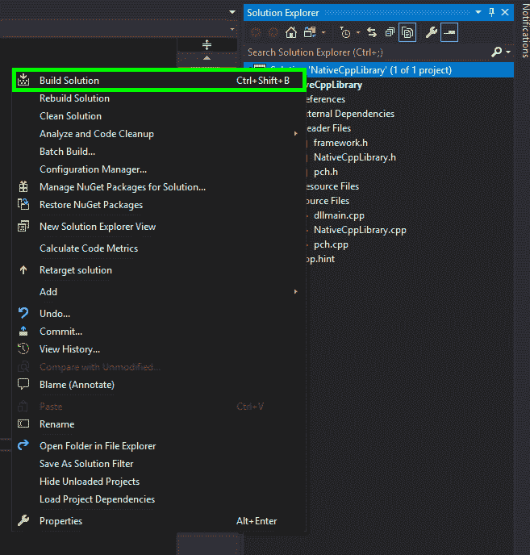
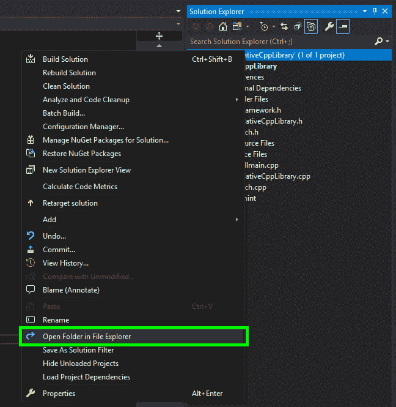

# 将本机 C/C++库与 Unity 集成为插件(逐步指南)

> 原文：<https://levelup.gitconnected.com/integrating-native-c-c-libraries-with-unity-as-plugins-a-step-by-step-guide-17ad70c2e3b4>


我的开发设置(R.I.P Dad)

作为中央阿肯色大学计算机科学系[的](https://uca.edu/computerscience/)[虚拟现实、模拟、成像和建模(ViRaSIM)实验室](http://sun0.cs.uca.edu/~thalic/virasim.html)的研究生研究助理，我正与软件工程师和分别来自 [Kitware](https://www.kitware.com/) 和 [Rensselaer 理工学院(RPI)](https://www.rpi.edu/) 的研究人员一起开发一个虚拟肩袖关节镜技能训练器(ViRCAST ),以使用[交互式医学模拟来虚拟模拟关节镜肩袖修复手术](https://www.imstk.org/)


手术模拟概述

> [交互式医疗模拟工具包(iMSTK)](https://www.imstk.org/) 是一个免费的&开源软件工具包，用 C++编写，有助于交互式多模式手术模拟的快速原型制作。

为了开发虚拟肩袖关节镜技能训练器(ViRCAST)，我们决定编写插件，以允许手术模拟社区使用[交互式医疗模拟工具包(iMSTK)](https://www.imstk.org/) 和 [Unity](https://unity.com/) 。

我的职责是为[触觉设备](https://www.3dsystems.com/haptics-devices/touch)开发动态链接库(dll ),以便通过 [Unity](https://unity.com/) 与[交互式医疗模拟工具包(iMSTK)](https://www.imstk.org/) 进行通信。

因此，我不得不学习什么是 dll，如何创建和使用它们。

T 这篇文章是为了展示我在编写触觉设备 dll 与[交互式医疗模拟工具包(iMSTK)](https://www.imstk.org/) 到 [Unity](https://unity.com/) 通信之前，在 Unity 中开发和使用 dll 的步骤。

> 触觉设备(或触觉接口)是在用户和计算机之间传递信息的机械设备。触觉设备允许用户在虚拟环境和远程操作系统中触摸、感觉和操纵三维物体。

# *总结*

在本文中，我将讨论如何使用 dll 来运行 Unity 中的 C/C++代码。插件用于包含在 Unity 平台之外创建的代码。这背后的目的是将 C/C++代码与 Unity 集成，以便我们能够从 Unity C#脚本中调用 C/C++编写的函数。除了插件，我还会讲解动态链接库(DLL)的使用。这些库包含 Unity 等第三方应用程序可以使用的代码和数据。使用 DLL 可以促进代码重用和有效的内存使用。这种技术也允许将 Unity 程序模块化成独立的组件，每个组件都可以根据需要使用。本文还介绍了一种简单的方法，使用外部编译器编译我的原生 C/C++代码，然后将生成的 DLL 添加到 Unity 项目中。

# 介绍

Unity 是一款游戏引擎和集成开发工具，用于开发模拟、实时 3D 动画和视频游戏等程序和应用。Unity 提供多种功能来支持所有类型的游戏开发需求，例如着色器、网络、地图和地形处理、物理引擎和视频/音频。虽然 Unity 基于 C#脚本开发应用程序，但它也提供了两种插件，允许用户包含外部创建的代码和使用不同编程语言编写的代码。Unity 提供了两种类型的插件:*托管插件*和*原生插件。*

*托管插件*被托管。使用第三方工具创建的. NET 程序集，通常包含。只能访问. NET 代码。NET 支持的库。

*原生插件*是特定于平台的原生代码库。它们用于访问第三方代码库，否则 Unity 通常无法访问这些库。

本文主要关注本机插件。我将解释一种简单的方法，使用本地插件来允许我们的 Unity 代码(C#)从现有的 C/C++代码中调用函数。Unity 用户将能够应用这种技术来使用 C#与他们的 C/C++函数进行交互。


*使用插件链接本机 C/C++库和 unity 的架构*

# 动态链接库

DLL 文件(*动态链接库)*是一种包含其他程序使用的数据和指令的文件，可以在需要时调用。DLL 文件允许多个程序同时共享函数和类。与可执行程序不同，DLL 文件不能直接运行，而是必须由其他程序调用。

单词“ *dynamic* ”用于解释数据并不总是存在于内存中，它只是在程序主动调用它时才被使用。DLL 文件允许将程序分成多个独特的组件，然后可以添加或删除这些组件以包含或排除某些功能。这非常有用，因为它降低了内存的使用，因为程序不需要一次加载所有的东西。

C 和 C++

Microsoft Visual C++为标准 C++提供了多种扩展，允许在 C++代码中将函数和类指定为直接导入或导出。这些扩展在函数或类声明前使用属性 *__declspec* 。

请注意，当从 C++访问 C 函数或类时，函数必须在 C++代码中声明为 extern“C ”,以通知编译器不要*篡改*函数或类名，而是使用“C”链接。

因为 C++支持函数重载，我们可以用相同的名字和不同的参数声明多个函数。然后，我们需要向编译器提供关于函数名的附加信息，以避免未定义的引用错误或链接错误(因为 C 不支持*函数重载*)。

这里的解决方案是在我们的 C++程序中指定 extern“C”。当编译器找到一个 extern“C”块时，它确保函数名不会被破坏——编译器会发出一个名称不变的二进制文件，就像“C”编译器会做的那样。这些额外的信息允许我们避免二进制代码中的链接问题和冲突。

# 创建 dll

下面的例子是使用 Visual Studio 2019 创建和构建一个简单的 DLL。

*   打开 Visual Studio 并创建一个新项目。要指定这是一个 DLL，我们需要选择“带有导出的动态链接库(DLL)”


*微软 Visual Studio 2019 —新项目*


*微软 Visual Studio 2019 — DLL 项目*

*   在为我们的项目选择了一个名称和一个保存位置之后。我们继续打开生成的“头文件”文件夹([ProjectName])。h 文件):


*微软 Visual Studio 2019 —解决方案资源管理器*

```
NativeCppLibrary.h:/* The following ifdef block is the standard way of creating macros which make exporting from a DLL simpler. All files within this DLL are compiled with the NATIVECPPLIBRARY_EXPORTS symbol defined on the command line. This symbol should not be defined on any project that uses this DLL. This way any other project whose source files include this file see NATIVECPPLIBRARY_API functions as being imported from a DLL, whereas this DLL sees symbols defined with this macro as being exported.
*/#ifdef NATIVECPPLIBRARY_EXPORTS
#define NATIVECPPLIBRARY_API __declspec(dllexport)
#else
#define NATIVECPPLIBRARY_API __declspec(dllimport)# endif// This class is exported from the dllclass NATIVECPPLIBRARY_API CNativeCppLibrary { public: CNativeCppLibrary(void);// TODO: add your methods here.};extern NATIVECPPLIBRARY_API int nNativeCppLibrary; NATIVECPPLIBRARY_API int fnNativeCppLibrary(void);
```

头文件(*nativecplibrary . h)*将用于声明我们所有的类和函数。

首先，我们定义一个 C++宏，它为第三方应用程序(Unity)导出函数，这些应用程序将使用 DLL 来访问函数和类。这个块被称为条件组。

我们可以删除类和函数的例子，因为我们将为测试编写自己的函数。

您可以将这些功能定义为一行或一个块。

```
// Single line function declarationsextern “C” NATIVECPPLIBRARY_API int displayNumber();extern “C” NATIVECPPLIBRARY_API int getRandom();extern “C” NATIVECPPLIBRARY_API int displaySum(); // Block declarationsextern “C” {NATIVECPPLIBRARY_API int displayNumber();NATIVECPPLIBRARY_API int getRandom();NATIVECPPLIBRARY_API int displaySum();}
```

我们创建了三个简单的函数。第一个显示一个数字，第二个显示一个随机数，第三个将两个数字相加。

请注意，我们使用 extern“C”来避免上面讨论的名称混淆。

在解决方案资源管理器中，打开[ProjectName.cpp]文件:


*微软 Visual Studio 2019 —解决方案浏览器*

```
NativeCppLibrary.cpp:/* NativeCppLibrary.cpp : Defines the exported functions for the DLL.*/#include “pch.h”#include “framework.h”#include “NativeCppLibrary.h” // This is an example of an exported variableNATIVECPPLIBRARY_API int nNativeCppLibrary = 0; // This is an example of an exported function.NATIVECPPLIBRARY_API int fnNativeCppLibrary(void) { return 0;}// This is the constructor of a class that has been exported.CNativeCppLibrary::CNativeCppLibrary() {}
```

*   让我们删除示例函数，并基于头文件创建我们自己的函数。

```
/* NativeCppLibrary.cpp : Defines the exported functions for the DLL.*/ #include “pch.h”#include “framework.h”#include “NativeCppLibrary.h” // Standard Library imports#include <iostream> int displayNumber() { return 1;}int getRandom() { return rand();}int displaySum() { int first_number = 7; int second_number = 7; int total = first_number + second_number;}
```

现在我们有了测试函数。让我们构建我们的解决方案，但在此之前，我们需要确保我们构建的是正确的预期 64 位架构。我们需要为 x64 平台(64 位)编译我们的库。

要在 Visual Studio 中更改这一点，我们可以转到配置管理器，然后在“平台”下选择 x64，或者只需从顶部的下拉菜单中选择 x64。


*微软 Visual Studio 2019 —选择正确的架构*

*   将 C/C++代码构建到 dll 中



*微软 Visual Studio 2019 —构建过程*


*微软 Visual Studio 2019 —构建控制台*

我们的解决方案构建成功

*   获取生成的 dll

要轻松访问生成的 dll，请在解决方案资源管理器中右键单击您的解决方案，然后选择“在文件资源管理器中打开文件夹”



*微软 Visual Studio 2019 —文件浏览器*

# 在 Unity 中使用原生 dll

*   创建新的 Unity 项目或打开现有项目:


*Unity — Hub*


*Unity —项目窗口*

*   首先，如果我们在 Unity 项目中创建一个插件文件夹来重组我们所有的 dll 会更容易。这可以通过右击我们的场景->创建->文件夹来完成。将文件夹命名为:“插件”。


*Unity —创建新文件夹*


*Unity —文件浏览器*

*   然后，我们可以将我们创建的 DLL 文件复制到 Unity plugins 文件夹中。


*Unity — DLL 文件*

*   我们的下一步是给我们的主摄像头添加一个新的 C#脚本。这个 C#脚本将用于访问我们创建的三个 C++函数。


*Unity —添加组件*


*Unity— C#脚本*

*   在 C#中调用本机 C/C++函数

双击脚本将其打开。

首先，我们需要加上“使用系统。运行时. InteropServices"允许我们在函数声明中使用“extern”修饰符。

然后我们定义 DLL 入口点，这可以使用 DLLImport 注释来完成。我们需要指定 DLL 的名称和函数的名称。EntryPoint 中使用的字符串必须与 C++库中使用的名称匹配。我们决定，如果我们也在 DllImport 下定义每个函数，会更容易。但是，您可以按照自己的方式调用函数；从现在开始 C#就这么叫它了。

用[DllImport]属性标记为 extern 的方法通常是对 C librarires 的调用。当调用 WindowsAPI(WinAPI)或遗留代码时，记住这一点很有用。

在方法声明中指定 extern 修饰符表示该方法是在外部实现的。我们的 C++函数调用是用那个属性来管理的。

每个新的 C#文件还包括两个函数 Start()和 Update()。当在第一次调用任何 Update()函数之前启用脚本时，会调用 Start()函数。因为我们希望在运行 Unity 应用程序时只调用一次函数，所以我们可以忽略 Update()方法，并将其从脚本中删除。

*nativecpplibraryintegration . cs 脚本*

```
using System.Collections;using System.Collections.Generic;using UnityEngine;using System.Runtime.InteropServices; public class NativeCppLibraryIntegration: MonoBehaviour { // Import and expose native c++ functions[DllImport(“NATIVECPPLIBRARY”, EntryPoint = “displayNumber”)]public static extern int displayNumber(); [DllImport(“NATIVECPPLIBRARY”, EntryPoint = “getRandom”)]public static extern int getRandom(); [DllImport(“NATIVECPPLIBRARY”, EntryPoint = “displaySum”)]public static extern int displaySum(); // Start is called before the first frame updatevoid Start() { // Display output of functions print(displayNumber()); print(getRandom()); print(displaySum()); }}
```

*   测试

我们只需在 Unity 中运行我们的程序，并接收包含在 Unity start()函数中的打印语句的结果:

结果:


*Unity — Unity 控制台结果*

# 结论

本文介绍的技术正被用于集成[交互式医疗模拟工具包(imstk)](https://www.imstk.org/) 和 [Unity](https://unity.com/) 。

这篇文章展示了一个简单的技术，在 Unity 中集成现有的 C/C++代码，允许我们使用插件直接从我们的 C# Unity 脚本中访问已经存在的 C/C++方法和类。

参考

1.  Unity — *“底层原生插件接口”*[https://docs . unity 3d . com/560/Documentation/Manual/nativeplugininterface . html](https://docs.unity3d.com/560/Documentation/Manual/NativePluginInterface.html)
2.  微软— *"什么是 DLL "*[https://support . Microsoft . com/en-us/help/815065/What-is-a-DLL](https://support.microsoft.com/en-us/help/815065/what-is-a-dll)
3.  维基百科— *“动态链接库”*[https://en . Wikipedia . org/wiki/Dynamic-link _ library # C _ and _ c++](https://en.wikipedia.org/wiki/Dynamic-link_library#C_and_C++)
4.  海合会文件*“Ifdef”【https://gcc.gnu.org/onlinedocs/gcc-4.8.5/cpp/Ifdef.html】*T22
5.  *“extern 在 C#中是如何工作的？”*[https://stack overflow . com/questions/5110706/how-does-extern-work-in-c](https://stackoverflow.com/questions/5110706/how-does-extern-work-in-c)
6.  Unity — *【入门】*[https://docs . unity 3d . com/560/Documentation/Manual/Getting Started . html](https://docs.unity3d.com/560/Documentation/Manual/GettingStarted.html)