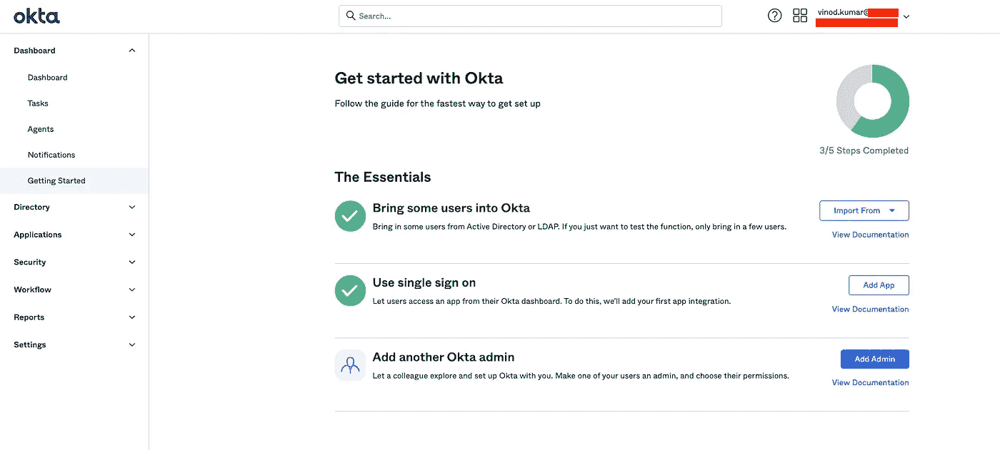
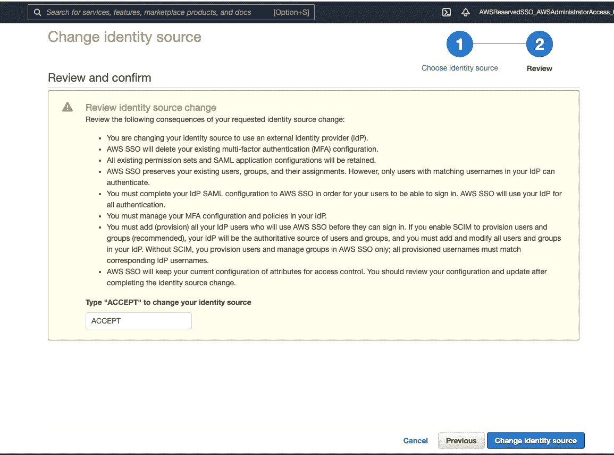

# 集成 Okta 以允许联合用户访问多帐户 AWS 环境

> 原文：<https://levelup.gitconnected.com/integrating-okta-to-allow-federated-users-to-access-multi-account-aws-environment-7504ae1f1f5a>

如果您想要集成像 **Okta** 这样的外部身份提供者，让您的联盟用户访问您的 AWS 资源，并从 Okta 作为一个集中的、单一的真实来源管理用户配置，那么您就找对了地方。

**Okta** 是一个外部用户身份提供者，它可以很好地与支持 SAML 2.0 的各种应用程序集成。它是高度安全的，并且将用户身份管理问题与您的应用程序分开。

在这篇博客中，我将向您展示如何将 Okta 与您现有的 AWS 多帐户环境集成。我假设你已经在你的 AWS 主帐户上设置了一个多帐户环境，如果没有的话，在我之前的博客中，我已经向你展示了如何使用控制塔在 AWS 上轻松设置一个多帐户环境。你可以参考我之前在这里，然后继续设置 Okta:-

 [## 具有 AWS 单点登录的 AWS 多帐户体系结构

### 多帐户体系结构为客户提供了全面的治理、安全性、成本优化以及对其…

levelup.gitconnected.com](/aws-multi-account-architecture-with-aws-single-sign-on-f70af7d7663) 

# 建筑:-

Okta 与 AWS SSO 集成

您需要有一个以您的名字注册的有效域名(如 example.com)才能在 Okta 设立账户。前往 https://www.okta.com/free-trial/，用你的域名在 Okta 注册一个账户。

完成后，登录你的 Okta 的管理门户网站(或 [https:// <你的注册域名> -admin.okta.com/](https://getsmallpdf-admin.okta.com/) )。管理门户将如下所示:-

Okta 管理门户

然后点击左侧“**应用程序**”下的“**应用程序**”链接，然后搜索并添加一个名为“ **AWS 单点登录**的新应用程序。

Okta — AWS 单点登录

打开新添加的 AWS 单点登录应用程序，单击名为 **Sign-On** 的选项卡，然后单击下面名为“**Identity Provider metadata**的链接(在红色矩形框中突出显示)。这将打开另一个浏览器标签，显示你的 Okta 帐户的元数据。只需将此文件保存为本地计算机驱动器中的 metadata.xml 格式，因为我们稍后需要将它上传到 AWS SSO(单点登录)服务器。

Okta — AWS SSO

现在，转到您的主帐户或管理帐户的 AWS 控制台，单击 SSO，然后单击“T22 选择您的身份源 T23”。

AWS SSO

在“设置”下，单击“**身份源**”的“更改”，然后选择选项作为“**外部身份提供者**

AWS SSO

AWS SSO

单击“**显示单个元数据值**”链接，并将 AWS“**SSO ACS URL”**和“**AWS SSO issuer URL”**的值复制到记事本，因为我们需要将这些详细信息复制到 Okta 端。另请注意“ **AWS SSO 登录 URL”**，因为这将是您的最终用户登录 AWS cloud 的 URL。

AWS SSO

现在，对于选项' **IdP SAML metadata** '，从您的 OKTA 帐户浏览并上传之前保存的名为 metadata.xml 的文件，然后单击' **Next: Review** '按钮，接受并提交请求。

AWS SSO

点击“编辑”后，将 Okta - > AWS 单点登录应用- > Sign On(选项卡)上的“**SSO ACS URL”**和“**AWS SSO issuer URL”**的值复制到“**高级登录设置**”中，然后保存。

天空的八分之一

天空的八分之一

很好，我们完成了 Okta 与 AWS SSO 的集成。现在，如果一个新用户加入或离开组织，我们将如何自动化用户配置/取消配置，并让 AWS 知道这一点？

因此，再次转到 AWS SSO 的设置页面，在'**配置**下，单击'**启用自动配置**，这将弹出一个窗口

AWS SSO

AWS SSO

记下 SCIM 端点和访问令牌，因为这需要复制到 Okta。

现在，返回 Okta -> AWS 单点登录应用程序，然后单击“**供应**”选项卡。在“**集成**选项下，启用“**启用 API 集成**”复选框，单击**编辑**并复制从 AWS SSO - > SCIM 收到的**基础 URL** (从 URL 中删除最后一个正斜杠“/”)和 **API 令牌**，并通过单击“**测试 API 凭据”**测试凭据。保存更改。在同一个**供应**选项卡上的设置下，确保勾选了显示在“**至应用**”下的选项(或，Okta 至应用)

天空的八分之一

天空的八分之一

天空的八分之一

现在，在 Okta 上，在“**目录**选项下，分别转到“**人**和“**组**”并创建一些用户和组，玩玩这个系统。并确保您创建的用户有权访问此 AWS 单点登录应用程序，如果没有，您可以如下所示分配此应用程序。

Okta 用户

奥克塔集团

Okta 用户

最后，前往 Okta- > AWS 单点登录应用程序上的“**推送组**选项卡，并创建规则(按名称或规则)。因此，这些组将被您创建的规则推送到 AWS SSO。因为。例如，如果您有一个带有条件的规则，推送以单词“AWS”开头的所有组，那么它只会将这些组推送到 AWS SSO，而不会将任何其他组推送到 Okta。

天空的八分之一

现在，在 AWS SSO 端，你会看到你的 Okta 用户和组被自动同步。

Okta 用户

奥克塔集团

您可以通过 AWS 组织中的权限集进一步利用这些组，以允许哪个用户组可以访问您的多帐户环境中的所有 AWS 帐户。

您的 Okta 用户现在可以使用 AWS SSO URL 登录，一旦用户成功通过 Okta 认证，该 URL 将重定向到 AWS SSO 门户。

在我的例子中，这是我的 AWS SSO URL【https://vinod827.awsapps.com/start】

****

**AWS SSO URL**

****

**AWS 单点登录门户**

**恭喜，您已经完成了 Okta 与 AWS SSO 的集成，并允许您的联邦用户允许您的多帐户 AWS 环境。**

**希望你喜欢这篇文章。**

# **摘要:-**

**在这篇博客中，我们看到了如何将 Okta(外部身份提供者)与 AWS SSO 集成。这允许您的联合用户在多帐户体系结构中基于您的 AWS 组织内的组/权限集访问各自的 AWS 帐户。**