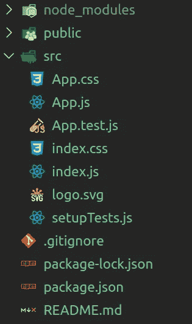
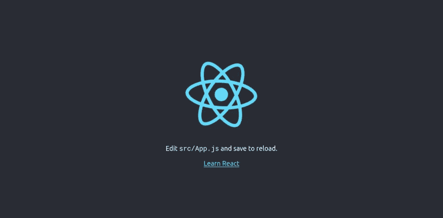
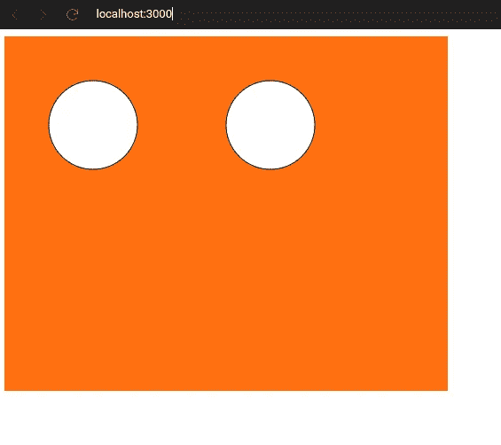

# 将 P5 草图集成到 React 应用程序中。

> 原文：<https://levelup.gitconnected.com/integrating-p5-sketches-into-your-react-app-de44a8c74e91>

React+P5.js

在这篇文章中，我们将学习如何将 P5 草图集成到 React Web 应用程序中。

# 开始好玩吧:)

为此，让我们使用 [**create-react-app**](https://create-react-app.dev/) 搭建一个简单的 React 应用程序

`npx create-react-app my-sketch`

这将创建一个名为 **my-sketch** 的新文件夹，并安装 react 依赖项。

我的-sketch 文件夹应该是这样的:)

让我们使用`npm run start`来运行我们的项目

执行该命令后，您的浏览器窗口应该如下所示。

现在我们实际上已经准备好开始编码我们的 P5 草图了。但是我们需要一个专门的工具来帮助我们集成 P5 和 React，为此，我们将安装 [**react-p5**](https://github.com/Gherciu/react-p5#readme) 。

`npm i react-p5`

**现在我们准备写一些代码。**先从这个简单的草图开始；)

App.jsx

现在我们已经准备好画布，我们的应用程序看起来会像这样。

🥳乌拉我们简单的草图完成了！

# 高级用法🤓

[**react-p5**](https://github.com/Gherciu/react-p5#readme) 要小心使用，因为它有一些用法*约定/原则*以免出现意外情况。

*   不要在 **draw** 函数内部或者在 draw 函数*内部调用的函数中使用 **setState** (因为 draw 函数是由 P5 在无限循环中执行的)。*
*   如果你想存储一些东西*(而不是组件状态)，使用在组件外部声明的类属性**或**变量。*
*   如果你需要 [**react-p5**](https://github.com/Gherciu/react-p5#readme) 在你的 Sketch 方法之外使用的 P5 实例，那么你可以从`window.p5` *中获取。*
*   在`setup`中创建画布时，请始终使用`.parent(canvasParentRef)`方法。因为如果没有它，P5 将会在你的组件之外渲染你的画布，这可能是一个问题，因为 [**react-p5**](https://github.com/Gherciu/react-p5#readme) 将会失去对渲染画布的完全控制。

感谢阅读。我希望这有所帮助。