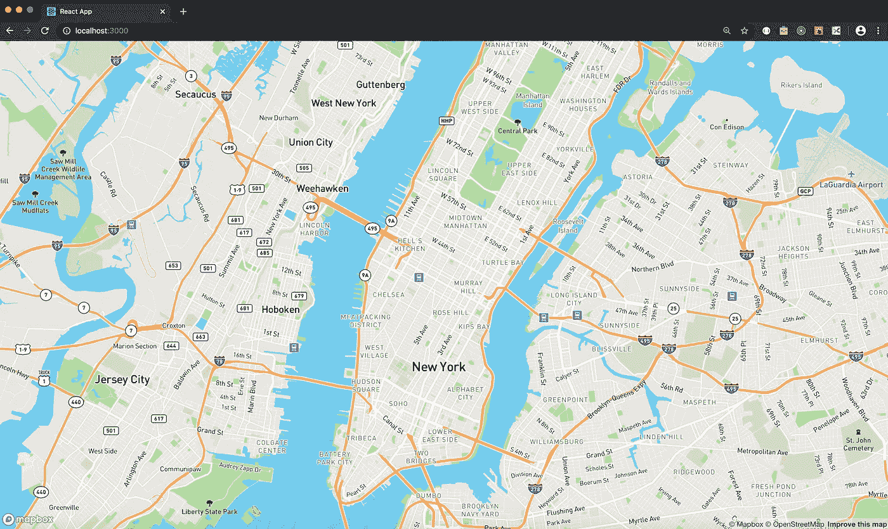
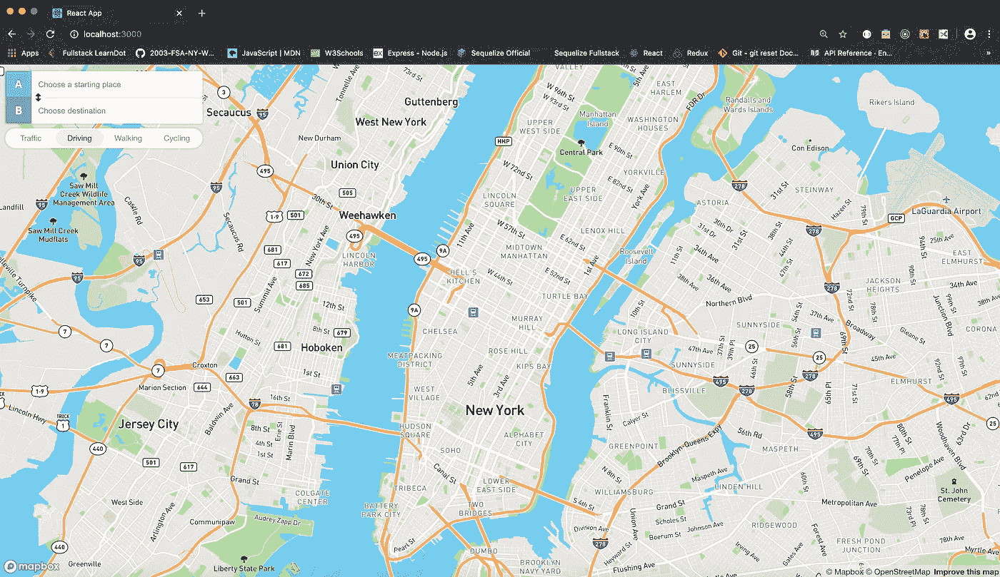
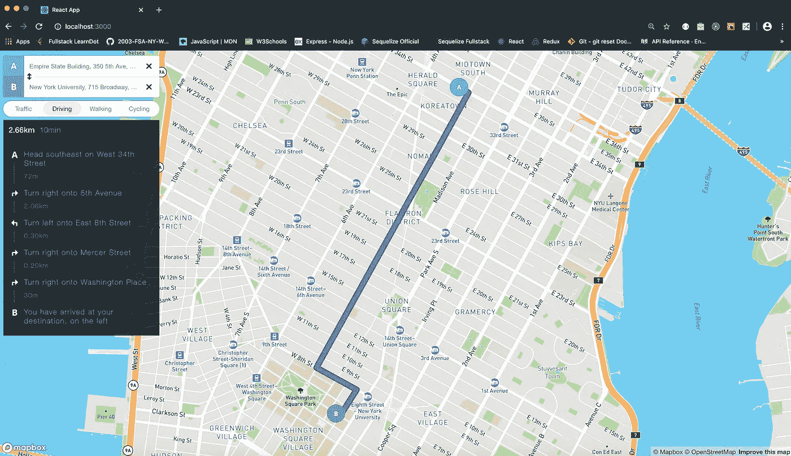

# 集成反应堆、地图框和地图框方向

> 原文：<https://levelup.gitconnected.com/integrating-reactjs-mapbox-and-mapbox-directions-a654086a97fc>

令人惊讶的是，网上详细介绍在 React 应用程序中设置 mapbox-gl 和 mapbox-gl-directions 的资源数量非常有限(至少对初学者而言)。优步的 react-map-gl 库工作得很好，因为它充当核心 Mapbox API 的包装器，但该库不包括利用 Mapbox 方向 API 的内置功能。使用此库显示路径需要创建自定义图层。Mapbox 网站提供了在 React 应用[中使用 mapbox-gl 的步骤，但似乎没有针对 Mapbox Directions API 的类似教程。大多数教程侧重于在静态 index.html 文件中使用地图框和地图框方向。对于那些对使用 Mapbox 构建 React 应用感兴趣但不确定如何着手的人，本文将作为入门指南。](https://docs.mapbox.com/help/tutorials/use-mapbox-gl-js-with-react/)

# 反应设置

第一步包括创建一个 React 应用程序。这里的指令[演示了如何做到这一点。但是，对于最低版本为 8.10 的 Node 和 5.6 的 npm，以下命令将起作用:](https://reactjs.org/docs/create-a-new-react-app.html)

```
// From the terminalnpx create-react-app your-app-name
cd your-app-name
npm install mapbox-gl @mapbox/mapbox-gl-directions
```

接下来，使用熟悉的文本编辑器打开 your-app-name 目录中的 src/App.js 文件。为了利用生命周期方法，将功能性 App 组件更改为类组件。该组件只需要返回一个空的 div 标签，它稍后将作为地图的容器。

```
// src/App.jsimport React from ‘react’;
import ‘./App.css’;class App extends React.Component {
  render() {
    return (
      <div />
    );
  }
}export default App;
```

要使用地图框和地图框方向 API，在这里注册一个地图框账户[，并记下新创建的公钥。要在线共享应用程序而不暴露此密钥，请在 your-app-name 目录的根目录下创建一个. env 文件。将密钥作为以 REACT_APP 开头的变量(即 REACT_APP_MAPBOX_KEY)存储在。env 文件，并确保将。env 文件添加到。gitignore 文件。](https://account.mapbox.com/auth/signup/?route-to=%22https://account.mapbox.com/%22)

```
// From the terminaltouch .env // .envREACT_APP_MAPBOX_KEY = YOUR_PUBLIC_MAPBOX_KEY // .gitignore# files
.env# dependencies
/node_modules
/.pnp
.pnp.js...
```

# 集成地图框

返回到 src 目录中的 App.js 文件，并导入 mapbox-gl(作为 mapboxgl)以及 map box CSS(" map box-GL/dist/map box-GL . CSS ")。在导入下，将变量赋值给。env 现在存储内置 mapboxgl.accessToken 参数的 Mapbox API 键。中的 Mapbox 关键字变量。env 现在是一个环境变量，可以通过“process.env”前缀(即 process . env . react _ APP _ map box _ KEY)进行访问。现在，合并地图显示的基础已经就绪！

在 componentDidMount 生命周期方法中，创建一个新的 mapboxgl。带有一些默认参数的映射实例:

```
// src/App.jscomponentDidMount() {

  const map = new mapboxgl.Map({
    container: this.mapWrapper,
    style: 'mapbox://styles/mapbox/streets-v10',
    center: [-73.985664, 40.748514],
    zoom: 12
  });}
```

样式、中心和缩放参数都可以自定义，以适应各种规格和偏好。上述代码的 center 参数具有纽约市帝国大厦的坐标，因此地图的中间将聚焦于帝国大厦的位置。请注意，这个坐标数组采用的是[经度，纬度]格式。对于样式参数，在[页面](https://docs.mapbox.com/api/maps/#styles)上有许多选项可以将地图显示更改为暗视图或卫星视图。最后，缩放参数确定地图加载时中心位置的放大程度。[地图框文档](https://docs.mapbox.com/mapbox-gl-js/api/)列出了进一步定制和功能选项的附加参数。

下一步是设置一个函数，将地图的容器值(this.mapWrapper)作为 return 语句的 div 标记的引用属性。这个 div 还应该有一个 id 或 className 属性值，这样就可以在样式表中引用标记。最后，在 App.css 文件中，设置地图的宽度和高度属性。[这个例子](https://docs.mapbox.com/mapbox-gl-js/example/custom-style-id/)在样式标签中包含了地图的额外 CSS 选项。此时，App.js 和 App.css 文件应包含以下代码:

```
// src/App.css.mapWrapper {
  width: 100vw;
  height: 100vh;
}... // src/App.jsimport React from 'react';
import './App.css';
import mapboxgl from 'mapbox-gl';
import 'mapbox-gl/dist/mapbox-gl.css';mapboxgl.accessToken = process.env.REACT_APP_MAPBOX_KEY;class App extends React.Component { componentDidMount() {

    const map = new mapboxgl.Map({
      container: this.mapWrapper,
      style: 'mapbox://styles/mapbox/streets-v10',
      center: [-73.985664, 40.748514],
      zoom: 12
    }); } render() { return (
      <div 
        ref={el => (this.mapWrapper = el)} 
        className="mapWrapper" 
      />
    );
  }}export default App;
```

在终端中运行 npm start 之后，现在应该可以看到地图了！以帝国大厦为中心的输出应该如下图所示。地图会根据浏览器窗口的尺寸进行调整。用户可以使用鼠标滚轮或在触控板上移动两个手指来放大和缩小。通过点击和拖动，用户可以在地图上移动或改变地图的焦点。



# 集成地图框方向

合并地图框方向的过程与上面设置核心地图框 API 的说明非常相似。首先在 App.js 中导入 MapboxDirections(来自“@ map box/map box-GL-directions/dist/map box-GL-directions”)以及对应的 CSS(“@ map box/map box-GL-directions/dist/map box-GL-directions . CSS”)。

地图框方向自带一组需要注意的参数。在 componentDidMount 中的核心 Mapbox 对象之后，创建一个至少具有以下参数的新 MapboxDirections 实例:

```
// src/App.jscomponentDidMount() {... const directions = new MapboxDirections({
    accessToken: mapboxgl.accessToken,
    unit: 'metric',
    profile: 'mapbox/driving'
  })}
```

请确保在新方向对象的 accessToken 参数中引用公共地图框键(存储在 mapboxgl.accessToken 中)。单位参数决定了用于计算地图上两点之间距离的测量系统。profile 参数根据用户的交通方式调整路线、方向列表和预计到达时间。轮廓参数的选项包括“地图框/驾驶”、“地图框/步行”和“地图框/骑自行车”。“地图框/驾驶-交通”扩展在推荐驾驶路线时结合了过去和现在的交通数据。关于这些参数和附加参数选项的附加信息可以在[地图框方向 API 文档](https://docs.mapbox.com/api/navigation/#directions)中找到。

最后一步，调用 Mapbox 内置的 addControl 方法将方向组件添加到地图中:

```
// src/App.jscomponentDidMount() { const map = new mapboxgl.Map({
    container: this.mapWrapper,
    style: 'mapbox://styles/mapbox/streets-v10',
    center: [-73.985664, 40.748514],
    zoom: 12
  }); const directions = new MapboxDirections({
    accessToken: mapboxgl.accessToken,
    unit: 'metric',
    profile: 'mapbox/driving'
  }); map.addControl(directions, 'top-left');}
```

addControl 方法中的第二个参数指定方向组件在地图上的大致位置。可接受的位置包括“右上”、“左上”、“右下”和“左下”。如果在没有第二个参数的情况下调用 addControl，则控件默认位于“右上”位置。

在浏览器中打开应用程序或在终端中再次运行 npm start 后，地图现在将加载方向覆盖图！用户可以输入起点和目的地，然后会填充一条路线。或者，用户可以单击地图上的两个不同点来创建这两个点之间的路线。也可以从地图显示中更改方向配置文件参数或用户交通模式。



Mapbox 提供了大量的除方向之外的控件，开发者可以使用这些控件向他们的地图添加额外的功能。另一个例子是 GeolocateControl。该控件在地图显示中添加了一个按钮，按下该按钮时，地图会以用户的位置为中心，该位置用一个大头针表示，当用户更改位置时，该大头针会动态移动。[本页](https://docs.mapbox.com/mapbox-gl-js/api/#geolocatecontrol)展示了如何定义一个新的 GeolocateControl 实例。[这个文档](https://docs.mapbox.com/help/tutorials/markers/)包含了给地图添加大头针和标记的说明。

# 缺点和潜在的改进

本指南提供了一种有效的方法来集成 ReactJS、Mapbox 和 Mapbox 方向，以创建一个基于地图的功能应用程序。然而，这种解决方案并非没有缺点。例如，随着 React 继续从组件生命周期方法和类组件过渡到钩子和功能组件，这些代码肯定需要重构。如果开发人员希望通过将特定位置的坐标作为道具传递给地图组件来手动创建路线，他们将需要考虑 React 生命周期。这些属性可能无法在 componentDidMount 函数中访问，因此在这种情况下，另一种生命周期方法可能更有效。最后，开发者还应该考虑 google-maps-react 库。该库旨在与 React 兼容，并且可能已经包含了符合应用规范的功能。

本指南中的完整代码可在[本报告](https://github.com/teaden/React-Mapbox)中找到。

[](https://skilled.dev) [## 编写面试问题

### 一个完整的平台，在这里我会教你找到下一份工作所需的一切，以及…

技术开发](https://skilled.dev)