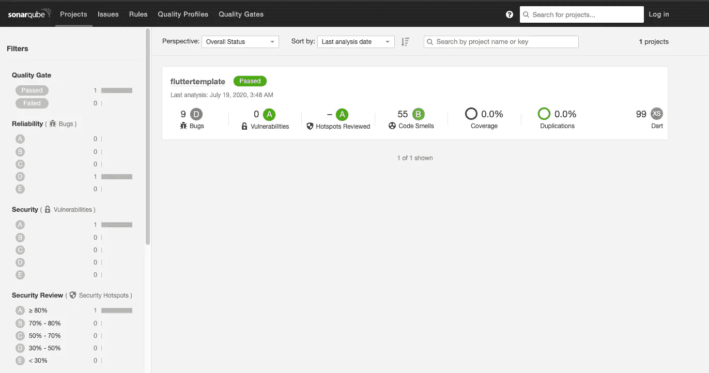

# 使用 Docker 将 SonarQube 集成到您的 Flutter 应用程序中

> 原文：<https://levelup.gitconnected.com/integrating-sonarqube-to-your-flutter-app-using-docker-c7b2a8d94e49>

在写这篇文章的时候，还没有清晰、直接的方法将 SonarQube 的(【https://www.sonarqube.org/】T2)静态代码分析工具添加到你的 Flutter 代码中。

在本文中，我将提供如何安装 Docker、修改其状态、将容器保存为图像、添加 SonarQube 的 SonarScanner 以及对代码运行分析的分步说明。

本教程中使用了一台运行 MacOS 的机器。

## 先决条件:

*   dart SDK(【https://dart.dev/get-dart】T4)
*   码头工人([https://docs.docker.com/engine/install/](https://docs.docker.com/engine/install/))
*   声纳扫描颤振插件([https://github.com/insideapp-oss/sonar-flutter](https://github.com/insideapp-oss/sonar-flutter))
*   sonar scanner([https://docs . sonar qube . org/latest/analysis/scan/sonar scanner/](https://docs.sonarqube.org/latest/analysis/scan/sonarscanner/))

## 1.下载 Docker

Docker 是一个工具，旨在通过使用容器来简化应用程序的创建、部署和运行。容器允许开发人员将应用程序与它需要的所有部分打包在一起，例如库和其他依赖项，并将其作为单个包进行部署。

下载:[https://docs.docker.com/engine/install/](https://docs.docker.com/engine/install/)

下载后，确保您已登录并保持运行。

*如果您遇到问题，请尝试:*

> - docker 注销
> 
> docker 登录—用户名 <username>—密码<password>[https://hub.docker.com](https://hub.docker.com)</password></username>

或者

> docker 登录

## 2.下载声纳扫描颤振插件

在撰写本文时，SonarScanner 上还没有对 Dart 的官方支持，但幸运的是现在有一个插件可以帮助我们

下载“sonar-flutter-plugin-0.2.1.jar”文件后，将其粘贴到您的 flutter 项目的根目录下

下载:[https://github.com/insideapp-oss/sonar-flutter](https://github.com/insideapp-oss/sonar-flutter)

## 3.创建 SonarQube 的项目属性文件

在颤振项目的根目录中，创建“sonar-project.properties ”,并添加以下内容:

> #在给定的 SonarQube 实例中必须是唯一的
> 
> sonar . project key = flutter template
> 
> sonar . project name = flutter template
> 
> sonar.projectVersion=1.0
> 
> # Path 相对于 sonar-project.properties 文件。默认为
> 
> sonar.sources=lib
> 
> 声纳测试=测试
> 
> #源代码的编码。默认为默认系统编码
> 
> sonar.sourceEncoding=UTF-8
> 
> #排除覆盖测试的规格文件
> 
> #sonar.exclusions=lib/test

## 4.为您的操作系统下载 SonarScanner

下载后，将文件提取到一个容易访问的路径，并将 sonar-scanner 添加到您的系统路径，以便可以从终端访问它:

$ PATH _ TO _ SONAR-SCANNER/SONAR-SCANNER-4 . 4 . 0 . 2170-ma cosx/bin

下载:[https://docs . sonar qube . org/latest/analysis/scan/sonar scanner/](https://docs.sonarqube.org/latest/analysis/scan/sonarscanner/)

## 5.创建一个基本容器

运行:

> docker create —名称 sonarqube base-p 9000:9000 sonarqube

这将创建一个名为 sonarqubebase 的容器，以 sonarqube(【https://hub.docker.com/_/sonarqube】)作为其基本映像，并公开端口 9000

> 检查图像:docker 图像
> 
> 检查集装箱:docker ps -a

## 6.启动容器

> 运行:docker sonarqubebase

等待服务器启动，您可以在 Docker 桌面仪表板上查看日志

## 7.从容器中创建图像

> 运行:docker 提交 sonarqubebase
> 
> 然后运行:docker 图像

现在标记你的图像

运行:

> <id>码头工人标签<tagname></tagname></id>

## 8.为你的 Flutter 项目创建一个 docker 文件

在 flutter 项目的根目录下创建一个 docker 文件，代码如下:

> 来自 sonarqubebase
> 
> 复制 sonar-flutter-plugin-0 . 2 . 1 . jar/opt/sonar cube/extensions/plugins

在这里，我们将非官方的声纳扫描仪插件复制到我们的 docker 图像中

## 9.构建和运行

在 Flutter 项目的根目录下运行以下命令:

> sudo docker build-tag sonarqubescan。

然后

> sudo docker run-d-p 9000:9000 sonarkubescan

## 10.运行代码分析

在您的颤振项目运行的根中:

> 声纳扫描仪

分析将很快开始，您将能够在 [http://localhost:9000/](http://localhost:9000/) 上查看您的报告

您可以在颤振项目的根中为新报告运行另一个分析，使用:

> 声纳扫描仪

结果:

感谢您的时间，我希望这篇文章对您有所帮助。