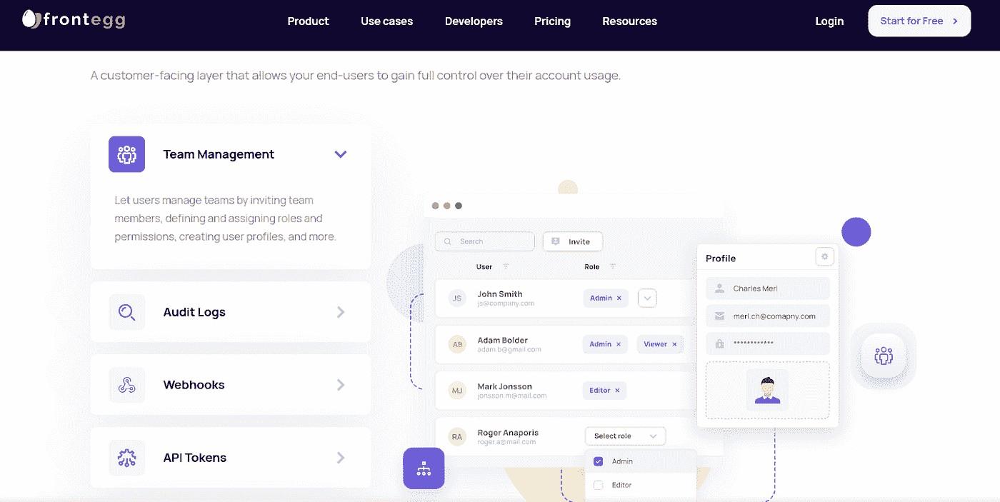

# 在您的 JavaScript 应用程序中集成团队管理

> 原文：<https://levelup.gitconnected.com/integrating-team-management-in-your-javascript-application-7e02919376a4>

**照片由** [**照片由**](https://unsplash.com/@ffstop?utm_source=unsplash&utm_medium=referral&utm_content=creditCopyText) **上** [**下**](https://unsplash.com/s/photos/programming?utm_source=unsplash&utm_medium=referral&utm_content=creditCopyText)

# 介绍

JavaScript 是一种众所周知的开源编程语言，用于开发和验证其他软件。

**节点包管理器**是 JavaScript 可用的最大的库，它的默认包是 [**NPM**](https://www.npmjs.com/) **。**

团队是一群通过合作一起完成任务的人。在一个团队中，每个人都有自己的专长。因此，团队经理有责任将不同类型的人团结在一起，并根据他们的长处利用他们，以便他们能够提供最佳结果。

建立一个能够在完美的时间表内实现目标的优秀团队并不是一件容易的事情。队友之间需要有协调；他们需要相互理解来创造一个高效的工作环境。你知道 JavaScript 如何帮助团队管理吗？让我们讨论开发人员如何使用 JavaScript 将团队管理集成到他们的应用程序中。

# JavaScript 应用程序中团队管理的集成

在用 JavaScript 创建应用程序后，开发人员可以执行团队管理操作。要执行团队管理，需要实现几件事情，比如添加团队成员、创建注册页面和管理基于角色的访问控制。这些我们来讨论一下，一个一个来。

# 为用户创建简单的注册页面

要启动团队管理流程，管理员首先需要创建一个简单的注册页面，以便用户可以注册并创建他们的帐户。通过创建注册或登录页面，管理员可以避免创建用户帐户。用户可以直接进入注册页面，轻松创建自己的账户。规则可以设置在同一个页面上，这样用户就可以轻松地访问他们的角色所需的一些内容。

下面提到的代码可用于为团队成员创建注册功能。

[来源](https://heynode.com/tutorial/process-user-login-form-expressjs/)

通过使用上面的代码，您可以让用户轻松地在网站上注册并查看正在进行的活动。

# 创建邀请系统来邀请团队成员

一些用户已经在应用程序中注册了自己，但是您还需要来自现有团队之外的人的建议和想法。例如，在会议室中，我们需要来自 CISO 的关于如何在我们的组织中实现安全架构的建议，但是 CISO 不是我们团队的成员。

开发人员可以创建一个功能，通过这个功能，管理员可以向非团队成员发送查看特定信息的邀请。让我们了解这是如何在应用程序中实现的。

[来源](https://manishbit97.medium.com/sending-email-via-node-js-with-calendar-invite-2ebf8637b22f)

在这段代码中，我们实际上添加了一些东西，比如地点和日程，这样非团队成员在接受邀请之前就有了关于合作目的的必要信息。

# 为现有成员创建基于角色的访问控制

[基于角色的访问控制](https://en.wikipedia.org/wiki/Role-based_access_control)在整合团队时发挥着重要作用。例如，一个团队可能有很多信息，比如关于其他用户的信息或者只供管理员使用的敏感信息。在这种情况下，有必要在应用程序中实现基于角色的访问控制，以便用户只访问他们有权查看的信息。然而，基于角色的访问控制很难实现，因为我们必须处理大量的访问控制代码及其实现。

让我们看看这段代码，了解它是如何实现的。

[来源](https://medium.com/@zahorovskyi/how-to-implement-role-based-access-control-in-javascript-ab25313d3d29)

要实现这一点，我们首先需要为访问控制创建几个类，并对它们拥有的权限进行编程。创建类之后，我们需要对这些角色实施访问控制。创建类然后给每个用户分配角色变得非常忙碌。此外，如果基于角色的访问控制实现有问题，这将导致可能的[敏感数据泄露](https://owasp.org/www-project-top-ten/2017/A3_2017-Sensitive_Data_Exposure) —用户将能够访问他们无权查看的资源。

# 删除和删除用户的访问控制

删除用户是团队管理的另一个重要方面，因为用户入职和离职会根据用户的级别限制用户访问敏感数据的能力。

[**来源**](https://stackoverflow.com/questions/53476178/how-to-delete-user-profile-node-js-express)

这个简单的代码可用于从组织或团队中删除用户。你只需要传递用户名，他就会加入这个团队。

# 使用 Frontegg 实现用户管理

如果您真的希望创建一个定制的团队管理应用程序，这并不是一件容易的事情。此外，可能会有错误和安全漏洞。一个简单的解决方案是 [Frontegg](https://frontegg.com/product-overview) ，这是一个提供实现认证和管理面板的简单方法的服务。只需 5 行代码，您就可以轻松地将它嵌入到您的产品中。Frontegg 对于第一次测试用户和团队管理的小型开发团队来说是免费的。

# 结论

如您所知，使用 JavaScript 应用程序管理团队是一件痛苦的事情。当我们不得不修补错误时，这也造成了很多麻烦。为了更容易和更安全，我们可以轻松地使用 Frontegg，它为团队管理提供了简单的解决方案。这是非常安全的，并提供了许多安全特性，可以用来使团队管理更加安全。